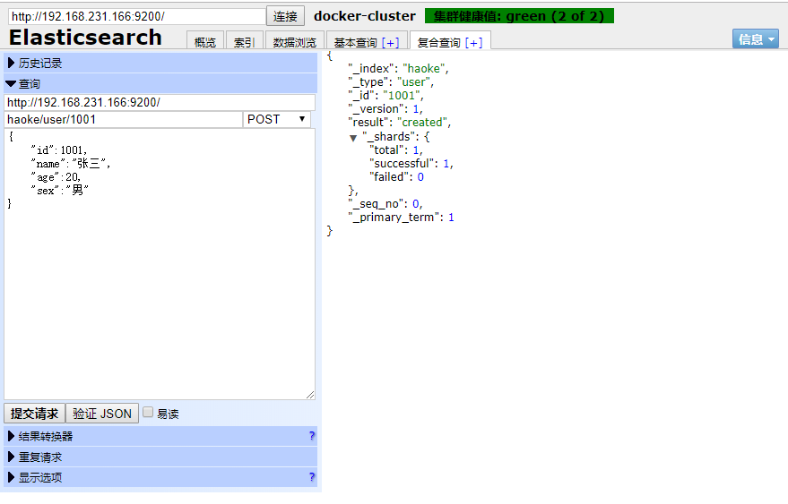
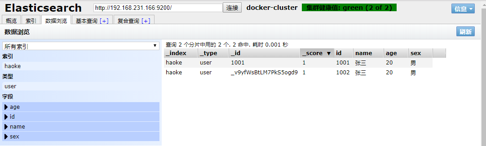
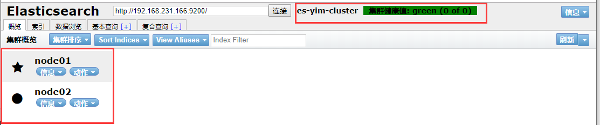
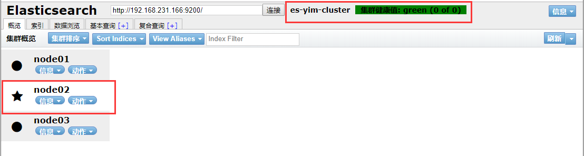
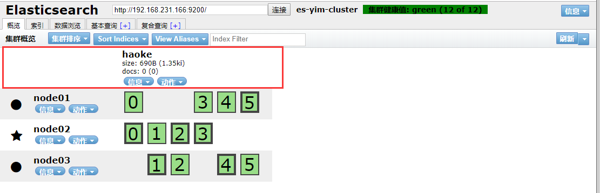
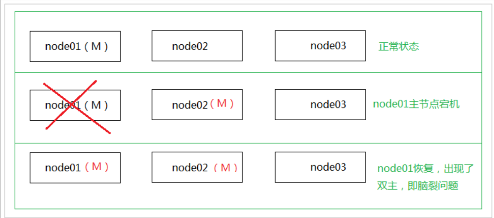

# 	Elastic Stack之Elasticsearch

## 主要内容

- 简介和安装
- Elasticsearch

## 一 Elastic Stack简介

如果你没有听说过Elastic Stack，那你一定听说过ELK，实际上ELK是三款软件的简称，分别是Elasticsearch、
Logstash、Kibana组成，在发展的过程中，又有新成员Beats的加入，所以就形成了Elastic Stack。所以说，ELK
是旧的称呼，Elastic Stack是新的名字。


- Elasticsearch
  - Elasticsearch 基于java，是个开源分布式搜索引擎，它的特点有：分布式，零配置，自动发现，索引自动分片，索引副本机制，restful风格接口，多数据源，自动搜索负载等。
- Logstash
  - Logstash 基于java，是一个开源的用于收集,分析和存储日志的工具。
- Kibana
  - Kibana 基于nodejs，也是一个开源和免费的工具，Kibana可以为 Logstash 和 ElasticSearch 提供的日志分析友好的 Web 界面，可以汇总、分析和搜索重要数据日志。
- Beats
  - Beats是elastic公司开源的一款采集系统监控数据的代理agent，是在被监控服务器上以客户端形式运行的数据收集器的统称，可以直接把数据发送给Elasticsearch或者通过Logstash发送给Elasticsearch，然后进行后续的数据分析活动。
  - Beats由如下组成:
    - Packetbeat：是一个网络数据包分析器，用于监控、收集网络流量信息，Packetbeat嗅探服务器之间的流量，解析应用层协议，并关联到消息的处理，其支 持ICMP (v4 and v6)、DNS、HTTP、Mysql、
    - PostgreSQL、Redis、MongoDB、Memcache等协议；
    - Filebeat：用于监控、收集服务器日志文件，其已取代 logstash forwarder；
    - Metricbeat：可定期获取外部系统的监控指标信息，其可以监控、收集 Apache、HAProxy、MongoDB、MySQL、Nginx、PostgreSQL、Redis、System、Zookeeper等服务；
    - Winlogbeat：用于监控、收集Windows系统的日志信息；

## 二 Elasticsearch

ElasticSearch是一个基于Lucene的搜索服务器。它提供了一个分布式多用户能力的全文搜索引擎，基于RESTful web接口。Elasticsearch是用Java开发的，并作为Apache许可条款下的开放源码发布，是当前流行的企业级搜索引擎。设计用于[云计算](https://baike.baidu.com/item/云计算/9969353)中，能够达到实时搜索，稳定，可靠，快速，安装使用方便。

官网：https://www.elastic.co/cn/products/elasticsearch

Elasticsearch的发展是非常快速的，所以在ES5.0之前，ELK的各个版本都不统一，出现了版本号混乱的状态，所以从5.0开始，所有Elastic Stack中的项目全部统一版本号。目前最新版本是6.5.4，我们将基于这一版本进行学习。

### 2.1 下载安装

下载地址：https://www.elastic.co/cn/downloads/elasticsearch

#### 2.1.1 单机版安装

1. 下载解压

   ```sh
   #解压安装包到指定目录
   tar -xvf elasticsearch-6.5.4.tar.gz -C haoke/es
   ```

2. 修改配置文件

   ```sh
   #修改配置文件
   vim conf/elasticsearch.yml
   	network.host: 192.168.231.166  #绑定的地址
   
   #说明：在Elasticsearch中如果，network.host不是localhost或者127.0.0.1的话，就会认为是生产环境，会对环境的要求比较高，我们的测试环境不一定能够满足，一般情况下需要修改3处配置，如下：
   
   #1：修改jvm启动参数
   vim conf/jvm.options
   	-Xms128m #根据自己机器情况修改
   	-Xmx128m
   #2：单个进程中的最大线程数
   vim /etc/sysctl.conf
   	vm.max_map_count=655360
   #3: 调整es用户打开文件最大数量的软硬限制
   ulimit -S -n # 查看当前用户软限制数量
   ulimit -H -n # 查看当前用户硬限制数量
   vim /etc/security/limits.conf
   	es   soft    nofile    65536 
   	es   hard    nofile    65536
   ```

3. es 用户启动

   ```sh
   #Elasticsearch不支持root用户运行,需要创建es用户
   useradd es
   # 切换用户
   su es 
   #cd到elasticsearch的bin目录启动,需要给es用户文件访问权限
   ./elasticsearch 
   ./elasticsearch -d #后台系统
   #通过访问http://192.168.231.166:9200进行测试，看到如下信息，就说明ES启动成功了
   ```

4. 关闭应该用

   ```sh
   #停止服务
   root@itcast:~# jps
   68709 Jps
   68072 Elasticsearch
   kill 68072  #通过kill结束进程
   ```

#### 2.1.2 使用docker安装

```sh
#拉取镜像
docker pull elasticsearch:6.5.4
#创建容器
docker create --name elasticsearch --net host -e "discovery.type=single-node" -e "network.host=192.168.231.166" elasticsearch:6.5.4
#启动
docker start elasticsearch
#查看日志
docker logs elasticsearch
```

> 此docker安装是开发环境模式，并没有配置目录挂载等内容v m/

#### 2.1.3 elasticsearch-head

由于ES官方并没有为ES提供界面管理工具，仅仅是提供了后台的服务。elasticsearch-head是一个为ES开发的一个
页面客户端工具，其源码托管于GitHub，地址为：https://github.com/mobz/elasticsearch-head

- 通过docker安装（推荐）

  - 由于前后端分离开发，所以会存在跨域问题，需要在服务端做CORS的配置，如下：
    vim elasticsearch.yml
    http.cors.enabled: true http.cors.allow-origin: "*"

  ```sh
  #拉取镜像
  docker pull mobz/elasticsearch-head:5
  #创建容器
  docker create --name elasticsearch-head -p 9100:9100 mobz/elasticsearch-head:5
  #启动容器
  docker start elasticsearch-head
  
  #由于前后端分离开发，所以会存在跨域问题，需要在服务端做CORS的配置，如下：
  vim elasticsearch.yml
  http.cors.enabled: true http.cors.allow-origin: "*"
  ```

- 通过chrome插件安装（推荐）

  打开chrome的应用商店，即可安装https://chrome.google.com/webstore/detail/elasticsearch-head/ffmkiejjmecolpfloofpjologoblkegm

> 建议：推荐使用chrome插件的方式安装，如果网络环境不允许，就采用docker方式安装。

### 2.2 基本概念

- 索引
  - 索引（index）是Elasticsearch对逻辑数据的逻辑存储，所以它可以分为更小的部分。
  - 可以把索引看成关系型数据库的表，索引的结构是为快速有效的全文索引准备的，特别是它不存储原始值。
  - 可以把Elasticsearch的索引看成MongoDB里的一个集合。
  - Elasticsearch可以把索引存放在一台机器或者分散在多台服务器上，每个索引有一或多个分片（shard），每个分片可以有多个副本（replica）。
- 文档
  - 存储在Elasticsearch中的主要实体叫文档（document）。用关系型数据库来类比的话，一个文档相当于数据库表中的一行记录。
  - Elasticsearch和MongoDB中的文档类似，都可以有不同的结构，但Elasticsearch的文档中，相同字段必须有相同类型。
  - 文档由多个字段组成，每个字段可能多次出现在一个文档里，这样的字段叫多值字段（multivalued）。
  - 每个字段的类型，可以是文本、数值、日期等。字段类型也可以是复杂类型，一个字段包含其他子文档或者数组。
- 映射
  - 所有文档写进索引之前都会先进行分析，如何将输入的文本分割为词条、哪些词条又会被过滤，这种行为叫做映射（mapping）。一般由用户自己定义规则。
- 文档类型
  - 在Elasticsearch中，一个索引对象可以存储很多不同用途的对象。例如，一个博客应用程序可以保存文章和评论。
  - 每个文档可以有不同的结构。
  - 不同的文档类型不能为相同的属性设置不同的类型。例如，在同一索引中的所有文档类型中，一个叫title的字段必须具有相同的类型。

### 2.3 RESTful API

在Elasticsearch中，提供了功能丰富的RESTful API的操作，包括基本的CRUD、创建索引、删除索引等操作。

**Elasticsearch中对应RESTful风格说明**：

- URL：

  ```ruby
  http://192.168.231.166:9200/{索引}/{类型}/{id}
  ```

- 请求方法：

  - PUT
  - DELETE
  - POST
  - GET
  - HEAD

- 请求的参数数据内容：json格式

#### 2.3.1 创建非结构化索引

在Lucene中，创建索引是需要定义字段名称以及字段的类型的，在Elasticsearch中提供了非结构化的索引，就是
不需要预先创建索引结构，即可写入数据到索引中，实际上在Elasticsearch底层会进行结构化操作，此操作对用户是透明的。

#### 2.3.2 插入数据

```json
指定ID插入: http://192.168.231.166:9200/haoke/user/1001
请求方法: POST
请求内容 =
{
    "id":1001,
    "name":"张三",
    "age":20,
    "sex":"男"
}
```



```json
不指定ID插入: http://192.168.231.166:9200/haoke/user/
请求方法: POST
{
    "id":1002,
    "name":"张三",
    "age":20,
    "sex":"男"
}
```



> 非结构化的索引，不需要事先创建，直接插入数据默认创建索引。
>
> 不指定ID插入，会自动生成ID

#### 2.3.3 删除数据

在Elasticsearch中，删除文档数据，只需要发起DELETE请求即可。

```json
http://192.168.231.166:9200/haoke/user/1001/ 	DELETE
{
    "_index": "haoke",
    "_type": "user",
    "_id": "1001",
    "_version": 6,// 版本号+1
    "result": "deleted",//结果状态：已删除
    "_shards": {
        "total": 1,
        "successful": 1,
        "failed": 0
    },
    "_seq_no": 6,
    "_primary_term": 1
}
```

**注意**：

- 如果删除一条不存在的数据，会响应404
- 删除一个文档也不会立即从磁盘上移除，它只是被标记成已删除。Elasticsearch将会在你之后添加更多索引
  的时候才会在后台进行删除内容的清理。

#### 2.3.4 更新数据

在Elasticsearch中，文档数据是不为修改的，但是可以通过覆盖的方式进行整体更新。

- 请求内容：

  ```json
  http://192.168.231.166:9200/haoke/user/1001  PUT
  
  {"id":1002,"name":"张三","age":20,"sex":"女"}
  ```

- 响应结果：

  ```json
  {
      "_index": "haoke",
      "_type": "user",
      "_id": "1001",
      "_version": 2,//更新操作版本号+1
      "result": "updated",//结果状态：已更新
      "_shards": {
          "total": 1,
          "successful": 1,
          "failed": 0
      },
      "_seq_no": 2,
      "_primary_term": 1
  }
  ```

可以看到数据已经被覆盖了。

**问题来了，可以局部更新吗？ -- 可以的。**
前面不是说，文档数据不能更新吗？ 其实是这样的：
在内部，依然会查询到这个文档数据，然后进行覆盖操作，步骤如下：

1. 从旧文档中检索JSON
2. 修改它
3. 删除旧文档
4. 索引新文档

```json
#注意：这里多了_update标识
http://172.16.55.185:9200/haoke/user/1001/_update	POST 
{
    "doc":{
        "age":23
    }
}
```

#### 2.3.5 搜索数据

- 根据id进行搜索

  ```
  http://192.168.231.166:9200/haoke/user/1001/ 	GET
  ```

- 搜索全部数据

  ```sh
  http://192.168.231.166:9200/haoke/user/_search  GET
  # 响应：（默认返回10条数据）
  ```

- 关键字搜素数据

  ```sh
  # 查询年龄等于20的用户
  GET http://192.168.231.166/haoke/user/_search?q=age:20
  ```

#### 2.3.6 DSL搜索

Elasticsearch提供丰富且灵活的查询语言叫做DSL查询(Query DSL),它允许你构建更加复杂、强大的查询。
DSL(Domain Specific Language特定领域语言)以JSON请求体的形式出现。

> 实现：查询年龄大于18岁的男性用户。

```python
POST http://192.168.231.166:9200/haoke/user/_search
# 请求数据
{
    "query": {
        "bool": {
            "filter": {
                "range": {
                    "age": {
                        "gt": 18
                    }
                }
            },
            "must": {
                "match": {
                    "sex": "男"
                }
            }
        }
    }
}
```

> 全文搜索

```python
POST http://192.168.231.166:9200/haoke/user/_search
#请求数据
{
    "query": {
        "match": {
            "name": "张三 张er"
        }
    },
    "highlight": { #高亮显示字段
        "fields": {
            "name": {}
        }
    }
}
```

#### 2.3.7 聚合

在Elasticsearch中，支持聚合操作，类似SQL中的group by操作。

```json
POST http://192.168.231.166:9200/haoke/user/_search

{
    "aggs": {
        "all_interests": {
            "terms": {
                "field": "age"
            }
        }
    }
}
```

## 三 核心讲解

### 3.1 文档数据组成

**存储数据**：在Elasticsearch中，文档以JSON格式进行存储，可以是复杂的结构：json数据嵌套

**元数据（metadata）**：

一个文档不只有数据。它还包含了元数据(metadata)——关于文档的信息。三个必须的元数据节点是：

| 节点   | 说明               |
| ------ | ------------------ |
| _index | 文档存储的地方     |
| _type  | 文档代表的对象的类 |
| _id    | 文档的唯一标识     |

- 索引(index)：类似于关系型数据库里的“数据库”——它是我们存储和索引关联数据的地方。
- 类型(type)：
  - 在关系型数据库中，我们经常将相同类的对象存储在一个表里，因为它们有着相同的结构。同理，在Elasticsearch中，我们使用相同类型(type)的文档表示相同的“事物”，因为他们的数据结构也是相同的。
  - 每个类型(type)都有自己的映射(mapping)或者结构定义，就像传统数据库表中的列一样。所有类型下的文档被存储在同一个索引下，但是类型的映射(mapping)会告诉Elasticsearch不同的文档如何被索引。

- **id**仅仅是一个字符串，它与 _index 和 _type 组合时，就可以在Elasticsearch中唯一标识一个文档。当创建一个文档，你可以自定义 _id ，也可以让Elasticsearch帮你自动生成（32位长度）。

### 3.2 查询响应

**pretty**

可以在查询url后面添加pretty参数，使得返回的json更易查看。

```ruby
http://192.168.231.166:9200/haoke/user/_search?pretty	GET
```

**指定响应字段**

- 在响应的数据中，如果我们不需要全部的字段，可以指定某些需要的字段进行返回。

  ```ruby
  http://192.168.231.166:9200/haoke/user/1002/?_source=id,name  GET
  ```

- 如不需要返回元数据，仅仅返回原始数据，可以这样：

  ```ruby
  http://192.168.231.166:9200:9200/haoke/user/1002/_source  GET
  ```

  ```ruby
  http://192.168.231.166:9200/haoke/user/1002/_source?_source=id,name  GET
  ```

### 3.3 批量操作

有些情况下可以通过批量操作以减少网络请求。如：批量查询、批量插入数据。

#### 3.3.1 批量查询

```json
POST http://192.168.231.166:9200/haoke/user/_mget
{
    "ids" : [ "1001", "1003" ]
}
```

如果，某一条数据不存在，不影响整体响应，需要通过found的值进行判断是否查询到数据。

#### 3.3.2 _bulk操作

在Elasticsearch中，支持批量的插入、修改、删除操作，都是通过_bulk的api完成的。

请求格式如下：（请求格式不同寻常）：

```ruby
{ action: { metadata }}\n
{ request body    }\n
{ action: { metadata }}\n
{ request body    }\n
...
    
http://192.168.231.166:9200/haoke/user/_bulk POST
```

> 批量插入数据：注意最后一行的回车。

```json
{"create":{"_index":"haoke","_type":"user","_id":2001}}
{"id":2001,"name":"name1","age": 20,"sex": "男"}
{"create":{"_index":"haoke","_type":"user","_id":2002}}
{"id":2002,"name":"name2","age": 20,"sex": "男"}
{"create":{"_index":"haoke","_type":"user","_id":2003}}
{"id":2003,"name":"name3","age": 20,"sex": "男"}

```

> 批量删除：由于delete没有请求体，所以，action的下一行直接就是下一个action。

```json
{"delete":{"_index":"haoke","_type":"user","_id":2001}}
{"delete":{"_index":"haoke","_type":"user","_id":2002}}
{"delete":{"_index":"haoke","_type":"user","_id":2003}}

```

### 3.4 分页

和SQL使用 LIMIT 关键字返回只有一页的结果一样，Elasticsearch接受 from 和 size 参数：

- size: 结果数，默认10
- from: 跳过开始的结果数，默认0

> 应该当心分页太深或者一次请求太多的结果。结果在返回前会被排序。但是记住一个搜索请求常常涉及多个
> 分片。每个分片生成自己排好序的结果，它们接着需要集中起来排序以确保整体排序正确。

```ruby
/_search?size=5&from=10  GET 
```

> **在集群系统中深度分页**
>
> 为了理解为什么深度分页是有问题的，让我们假设在一个有5个主分片的索引中搜索。当我们请求结果的第一
> 页（结果1到10）时，每个分片产生自己最顶端10个结果然后返回它们给请求节点(requesting node)，它
> 再排序这所有的50个结果以选出顶端的10个结果。
> 现在假设我们请求第1000页——结果10001到10010。工作方式都相同，不同的是每个分片都必须产生顶端
> 的10010个结果。然后请求节点排序这50050个结果并丢弃50040个！
>
> 你可以看到在分布式系统中，排序结果的花费随着分页的深入而成倍增长。这也是为什么网络搜索引擎中任
> 何语句不能返回多于1000个结果的原因。

### 3.5 映射

前面我们创建的索引以及插入数据，都是由Elasticsearch进行自动判断类型，有些时候我们是需要进行明确字段类
型的，否则，自动判断的类型和实际需求是不相符的。

自动判断的规则如下：

| JSON type | Field type |
| --------- | ---------- |
||Boolean:  true or  false |
|Whole number:  123 |"long"|
|Floating point:  123.45| "double"|
|String, valid date:  "2014-09-15" |"date"|
|String:  "foo bar" |"string"|

Elasticsearch中支持的类型如下：

|类型 |表示的数据类型|
| --------- | ---------- |
|String |string , text , keyword|
|Whole number |byte ,  short ,  integer ,  long|
|Floating point |float ,  double|
|	Boolean |boolean|
> - string类型在ElasticSearch 旧版本中使用较多，从ElasticSearch 5.x开始不再支持string，由text和
>   keyword类型替代。
> - text 类型，当一个字段是要被全文搜索的，比如Email内容、产品描述，应该使用text类型。设置text类
>   型以后，字段内容会被分析，在生成倒排索引以前，字符串会被分析器分成一个一个词项。text类型的
>   字段不用于排序，很少用于聚合。
> - keyword类型适用于索引结构化的字段，比如email地址、主机名、状态码和标签。如果字段需要进行
>   过滤(比如查找已发布博客中status属性为published的文章)、排序、聚合。keyword类型的字段只能通
>   过精确值搜索到。

**创建明确类型的索引：**

```json
PUT http://192.168.231.166:9200/yim
{
    "settings": {
        "index": {
            "number_of_shards": "1",
            "number_of_replicas": "0"
        }
    },
    "mappings": {
        "person": {
            "properties": {
                "name": {
                    "type": "text"
                },
                "age": {
                    "type": "integer"
                },
                "mail": {
                    "type": "keyword"
                },
                "hobby": {
                    "type": "text",
                    "analyzer":"ik_max_word"
                }
            }
        }
    }
}
# 查看映射
GET http://192.168.231.166:9200/yim/_mapping

POST http://172.16.55.185:9200/yim/_bulk

{"index":{"_index":"yim","_type":"person"}}
{"name":"张三","age": 20,"mail": "111@qq.com","hobby":"羽毛球、乒乓球、足球"}
{"index":{"_index":"yim","_type":"person"}}
{"name":"李四","age": 21,"mail": "222@qq.com","hobby":"羽毛球、乒乓球、足球、篮球"}
{"index":{"_index":"yim","_type":"person"}}
{"name":"王五","age": 22,"mail": "333@qq.com","hobby":"羽毛球、篮球、游泳、听音乐"}
{"index":{"_index":"yim","_type":"person"}}
{"name":"赵六","age": 23,"mail": "444@qq.com","hobby":"跑步、游泳"}
{"index":{"_index":"yim","_type":"person"}}
{"name":"孙七","age": 24,"mail": "555@qq.com","hobby":"听音乐、看电影"}

```

### 3.6 结构化查询

- **term查询**
  - term 主要用于精确匹配哪些值，比如数字，日期，布尔值或  not_analyzed 的字符串(未经分析的文本数据类型)
- **terms查询**
  - terms 跟  term 有点类似，但  terms 允许指定多个匹配条件。 如果某个字段指定了多个值，那么文档需要一起去做匹配
- **range查询**
  - range 过滤允许我们按照指定范围查找一批数据
  - gt :: 大于
  - gte :: 大于等于
  - lt :: 小于
  - lte :: 小于等于
- **exists 查询**
  - exists 查询可以用于查找文档中是否包含指定字段或没有某个字段，类似于SQL语句中的 IS_NULL 条件
- **match查询**
  - match 查询是一个标准查询，不管你需要全文本查询还是精确查询基本上都要用到它。
- **bool查询**
  - bool 查询可以用来合并多个条件查询结果的布尔逻辑，它包含一下操作符：
  - must :: 多个查询条件的完全匹配,相当于  and 。
  - must_not :: 多个查询条件的相反匹配，相当于  not 。
  - should :: 至少有一个查询条件匹配, 相当于  or 。

### 3.7 过滤查询

前面讲过结构化查询，Elasticsearch也支持过滤查询，如term、range、match等。

**查询和过滤的对比**：

- 一条过滤语句会询问每个文档的字段值是否包含着特定值。
- 查询语句会询问每个文档的字段值与特定值的匹配程度如何。
  - 一条查询语句会计算每个文档与查询语句的相关性，会给出一个相关性评分 _score，并且 按照相关性对
    匹配到的文档进行排序。 这种评分方式非常适用于一个没有完全配置结果的全文本搜索。
- 一个简单的文档列表，快速匹配运算并存入内存是十分方便的， 每个文档仅需要1个字节。这些缓存的过滤结
  果集与后续请求的结合使用是非常高效的。
- 查询语句不仅要查找相匹配的文档，还需要计算每个文档的相关性，所以一般来说查询语句要比 过滤语句更
  耗时，并且查询结果也不可缓存。

> 建议：
>
> 做精确匹配搜索时，最好用过滤语句，因为过滤语句可以缓存数据。

## 四 分词器

分词就是指将一个文本转化成一系列单词的过程，也叫文本分析，在Elasticsearch中称之为Analysis。

举例：我是中国人 --> 我/是/中国人

### 4.1 分词api

指定分词器进行分词

```json
http://192.168.231.166:9200/_analyze  POST 
{
    "analyzer":"standard",
    "text":"hello world"
}
```

指定索引分词

```json
http://192.168.231.166:9200//haoke2/_analyze  POST 
{
    "analyzer": "standard",
    "field": "hobby",
    "text": "听音乐"
}
```

### 4.2 内置分词

- **Standard** 标准分词，按单词切分，并且会转化成小写

  ```json
  http://192.168.231.166:9200/_analyze  POST 
  {
      "analyzer": "standard",
      "text": "A man becomes learned by asking questions."
  }
  ```

- **Simple**分词器，按照非单词切分，并且做小写处理
- **Whitespace**是按照空格切分。
- **Stop**分词器，是去除Stop Word语气助词，如the、an等。
- **Keyword**分词器，意思是传入就是关键词，不做分词处理。

### 4.3 中文分词IK

中文分词的难点在于，在汉语中没有明显的词汇分界点，如在英语中，空格可以作为分隔符，如果分隔不正确就会
造成歧义。

常用中文分词器，IK、jieba、THULAC等，推荐使用IK分词器。

> IK Analyzer是一个开源的，基于java语言开发的轻量级的中文分词工具包。从2006年12月推出1.0版开始，
> IKAnalyzer已经推出了3个大版本。最初，它是以开源项目Luence为应用主体的，结合词典分词和文法分析
> 算法的中文分词组件。新版本的IK Analyzer 3.0则发展为面向Java的公用分词组件，独立于Lucene项目，同
> 时提供了对Lucene的默认优化实现。
>
> 采用了特有的“正向迭代最细粒度切分算法“，具有80万字/秒的高速处理能力 采用了多子处理器分析模式，支
> 持：英文字母（IP地址、Email、URL）、数字（日期，常用中文数量词，罗马数字，科学计数法），中文词
> 汇（姓名、地名处理）等分词处理。 优化的词典存储，更小的内存占用。

IK分词器 Elasticsearch插件地址：https://github.com/medcl/elasticsearch-analysis-ik

```sh
#安装方法：将下载到的elasticsearch-analysis-ik-6.5.4.zip解压到/elasticsearch/plugins/ik目录下即可。

#如果使用docker运行
docker cp /tmp/elasticsearch-analysis-ik-6.5.4.zip elasticsearch:/usr/share/elasticsearch/plugins/
#进入容器
docker exec -it elasticsearch /bin/bash

mkdir /usr/share/elasticsearch/plugins/ik

cd /usr/share/elasticsearch/plugins/ik

unzip elasticsearch-analysis-ik-6.5.4.zip
#重启容器即可
docker restart elasticsearch
```

验证安装插件:

```json
http://192.168.231.166:9200/_analyze  POST
{
    "analyzer": "ik_max_word",
    "text": "我是中国人"
}
```

### 4.4 倒排索引

倒排索引源于实际应用中需要根据属性的值来查找记录。这种索引表中的每一项都包括一个属性值和具有该属性值
的各记录的地址。由于不是由记录来确定属性值，而是由属性值来确定记录的位置，因而称为倒排索引(inverted
index)。带有倒排索引的文件我们称为倒排索引文件，简称倒排文件(inverted file)。

### 4.5 全文搜索

全文搜索两个最重要的方面是：

- 相关性（Relevance） 它是评价查询与其结果间的相关程度，并根据这种相关程度对结果排名的一种能力，这
  种计算方式可以是 TF/IDF 方法、地理位置邻近、模糊相似，或其他的某些算法。
- 分析（Analysis） 它是将文本块转换为有区别的、规范化的 token 的一个过程，目的是为了创建倒排索引以
  及查询倒排索引。

**构造搜索数据使用本文----目录3.5映射下 :**

创建明确类型的索引：内容数据,在hobby处添加了IK分词器

#### 4.5.1 单词搜索

```json
POST http://192.168.231.166:9200/yim/person/_search
{
    "query":{
        "match":{
            "hobby":"音乐"
        }
    },
    "highlight": {
        "fields": {
            "hobby": {}
        }
    }
}
```

过程说明：
1. 检查字段类型
爱好 hobby 字段是一个 text 类型（ 指定了IK分词器），这意味着查询字符串本身也应该被分词。
2. 分析查询字符串 。
将查询的字符串 “音乐” 传入IK分词器中，输出的结果是单个项 音乐。因为只有一个单词项，所以 match 查询
执行的是单个底层 term 查询。
3. 查找匹配文档 。
用 term 查询在倒排索引中查找 “音乐” 然后获取一组包含该项的文档，本例的结果是文档：3 、5 。
4. 为每个文档评分 。
用 term 查询计算每个文档相关度评分 _score ，这是种将 词频（term frequency，即词 “音乐” 在相关文档的
hobby 字段中出现的频率）和 反向文档频率（inverse document frequency，即词 “音乐” 在所有文档的
hobby 字段中出现的频率），以及字段的长度（即字段越短相关度越高）相结合的计算方式。

#### 4.5.2 多词搜索

```json
{
    "query":{
        "match":{
            "hobby":"音乐 篮球"
        }
    },
    "highlight": {
        "fields": {
            "hobby": {}
        }
    }
}
```

上面这种方法包含了“音乐”、“篮球”的数据都已经被搜索到了。

可是，搜索的结果并不符合我们的预期，因为我们想搜索的是既包含“音乐”又包含“篮球”的用户，显然结果返回
的“或”的关系。

在Elasticsearch中，可以指定词之间的逻辑关系，如下：

```json
{
    "query":{
        "match":{
            "hobby":{
                "query":"音乐 篮球",
                "operator":"and"
            }
        }
    },
    "highlight": {
        "fields": {
            "hobby": {}
        }
    }
}
```

可以看到结果符合预期。

前面我们测试了“OR” 和 “AND”搜索，这是两个极端，其实在实际场景中，并不会选取这2个极端，更有可能是选取
这种，或者说，只需要符合一定的相似度就可以查询到数据，在Elasticsearch中也支持这样的查询，通过
minimum_should_match来指定匹配度，如：70%；

```json
{
    "query":{
        "match":{
            "hobby":{
                "query":"游泳 羽毛球",
                "minimum_should_match":"70%"
            }
        }
    },
    "highlight": {
        "fields": {
            "hobby": {}
        }
    }
}
#结果：省略显示
{
    "took": 10,
    "timed_out": false,
    "_shards":{
        "total": 1,
        "successful": 1,
        "skipped": 0,
        "failed": 0
    },
    "hits":{
        "total": 3,#相似度为80%的情况下，查询到3条数据
        "max_score": 2.1933632,
        "hits":[
            {
                "_index": "yim",
                "_type": "person",
                "_id": "wEY3fmsBoFUGR-8z0_UI",
                "_score": 2.1933632,
                "_source":{"name": "王五", "age": 22, "mail": "333@qq.com", "hobby": "羽毛球、篮球、游泳、听音乐"…},
                "highlight":{"hobby":["<em>羽毛</em><em>球</em>、篮球、<em>游泳</em>、听音乐" ]}
            },
            {"_index": "yim", "_type": "person", "_id": "vkY3fmsBoFUGR-8z0_UI", "_score": 1.7171206,…},
            {"_index": "yim", "_type": "person", "_id": "v0Y3fmsBoFUGR-8z0_UI", "_score": 1.6262295,…}
        ]
    }
}
```

> 相似度应该多少合适，需要在实际的需求中进行反复测试，才可得到合理的值。

#### 4.5.3 组合搜索

在搜索时，也可以使用过滤器中讲过的bool组合查询，

示例：搜索结果中必须包含篮球，不能包含音乐，如果包含了游泳，那么它的相似度更高。

```json
{
    "query":{
        "bool":{
            "must":{
                "match":{
                    "hobby":"篮球"
                }
            },
            "must_not":{
                "match":{
                    "hobby":"音乐"
                }
            },
            "should":[
                {
                    "match": {
                        "hobby":"游泳"
                    }
                }
            ]
        }
    },
    "highlight": {
        "fields": {
            "hobby": {}
        }
    }
}
```

> **评分的计算规则:**
>
> bool 查询会为每个文档计算相关度评分 _score ， 再将所有匹配的 must 和 should 语句的分数 _score 求
> 和，最后除以 must 和 should 语句的总数。
> must_not 语句不会影响评分； 它的作用只是将不相关的文档排除。
>
> 默认情况下，should中的内容不是必须匹配的，如果查询语句中没有must，那么就会至少匹配其中一个。当然了，也可以通过minimum_should_match参数进行控制，该值可以是数字也可以的百分比。

#### 4.5.4 权重

有些时候，我们可能需要对某些词增加权重来影响该条数据的得分。如下：

> 搜索关键字为“游泳篮球”，如果结果中包含了“音乐”权重为10，包含了“跑步”权重为2。

```json
{
    "query": {
        "bool": {
            "must": {
                "match": {
                    "hobby": {
                        "query": "游泳篮球",
                        "operator": "and"
                    }
                }
            },
            "should": [
                {
                    "match": {
                        "hobby": {
                            "query": "音乐",
                            "boost": 10
                        }
                    }
                },
                {
                    "match": {
                        "hobby": {
                            "query": "跑步",
                            "boost": 2
                        }
                    }
                }
            ]
        }
    },
    "highlight": {
        "fields": {
            "hobby": {}
        }
    }
}
```

> 查看设置权重和不设置权重得分

### 4.6 短语匹配

在Elasticsearch中，短语匹配意味着不仅仅是词要匹配，并且词的顺序也要一致，如下：

```json
{
    "query":{
        "match_phrase":{
            "hobby":{
                "query":"羽毛球篮球"
            }
        }
    },
    "highlight": {
        "fields": {
            "hobby": {}
        }
    }
}
```

结果符合预期。

如果觉得这样太过于苛刻，可以增加slop参数，允许跳过N个词进行匹配。

```json
{
    "query":{
        "match_phrase":{
            "hobby":{
                "query":"羽毛球足球",
                "slop":3
            }
        }
    },
    "highlight": {
        "fields": {
            "hobby": {}
        }
    }
}
```

从结果中，可以看出已经跳过了“乒乓球”这个词。

## 五 Elasticsearch集群

### 5.1 集群节点

ELasticsearch的集群是由多个节点组成的，通过cluster.name设置集群名称，并且用于区分其它的集群，每个节
点通过node.name指定节点的名称。
在Elasticsearch中，节点的类型主要有4种：

- master节点
  - 配置文件中node.master属性为true(默认为true)，就有资格被选为master节点。
  - master节点用于控制整个集群的操作。比如创建或删除索引，管理其它非master节点等。
- data节点
  - 配置文件中node.data属性为true(默认为true)，就有资格被设置成data节点。
  - data节点主要用于执行数据相关的操作。比如文档的CRUD。
- 客户端节点
  - 配置文件中node.master属性和node.data属性均为false。
  - 该节点不能作为master节点，也不能作为data节点。
  - 可以作为客户端节点，用于响应用户的请求，把请求转发到其他节点
- 部落节点
  - 当一个节点配置tribe.*的时候，它是一个特殊的客户端，它可以连接多个集群，在所有连接的集群上执
    行搜索和其他操作。

### 5.2 使用docker搭建集群

1. 创建节点目录

   ```sh
   mkdir /haoke/es-cluster
   cd /haoke/es-cluster
   mkdir node01
   mkdir node02
   ```

2. 拷贝单机版安装目录下的elasticsearch.yml、jvm.options到node01 node02目录下，并配置

   ```sh
   #配置node01的elasticsearch.yml
   cluster.name: es-yim-cluster
   node.name: node01
   node.master: true
   node.data: true
   network.host: 192.168.231.166
   http.port: 9200
   discovery.zen.ping.unicast.hosts: ["192.168.231.166"]
   discovery.zen.minimum_master_nodes: 1
   http.cors.enabled: true
   http.cors.allow-origin: "*"
   
   #配置node02的elasticsearch.yml
   cluster.name: es-yim-cluster
   node.name: node02
   node.master: false
   node.data: true
   network.host: 192.168.231.166
   http.port: 9201
   discovery.zen.ping.unicast.hosts: ["192.168.231.166"]
   discovery.zen.minimum_master_nodes: 1
   http.cors.enabled: true
   http.cors.allow-origin: "*"
   ```

3. 创建容器并启动

   ```sh
   # 创建容器es-node01 es-node02
   docker create --name es-node01 --net host -v /haoke/es-cluster/node01/elasticsearch.yml:/usr/share/elasticsearch/config/elasticsearch.yml -v /haoke/es-cluster/node01/jvm.options:/usr/share/elasticsearch/config/jvm.options -v /haoke/es-cluster/node01/data:/usr/share/elasticsearch/data elasticsearch:6.5.4
   
   docker create --name es-node02 --net host -v /haoke/es-cluster/node02/elasticsearch.yml:/usr/share/elasticsearch/config/elasticsearch.yml -v /haoke/es-cluster/node02/jvm.options:/usr/share/elasticsearch/config/jvm.options -v /haoke/es-cluster/node02/data:/usr/share/elasticsearch/data elasticsearch:6.5.4
   
   #提示：启动时会报文件无权限操作的错误，需要对node01和node02进行chmod 777 的操作
   chmod -R 777 //haoke/es-cluster 
   
   #启动容器
   docker start es-node01 && docker logs -f es-node01
   docker start es-node02 && docker logs -f es-node02
   ```

4. 连接查看集群状态

   

   集群状态的三种颜色：

   - green：所有主要分片和复制分片都可用 
   - yellow：所有主要分片可用，但不是所有复制分片都可用
   - red：不是所有的主要分片都可用

### 5.3 分片和副本

为了将数据添加到Elasticsearch，我们需要索引(index)——一个存储关联数据的地方。实际上，索引只是一个用
来指向一个或多个分片(shards)的“逻辑命名空间(logical namespace)”.

- 一个分片(shard)是一个最小级别“工作单元(worker unit)”,它只是保存了索引中所有数据的一部分。
- 我们需要知道是分片就是一个Lucene实例，并且它本身就是一个完整的搜索引擎。应用程序不会和它直接通
  信。
- 分片可以是主分片(primary shard)或者是复制分片(replica shard)。
- 索引中的每个文档属于一个单独的主分片，所以主分片的数量决定了索引最多能存储多少数据。
- 复制分片只是主分片的一个副本，它可以防止硬件故障导致的数据丢失，同时可以提供读请求，比如搜索或
  者从别的shard取回文档。
- 当索引创建完成的时候，主分片的数量就固定了，但是复制分片的数量可以随时调整。

### 5.4 故障转移

为了测试故障转移，需要再向集群中添加一个节点，并且将所有节点的node.master设置为true。

```sh
docker create --name es-node03 --net host -v /haoke/es-cluster/node03/elasticsearch.yml:/usr/share/elasticsearch/config/elasticsearch.yml -v /haoke/es-cluster/node03/jvm.options:/usr/share/elasticsearch/config/jvm.options -v /haoke/es-cluster/node03/data:/usr/share/elasticsearch/data elasticsearch:6.5.4

docker stop es-node01 es-node02
#复制配置文件,并将所有节点的node.master设置为true,后启动
docker start es-node01 es-node02 es-node03
```

#### 5.4.1 查看集群状态:



此时，node02为主节点。

**新建索引:**



#### 5.4.2 将node01停止

```
docker stop es-node01 
```

说明：

- 需要连接到node2的端口9201进行查看状态
- 当前集群状态为黄色，表示主节点可用，副本节点不完全可用

过一段时间观察，发现节点列表中看不到node01，副本节点分配到了node02和node03，集群状态恢复到绿色。

将node01恢复启动：

```
docker start es-node01 
```

可以看到，node01恢复后，重新加入了集群，并且重新分配了节点信息。

#### 5.4.3 将node02停止

接下来，测试将node02停止，也就是将主节点停止。

```
docker stop es-node02
```

从结果中可以看出，集群对master进行了重新选举，选择node01为master。并且集群状态变成黄色。

过一会集群状态从黄色变为了绿色。

恢复node02节点：

```
docker start es-node02
```

重启之后，发现node02加不到集群中了。这其实是集群中**脑裂问题**。

#### 5.4.4 脑裂问题



解决方案：

- 思路：不能让节点很容易的变成master，必须有多个节点认可后才可以。
- 设置minimum_master_nodes的大小为2（配置文件）
  - 官方推荐：(N/2)+1，N为集群中节点数

**修改后重新测试**：（node02为主，发生宕机）

**测试结果**：node02恢复后，正常加入到了集群

### 5.5 分布式文档

#### 5.5.1 路由

当我们想一个集群保存文档时，文档该存储到哪个节点呢？ 是随机吗？ 是轮询吗？

实际上，在ELasticsearch中，会采用计算的方式来确定存储到哪个节点，计算公式如下：

```ruby
shard = hash(routing) % number_of_primary_shards 
```

> - routing值是一个任意字符串，它默认是_id但也可以自定义。
> - 这个routing字符串通过哈希函数生成一个数字，然后除以主切片的数量得到一个余数(remainder)，余
>   数的范围永远是0到number_of_primary_shards - 1，这个数字就是特定文档所在的分片。

这就是为什么创建了主分片后，不能修改的原因。

#### 5.5.2 文档的写操作

新建、索引和删除请求都是写(write)操作，它们必须在主分片上成功完成才能复制到相关的复制分片上。

下面我们罗列在主分片和复制分片上成功新建、索引或删除一个文档必要的顺序步骤：

1. 客户端给 Node 1 发送新建、索引或删除请求。
2. 节点使用文档的 _id 确定文档属于分片 0 。它转发请求到 Node 3 ，分片 0 位于这个节点上。
3.  Node 3 在主分片上执行请求，如果成功，它转发请求到相应的位于 Node 1 和 Node 2 的复制节点上。当
所有的复制节点报告成功， Node 3 报告成功到请求的节点，请求的节点再报告给客户端。

客户端接收到成功响应的时候，文档的修改已经被应用于主分片和所有的复制分片。你的修改生效了。

#### 5.5.3 搜索文档（单个文档）

文档能够从主分片或任意一个复制分片被检索。

下面我们罗列在主分片或复制分片上检索一个文档必要的顺序步骤：
1. 客户端给 Node 1 发送get请求。
2. 节点使用文档的 _id 确定文档属于分片 0 。分片 0 对应的复制分片在三个节点上都有。此时，它转发请求
到 Node 2 。
3. Node 2 返回文档(document)给 Node 1 然后返回给客户端。

对于读请求，为了平衡负载，请求节点会为每个请求选择不同的分片——它会循环所有分片副本。

可能的情况是，一个被索引的文档已经存在于主分片上却还没来得及同步到复制分片上。这时复制分片会报告文档
未找到，主分片会成功返回文档。一旦索引请求成功返回给用户，文档则在主分片和复制分片都是可用的。

#### 5.5.4 全文搜索

对于全文搜索而言，文档可能分散在各个节点上，那么在分布式的情况下，如何搜索文档呢？
搜索，分为2个阶段，搜索（query）+取回（fetch）

> 搜索（query）

查询阶段包含以下三步：
1. 客户端发送一个 search（搜索） 请求给 Node 3 , Node 3 创建了一个长度为 from+size 的空优先级队
2.  Node 3 转发这个搜索请求到索引中每个分片的原本或副本。每个分片在本地执行这个查询并且结果将结果
到一个大小为 from+size 的有序本地优先队列里去。
3. 每个分片返回document的ID和它优先队列里的所有document的排序值给协调节点 Node 3 。 Node 3 把这
些值合并到自己的优先队列里产生全局排序结果。

> 取回（fetch）

分发阶段由以下步骤构成：
1. 协调节点辨别出哪个document需要取回，并且向相关分片发出 GET 请求。
2. 每个分片加载document并且根据需要丰富（enrich）它们，然后再将document返回协调节点。
3. 一旦所有的document都被取回，协调节点会将结果返回给客户端。

## 六 Java客户端

在Elasticsearch中，为java提供了2种客户端，一种是REST风格的客户端，另一种是Java API的客户端。

下载地址：https://www.elastic.co/guide/en/elasticsearch/client/index.html

### 6.1 REST客户端

Elasticsearch提供了2种REST客户端，一种是低级客户端，一种是高级客户端。

- Java Low Level REST Client：官方提供的低级客户端。该客户端通过http来连接Elasticsearch集群。用户在
  使用该客户端时需要将请求数据手动拼接成Elasticsearch所需JSON格式进行发送，收到响应时同样也需要将
  返回的JSON数据手动封装成对象。虽然麻烦，不过该客户端兼容所有的Elasticsearch版本。
- Java High Level REST Client：官方提供的高级客户端。该客户端基于低级客户端实现，它提供了很多便捷的
  API来解决低级客户端需要手动转换数据格式的问题。

### 6.2 构造数据

```json
http://192.168.231.166:9200/haoke/house/_bulk 	POST

{"index":{"_index":"haoke","_type":"house"}}
{"id":"1001","title":"整租 · 南丹大楼 1居室 7500","price":"7500"}
{"index":{"_index":"haoke","_type":"house"}}
{"id":"1002","title":"陆家嘴板块，精装设计一室一厅，可拎包入住诚意租。","price":"8500"}
{"index":{"_index":"haoke","_type":"house"}}
{"id":"1003","title":"整租 · 健安坊 1居室 4050","price":"7500"}
{"index":{"_index":"haoke","_type":"house"}}
{"id":"1004","title":"整租 · 中凯城市之光+视野开阔+景色秀丽+拎包入住","price":"6500"}
{"index":{"_index":"haoke","_type":"house"}}
{"id":"1005","title":"整租 · 南京西路品质小区 21213三轨交汇 配套齐* 拎包入住","price":"6000"}
{"index":{"_index":"haoke","_type":"house"}}
{"id":"1006","title":"祥康里 简约风格 *南户型 拎包入住 看房随时","price":"7000"}

```

### 6.3 REST低级客户端

1. 创建Maven工程，导入依赖：

   ```xml
   <dependency>
       <groupId>org.elasticsearch.client</groupId>
       <artifactId>elasticsearch-rest-client</artifactId>
       <version>6.5.4</version>
   </dependency>
   <dependency>
       <groupId>junit</groupId>
       <artifactId>junit</artifactId>
       <version>4.12</version>
   </dependency>
   <dependency>
       <groupId>com.fasterxml.jackson.core</groupId>
       <artifactId>jackson-databind</artifactId>
       <version>2.9.4</version>
   </dependency>
   ```

2. 编写测试用例：

   ```java
   public class ElasticSearchRestTest {
   
       private static final ObjectMapper MAPPER = new ObjectMapper();
       private RestClient restClient;
   
       @Before
       public void init() {
           RestClientBuilder builder = RestClient.builder(
                   new HttpHost("192.168.231.166", 9200, "http")
                   , new HttpHost("192.168.231.166", 9201, "http")
                   , new HttpHost("192.168.231.166", 9202, "http")
           );
           builder.setFailureListener(new RestClient.FailureListener() {
               @Override
               public void onFailure(Node node) {
                   System.out.println("出错了 -> " + node);
               }
           });
           this.restClient = builder.build();
       }
   
       @After
       public void after() throws IOException {
           restClient.close();
       }
   
       /**
        * 查看集群状态
        *
        * @params: []
        * @return: void
        */
       @Test
       public void testGetInfo() throws IOException {
           Request request = new Request("GET", "/_cluster/state");
           request.addParameter("pretty", "true");
           Response response = this.restClient.performRequest(request);
           System.out.println(response.getStatusLine());
           System.out.println(EntityUtils.toString(response.getEntity()));
       }
       /**
        * 新增数据
        *
        * @params: []
        * @return: void
        */
       @Test
       public void testCreateData() throws IOException {
           Request request = new Request("POST", "/haoke/house");
           Map<String, Object> data = new HashMap<>();
           data.put("id", "2001");
           data.put("title", "张江高科");
           data.put("price", "3500");
           request.setJsonEntity(MAPPER.writeValueAsString(data));
           Response response = this.restClient.performRequest(request);
           System.out.println(response.getStatusLine());
           System.out.println(EntityUtils.toString(response.getEntity()));
       }
       /**
        * 查询数据
        *
        * @params: []
        * @return: void
        */
       @Test
       public void testQueryData() throws IOException {
           Request request = new Request("GET", "/haoke/house/_search");
           Response response = restClient.performRequest(request);
           System.out.println(response.getStatusLine());
           System.out.println(EntityUtils.toString(response.getEntity()));
       }
       /**
        * 搜索数据
        * 
        * @params: [] 
        * @return: void
        */
       @Test
       public void testSearchData() throws IOException {
           Request request = new Request("POST", "/haoke/house/_search");
           String searchJson = "{\"query\": {\"match\": {\"title\": \"拎包入住\"}}}";
           request.setJsonEntity(searchJson);
           request.addParameter("pretty","true");
           Response response = restClient.performRequest(request);
           System.out.println(response.getStatusLine());
           System.out.println(EntityUtils.toString(response.getEntity()));
       }
   }
   ```

   从使用中，可以看出，基本和我们使用RESTful api使用几乎是一致的。

### 6.4 REST高级客户端

1. 引入依赖

   ```xml
   <dependency>
       <groupId>org.elasticsearch.client</groupId>
       <artifactId>elasticsearch-rest-high-level-client</artifactId>
       <version>6.5.4</version>
   </dependency>
   ```

2. 编写测试用例

   ```java
   public class RestHighLevelTest {
   
       private RestHighLevelClient restHighLevelClient;
   
       @Before
       public void init() {
           RestClientBuilder builder = RestClient.builder(
                   new HttpHost("192.168.231.166", 9200, "http")
                   , new HttpHost("192.168.231.166", 9201, "http")
                   , new HttpHost("192.168.231.166", 9202, "http")
           );
           this.restHighLevelClient = new RestHighLevelClient(builder);
       }
   
       @After
       public void after() throws IOException {
           restHighLevelClient.close();
       }
   
       /**
        * 新增数据，同步操作
        *
        * @params: []
        * @return: void
        */
       @Test
       public void testCreate() throws Exception {
           Map<String, Object> data = new HashMap<>();
           data.put("id", "2002");
           data.put("title", "南京西路 拎包入住 一室一厅");
           data.put("price", "4500");
           IndexRequest indexRequest = new IndexRequest("haoke", "house").source(data);
           IndexResponse indexResponse = restHighLevelClient.index(indexRequest, RequestOptions.DEFAULT);
           System.out.println("id->" + indexResponse.getId());
           System.out.println("index->" + indexResponse.getIndex());
           System.out.println("type->" + indexResponse.getType());
           System.out.println("version->" + indexResponse.getVersion());
           System.out.println("result->" + indexResponse.getResult());
           System.out.println("shardInfo->" + indexResponse.getShardInfo());
       }
   
       /**
        * 新增数据，异步操作
        *
        * @params: []
        * @return: void
        */
       @Test
       public void testCreateAsync() throws Exception {
           Map<String, Object> data = new HashMap<>();
           data.put("id", "2003");
           data.put("title", "南京东路 最新房源 二室一厅");
           data.put("price", "5500");
           IndexRequest indexRequest = new IndexRequest("haoke", "house").source(data);
           restHighLevelClient.indexAsync(indexRequest, RequestOptions.DEFAULT
                   , new ActionListener<IndexResponse>() {
                       @Override
                       public void onResponse(IndexResponse indexResponse) {
                           System.out.println("id2->" + indexResponse.getId());
                           System.out.println("index2->" + indexResponse.getIndex());
                           System.out.println("typ2e->" + indexResponse.getType());
                           System.out.println("version->" + indexResponse.getVersion());
                           System.out.println("result->" + indexResponse.getResult());
                           System.out.println("shardInfo->" + indexResponse.getShardInfo());
                       }
   
                       @Override
                       public void onFailure(Exception e) {
                           System.out.println(e);
                       }
                   });
           Thread.sleep(20000);
       }
   
       /**
        * 根据id查询数据，返回字段
        *
        * @params: []
        * @return: void
        */
       @Test
       public void testQuery() throws Exception {
           GetRequest getRequest = new GetRequest("haoke", "house", "2fm1fmsBxrUgldy-oRFu");
           // 指定返回的字段
           String[] includes = new String[]{"title", "id"};
           String[] excludes = Strings.EMPTY_ARRAY;
           FetchSourceContext fetchSourceContext =
                   new FetchSourceContext(true, includes, excludes);
           getRequest.fetchSourceContext(fetchSourceContext);
           GetResponse response = restHighLevelClient.get(getRequest,
                   RequestOptions.DEFAULT);
           System.out.println("数据 -> " + response.getSource());
       }
   
       /**
        * 根据id查询数据，不返回字段
        *
        * @params: []
        * @return: void
        */
       @Test
       public void testExists() throws Exception {
           GetRequest getRequest = new GetRequest("haoke", "house", "2fm1fmsBxrUgldy-oRFu");
           // 不返回的字段
           getRequest.fetchSourceContext(new FetchSourceContext(false));
           boolean exists = restHighLevelClient.exists(getRequest, RequestOptions.DEFAULT);
           System.out.println("exists -> " + exists);
       }
   
       /**
        * 删除数据
        *
        * @params: []
        * @return: void
        */
       @Test
       public void testDelete() throws Exception {
           DeleteRequest deleteRequest = new DeleteRequest("haoke", "house", "2_nQfmsBxrUgldy-7BFM");
           DeleteResponse response = restHighLevelClient.delete(deleteRequest,
                   RequestOptions.DEFAULT);
           System.out.println(response.status());
       }
   
       /**
        * 更新数据
        *
        * @params: []
        * @return: void
        */
       @Test
       public void testUpdate() throws Exception {
           UpdateRequest updateRequest = new UpdateRequest("haoke", "house", "3PnlfmsBxrUgldy-0hGU");
           Map<String, Object> data = new HashMap<>();
           data.put("title", "张江高科2");
           data.put("price", "5000");
           updateRequest.doc(data);
           UpdateResponse response = restHighLevelClient.update(updateRequest,
                   RequestOptions.DEFAULT);
           System.out.println("version -> " + response.getVersion());
       }
   
       /**
        * 测试搜索数据
        *
        * @params: []
        * @return: void
        */
       @Test
       public void testSearch() throws Exception {
           SearchRequest searchRequest = new SearchRequest("haoke");
           searchRequest.types("house");
           SearchSourceBuilder sourceBuilder = new SearchSourceBuilder();
           sourceBuilder.query(QueryBuilders.matchQuery("title", "拎包入住"));
           sourceBuilder.from(0);
           sourceBuilder.size(5);
           sourceBuilder.timeout(new TimeValue(60, TimeUnit.SECONDS));
           searchRequest.source(sourceBuilder);
           SearchResponse search = restHighLevelClient.search(searchRequest,
                   RequestOptions.DEFAULT);
           System.out.println("搜索到 " + search.getHits().totalHits + " 条数据.");
           SearchHits hits = search.getHits();
           for (SearchHit hit : hits) {
               System.out.println(hit.getSourceAsString());
           }
       }
   }
   ```

## 七 Spring Data Elasticsearch

Spring Data项目对Elasticsearch做了支持，其目的就是简化对Elasticsearch的操作。
地址：https://spring.io/projects/spring-data-elasticsearch

### 7.1 创建SpringBoot项目，导入依赖

```xml
<parent>
    <groupId>org.springframework.boot</groupId>
    <artifactId>spring-boot-starter-parent</artifactId>
    <version>2.1.0.RELEASE</version>
</parent>

<dependencies>
    <dependency>
        <groupId>org.springframework.boot</groupId>
        <artifactId>spring-boot-starter-data-elasticsearch</artifactId>
    </dependency>
    <dependency>
        <groupId>org.springframework.boot</groupId>
        <artifactId>spring-boot-starter-test</artifactId>
    </dependency>
    <dependency>
        <groupId>org.projectlombok</groupId>
        <artifactId>lombok</artifactId>
    </dependency>
    <dependency>
        <groupId>org.elasticsearch.client</groupId>
        <artifactId>elasticsearch-rest-client</artifactId>
        <version>6.5.4</version>
    </dependency>
    <dependency>
        <groupId>org.elasticsearch.client</groupId>
        <artifactId>elasticsearch-rest-high-level-client</artifactId>
        <version>6.5.4</version>
    </dependency>
</dependencies>
```

### 7.2 编写application.properties

```properties
spring.application.name = elasticsearch-demo
spring.data.elasticsearch.cluster-name=es-yim-cluster
spring.data.elasticsearch.cluster-nodes=192.168.231.166:9300,192.168.231.166:9301,192.168.231.166:9302
```

**注意：使用的端口是9300，而并非9200，原因是9200是RESTful端口，9300是API端口。**

### 7.3 编写测试用例

```java
@Data
@AllArgsConstructor
@NoArgsConstructor
@Document(indexName = "yim", type = "user", shards = 6, replicas = 1)
public class User {
    @Id
    private Long id;
    @Field(store = true)
    private String name;
    @Field
    private Integer age;
    @Field
    private String hobby;
}
```

```java
@RunWith(SpringRunner.class)
@SpringBootTest
public class SpringBootElasticSearchTest {

    @Autowired
    private ElasticsearchTemplate elasticsearchTemplate;

    /**
     * 测试插入，对象数据
     *
     * @params: []
     * @return: void
     */
    @Test
    public void saveTest() {
        User user = new User(100L, "郝运", 22, "兽医、朱雀、爱爱");
        IndexQuery build = new IndexQueryBuilder().withObject(user).build();
        String index = elasticsearchTemplate.index(build);
        System.out.println(index);
    }

    /**
     * 测试批量插入，对象数据
     *
     * @params: []
     * @return: void
     */
    @Test
    public void bulkTest() {
        List list = new ArrayList();
        for (int i = 0; i < 5000; i++) {
            User user = new User();
            user.setId(1001L + i);
            user.setAge(i % 50 + 10);
            user.setName("张三" + i);
            user.setHobby("足球、篮球、听音乐");
            IndexQuery indexQuery = new
                    IndexQueryBuilder().withObject(user).build();
            list.add(indexQuery);
        }
        Long start = System.currentTimeMillis();
        this.elasticsearchTemplate.bulkIndex(list);
        System.out.println("用时：" + (System.currentTimeMillis() - start));
    }

    /**
     * 局部更新，全部更新使用index覆盖即可
     *   
     */
    @Test
    public void updateTest() {
        IndexRequest indexRequest = new IndexRequest();
        indexRequest.source("age", "30");
        UpdateQuery updateQuery = new UpdateQueryBuilder()
                .withId("1001")
                .withClass(User.class)
                .withIndexRequest(indexRequest).build();
        this.elasticsearchTemplate.update(updateQuery);
    }

    /**
     * 根据id，删除数据
     *
     * @params: []
     * @return: void
     */
    @Test
    public void deleteTest() {
        this.elasticsearchTemplate.delete(User.class, "1001");
    }

    /**
     * 查询数据测试
     *
     * @params: []
     * @return: void
     */
    @Test
    public void searchTest() {
        //设置分页参数
        PageRequest pageRequest = PageRequest.of(1, 10);
        SearchQuery searchQuery = new NativeSearchQueryBuilder()
                // match查询
                .withQuery(QueryBuilders.matchQuery("name", "张三"))
                .withPageable(pageRequest)
                .build();
        AggregatedPage<User> users = this.elasticsearchTemplate.queryForPage(searchQuery, User.class);
        System.out.println("总页数：" + users.getTotalPages());
        for (User user : users.getContent()) {
            System.out.println(user);
        }
    }
}
```

