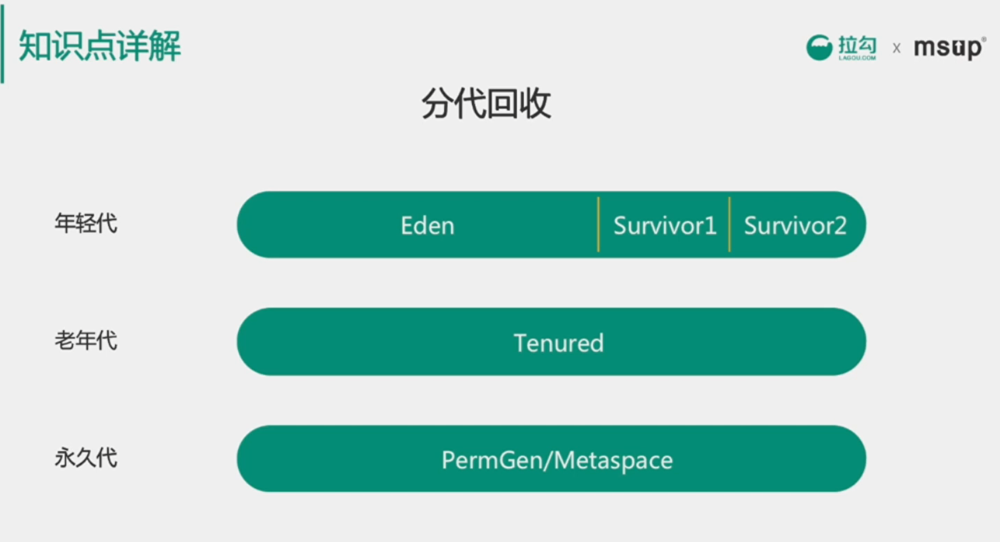
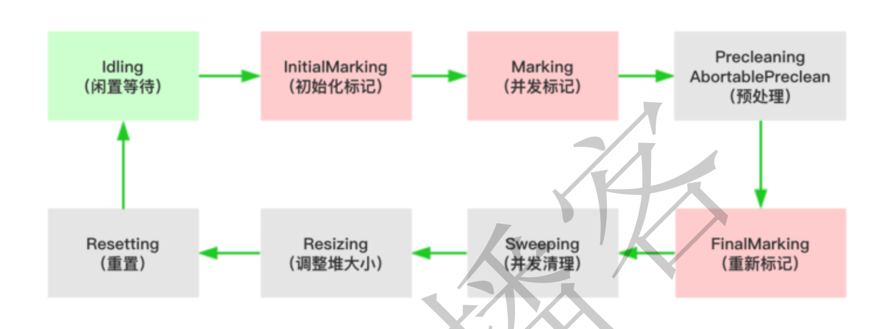
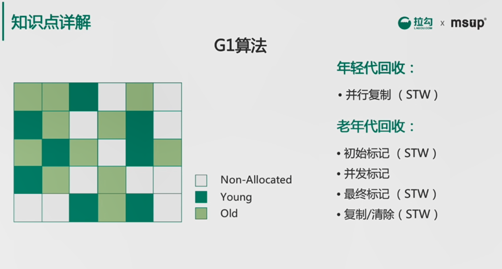
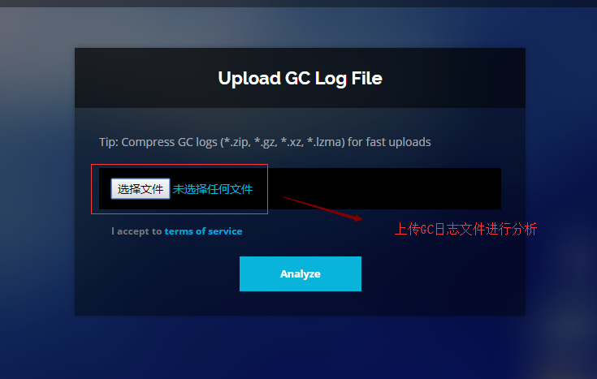

# 垃圾回收器GC

## 主要内容

- GC垃圾回收机制
- 垃圾回收器的常见算法
- 垃圾收集器和内存分配
- 可视化GC分析工具

## 一 什么是GC?

为了让程序员更专注于代码的实现，而不用过多的考虑内存释放的问题，所以，在Java语言中，有了自动的垃圾回收机制，也就是我们熟悉的GC。

有了垃圾回收机制后，程序员只需要关心内存的申请即可，内存的释放由系统自动识别完成。

当然，除了Java语言，C#、Python等语言也都有自动的垃圾回收机制。

## 二 垃圾回收的常见算法

### 2.1 引用计数法

**原理：**

在对象头维护着一个 counter 计数器，对象被引用一次则计数器 +1；若引用失效则计数器 -1。当计数器为 0 时，就认为该对象无效了。

**优缺点分析**：

优点：

- 实时性较高，无需等到内存不够的时候，才开始回收，运行时根据对象的计数器是否为0，就可以直接回收。
- 在垃圾回收过程中，应用无需挂起。如果申请内存时，内存不足，则立刻报outofmember 错误。
- 区域性，更新对象的计数器时，只是影响到该对象，不会扫描全部对象。

缺点：

- 每次对象被引用时，都需要去更新计数器，有一点时间开销。
- 浪费 CPU资源，即使内存够用，仍然在运行时进行计数器的统计。
- 无法解决循环引用问题。（最大的缺点）

**思考什么是循环引用？**

### 2.2 标记清除法（老年代）

标记清除算法，是将垃圾回收分为2个阶段，分别是标记和清除。

- 标记：从根节点开始标记引用的对象。
- 清除：未被标记引用的对象就是垃圾对象，可以被清理。

**优缺点**

可以看到，标记清除算法解决了引用计数算法中的循环引用的问题，没有从root节点引用的对象都会被回收。

- 效率较低，标记和清除两个动作都需要遍历所有的对象，并且在 GC时，需要停止应用程序，对于交互性要求比较高的应用而言这个体验是非常差的。
- 通过标记清除算法清理出来的内存，碎片化较为严重，因为被回收的对象可能存在于内存的各个角落，所以清理出来的内存是不连贯的

### 2.3 标记压缩算法（老年代）

标记压缩算法是在标记清除算法的基础之上，做了优化改进的算法。和标记清除算法一样，也是从根节点开始，对对象的引用进行标记，在清理阶段，并不是简单的清理未标记的对象，而是将存活的对象压缩到内存的一端，然后清理边界以外的垃圾，从而解决了碎片化的问题。

### 2.4 复制算法(新生代)

复制算法的核心就是，将原有的内存空间一分为二，每次只用其中的一块，在垃圾回收时，将正在使用的对象复制到另一个内存空间中，然后将该内存空间清空，交换两个内存的角色，完成垃圾的回收。如果内存中的垃圾对象较多，需要复制的对象就较少，这种情况下适合使用该方式并且效率比较高，反之，则不适合。

优点：

- 在垃圾对象多的情况下，效率较高
- 清理后，内存无碎片

缺点：

- 在垃圾对象少的情况下，不适用，如：老年代内存
- 分配的 2块内存空间，在同一个时刻，只能使用一半，内存使用率较低

为了解决空间利用率问题，可以将内存分为三块： Eden、From Survivor、To Survivor

### 2.5 分代算法

根据对象存活周期的不同，将内存划分为几块。一般是把 Java 堆分为新生代和老年代，针对各个年代的特点采用最适当的收集算法。  

- 新生代：复制算法
- 老年代：标记-清除算法、标记-整理算法



## 三 垃圾收集器以及内存分配

前面我们讲了垃圾回收的算法，还需要有具体的实现，在jvm中，实现了多种垃圾收集器，包括：串行垃圾收集器、并行垃圾收集器、CMS（并发）垃圾收集器、G1垃圾收集器

### 3.1 串行垃圾收集器

串行垃圾收集器，是指使用单线程进行垃圾回收，垃圾回收时，只有一个线程在工作，并且java应用中的所有线程都要暂停，等待垃圾回收的完成。这种现象称之为STW（Stop-The-World）。

对于交互性较强的应用而言，这种垃圾收集器是不能够接受的。

一般在Javaweb应用中是不会采用该收集器的。

**设置垃圾回收为串行收集器**

在程序运行参数中添加2个参数，如下：

- -XX:+UseSerialGC
  - 指定年轻代和老年代都使用串行垃圾收集器
- -XX:+PrintGCDetails
  - 打印垃圾回收的详细信息

### 3.2 并行垃圾收集器

并行垃圾收集器在串行垃圾收集器的基础之上做了改进，将单线程改为了多线程进行垃圾回收，这样可以缩短垃圾回收的时间。（这里是指，并行能力较强的机器）

当然了，并行垃圾收集器在收集的过程中也会暂停应用程序，这个和串行垃圾回收器是一样的，只是并行执行，速度更快些，暂停的时间更短一些。

#### 3.2.1 ParNew垃圾收集器

ParNew垃圾收集器是工作在年轻代上的，只是将串行的垃圾收集器改为了并行。

通过-XX:+UseParNewGC参数设置年轻代使用ParNew回收器，老年代使用的依然是串行
收集器。

#### 3.2.2 ParallelGC垃圾收集器

ParallelGC 收集器工作机制和ParNewGC收集器一样，只是在此基础之上，新增了两个和系统吞吐量相关的参数，使得其使用起来更加的灵活和高效。

相关参数如下：

- -XX:+UseParallelGC
  - 年轻代使用 ParallelGC垃圾回收器，老年代使用串行回收器。
- -XX:+UseParallelOldGC
  - 年轻代使用 ParallelGC垃圾回收器，老年代使用ParallelOldGC垃圾回收器。
- -XX:MaxGCPauseMillis
  - 设置最大的垃圾收集时的停顿时间，单位为毫秒
  - 需要注意的时， ParallelGC为了达到设置的停顿时间，可能会调整堆大小或其他的参数，如果堆的大小设置的较小，就会导致GC工作变得很频繁，反而可能会影响到性能。
  - 该参数使用需谨慎。
- -XX:GCTimeRatio
  - 设置垃圾回收时间占程序运行时间的百分比，公式为 1/(1+n)。
  - 它的值为 0~100之间的数字，默认值为99，也就是垃圾回收时间不能超过1%
- -XX:UseAdaptiveSizePolicy
  - 自适应 GC模式，垃圾回收器将自动调整年轻代、老年代等参数，达到吞吐量、堆大小、停顿时间之间的平衡。
  - 一般用于，手动调整参数比较困难的场景，让收集器自动进行调整。

### 3.3  CMS垃圾收集器

CMS全称 Concurrent Mark Sweep，是一款并发的、使用标记-清除算法的垃圾回收器，该回收器是针对老年代垃圾回收的，通过参数-XX:+UseConcMarkSweepGC进行设置。

CMS垃圾回收器的执行过程如下：



- 初始化标记 (CMS-initial-mark) ,标记root，会导致stw；
- 并发标记 (CMS-concurrent-mark)，与用户线程同时运行；
- 预清理（ CMS-concurrent-preclean），与用户线程同时运行；
- 重新标记 (CMS-remark) ，会导致stw；
- 并发清除 (CMS-concurrent-sweep)，与用户线程同时运行；
- 调整堆大小，设置 CMS在清理之后进行内存压缩，目的是清理内存中的碎片；
- 并发重置状态等待下次 CMS的触发(CMS-concurrent-reset)，与用户线程同时运行；

**测试启动查看日志：**

```javascript
#设置启动参数
‐XX:+UseConcMarkSweepGC ‐XX:+PrintGCDetails ‐Xms16m ‐Xmx16m
#运行日志
[GC (Allocation Failure) [ParNew: 4926K‐>512K(4928K), 0.0041843 secs]
9424K‐>6736K(15872K), 0.0042168 secs] [Times: user=0.00 sys=0.00,
real=0.00 secs]
#第一步，初始标记
[GC (CMS Initial Mark) [1 CMS‐initial‐mark: 6224K(10944K)] 6824K(15872K),
0.0004209 secs] [Times: user=0.00 sys=0.00, real=0.00 secs]
#第二步，并发标记
[CMS‐concurrent‐mark‐start]
[CMS‐concurrent‐mark: 0.002/0.002 secs] [Times: user=0.00 sys=0.00,
real=0.00 secs]
#第三步，预处理
[CMS‐concurrent‐preclean‐start]
[CMS‐concurrent‐preclean: 0.000/0.000 secs] [Times: user=0.00 sys=0.00,
real=0.00 secs]
#第四步，重新标记
[GC (CMS Final Remark) [YG occupancy: 1657 K (4928 K)][Rescan (parallel)
, 0.0005811 secs][weak refs processing, 0.0000136 secs][class unloading,
0.0003671 secs][scrub symbol table, 0.0006813 secs][scrub string table,
0.0001216 secs][1 CMS‐remark: 6224K(10944K)] 7881K(15872K), 0.0018324
secs] [Times: user=0.00 sys=0.00, real=0.00 secs]
#第五步，并发清理
[CMS‐concurrent‐sweep‐start]
[CMS‐concurrent‐sweep: 0.004/0.004 secs] [Times: user=0.00 sys=0.00,
real=0.00 secs]
#第六步，重置
[CMS‐concurrent‐reset‐start]
[CMS‐concurrent‐reset: 0.000/0.000 secs] [Times: user=0.00 sys=0.00,
real=0.00 secs]
```

### 3.4、G1垃圾收集器（重点）

G1垃圾收集器是在jdk1.7中正式使用的全新的垃圾收集器，oracle官方计划在jdk9中将G1变成默认的垃圾收集器，以替代CMS。

G1 的设计原则就是简化JVM性能调优，开发人员只需要简单的三步即可完成调优：
1. 第一步，开启G1垃圾收集器
2. 第二步，设置堆的最大内存
3. 第三步，设置最大的停顿时间
G1中提供了三种模式垃圾回收模式，Young GC、Mixed GC 和 Full GC，在不同的条件
下被触发。

#### 3.4.1 原理：

G1垃圾收集器相对比其他收集器而言，最大的区别在于它取消了年轻代、老年代的物理划分，取而代之的是将堆划分为若干个区域（Region），这些区域中包含了有逻辑上的年轻代、老年代区域。

这样做的好处就是，我们再也不用单独的空间对每个代进行设置了，不用担心每个代内存是否足够




在 G1划分的区域中，年轻代的垃圾收集依然采用暂停所有应用线程的方式，将存活对象拷贝到老年代或者Survivor空间，G1收集器通过将对象从一个区域复制到另外一个区域，完成了清理工作。

这就意味着，在正常的处理过程中，G1完成了堆的压缩（至少是部分堆的压缩），这样也就不会有cms内存碎片问题的存在了。

在G1中，有一种特殊的区域，叫Humongous区域。

- 如果一个对象占用的空间超过了分区容量 50%以上，G1收集器就认为这是一个巨型对象。
- 这些巨型对象，默认直接会被分配在老年代，但是如果它是一个短期存在的巨型对象，就会对垃圾收集器造成负面影响。
- 为了解决这个问题， G1划分了一个Humongous区，它用来专门存放巨型对象。如果一个H区装不下一个巨型对象，那么G1会寻找连续的H分区来存储。为了能找到连续的H区，有时候不得不启动Full GC。

#### 3.4.2 Young GC

Young GC主要是对Eden区进行GC，它在Eden空间耗尽时会被触发。

- Eden 空间的数据移动到Survivor空间中，如果Survivor空间不够，Eden空间的部分数据会直接晋升到年老代空间。
- Survivor 区的数据移动到新的Survivor区中，也有部分数据晋升到老年代空间中。
- 最终 Eden空间的数据为空，GC停止工作，应用线程继续执行

**Remembered Set（已记忆集合）**

在GC年轻代的对象时，我们如何找到年轻代中对象的根对象呢？

根对象可能是在年轻代中，也可以在老年代中，那么老年代中的所有对象都是根么？

如果全量扫描老年代，那么这样扫描下来会耗费大量的时间。

于是，G1引进了RSet的概念。它的全称是Remembered Set，其作用是跟踪指向某个堆内的对象引用。

#### 3.4.3 Mixed GC

当越来越多的对象晋升到老年代old region时，为了避免堆内存被耗尽，虚拟机会触发一个混合的垃圾收集器，即Mixed GC，该算法并不是一个Old GC，除了回收整个YoungRegion，还会回收一部分的Old Region，这里需要注意：是一部分老年代，而不是全部老年代，可以选择哪些old region进行收集，从而可以对垃圾回收的耗时时间进行控制。也要注意的是Mixed GC 并不是 Full GC。

MixedGC什么时候触发？ 由参数 `-XX:InitiatingHeapOccupancyPercent=n `决定。默认：45%，该参数的意思是：当老年代大小占整个堆大小百分比达到该阀值时触发。

它的GC步骤分2步：

1. 全局并发标记（global concurrent marking）
2. 拷贝存活对象（evacuation）

**全局并发标记，执行过程分为五个步骤：**

- 初始标记（ initial mark，STW）
  - 标记从根节点直接可达的对象，这个阶段会执行一次年轻代 GC，会产生全局停顿。
- 根区域扫描（ root region scan）
  - G1 GC  在初始标记的存活区扫描对老年代的引用，并标记被引用的对象。
  - 该阶段与应用程序（非 STW）同时运行，并且只有完成该阶段后，才能开始下一次 STW 年轻代垃圾回收。
- 并发标记（Concurrent Marking）
  - G1 GC  在整个堆中查找可访问的（存活的）对象。该阶段与应用程序同时运行，可以被 STW 年轻代垃圾回收中断。
- 重新标记（ Remark，STW）
  - 该阶段是 STW 回收，因为程序在运行，针对上一次的标记进行修正。
- 清除垃圾（ Cleanup，STW）
  - 清点和重置标记状态，该阶段会 STW，这个阶段并不会实际上去做垃圾的收集，等待evacuation阶段来回收。

**Evacuation阶段是全暂停的。该阶段把一部分Region里的活对象拷贝到另一部分Region**
**中，从而实现垃圾的回收清理。**

#### 3.4.4 G1收集器相关参数

- -XX:+UseG1GC
  - 使用 G1 垃圾收集器
- -XX:MaxGCPauseMillis
  - 设置期望达到的最大 GC停顿时间指标（JVM会尽力实现，但不保证达到），默认值是 200 毫秒。
- -XX:G1HeapRegionSize=n
  - 设置的 G1 区域的大小。值是 2 的幂，范围是 1 MB 到 32 MB 之间。目标是根据最小的 Java 堆大小划分出约 2048 个区域。
  - 默认是堆内存的 1/2000。
- -XX:ParallelGCThreads=n
  - 设置 STW 工作线程数的值。将 n 的值设置为逻辑处理器的数量。n 的值与逻辑处理器的数量相同，最多为 8。
- -XX:ConcGCThreads=n
  - 设置并行标记的线程数。将 n 设置为并行垃圾回收线程数 (ParallelGCThreads)的 1/4 左右。
- -XX:InitiatingHeapOccupancyPercent=n
  - 设置触发标记周期的 Java 堆占用率阈值。默认占用率是整个 Java 堆的 45%。

#### 3.4.6  对于G1垃圾收集器优化建议

- 年轻代大小
  - 避免使用 -Xmn 选项或 -XX:NewRatio 等其他相关选项显式设置年轻代大小。
  - 固定年轻代的大小会覆盖暂停时间目标。
- 暂停时间目标不要太过严苛
  - G1 GC  的吞吐量目标是 90% 的应用程序时间和 10%的垃圾回收时间。
  - 评估 G1 GC 的吞吐量时，暂停时间目标不要太严苛。目标太过严苛表示您愿意承受更多的垃圾回收开销，而这会直接影响到吞吐量。


## 四 可视化GC日志分析工具

### 4.1、GC日志输出参数

在日志打印输出涉及到的参数如下：

```
‐XX:+PrintGC 输出GC日志
‐XX:+PrintGCDetails 输出GC的详细日志
‐XX:+PrintGCTimeStamps 输出GC的时间戳（以基准时间的形式）
‐XX:+PrintGCDateStamps 输出GC的时间戳（以日期的形式，如 2013‐05‐
04T21:53:59.234+0800）
‐XX:+PrintHeapAtGC 在进行GC的前后打印出堆的信息
‐Xloggc:../logs/gc.log 日志文件的输出路径
```

### 4.2 、GC Easy 可视化工具

前面通过-XX:+PrintGCDetails可以对GC日志进行打印，我们就可以在控制台查看，这样虽然可以查看GC的信息，但是并不直观，可以借助于第三方的GC日志分析工具进行查看。

GC Easy是一款在线的可视化工具，易用、功能强大，网站：http://gceasy.io/




## 五 GC如何判定回收对象？

### 5.1 可达性分析法

所有和 GC Roots 直接或间接关联的对象都是有效对象，和 GC Roots 没有关联的对象就是无效对象。

GC Roots 是指：

* Java 虚拟机栈（栈帧中的本地变量表）中引用的对象
* 本地方法栈中引用的对象
* 方法区中常量引用的对象
* 方法区中类静态属性引用的对象

GC Roots 并不包括堆中对象所引用的对象，这样就不会有循环引用的问题。

### 5.2 引用的种类

判定对象是否存活与“引用”有关。

在 JDK 1.2 之后，Java 对引用的概念进行了扩充，将引用分为了以下四种。不同的引用类型，主要体现的是对象不同的可达性状态`reachable`和垃圾收集的影响。

**强引用（Strong Reference）**

类似 "Object obj = new Object()" 这类的引用，就是强引用，只要强引用存在，垃圾收集器永远不会回收被引用的对象。但是，如果我们**错误地保持了强引用**，比如：赋值给了 static 变量，那么对象在很长一段时间内不会被回收，会产生内存泄漏。

**软引用（Soft Reference）**

软引用是一种相对强引用弱化一些的引用，可以让对象豁免一些垃圾收集，只有当 JVM 认为内存不足时，才会去试图回收软引用指向的对象。JVM 会确保在抛出 OutOfMemoryError 之前，清理软引用指向的对象。软引用通常用来**实现内存敏感的缓存**，如果还有空闲内存，就可以暂时保留缓存，当内存不足时清理掉，这样就保证了使用缓存的同时，不会耗尽内存。

**弱引用（Weak Reference）**

弱引用的**强度比软引用更弱**一些。当 JVM 进行垃圾回收时，**无论内存是否充足，都会回收**被软引用关联的对象。

**虚引用（Phantom Reference）**

虚引用也称幽灵引用或者幻影引用，它是**最弱**的一种引用关系。一个对象是否有虚引用的存在，完全不会对其生存时间构成影响。它仅仅是提供了一种确保对象被 finalize 以后，做某些事情的机制，比如，通常用来做所谓的 Post-Mortem 清理机制。

### 5.3 回收堆中无效对象

对于可达性分析中不可达的对象，也并不是没有存活的可能。

#### 5.3.1 判定 finalize() 是否有必要执行

JVM 会判断此对象是否有必要执行 finalize() 方法，如果对象没有覆盖 finalize() 方法，或者 finalize() 方法已经被虚拟机调用过，那么视为“没有必要执行”。那么对象基本上就真的被回收了。

如果对象被判定为有必要执行 finalize() 方法，那么对象会被放入一个 F-Queue 队列中，虚拟机会以较低的优先级执行这些 finalize()方法，但不会确保所有的 finalize() 方法都会执行结束。如果 finalize() 方法出现耗时操作，虚拟机就直接停止指向该方法，将对象清除。

#### 5.3.2 对象重生或死亡

如果在执行 finalize() 方法时，将 this 赋给了某一个引用，那么该对象就重生了。如果没有，那么就会被垃圾收集器清除。

> 任何一个对象的 finalize() 方法只会被系统自动调用一次，如果对象面临下一次回收，它的 finalize() 方法不会被再次执行，想继续在 finalize() 中自救就失效了。

#### 5.3.3 回收方法区内存

方法区中存放生命周期较长的类信息、常量、静态变量，每次垃圾收集只有少量的垃圾被清除。方法区中主要清除两种垃圾：

* 废弃常量
* 无用的类

#### 5.3.5 判定废弃常量

只要常量池中的常量不被任何变量或对象引用，那么这些常量就会被清除掉。比如，一个字符串 "bingo" 进入了常量池，但是当前系统没有任何一个 String 对象引用常量池中的 "bingo" 常量，也没有其它地方引用这个字面量，必要的话，"bingo"常量会被清理出常量池。

#### 5.3.5 判定无用的类

判定一个类是否是“无用的类”，条件较为苛刻。

* 该类的所有对象都已经被清除
* 加载该类的 ClassLoader 已经被回收
* 该类的 java.lang.Class 对象没有在任何地方被引用，无法在任何地方通过反射访问该类的方法。

> 一个类被虚拟机加载进方法区，那么在堆中就会有一个代表该类的对象：java.lang.Class。这个对象在类被加载进方法区时创建，在方法区该类被删除时清除。

## 六 内存分配与回收策略

对象的内存分配，就是在堆上分配（也可能经过 JIT 编译后被拆散为标量类型并间接在栈上分配），对象主要分配在新生代的 Eden 区上，少数情况下可能直接分配在老年代，**分配规则不固定**，取决于当前使用的垃圾收集器组合以及相关的参数配置。

以下列举几条最普遍的内存分配规则，供大家学习。

### 6.1 对象优先在 Eden 分配

大多数情况下，对象在新生代 Eden 区中分配。当 Eden 区没有足够空间进行分配时，虚拟机将发起一次 Minor GC。

👇**Minor GC** vs **Major GC**/**Full GC**：

- Minor GC：回收新生代（包括 Eden 和 Survivor 区域），因为 Java 对象大多都具备朝生夕灭的特性，所以 Minor GC 非常频繁，一般回收速度也比较快。
- Major GC / Full GC: 回收老年代，出现了 Major GC，经常会伴随至少一次的 Minor GC，但这并非绝对。Major GC 的速度一般会比 Minor GC 慢 10 倍 以上。 

> 在 JVM 规范中，Major GC 和 Full GC 都没有一个正式的定义，所以有人也简单地认为 Major GC 清理老年代，而 Full GC 清理整个内存堆。

### 6.2 大对象直接进入老年代

大对象是指需要大量连续内存空间的 Java 对象，如很长的字符串或数据。

一个大对象能够存入 Eden 区的概率比较小，发生分配担保的概率比较大，而分配担保需要涉及大量的复制，就会造成效率低下。

虚拟机提供了一个 -XX:PretenureSizeThreshold 参数，令大于这个设置值的对象直接在老年代分配，这样做的目的是避免在 Eden 区及两个 Survivor 区之间发生大量的内存复制。（还记得吗，新生代采用复制算法回收垃圾）

### 6.3 长期存活的对象将进入老年代

JVM 给每个对象定义了一个对象年龄计数器。当新生代发生一次 Minor GC 后，存活下来的对象年龄 +1，当年龄超过一定值时，就将超过该值的所有对象转移到老年代中去。

使用 -XXMaxTenuringThreshold 设置新生代的最大年龄，只要超过该参数的新生代对象都会被转移到老年代中去。

### 6.4 动态对象年龄判定

如果当前新生代的 Survivor 中，相同年龄所有对象大小的总和大于 Survivor 空间的一半，年龄 &gt;= 该年龄的对象就可以直接进入老年代，无须等到 MaxTenuringThreshold 中要求的年龄。

### 6.5 空间分配担保

JDK 6 Update 24 之前的规则是这样的：  
 在发生 Minor GC 之前，虚拟机会先检查**老年代最大可用的连续空间是否大于新生代所有对象总空间**， 如果这个条件成立，Minor GC 可以确保是安全的； 如果不成立，则虚拟机会查看 HandlePromotionFailure 值是否设置为允许担保失败， 如果是，那么会继续检查老年代最大可用的连续空间是否大于历次晋升到老年代对象的平均大小， 如果大于，将尝试进行一次 Minor GC,尽管这次 Minor GC 是有风险的； 如果小于，或者 HandlePromotionFailure 设置不允许冒险，那此时也要改为进行一次 Full GC。

JDK 6 Update 24 之后的规则变为：  
 只要老年代的连续空间大于新生代对象总大小或者历次晋升的平均大小，就会进行 Minor GC，否则将进行 Full GC。

通过清除老年代中废弃数据来扩大老年代空闲空间，以便给新生代作担保。

这个过程就是分配担保。

------

👇总结一下有哪些情况可能会触发 JVM 进行 Full GC。

1. System.gc() 方法的调用<br>
   此方法的调用是建议 JVM 进行 Full GC，注意这**只是建议而非一定**，但在很多情况下它会触发 Full GC，从而增加 Full GC 的频率。通常情况下我们只需要让虚拟机自己去管理内存即可，我们可以通过 -XX:+ DisableExplicitGC 来禁止调用 System.gc()。
2. 老年代空间不足<br>
   老年代空间不足会触发 Full GC操作，若进行该操作后空间依然不足，则会抛出如下错误：<br>
   ` java.lang.OutOfMemoryError: Java heap space `
3. 永久代空间不足<br>
   JVM 规范中运行时数据区域中的方法区，在 HotSpot 虚拟机中也称为永久代（Permanet Generation），存放一些类信息、常量、静态变量等数据，当系统要加载的类、反射的类和调用的方法较多时，永久代可能会被占满，会触发 Full GC。如果经过 Full GC 仍然回收不了，那么 JVM 会抛出如下错误信息：<br>
   `java.lang.OutOfMemoryError: PermGen space `
4. CMS GC 时出现 promotion failed 和 concurrent mode failure<br>
   promotion failed，就是上文所说的担保失败，而 concurrent mode failure 是在执行 CMS GC 的过程中同时有对象要放入老年代，而此时老年代空间不足造成的。
5. 统计得到的Minor GC晋升到旧生代的平均大小大于老年代的剩余空间