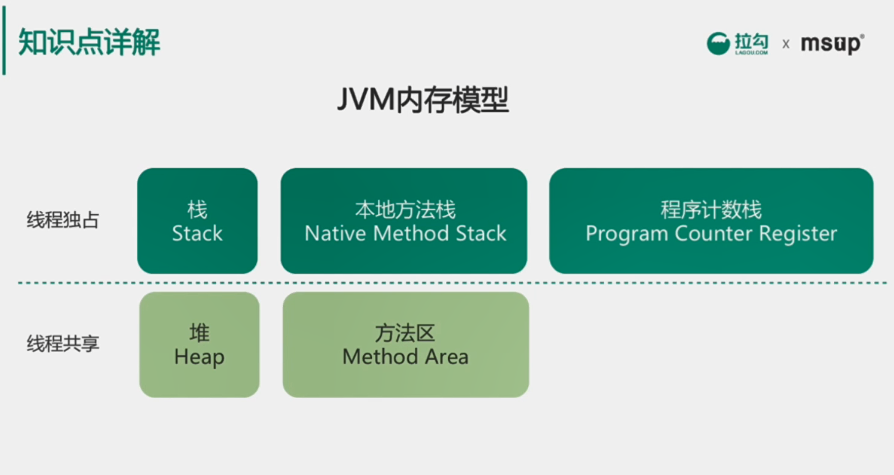
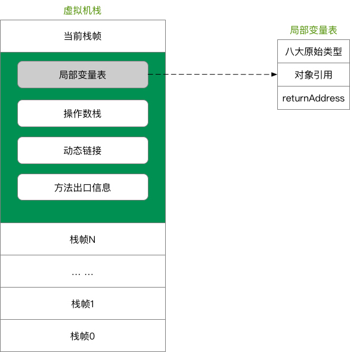
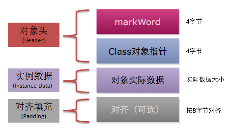
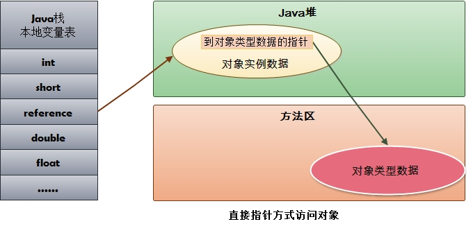
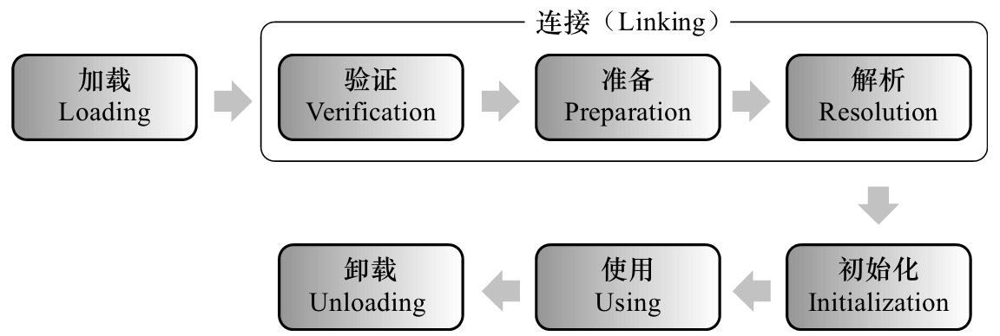

# 深入理解JVM

## 今日内容

- JVM内存结构
- 虚拟机对象Hotspot
- 类加载过程
- 类加载器

## 一 JVM 内存结构

Java 虚拟机的内存空间分为 5 个部分：

* 程序计数器
* Java 虚拟机栈
* 本地方法栈
* 堆
* 方法区



JDK 1.8 同 JDK 1.7 比，最大的差别就是：元数据区取代了永久代。元空间的本质和永久代类似，都是对 JVM 规范中方法区的实现。不过元空间与永久代之间最大的区别在于：元数据空间并不在虚拟机中，而是使用本地内存。

### 1.1 程序计数器（PC 寄存器）

#### 程序计数器的定义

程序计数器是一块较小的内存空间，是当前线程正在执行的那条字节码指令的地址。若当前线程正在执行的是一个本地方法，那么此时程序计数器为`Undefined`。

#### 程序计数器的作用

* 字节码解释器通过改变程序计数器来依次读取指令，从而实现代码的流程控制。
* 在多线程情况下，程序计数器记录的是当前线程执行的位置，从而当线程切换回来时，就知道上次线程执行到哪了。

#### 程序计数器的特点

* 是一块较小的内存空间。
* 线程私有，每条线程都有自己的程序计数器。
* 生命周期：随着线程的创建而创建，随着线程的结束而销毁。
* 是唯一一个不会出现`OutOfMemoryError`的内存区域。

### 1.2 Java 虚拟机栈（Java 栈）

#### Java 虚拟机栈的定义

Java 虚拟机栈是描述 Java 方法运行过程的内存模型。

Java 虚拟机栈会为每一个即将运行的 Java 方法创建一块叫做“栈帧”的区域，用于存放该方法运行过程中的一些信息，如：

* 局部变量表
* 操作数栈
* 动态链接
* 方法出口信息
* ......



#### 压栈出栈过程

当方法运行过程中需要创建局部变量时，就将局部变量的值存入栈帧中的局部变量表中。

Java 虚拟机栈的栈顶的栈帧是当前正在执行的活动栈，也就是当前正在执行的方法，PC 寄存器也会指向这个地址。只有这个活动的栈帧的本地变量可以被操作数栈使用，当在这个栈帧中调用另一个方法，与之对应的栈帧又会被创建，新创建的栈帧压入栈顶，变为当前的活动栈帧。

方法结束后，当前栈帧被移出，栈帧的返回值变成新的活动栈帧中操作数栈的一个操作数。如果没有返回值，那么新的活动栈帧中操作数栈的操作数没有变化。

> 由于Java 虚拟机栈是与线程对应的，数据不是线程共享的，因此不用关心数据一致性问题，也不会存在同步锁的问题。

#### Java 虚拟机栈的特点

* 局部变量表随着栈帧的创建而创建，它的大小在编译时确定，创建时只需分配事先规定的大小即可。在方法运行过程中，局部变量表的大小不会发生改变。
* Java 虚拟机栈会出现两种异常：StackOverFlowError 和 OutOfMemoryError。
  * StackOverFlowError  若 Java 虚拟机栈的大小不允许动态扩展，那么当线程请求栈的深度超过当前 Java 虚拟机栈的最大深度时，抛出 StackOverFlowError 异常。
  * OutOfMemoryError  若允许动态扩展，那么当线程请求栈时内存用完了，无法再动态扩展时，抛出 OutOfMemoryError 异常。
* Java 虚拟机栈也是线程私有，随着线程创建而创建，随着线程的结束而销毁。

> 出现 StackOverFlowError 时，内存空间可能还有很多。

### 1.3 本地方法栈（C 栈）

#### 本地方法栈的定义

本地方法栈是为 JVM 运行 Native 方法准备的空间，由于很多 Native 方法都是用 C 语言实现的，所以它通常又叫 C 栈。它与 Java 虚拟机栈实现的功能类似，只不过本地方法栈是描述本地方法运行过程的内存模型。

#### 栈帧变化过程

本地方法被执行时，在本地方法栈也会创建一块栈帧，用于存放该方法的局部变量表、操作数栈、动态链接、方法出口信息等。

方法执行结束后，相应的栈帧也会出栈，并释放内存空间。也会抛出 StackOverFlowError 和 OutOfMemoryError 异常。

> 如果 Java 虚拟机本身不支持 Native 方法，或是本身不依赖于传统栈，那么可以不提供本地方法栈。如果支持本地方法栈，那么这个栈一般会在线程创建的时候按线程分配。

### 1.4 堆区

#### 堆的定义

堆是用来存放对象的内存空间，几乎所有的对象都存储在堆中。

#### 堆的特点

* 线程共享，整个 Java 虚拟机只有一个堆，所有的线程都访问同一个堆。而程序计数器、Java 虚拟机栈、本地方法栈都是一个线程对应一个。
* 在虚拟机启动时创建。
* 是垃圾回收的主要场所。
* 进一步可分为：新生代\(Eden区  From Survior  To Survivor\)、老年代。

不同的区域存放不同生命周期的对象，这样可以根据不同的区域使用不同的垃圾回收算法，更具有针对性。

堆的大小既可以固定也可以扩展，但对于主流的虚拟机，堆的大小是可扩展的，因此当线程请求分配内存，但堆已满，且内存已无法再扩展时，就抛出 OutOfMemoryError 异常。

> Java 堆所使用的内存不需要保证是连续的。而由于堆是被所有线程共享的，所以对它的访问需要注意同步问题，方法和对应的属性都需要保证一致性。

### 1.5 方法区

#### 方法区的定义

Java 虚拟机规范中定义方法区是堆的一个逻辑部分。方法区存放以下信息：  


* 已经被虚拟机加载的类信息
* 常量
* 静态变量
* 即时编译器编译后的代码

#### 方法区的特点

* 线程共享。  方法区是堆的一个逻辑部分，因此和堆一样，都是线程共享的。整个虚拟机中只有一个方法区。
* 永久代。  方法区中的信息一般需要长期存在，而且它又是堆的逻辑分区，因此用堆的划分方法，把方法区称为“永久代”。
* 内存回收效率低。  方法区中的信息一般需要长期存在，回收一遍之后可能只有少量信息无效。主要回收目标是：对常量池的回收；对类型的卸载。
* Java 虚拟机规范对方法区的要求比较宽松。  和堆一样，允许固定大小，也允许动态扩展，还允许不实现垃圾回收。

#### 运行时常量池

方法区中存放：类信息、常量、静态变量、即时编译器编译后的代码。常量就存放在运行时常量池中。

当类被 Java 虚拟机加载后， .class 文件中的常量就存放在方法区的运行时常量池中。而且在运行期间，可以向常量池中添加新的常量。如 String 类的 intern\(\) 方法就能在运行期间向常量池中添加字符串常量。

### 1.6 直接内存（堆外内存）

直接内存是除 Java 虚拟机之外的内存，但也可能被 Java 使用。

#### 操作直接内存

在 NIO 中引入了一种基于通道和缓冲的 IO 方式。它可以通过调用本地方法直接分配 Java 虚拟机之外的内存，然后通过一个存储在堆中的`DirectByteBuffer`对象直接操作该内存，而无须先将外部内存中的数据复制到堆中再进行操作，从而提高了数据操作的效率。

直接内存的大小不受 Java 虚拟机控制，但既然是内存，当内存不足时就会抛出 OutOfMemoryError 异常。

#### 直接内存与堆内存比较

* 直接内存申请空间耗费更高的性能
* 直接内存读取 IO 的性能要优于普通的堆内存。
* 直接内存作用链： 本地 IO -&gt; 直接内存 -&gt; 本地 IO
* 堆内存作用链：本地 IO -&gt; 直接内存 -&gt; 非直接内存 -&gt; 直接内存 -&gt; 本地 IO

> 服务器管理员在配置虚拟机参数时，会根据实际内存设置`-Xmx`等参数信息，但经常忽略直接内存，使得各个内存区域总和大于物理内存限制，从而导致动态扩展时出现`OutOfMemoryError`异常。


## 二 HotSpot 虚拟机对象探秘

### 2.1 对象的内存布局

在 HotSpot 虚拟机中，对象的内存布局分为以下 3 块区域：

- 对象头（Header）
- 实例数据（Instance Data）
- 对齐填充（Padding）



#### 对象头

对象头记录了对象在运行过程中所需要使用的一些数据：

- 哈希码
- GC 分代年龄
- 锁状态标志
- 线程持有的锁
- 偏向线程 ID
- 偏向时间戳

对象头可能包含类型指针，通过该指针能确定对象属于哪个类。如果对象是一个数组，那么对象头还会包括数组长度。

#### 实例数据

实例数据部分就是成员变量的值，其中包括父类成员变量和本类成员变量。

#### 对齐填充

用于确保对象的总长度为 8 字节的整数倍。

HotSpot VM 的自动内存管理系统要求对象的大小必须是 8 字节的整数倍。而对象头部分正好是 8 字节的倍数（1 倍或 2 倍），因此，当对象实例数据部分没有对齐时，就需要通过对齐填充来补全。

> 对齐填充并不是必然存在，也没有特别的含义，它仅仅起着占位符的作用。

### 2.2 对象的创建过程

#### 类加载检查

虚拟机在解析`.class`文件时，若遇到一条 new 指令，首先它会去检查常量池中是否有这个类的符号引用，并且检查这个符号引用所代表的类是否已被加载、解析和初始化过。如果没有，那么必须先执行相应的类加载过程。

#### 为新生对象分配内存

对象所需内存的大小在类加载完成后便可完全确定，接下来从堆中划分一块对应大小的内存空间给新的对象。分配堆中内存有两种方式：

- **指针碰撞**<br>
  如果 Java **堆中内存绝对规整**（说明采用的是“**复制算法**”或“**标记整理法**”），空闲内存和已使用内存中间放着一个指针作为分界点指示器，那么分配内存时只需要把指针向空闲内存挪动一段与对象大小一样的距离，这种分配方式称为“**指针碰撞**”。
- **空闲列表**<br>
  如果 Java **堆中内存并不规整**，已使用的内存和空闲内存交错（说明采用的是**标记-清除法**，有碎片），此时没法简单进行指针碰撞， VM 必须维护一个列表，记录其中哪些内存块空闲可用。分配之时从空闲列表中找到一块足够大的内存空间划分给对象实例。这种方式称为“**空闲列表**”。

#### 初始化

分配完内存后，为对象中的成员变量赋上初始值，设置对象头信息，调用对象的构造函数方法进行初始化。

至此，整个对象的创建过程就完成了。

### 2.3 对象的访问方式

所有对象的存储空间都是在堆中分配的，但是这个对象的引用却是在堆栈中分配的。也就是说在建立一个对象时两个地方都分配内存，在堆中分配的内存实际建立这个对象，而在堆栈中分配的内存只是一个指向这个堆对象的指针（引用）而已。 那么根据引用存放的地址类型的不同，对象有不同的访问方式。

#### 句柄访问方式（引用）

堆中需要有一块叫做“句柄池”的内存空间，句柄中包含了对象实例数据与类型数据各自的具体地址信息。

引用类型的变量存放的是该对象的句柄地址（reference）。访问对象时，首先需要通过引用类型的变量找到该对象的句柄，然后根据句柄中对象的地址找到对象。


#### 直接指针访问方式

引用类型的变量直接存放对象的地址，从而不需要句柄池，通过引用能够直接访问对象。但对象所在的内存空间需要额外的策略存储对象所属的类信息的地址。



需要说明的是，HotSpot 采用第二种方式，即直接指针方式来访问对象，只需要一次寻址操作，所以在性能上比句柄访问方式快一倍。但像上面所说，它需要**额外的策略**来存储对象在方法区中类信息的地址。

## 三 类加载器

### 3.1 判断类是否“相等”

任意一个类，都由**加载它的类加载器**和这个**类本身**一同确立其在 Java 虚拟机中的唯一性，每一个类加载器，都有一个独立的类名称空间。

因此，比较两个类是否“相等”，只有在这两个类是由同一个类加载器加载的前提下才有意义，否则，即使这两个类来源于同一个 Class 文件，被同一个虚拟机加载，只要加载它们的类加载器不同，那么这两个类就必定不相等。

这里的“相等”，包括代表类的 Class 对象的 equals\(\) 方法、isInstance\(\) 方法的返回结果，也包括使用 instanceof 关键字做对象所属关系判定等情况。

### 3.2 加载器种类

系统提供了 3 种类加载器：

- 启动类加载器（Bootstrap ClassLoader）：  负责将存放在 `<JAVA_HOME>\lib` 目录中的，并且能被虚拟机识别的（仅按照文件名识别，如 rt.jar，名字不符合的类库即使放在 lib 目录中也不会被加载）类库加载到虚拟机内存中。
- 扩展类加载器（Extension ClassLoader）：  负责加载 `<JAVA_HOME>\lib\ext` 目录中的所有类库，开发者可以直接使用扩展类加载器。
- 应用程序类加载器（Application ClassLoader）：  由于这个类加载器是 ClassLoader 中的 getSystemClassLoader\(\) 方法的返回值，所以一般也称它为“系统类加载器”。它负责加载用户类路径（classpath）上所指定的类库，开发者可以直接使用这个类加载器，如果应用程序中没有自定义过自己的类加载器，一般情况下这个就是程序中默认的类加载器。


当然，如果有必要，还可以加入自己定义的类加载器。

### 3.3 双亲委派模型

#### 3.3.1 什么是双亲委派模型

双亲委派模型是描述类加载器之间的层次关系。它要求除了顶层的启动类加载器外，其余的类加载器都应当有自己的父类加载器。（父子关系一般不会以继承的关系实现，而是以组合关系来复用父加载器的代码）

#### 3.3.2 工作过程

如果一个类加载器收到了类加载的请求，它首先不会自己去尝试加载这个类，而是把这个请求委派给父类加载器去完成，每一个层次的类加载器都是如此，因此所有的加载请求最终都应该传送到顶层的启动类加载器中，只有当父加载器反馈自己无法完成这个加载请求（找不到所需的类）时，子加载器才会尝试自己去加载。

在 java.lang.ClassLoader 中的 loadClass\(\) 方法中实现该过程。

#### 3.3.3  为什么使用双亲委派模型

像 java.lang.Object 这些存放在 rt.jar 中的类，无论使用哪个类加载器加载，最终都会委派给最顶端的启动类加载器加载，从而使得不同加载器加载的 Object 类都是同一个。

相反，如果没有使用双亲委派模型，由各个类加载器自行去加载的话，如果用户自己编写了一个称为 java.lang.Object 的类，并放在 classpath 下，那么系统将会出现多个不同的 Object 类，Java 类型体系中最基础的行为也就无法保证。


## 四 类加载过程

### 4.1 类的生命周期

类从被加载到虚拟机内存开始，到卸载出内存为止，它的整个生命周期包括以下 7 个阶段：

- 加载
- 验证
- 准备
- 解析
- 初始化
- 使用
- 卸载

验证、准备、解析 3 个阶段统称为连接。



加载、验证、准备、初始化和卸载这 5 个阶段的顺序是确定的，类的加载过程必须按照这种顺序按部就班地开始（注意是“开始”，而不是“进行”或“完成”），而解析阶段则不一定：它在某些情况下可以在初始化后再开始，这是为了支持 Java 语言的运行时绑定。

### 4.2 类加载过程中“初始化”开始的时机

Java 虚拟机规范没有强制约束类加载过程的第一阶段（即：加载）什么时候开始，但对于“初始化”阶段，有着严格的规定。有且仅有 5 种情况必须立即对类进行“初始化”：

- 在遇到 new、putstatic、getstatic、invokestatic 字节码指令时，如果类尚未初始化，则需要先触发其初始化。
- 对类进行反射调用时，如果类还没有初始化，则需要先触发其初始化。
- 初始化一个类时，如果其父类还没有初始化，则需要先初始化父类。
- 虚拟机启动时，用于需要指定一个包含 main\(\) 方法的主类，虚拟机会先初始化这个主类。
- 当使用 JDK 1.7 的动态语言支持时，如果一个 java.lang.invoke.MethodHandle 实例最后的解析结果为 REF\_getStatic、REF\_putStatic、REF\_invokeStatic 的方法句柄，并且这个方法句柄所对应的类还没初始化，则需要先触发其初始化。

这 5 种场景中的行为称为对一个类进行**主动引用**，除此之外，其它所有引用类的方式都不会触发初始化，称为**被动引用**。

### 4.3 类加载的过程

类加载过程包括 5 个阶段：加载、验证、准备、解析和初始化。

#### 加载

**加载的过程**

“加载”是“类加载”过程的一个阶段，不能混淆这两个名词。在加载阶段，虚拟机需要完成 3 件事：

- 通过类的全限定名获取该类的二进制字节流。
- 将二进制字节流所代表的静态结构转化为方法区的运行时数据结构。
- 在内存中创建一个代表该类的 java.lang.Class 对象，作为方法区这个类的各种数据的访问入口。

**获取二进制字节流**

对于 Class 文件，虚拟机没有指明要从哪里获取、怎样获取。除了直接从编译好的 .class 文件中读取，还有以下几种方式：

- 从 zip 包中读取，如 jar、war等
- 从网络中获取，如 Applect
- 通过动态代理计数生成代理类的二进制字节流
- 由 JSP 文件生成对应的 Class 类
- 从数据库中读取，如 有些中间件服务器可以选择把程序安装到数据库中来完成程序代码在集群间的分发。

**“非数组类”与“数组类”加载比较**

- 非数组类加载阶段可以使用系统提供的引导类加载器，也可以由用户自定义的类加载器完成，开发人员可以通过定义自己的类加载器控制字节流的获取方式（如重写一个类加载器的 loadClass\(\) 方法）
- 数组类本身不通过类加载器创建，它是由 Java 虚拟机直接创建的，再由类加载器创建数组中的元素类。

**注意事项**

- 虚拟机规范未规定 Class 对象的存储位置，对于 HotSpot 虚拟机而言，Class 对象比较特殊，它虽然是对象，但存放在方法区中。
- 加载阶段与连接阶段的部分内容交叉进行，加载阶段尚未完成，连接阶段可能已经开始了。但这两个阶段的开始实践仍然保持着固定的先后顺序。

#### 验证

**验证的重要性**

验证阶段确保 Class 文件的字节流中包含的信息符合当前虚拟机的要求，并且不会危害虚拟机自身的安全。

**验证的过程**

- 文件格式验证  验证字节流是否符合 Class 文件格式的规范，并且能被当前版本的虚拟机处理，验证点如下： 
  - 是否以魔数 0XCAFEBABE 开头
  - 主次版本号是否在当前虚拟机处理范围内
  - 常量池是否有不被支持的常量类型
  - 指向常量的索引值是否指向了不存在的常量
  - CONSTANT\_Utf8\_info 型的常量是否有不符合 UTF8 编码的数据
  - ......
- 元数据验证  对字节码描述信息进行语义分析，确保其符合 Java 语法规范。
- 字节码验证  本阶段是验证过程中最复杂的一个阶段，是对方法体进行语义分析，保证方法在运行时不会出现危害虚拟机的事件。
- 符号引用验证 本阶段发生在解析阶段，确保解析正常执行。

#### 准备

准备阶段是正式为类变量（或称“静态成员变量”）分配内存并设置初始值的阶段。这些变量（不包括实例变量）所使用的内存都在方法区中进行分配。

初始值“通常情况下”是数据类型的零值（0, null...），假设一个类变量的定义为：

```java
public static int value = 123;
```

那么变量 value 在准备阶段过后的初始值为 0 而不是 123，因为这时候尚未开始执行任何 Java 方法。

存在“特殊情况”：如果类字段的字段属性表中存在 ConstantValue 属性，那么在准备阶段 value 就会被初始化为 ConstantValue 属性所指定的值，假设上面类变量 value 的定义变为：

```java
public static final int value = 123;
```

那么在准备阶段虚拟机会根据 ConstantValue 的设置将 value 赋值为 123。

#### 解析

解析阶段是虚拟机将常量池内的符号引用替换为直接引用的过程。

#### 初始化

类初始化阶段是类加载过程的最后一步，是执行类构造器 &lt;clinit&gt;\(\) 方法的过程。

&lt;clinit&gt;\(\) 方法是由编译器自动收集类中的所有类变量的赋值动作和静态语句块（static {} 块）中的语句合并产生的，编译器收集的顺序是由语句在源文件中出现的顺序所决定的。

静态语句块中只能访问定义在静态语句块之前的变量，定义在它之后的变量，在前面的静态语句块中可以赋值，但不能访问。如下方代码所示：

```java
public class Test {
    static {
        i = 0;  // 给变量赋值可以正常编译通过
        System.out.println(i);  // 这句编译器会提示“非法向前引用”
    }
    static int i = 1;
}
```

&lt;clinit&gt;\(\) 方法不需要显式调用父类构造器，虚拟机会保证在子类的 &lt;clinit&gt;\(\) 方法执行之前，父类的 &lt;clinit&gt;\(\) 方法已经执行完毕。

由于父类的 &lt;clinit&gt;\(\) 方法先执行，意味着父类中定义的静态语句块要优先于子类的变量赋值操作。如下方代码所示：

```java
static class Parent {
    public static int A = 1;
    static {
        A = 2;
    }
}

static class Sub extends Parent {
    public static int B = A;
}

public static void main(String[] args) {
    System.out.println(Sub.B); // 输出 2
}
```

&lt;clinit&gt;\(\) 方法不是必需的，如果一个类没有静态语句块，也没有对类变量的赋值操作，那么编译器可以不为这个类生成 &lt;clinit&gt;\(\) 方法。

接口中不能使用静态代码块，但接口也需要通过 &lt;clinit&gt;\(\) 方法为接口中定义的静态成员变量显式初始化。但接口与类不同，接口的 &lt;clinit&gt;\(\) 方法不需要先执行父类的 &lt;clinit&gt;\(\) 方法，只有当父接口中定义的变量使用时，父接口才会初始化。

虚拟机会保证一个类的 &lt;clinit&gt;\(\) 方法在多线程环境中被正确加锁、同步。如果多个线程同时去初始化一个类，那么只会有一个线程去执行这个类的 &lt;clinit&gt;\(\) 方法。