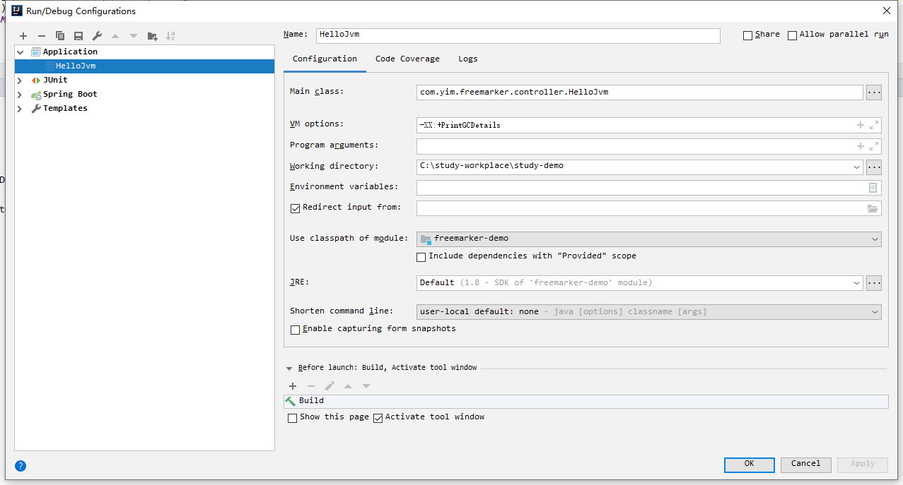
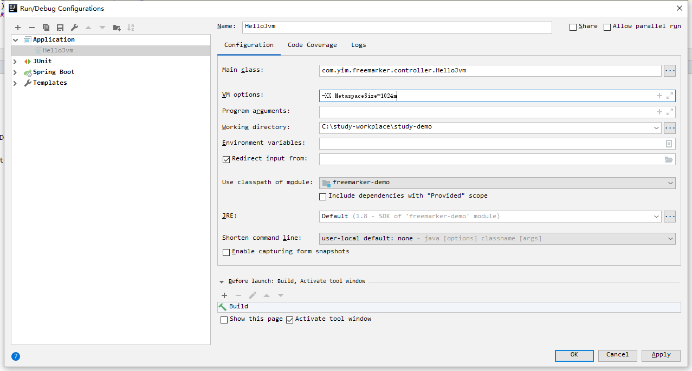
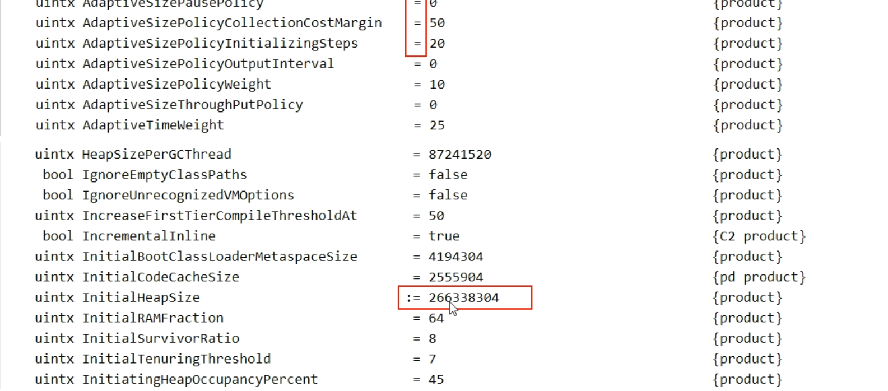
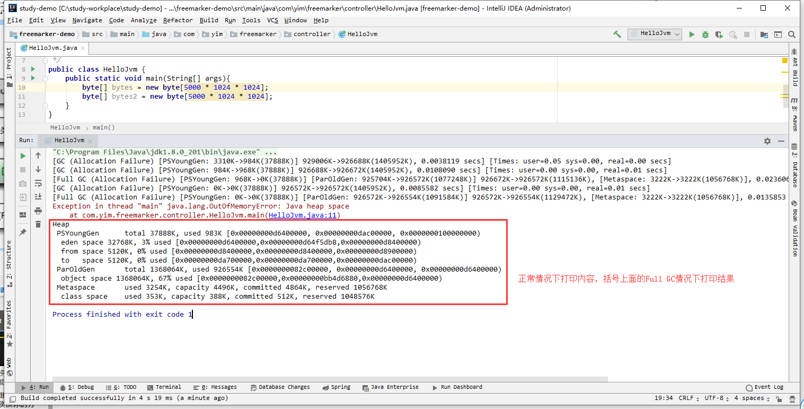

##  `JVM`面试接多线程内容

### 一 Java垃圾回收的时候如何确定垃圾？是否知道什么事GC Roots？

#### 1.1 如何确定垃圾可以被回收？

1. 引用计数法

2. 枚举根节点做可达性分析（根搜索路径）

   基本思路即使通过一系列名为“GC Roots”的对象作为起始点，从这个被称为GC Roots的对象开始向下搜索，如果GC Roots没有任何引用链相连时，则说明此对象不可用。也即给定一个集合的引用作为根节点出发，通过引用关系遍历对象图，能被遍历到的（可达）对象就被判定为存活；没有被遍历到就自然被判定为死亡。

#### 1.2 Java中哪一些对象可以作为GC Roots对象呢？

- 虚拟机栈中引用的对象
- 方法区中类静态属性引用的对象
- 方法去中常量引用的对象
- 本地方法栈中JNI(Native方法)引用的对象 

### 二 你说你做过JVM调优和参数配置，请问如何盘点查看JVM系统默认值？

#### 2.1 三种参数类型

- 标准参数，一般都是很稳定的，在未来的JVM版本中不会改变，可以使用`java -help`检索出所有的标准参数。
  - -help
  - -version
- -X 参数 （非标准参数，在不同版本的jvm中，参数可能会有所不同，可以通过java -X查看非标准参数。
  - -Xint
  - -Xcomp
- -XX 参数（使用率较高），主要用于jvm的调优和debug操作。-XX参数的使用有2种方式，一种是boolean类型，一种是非boolean类型
  - boolean 类型
    - 格式： -XX:[+-]（+表示开启 -表示关闭）
    - 如： -XX:+DisableExplicitGC 表示禁用手动调用gc操作，也就是说调用System.gc()无效
  - 非 boolean类型
    - 格式： -XX:
    - 如： -XX:NewRatio=1 表示新生代和老年代的比值

### 2.2 -Xms与-Xmx参数

-Xms与-Xmx分别是设置jvm的堆内存的初始大小和最大大小。

-Xmx2048m：等价于-XX:MaxHeapSize，设置JVM最大堆内存为2048M。

-Xms512m：等价于-XX:InitialHeapSize，设置JVM初始堆内存为512M。

适当的调整jvm的内存大小，可以充分利用服务器资源，让程序跑的更快。

#### 2.3 -XX之boolean 类型

**示例：是否打印GC收集细节**

**在启动类中设置VM参数，开启收集**



**使用如下命令查看**

```shell
# 查看java进程
jps -l
# 查看PrintGCDetails是否看起
jinfo -flag PrintGCDetails 12268
```

#### 2.4 非 boolean类型（kv类型设值）

**示例：设值元空间大小**



#### 2.5 查看所有默认参数

```shell
C:\study-workplace\study-demo>jinfo -flags 15856
VM Flags:
-XX:CICompilerCount=3 -XX:InitialHeapSize=132120576 -XX:MaxHeapSize=2101346304 -XX:MaxNewSize=700448768 -XX:MinHeapDeltaBytes=524288 -XX:NewSize=44040192 -XX:OldSize=88080384 -XX:+PrintGCDetails -XX:+UseCompressedClassPointers -XX:+
UseCompressedOops -XX:+UseFastUnorderedTimeStamps -XX:-UseLargePagesIndividualAllocation -XX:+UseParallelGC

```

#### 2.6 盘点查看默认值的方法

**第一种方法**

```shell
# 打印具体参数
jinfo -flag 具体参数 <java pid>
# 打印所有
jinfo -flags <java pid>
```

**第二种方法**

```shell
# 查看初始默认
java -XX:+PrintFlagsInitial

# 查看修改更新设置,使用此命令效果如下图，则可以看出:=的内容为人为修改的内容
java -XX:+PrintFlagsFinal
```



**第三种方式**：此命令可方便看出所用的垃圾收集器`G1`

```sh
C:\study-workplace\study-demo>java -XX:+PrintCommandLineFlags -version

-XX:G1ConcRefinementThreads=6 -XX:GCDrainStackTargetSize=64 -XX:InitialHeapSize=131281600 -XX:MaxHeapSize=2100505600 -XX:+PrintCommandLineFlags -XX:ReservedCodeCacheSize=251658240
-XX:+SegmentedCodeCache -XX:+UseCompressedClassPointers -XX:+UseCompressedOops -XX:+UseG1GC -XX:-UseLargePagesIndividualAllocation

java version "11.0.1" 2018-10-16 LTS
Java(TM) SE Runtime Environment 18.9 (build 11.0.1+13-LTS)
Java HotSpot(TM) 64-Bit Server VM 18.9 (build 11.0.1+13-LTS, mixed mode)
```

#### 2.7 程序的方法获得内存大小

```java
public static void main(String[] args) throws InterruptedException {
    long l = Runtime.getRuntime().totalMemory();
}
```

### 三 你平时工作用过的JVM常用基本配置参数有哪些？

#### 3.1 JVM常用参数清单

- -Xms：初始大小内存，默认物理内存的1/64
- -Xmx：最大分配内存，默认物理内存1/4
- -Xss：设置单个线程大小，一般默认512k~1024k，等价于-XX:ThreadStackSize 
- -Xmn：设置年轻代大小
- -XX:MetaspaceSize 默认值20m往右，比较小可设置
- -XX:PrintGCDetails 能够打印垃圾回收的详细情况：用于查看Full GC问题
- -XX:SurvivorRatio 设置新生代中eden和S0/S1空间的比例，默认Eden:S0:S1=8:1:1
- -XX:NewRatio 配置年轻代与老年代在堆内存中的比例：默认年轻代1/3，老年代2/3
- -XX:MaxTenuringThreshold 设置垃圾回收的最大年龄

#### 3.2 `-XX:PrintGCDetails`收集GC和FullGC信息

打印细节如下：为了能展示所有情况，我new了两个大对象，导致OOM异常，触发了FullGC细节的打印



### 四 强、弱、软、虚引用分别是什么？

判定对象是否存活与“引用”有关。

在 JDK 1.2 之后，Java 对引用的概念进行了扩充，将引用分为了以下四种。不同的引用类型，主要体现的是对象不同的可达性状态`reachable`和垃圾收集的影响。

**强引用（Strong Reference）**

类似 "Object obj = new Object()" 这类的引用，就是强引用，只要强引用存在，垃圾收集器永远不会回收被引用的对象。但是，如果我们**错误地保持了强引用**，比如：赋值给了 static 变量，那么对象在很长一段时间内不会被回收，会产生内存泄漏。

**软引用（Soft Reference）**

软引用是一种相对强引用弱化一些的引用，可以让对象豁免一些垃圾收集，只有当 JVM 认为内存不足时，才会去试图回收软引用指向的对象。JVM 会确保在抛出 OutOfMemoryError 之前，清理软引用指向的对象。软引用通常用来**实现内存敏感的缓存**，如果还有空闲内存，就可以暂时保留缓存，当内存不足时清理掉，这样就保证了使用缓存的同时，不会耗尽内存。

**弱引用（Weak Reference）**

弱引用的**强度比软引用更弱**一些。当 JVM 进行垃圾回收时，**无论内存是否充足，都会回收**被软引用关联的对象。

**虚引用（Phantom Reference）**

虚引用也称幽灵引用或者幻影引用，它是**最弱**的一种引用关系。一个对象是否有虚引用的存在，完全不会对其生存时间构成影响。它仅仅是提供了一种确保对象被 finalize 以后，做某些事情的机制，比如，通常用来做所谓的 Post-Mortem 清理机制。

### 五 请谈谈你对OOM的认识

- StackoverFlowError：栈内存溢出错误，过量的方法调用导致的错误，如没有结点的递归调用。

- OutofMemeoryError: Java heap space ：参照3.2部分内容,new 了大对象导致内存溢出

- OutofMemeoryError: GC overhead limit exceeded ：超过98%的时间做GC，并且多次回收了不到2%的不吃内存

  ```java
  /**
   * -Xms10m -Xmx10m -XX:+PrintGCDetails -XX:MaxDirectMemorySize=5m
   * @author yim create time 2019-9-2
   */
  public class ErrorDemo {
      public static void main(String[] args) {
          int a = 0;
          ArrayList<String> list = new ArrayList<>();
          try {
              while (true){
                  list.add(String.valueOf(++a).intern());
              }
          } catch (Exception e) {
              e.printStackTrace();
          }
      }
  }
  ```

- OutofMemeoryError: Direct buffer memeory：直接内存溢出

  ```java
  /**
   * 直接内存溢出，用NIO方法allocateDirect需要注意
   * -Xms10m -Xmx10m -XX:+PrintGCDetails -XX:MaxDirectMemorySize=5m
   */
  public class ErrorDemo {
      public static void main(String[] args) {
          System.out.println("配置的maxDirectMemory："+ sun.misc.VM.maxDirectMemory()/1024/1024+"MB");
          try {
              Thread.sleep(3000);
          } catch (InterruptedException e) {
              e.printStackTrace();
          }
          ByteBuffer byteBuffer = ByteBuffer.allocateDirect(6*1024*1024);
      }
  }
  ```

  打印内容如下：

  ```
  配置的maxDirectMemory：5MB
  [GC (Allocation Failure) [PSYoungGen: 2048K->496K(2560K)] 2048K->912K(9728K), 0.0077941 secs] [Times: user=0.00 sys=0.00, real=0.01 secs] 
  [GC (System.gc()) [PSYoungGen: 1142K->496K(2560K)] 1558K->1088K(9728K), 0.0007687 secs] [Times: user=0.00 sys=0.00, real=0.00 secs] 
  [Full GC (System.gc()) [PSYoungGen: 496K->0K(2560K)] [ParOldGen: 592K->959K(7168K)] 1088K->959K(9728K), [Metaspace: 3722K->3722K(1056768K)], 0.0073476 secs] [Times: user=0.00 sys=0.00, real=0.01 secs] 
  Exception in thread "main" java.lang.OutOfMemoryError: Direct buffer memory
  	at java.nio.Bits.reserveMemory(Bits.java:694)
  	at java.nio.DirectByteBuffer.<init>(DirectByteBuffer.java:123)
  	at java.nio.ByteBuffer.allocateDirect(ByteBuffer.java:311)
  	at com.yim.interview.ErrorDemo.main(ErrorDemo.java:19)
  ```

- OutofMemeoryError: unable to create new native thread 不能创建更多的本地线程

  ```java
  /**
   * 高并发请求服务器时，经常出现如下异常：java.lang.OutOfMemoryError:unable to create new native thread
   * 准确的讲native thread异常与对应的平台有关
   *
   * 导致原因：一个应用创建了过多的线程，超过了当前系统线程创建的限制Linux系统默认单个进程创建的线程个数1024
   *
   * 解决：
   * 1. 降低创建的线程数
   * 2. 提高系统限制量
   * @author yim create time 2019-9-3
   */
  public class UnableCreateNative {
      public static void main(String[] args) {
          for (int i = 0; ; i++) {
              final int i1 = i;
              new Thread(() -> {
                  System.out.println("不停的创建线程"+ i1);
              },"thread" + i1).start();
          }
      }
  }
  ```

- OutofMemeoryError: Metaspace

### 六 GC垃圾回收算法和垃圾收集器的关系？分别是什么？

参考GC文档的内容

#### 6.1 垃圾回收算法？

1. 引用计数法
2. 复制算法
3. 标记整理
4. 标记清楚

#### 6.2 垃圾回收器? 4种主要

1. 串行垃圾收集器
2. 并行垃圾收集器
3. CMS（并发）垃圾收集器
4. G1垃圾收集器

### 七 怎么查看服务器默认垃圾收集器是哪个？生产上如何配置垃圾收集器？请谈谈你对垃圾收集器的理解？

### 八 G1垃圾收集器

### 九 生产环境服务器变慢，诊断思路和性能评估？

### 十 假如生产环境出现CPU占用过高，请谈谈你的分析思路和定位？

1. 使用top命令查看cpu占比最高的

2. ps -ef或者jps进一步定位，得知是一个怎么样的后台程序

   ```sh
   # jps方式定位
   jps -l
   
   # ps方式定位 
   ps -ef|grep java|grep -v grep
   ```

3. 定位具体线程或者代码

   ```sh
   # 能够查看到具体tid
   # -m 显示所有的线程
   # -p pid进程使用cpu的时间
   # -o 该参数后是用户自定义格式
   ps -mp 进程id -o THREAD，tid，time
   ```

4. 将需要的线程ID转换成16进制格式（英文小写格式）

   ```sh
   # 3中查到有问题的线程id，进行16进制转换
   prinf "%x\n" tid
   ```

5. jstack 进程id | grep tid（16进制线程id小写英文）

### 十一 如何找到优秀的源码+进行深度的框架解读+学习其他高手的代码+自己共享贡献

### 11.1 in操作

```sh
xxx关键词 in:name

# 项目名中包含seckill关键字
seckill in:name

# 项目名中 readme 描述中包含关键字seckill
seckill in:name,readme,description
```

### 11.2 fork操作和stars操作

```sh
# 关键字 + stars:>=num
# 查询springboot星标>=5000的项目
springboot stars:>=5000

# fork
springboot forks:>=5000

# 查询fork数量100到200之间并且stars在80到100之间的
springboot forks:100..200 stars:80..100
```

### 11.3 awesome加强搜索

```sh
# 一般用来收集学习
awesome redis
```

### 11.4 高亮显示具体的代码

```sh
# 给别人指出关键代码的行号，如:第十三行

URL+#L13

# 给别人指出关键代码区间，显示13~23行代码的内容

URL+#L13-L23
```

### 11.5 项目内搜索

```sh
github里使用英文字母t

#搜索github内的大牛

location:beijing language:java
```

