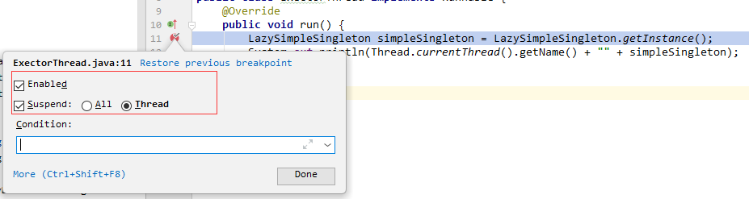
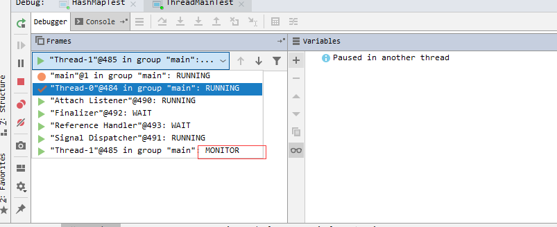
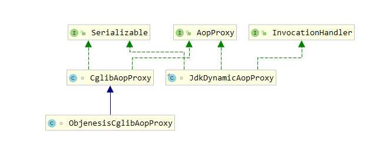

# 【11】常用设计模式

## 本文学习目标

- [ ] 背诵基本设计原则
- [ ] 掌握常用设计模式
  - [ ] 单例设计模式
  - [ ] 工厂设计模式
  - [ ] 原型模式
  - [ ] 适配器模式
  - [ ] 代理模式
  - [ ] 装饰者模式

## 一 前言

### 1.1 设计原则

#### 1.1.1 开闭原则

- 对扩展开放，对修改关闭
- 任何软件都是有bug的，bug就是臭虫、漏洞的意思 
- 提高了项目的可维护性和可扩展性

**如下：**

```java
public class Person{
    private String name;
    private int age;
    ... ...
}
public class Student extends Person{
    private int id;
    ... ...
}
```

#### 1.1.2 依赖倒转原则

是指设计代码结构时，高层模块不应该依赖底层模块，二者都应该依赖其抽象。抽象不应该依赖细节；细节应该依赖抽象。通过依赖倒置，可以减少类与类之间的耦合性，提高系统的稳定性，提高代码的可读性和可维护性，并能够降低修改程序所造成的风险。 

- 尽量多依赖抽象类和接口，而不是具体实现类
- 抽象类和接口对子类具有强制性和规范性。

#### 1.1.3 接口隔离原则

- 尽量多依赖于小接口而不是大接口，避免接口的污染
- 建立单一接口

```java
public interface FlyAnimal{
    public abstract void fly();
}
public interface RunAnimal{
    public abstract void run();
}
class Dog implements RunAnimal{
    ... ...
}
```

#### 1.1.4 迪米特原则（最少知道原则）

- 一个实体应当尽量少与其它实体之间发生关联
- 高内聚低耦合
  - 内聚就是指一个实体应当将该有的所有功能聚集于该实体的内部。
  - 耦合就是指一个实体与其它实体之间的关联度。

#### 1.1.5 里氏代换原则

- 所有引用父类的地方必须能透明地使用其子类的对象，子类对象能够替换父类对象，而程序逻辑不变。 
- 子类 is a 父类。
- 建议多使用继承和多态的方式编码。

#### 1.1.6 合成复用原则

- 尽量多使用合成的方式而不是继承达到代码复用的目的
- 继承我们叫做白箱复用，相当于把所有的实现细节暴露给子类。组合/聚合也称之为黑箱复用，对类以外的对象是无法获取到实现细节的 

**如下：**

```java
class A{
    void show(){}
}
class B extends A{
    void test(){
        show();
    }
}
class A{
    void show(){}
}
class B{
    private A a;
    void test(){
        a.show();
    }
}
```

#### 1.1.7 单一职责原则

### 1.2 设计模式在Spring中的应用

Spring 就是一个把设计模式用得淋漓尽致的经典框架，其实从类的命名就能看出来，我们从类的命名就能看出来

| 设计模式名 | 举例                  |
| ---------- | --------------------- |
| 工厂模式   | BeanFactory           |
| 装饰者模式 | BeanWrapper           |
| 代理模式   | AopProxy              |
| 委派模式   | DispatcherServlet     |
| 策略模式   | HandlerMapping        |
| 适配器模式 | HandlerAdapter        |
| 模板模式   | JdbcTemplate          |
| 观察者模式 | ContextLoaderListener |

需要特别声明的是，设计模式从来都不是单个设计模式独立使用的。在实际应用中，通常是多个设计模式混合使用。

### 1.3 了解设计模式分类

| 类型       | 中文名称 | 英文名称 |
| ---------- | -------- | -------- |
| 创建型模式 | 工厂模式 |     Factory Pattern     |
|  | 单例模式 | Singleton Pattern |
|  | 原型模式 | Prototype Pattern |
| 结构型模式 | 适配器模式 | Adapter Pattern |
|  | 装饰者模式 | Decorator Pattern |
|  | 代理模式 | Proxy Pattern |
| 行为型模式 | 策略模式 | Strategy Pattern |
|  | 模板模式 | Template Pattern |
|  | 委派模式 | Delegate Pattern |
|  | 观察者模式 | Observer Pattern |

## 二 工厂模式

### 2.1 简单工厂模式

简单工厂模式（Simple Factory Pattern）是指由一个工厂对象决定创建出哪一种产品类的实例，但它不属于 GOF，23 种设计模式，简单工厂适用于工厂类负责创建的对象较少的场景，且客户端只需要传入工厂类的参数，对于如何创建对象的逻辑不需要关心。 

GOF23种设计模式：http://c.biancheng.net/view/1320.html

1. 创建抽象产品

   ```java
   // 课程
   public interface ICourse {
       /**
        * 录制视频
        * @return
        */
       void record();
   }
   ```

2. 创建具体产品

   ```java
   // Java课程
   public class JavaCourse implements ICourse {
   
       @Override
       public void record() {
           System.out.println("录制Java课程");
       }
   }
   // Python课程
   public class PythonCourse implements ICourse {
   
       @Override
       public void record() {
           System.out.println("录制Python课程");
       }
   }
   ```

3. 9创建工厂类

   ```java
   // 课程工厂
   public class CourseFactory {
       public ICourse create(String courseName){
           if (courseName.equals("Java")){
               return new JavaCourse();
           }else if (courseName.equals("Python")){
               return new PythonCourse();
           }else {
               return null;
           }
       }  
   }
   ```

4. 测试简单工厂模式

   ```java
   /**
    * Create By Yim
    * 2019-5-27 13:59
    *
    * 简单工厂模式适用场景：
    *
    * 工厂类负责创建的对象较少。
    * 客户端只需要传入工厂类的参数，对于如何创建对象的逻辑不需
    * 要关心。
    *
    * 优点：只需传入一个正确的参数，就可以获取你所需要的对象
    * 无须知道其创建的细节。
    *
    * 缺点：
    * 工厂类的职责相对过重，增加新的产品时需要修改工厂类的判断逻辑，违背开闭原则。
    * 不易于扩展过于复杂的产品结构。
    *
    **/
   public class SimpleFactoryTest {
       public static void main(String[] args) {
           CourseFactory courseFactory = new CourseFactory();
           ICourse java = courseFactory.create("Java");
           java.record();
       }
   }
   ```

   

### 2.2 工厂方法模式

工厂方法模式（Fatory Method Pattern）是指定义一个创建对象的接口，但让实现这个接口的类来决定实例化哪个类，工厂方法让类的实例化推迟到子类中进行。在工厂方法模式中用户只需要关心所需产品对应的工厂，无须关心创建细节，而且加入新的产品符合开闭原则 。

#### 2.2.1 创建抽象产品和具体产品

```java
public interface ICourse {
    void record();
}

class JavaCourse implements ICourse {

    @Override
    public void record() {
        System.out.println("录制Java课程");
    }
}

class PythonCourse implements ICourse {

    @Override
    public void record() {
        System.out.println("录制Python课程");
    }
}
```

#### 2.2.2 创建抽象工厂和具体工厂

```java
public interface ICourseFactory {
    ICourse create();
}

class JavaCourseFactory implements ICourseFactory {
    
    @Override
    public ICourse create() {
        return new JavaCourse();
    }
}

class PythonCourseFactory implements ICourseFactory {

    @Override
    public ICourse create() {
        return new PythonCourse();
    }
}
```

#### 2.2.3 测试工厂方法模式

```java
/**
 * Created by Yim.
 *
 * 工厂方法模式适用场景：
 *
 * 创建对象需要大量重复的代码。
 * 客户端（应用层）不依赖于产品类实例如何被创建、实现等细节。
 * 一个类通过其子类来指定创建哪个对象。
 *
 * 优点：
 *
 * 用户只需关心所需产品对应的工厂，无须关心创建细节。
 * 加入新产品符合开闭原则，提高了系统的可扩展性
 *
 * 缺点:
 *
 * 类的个数容易过多，增加了代码结构的复杂度。
 * 增加了系统的抽象性和理解难度。
 *
 */
public class FactoryMethodTest {

    public static void main(String[] args) {

        ICourseFactory factory = new PythonCourseFactory();
        ICourse course = factory.create();
        course.record();

        factory = new JavaCourseFactory();
        course = factory.create();
        course.record();
    }
}
```

### 2.3 抽象工厂模式

抽象工厂模式（Abastract Factory Pattern）：是指提供一个创建一系列相关或相互依赖对象的接口，无须指定他们具体的类。

客户端（应用层）不依赖于产品类实例如何被创建、实现等细节，强调的是一系列相关的产品对象（属于同一产品族）一起使用创建对象需要大量重复的代码。需要提供一个产品类的库，所有的产品以同样的接口出现，从
而使客户端不依赖于具体实现 

#### 2.3.1 创建多个抽象产品和具体产品

1. 笔记

   ```java
   public interface INote {
       void edit();
   }
   
   class JavaNote implements INote {
       @Override
       public void edit() {
           System.out.println("编写Java笔记");
       }
   }
   
   class PythonNote implements INote {
       @Override
       public void edit() {
           System.out.println("编写Python笔记");
       }
   }
   ```

2. 视频

   ```java
   public interface IVideo {
       void record();
   }
   
   class JavaVideo implements IVideo {
       @Override
       public void record() {
           System.out.println("录制Java视频");
       }
   }
   
   class PythonVideo implements IVideo {
       @Override
       public void record() {
           System.out.println("录制Python视频");
       }
   }
   ```

#### 2.3.2 创建抽象工厂和具体工厂

```java
/**
 * 抽象工厂是用户的主入口
 * 在Spring中应用得最为广泛的一种设计模式
 * 易于扩展
 */
public interface CourseFactory {

    INote createNote();

    IVideo createVideo();

}

class JavaCourseFactory implements CourseFactory {

    @Override
    public INote createNote() {
        return new JavaNote();
    }

    @Override
    public IVideo createVideo() {
        return new JavaVideo();
    }
}

class PythonCourseFactory implements CourseFactory {

    @Override
    public INote createNote() {
        return new PythonNote();
    }

    @Override
    public IVideo createVideo() {
        return new PythonVideo();
    }
}
```

#### 2.3.3 测试抽象工厂模式

```java
/**
 * 适用场景：
 * 客户端（应用层）不依赖于产品类实例如何被创建、实现等细节。
 * 强调一系列相关的产品对象（属于同一产品族）一起使用创建对象需要大量重复的代码。
 * 提供一个产品类的库，所有的产品以同样的接口出现，从而使客户端不依赖于具体实现。
 * 
 * 优点：
 * 具体产品在应用层代码隔离，无须关心创建细节
 * 将一个系列的产品族统一到一起创建。
 *
 * 缺点：
 * 规定了所有可能被创建的产品集合，产品族中扩展新的产品困难，需要修改抽象工厂的接口。
 * 增加了系统的抽象性和理解难度。
 */
public class AbstractFactoryTest {

    public static void main(String[] args) {

        JavaCourseFactory factory = new JavaCourseFactory();

        factory.createNote().edit();
        factory.createVideo().record();
    }
}
```

## 三 单例设计模式

### 3.1 第二章学习目标

- [ ] 掌握单例模式的应用场景
- [ ] 掌握IDEA下多线程的调试方式
- [ ] 掌握保证线程安全的单例模式
- [ ] 掌握反射暴力攻击单例的解决方案及原理分析
- [ ] 序列化破坏单例的原理及解决方案
- [ ] 常见的单例写法

### 3.2 应用场景

单例模式（Singleton Pattern）是指确保一个类在任何情况下都绝对只有一个实例，并提供一个全局访问点。单例模式是创建型模式 。在 Spring 框架应用中 ApplicationContext；数据库的连接池也都是单例形式 。

### 3.3 饿汉式单例

饿汉式单例是在类加载的时候就立即初始化，并且创建单例对象。绝对线程安全，在线程还没出现以前就是实例化了，不可能存在访问安全问题。

- 优点：没有加任何的锁、执行效率比较高，在用户体验上来说，比懒汉式更好。
- 缺点：类加载的时候就初始化，不管用与不用都占着空间，浪费了内存，有可能占着茅坑不拉屎。

####  3.3.1 常规写法

```java
//饿汉式单例
// 它是在类加载的时候就立即初始化，并且创建单例对象

    //绝对线程安全，在线程还没出现以前就是实例化了，不可能存在访问安全问题
public class HungrySingleton {
    //先静态、后动态
    //先属性、后方法
    //先上后下
    private static final HungrySingleton hungrySingleton = new HungrySingleton();

    private HungrySingleton(){}

    public static HungrySingleton getInstance(){
        return  hungrySingleton;
    }
}

```

#### 3.3.2 静态写法

```java
//饿汉式静态块单例
public class HungryStaticSingleton {
    private static final HungryStaticSingleton hungrySingleton;
    static {
        hungrySingleton = new HungryStaticSingleton();
    }
    private HungryStaticSingleton(){}
    public static HungryStaticSingleton getInstance(){
        return  hungrySingleton;
    }
}
```

### 3.4 懒汉式单例

懒汉式单例的特点是：被外部类调用的时候内部类才会加载 

#### 3.4.1 简单单例写法

```java
//懒汉式单例
//在外部需要使用的时候才进行实例化
public class LazySimpleSingleton {
    private LazySimpleSingleton(){}
    //静态块，公共内存区域
    private static LazySimpleSingleton lazy = null;
    public static LazySimpleSingleton getInstance(){
        if(lazy == null){
            lazy = new LazySimpleSingleton();
        }
        return lazy;
    }
}
```

**思考：简单的饿汉式单例，在多线程环境下存在的问题？**

多现场环境下：多个线程调用同一个单例类，可能会出现多个单例，违背了单例模式的初衷。

#### 3.4.2 多线程环境下测试

1. 创建多线程环境进行测试

   ```java
   //创建多线程，进行单例加载
   public class ExectorThread implements Runnable {
       @Override
       public void run() {
           LazySimpleSingleton simpleSingleton = LazySimpleSingleton.getInstance();
           System.out.println(Thread.currentThread().getName() + "" + simpleSingleton);
       }
   }
   ```

2. 编写测试的主方法

   ```java
   public class ThreadMainTest {
       public static void main(String[] args) {
           Thread thread = new Thread(new ExectorThread());
           Thread thread1 = new Thread(new ExectorThread());
           thread.start();
           thread1.start();
           System.out.println("end");
       }
   }
   ```

   

3. 使用idea多线程断点调试的方法

   1. 选择默认断点方式

   

   2. 进行线程切换

   ![[idea多线程断点02]](../images/idea多线程断点02.png)

> **结论：通过不断切换线程，并观测其内存状态，我们发现在线程环境下 LazySimpleSingleton被实例化了两次。有时，我们得到的运行结果可能是相同的两个对象，实际上是被后面执行的线程覆盖了，我们看到了一个假象，线程安全隐患依旧存在。** 

#### 3.4.3 解决01：锁方法的方式实现线程安全

```java
public class LazySimpleSingleton {
    private LazySimpleSingleton(){}
    //静态块，公共内存区域
    private static LazySimpleSingleton lazy = null;
    public synchronized static LazySimpleSingleton getInstance(){
        if(lazy == null){
            lazy = new LazySimpleSingleton();
        }
        return lazy;
    }
}
```

这时候，我们再来调试。当我们将其中一个线程执行并调用 getInstance()方法时，另一个线程在调getInstance()方法，线程的状态由 RUNNING 变成了 MONITOR,出现阻塞。直到第一个线程执行完，第二个线程才恢RUNNING 状态继续调用 getInstance()方法 

如下图所示：



完美的展现了 synchronized 监视锁的运行状态，线程安全的问题便解决了。但是，用synchronized 加锁，**在线程数量比较多情况下，如果 CPU 分配压力上升，会导致大批量线程出现阻塞，从而导致程序运行性能大幅下降**。那么，有没有一种更好的方式，既兼顾线程安全又提升程序性能呢？答案是肯定的。 

#### 3.4.4  解决02：通过双重检查锁的方式

```java
public class LazyDoubleCheckSingleton {
    private volatile static LazyDoubleCheckSingleton lazy = null;

    private LazyDoubleCheckSingleton(){}
    public static LazyDoubleCheckSingleton getInstance(){
        if(lazy == null){
            synchronized (LazyDoubleCheckSingleton.class){
                if(lazy == null){
                    lazy = new LazyDoubleCheckSingleton();
                    //1.分配内存给这个对象
                    //2.初始化对象
                    //3.设置lazy指向刚分配的内存地址
                    //4.初次访问对象
                }
            }
        }
        return lazy;
    }
}
```

当第一个线程调用 getInstance()方法时，第二个线程也可以调用 getInstance()。当第一个线程执行synchronized 时会上锁，第二个线程就会变成 MONITOR 状态，出现阻塞。此时，阻塞并不是基于整个 LazySimpleSingleton 类的阻塞，而是在 getInstance()方法内部阻塞，只要逻辑不是太复杂，对于调用者而言感知不到。 

但是，用到 synchronized 关键字，总归是要上锁，对程序性能还是存在一定影响的。难道就真的没有更好的方案吗？当然是有的。我们可以从类初始化角度来考虑，看下面的代码，采用静态内部类的方式： 

#### 3.4.5 解决03：静态内部类

```java
//这种形式兼顾饿汉式的内存浪费，也兼顾synchronized性能问题
//完美地屏蔽了这两个缺点
//史上最牛B的单例模式的实现方式
public class LazyInnerClassSingleton {
    //默认使用LazyInnerClassGeneral的时候，会先初始化内部类
    //如果没使用的话，内部类是不加载的
    private LazyInnerClassSingleton(){}

    //每一个关键字都不是多余的
    //static 是为了使单例的空间共享
    //final保证这个方法不会被重写，重载
    public static final LazyInnerClassSingleton getInstance(){
        //在返回结果以前，一定会先加载内部类
        return LazyHolder.LAZY;
    }

    //默认不加载
    private static class LazyHolder{
        private static final LazyInnerClassSingleton LAZY = new LazyInnerClassSingleton();
    }
}
```

### 3.5 反射破坏单例

上面介绍的单例模式的构造方法除了加上 private 以外，没有做任何处理。如果我们使用反射来调用其构造方法，然后，再调用 getInstance()方法，应该就会两个不同的实例。 

**做进一步优化**

```java
public class LazyInnerClassSingleton {
    //默认使用LazyInnerClassGeneral的时候，会先初始化内部类
    //如果没使用的话，内部类是不加载的
    private LazyInnerClassSingleton(){//使用反射破坏单例的解决方法
        if(LazyHolder.LAZY != null){
            throw new RuntimeException("不允许创建多个实例");
        }
    }

    //每一个关键字都不是多余的
    //static 是为了使单例的空间共享
    //final保证这个方法不会被重写，重载
    public static final LazyInnerClassSingleton getInstance(){
        //在返回结果以前，一定会先加载内部类
        return LazyHolder.LAZY;
    }

    //默认不加载
    private static class LazyHolder{
        private static final LazyInnerClassSingleton LAZY = new LazyInnerClassSingleton();
    }
}
```

### 3.6 序列化破坏单例

当我们将一个单例对象创建好，有时候需要将对象序列化然后写入到磁盘，下次使用时再从磁盘中读取到对象，反序列化转化为内存对象。反序列化后的对象会重新分配内存，即重新创建。那如果序列化的目标的对象为单例对象，就违背了单例模式的初衷，相当于破坏了单例，来看一段代码：

```java
//反序列化时导致单例破坏
public class SeriableSingleton implements Serializable {

    //序列化就是说把内存中的状态通过转换成字节码的形式
    //从而转换一个IO流，写入到其他地方(可以是磁盘、网络IO)
    //内存中状态给永久保存下来了

    //反序列化
    //讲已经持久化的字节码内容，转换为IO流
    //通过IO流的读取，进而将读取的内容转换为Java对象
    //在转换过程中会重新创建对象new

    public  final static SeriableSingleton INSTANCE = new SeriableSingleton();
    private SeriableSingleton(){}

    public static SeriableSingleton getInstance(){
        return INSTANCE;
    }
	//只需要增加 readResolve()方法即可，解决
    private  Object readResolve(){
        return  INSTANCE;
    }

}
```

序列化破坏单例原因：

```java
序列化是调用ObjectStreamClass中的isInstantiable方法进行判断,只要有无参构造方法就会实例化

boolean isInstantiable() {
    requireInitialized();
    return (cons != null);
}
```

增加 readResolve()方法返回实例，解决了单例被破坏的问题。但是，我们通过分析源码以及调试，我们可以看到实际上实例化了两次，只不过新创建的对象没有被返回而已。那如果，创建对象的动作发生频率增大，就意味着内存分配开销也就随之增大，难道真的就没办法从根本上解决问题吗？下面我们来注册式单例也许能帮助到你。 

### 3.7 注册式单例

注册式单例又称为登记式单例，就是将每一个实例都登记到某一个地方，使用唯一的标识获取实例。注册式单例有两种写法：一种为容器缓存，一种为枚举登记。先来看枚举式单例的写法，来看代码，创建 EnumSingleton 类： 

```java
public enum EnumSingleton {
    /**
     * 
     * @Params: 
     * @return: 
     */
    INSTANCE;
    private Object data;
    public Object getData() {
        return data;
    }
    public void setData(Object data) {
        this.data = data;
    }
    public static EnumSingleton getInstance(){
        return INSTANCE;
    }
}
```

 接下来看注册式单例还有另一种写法，容器缓存的写法，创建 ContainerSingleton 类： 

```java
//Spring中的做法，就是用这种注册式单例
public class ContainerSingleton {
    private ContainerSingleton(){}
    private static Map<String,Object> ioc = new ConcurrentHashMap<String,Object>();
    public static Object getInstance(String className){
        synchronized (ioc) {
            if (!ioc.containsKey(className)) {
                Object obj = null;
                try {
                    obj = Class.forName(className).newInstance();
                    ioc.put(className, obj);
                } catch (Exception e) {
                    e.printStackTrace();
                }
                return obj;
            } else {
                return ioc.get(className);
            }
        }
    }
}
```

容器式写法适用于创建实例非常多的情况，便于管理。但是，是非线程安全的。 

### 3.8 ThreadLocal线程单例

ThreadLocal 不能保证其创建的对象是全局唯一，但是能保证在单个线程中是唯一的，天生的线程安全。 

```java
public class ThreadLocalSingleton {
    private static final ThreadLocal<ThreadLocalSingleton> threadLocalInstance =
            new ThreadLocal<ThreadLocalSingleton>(){
                @Override
                protected ThreadLocalSingleton initialValue() {
                    return new ThreadLocalSingleton();
                }
            };

    private ThreadLocalSingleton(){}

    public static ThreadLocalSingleton getInstance(){
        return threadLocalInstance.get();
    }
}
```

我们知道上面的单例模式为了达到线程安全的目的，给方法上锁，以时间换空间。 ThreadLocal将所有的对象全部放在 ThreadLocalMap 中，为每个线程都提供一个对象，实际上是以空间换时间来实现线程间隔离的。 

## 四  代理模式

### 4.1 学习目标

- [ ] 掌握代理模式的应用场景和实现原理 
- [ ] 了解静态代理和动态代理的区别
- [ ] 了解 CGLib 和 JDK Proxy 的根本区别 
- [ ] 手写实现定义的动态代理

### 4.2 应用场景

在生活中，我们经常见到这样的场景，如：租房中介、售票黄牛、婚介、经纪人、快递、事务代理、非侵入式日志监听等，这些都是代理模式的实际体现。代理模式（ProxyPattern）的定义也非常简单，是指为其他对象提供一种代理，以控制对这个对象的访问。代理对象在客服端和目标对象之间起到中介作用，代理模式属于结构型设计模式。 

使用代理模式主要有两个目的：一保护目标对象，二增强目标对象。 

#### 4.2.1 静态代理和动态的本质区别 

1. 静态代理只能通过手动完成代理操作，如果被代理类增加新的方法，代理类需要同步新增，违背开闭原则。
2. 动态代理采用在运行时动态生成代码的方式，取消了对被代理类的扩展限制，遵循开闭原则。
3. 若动态代理要对目标类的增强逻辑扩展，结合策略模式，只需要新增策略类便可完成，无需修改代理类的代码 

#### 4.2.2 代理模式的优缺点 

使用代理模式具有以下几个优点：

1. 代理模式能将代理对象与真实被调用的目标对象分离。
2. 一定程度上降低了系统的耦合度，扩展性好。
3. 可以起到保护目标对象的作用。
4. 可以对目标对象的功能增强。

当然，代理模式也是有缺点的： 

1. 代理模式会造成系统设计中类的数量增加。
2. 在客户端和目标对象增加一个代理对象，会造成请求处理速度变慢。
3. 增加了系统的复杂度 

### 4.3 静态代理

**实际业务场景**：在分布式业务场景中，我们通常会对数据库进行分库分表，分库分表之后使用 Java 操作时，就可能需要配置多个数据源，我们通过设置数据源路由来动态切换数据源。 

**实际分库要求**：实际业务生成过程产生了大量的订单，我们根据订单产生的时间进行分库。（根据具体业务情况进行分库）

#### 4.3.1 创建业务操作

```java
public class Order {

    private Object orderInfo;
    private Long id;
    private Long createTime;

    public Object getOrderInfo() {
        return orderInfo;
    }

    public void setOrderInfo(Object orderInfo) {
        this.orderInfo = orderInfo;
    }

    public Long getId() {
        return id;
    }

    public void setId(Long id) {
        this.id = id;
    }

    public Long getCreateTime() {
        return createTime;
    }

    public void setCreateTime(Long createTime) {
        this.createTime = createTime;
    }
}

interface IOrderService {
    int createOrder(Order order);
}

class OrderServiceImpl implements IOrderService {

    private OrderDao orderDao;

    public OrderServiceImpl(){
        orderDao = new OrderDao();
    }

    @Override
    public int createOrder(Order order) {
        System.out.println("创建订单的业务操作");
        return orderDao.createOrder(order);
    }
}

class OrderDao {

    int createOrder(Order order){
        System.out.println("创建工单的DAO层操作");
        return 1;
    }
}
```

#### 4.3.2 设置数据源操作类

```java
public class DynamicDataSource {

    /**
     * 设置默认数据源
     */
    public final static String DEFAULT_SOURCE = null;

    /**
     * 利用ThreadLocal线程变量，保证数据源切换的安全性
     */
    private final static ThreadLocal<String> local = new ThreadLocal<String>();

    private DynamicDataSource(){}

    /**
     * 获取当前正在使用的数据源
     * @Params: []
     * @return: java.lang.String
     */
    public static String get(){return  local.get();}

    /**
     * 还原当期切面的数据源
     * @Params: []
     * @return: void
     */
    public static void restore(){
        local.set(DEFAULT_SOURCE);
    }

    /**
     * 根据已知数据源名称这是数据源
     * @Params: [source]
     * @return: void
     */
    public static void set(String source){local.set(source);}

    /**
     * 根据年份动态设置数据源
     * @Params: [year]
     * @return: void
     */
    public static void set(int year){local.set("DB_" + year);}
}
```

#### 4.3.3 设置静态代理

```java
public class OrderServiceStaticProxy implements IOrderService {

    private SimpleDateFormat yearFormat = new SimpleDateFormat("yyyy");

    private IOrderService orderService;
    public OrderServiceStaticProxy(IOrderService orderService) {
        this.orderService = orderService;
    }
    @Override
    public int createOrder(Order order) {
        before();
        Long createTime = order.getCreateTime();
        Integer dbRouter = Integer.valueOf(yearFormat.format(new Date(createTime)));
        System.out.println("静态代理类自动分配到【DB_" + dbRouter + "】 数据源处理数据。 ");
        DynamicDataSource.set(dbRouter);
        orderService.createOrder(order);
        after();
        return 0;
    }

    private void before(){
        System.out.println("Proxy before method.");
    }

    private void after(){
        System.out.println("Proxy after method.");
    }
}
```

#### 4.3.4 测试静态代理下数据源切换

```java
public class OrderProxyTest {
    public static void main(String[] args) throws ParseException {

        Order order = new Order();

        SimpleDateFormat sdf = new SimpleDateFormat("yyyy/MM/dd");
        Date date = sdf.parse("2017/02/01");
        order.setCreateTime(date.getTime());
        IOrderService orderService = new OrderServiceStaticProxy(new OrderServiceImpl());
        orderService.createOrder(order);
    }
}

/*打印结果

Connected to the target VM, address: '127.0.0.1:11455', transport: 'socket'
Proxy before method.
静态代理类自动分配到【DB_2017】 数据源处理数据。 
创建订单的业务操作
创建工单的DAO层操作
Proxy after method.
Disconnected from the target VM, address: '127.0.0.1:11455', transport: 'socket'

*/
```

### 4.4 动态代理

动态代理和静态对比基本思路是一致的，只不过动态代理功能更加强大，随着业务的扩展适应性更强。

#### 4.4.1 创建婚介代理的例子

```java
public interface Person {
    void findLover();
}

class Customer implements Person {
    @Override
    public void findLover() {
        System.out.println("阳光帅气");
        System.out.println("有钱");
        System.out.println("有爱心");
    }
}

/**
 * 创建婚介代理
 * @author: yim create time 2019-7-19
 */
class MatchMakingProxy implements InvocationHandler {

    /**
     * 被代理的对象
     */
    private Person target;

    public Object getInstance(Person target){
        this.target = target;
        Class<? extends Person> clazz = target.getClass();
        return Proxy.newProxyInstance(clazz.getClassLoader(),clazz.getInterfaces(),this);
    }

    @Override
    public Object invoke(Object proxy, Method method, Object[] args) throws Throwable {
        before();
        Object invoke = method.invoke(this.target, args);
        after();
        return invoke;
    }

    private void before(){
        System.out.println("婚介公司代理，找对象需求");
        System.out.println("开始找对象...");
    }

    private void after(){
        System.out.println("返回代理结果");
    }
}

class TestSimple {
    public static void main(String[] args) {
        Person person = (Person) new MatchMakingProxy().getInstance(new Customer());
        person.findLover();
    }
}
```

#### 4.4.2 动态搭理方式实现静态代理中的例子

```java
public class OrderServiceDynamicProxy implements InvocationHandler {

    private SimpleDateFormat yearFormat = new SimpleDateFormat("yyyy");
    private Object target;

    public Object getInstance(Object target){
        this.target = target;
        Class<?> clazz = target.getClass();
        return Proxy.newProxyInstance(clazz.getClassLoader(),clazz.getInterfaces(),this);
    }

    private void before(Object target) throws Exception {
        System.out.println("Proxy before method.");
        Long time = (Long) target.getClass().getMethod("getCreateTime").invoke(target);
        Integer dbRouter = Integer.valueOf(yearFormat.format(new Date(time)));
        System.out.println("静态代理类自动分配到【DB_" + dbRouter + "】 数据源处理数据。 ");
        DynamicDataSource.set(dbRouter);
    }

    private void after(){
        System.out.println("Proxy after method.");
    }


    @Override
    public Object invoke(Object proxy, Method method, Object[] args) throws Throwable {
        before(args[0]);
        Object invoke = method.invoke(target, args);
        after();
        return invoke;
    }
}
```

#### 4.4.3 JDK Proxy 

以上动态代理的方式都是使用JDK Proxy实现的。

JDK Proxy 采用字节重组，重新生的对象来替代原始的对象以达到动态代理的目的。JDK Proxy 生成对象的步骤如下：

1. 拿到被代理对象的引用，并且获取到它的所有的接口，反射获取。
2. JDK Proxy 类重新生成一个新的类、同时新的类要实现被代理类所有实现的所有的接口。
3. 动态生成 Java 代码，把新加的业务逻辑方法由一定的逻辑代码去调用（在代码中体现）。
4. 编译新生成的 Java 代码.class。
5. 再重新加载到 JVM 中运行。 

以上这个过程就叫字节码重组。JDK 中有一个规范，在 ClassPath 下只要是$开头的 class文件一般都是自动生成的。那么我们有没有办法看到代替后的对象的真容呢？做一个这样测试，我们从内存中的对象字节码通过文件流输出到一个新的 class 文件，然后，利用反编译工具查看 class 的源代码。 

#### 4.4.4 CGLib 调用 API 及原理分析 

CGLib 代理的目标对象不需要实现任何接口，它是通过动态继承目标对象实现的动态代理。 

CGLib 代理的使用，仍以媒介公司为例

```java
public class CglibMatchMaking implements MethodInterceptor {

    public Object getInstance(Class<?> clazz){
        Enhancer enhancer = new Enhancer();
        enhancer.setSuperclass(clazz);
        enhancer.setCallback(this);
        return enhancer.create();
    }

    @Override
    public Object intercept(Object o, Method method, Object[] objects, MethodProxy methodProxy) throws Throwable {
        before();
        Object aSuper = methodProxy.invokeSuper(o, objects);
        after();
        return aSuper;
    }
    private void before(){
        System.out.println("婚介公司代理，找对象需求");
        System.out.println("开始找对象...");
    }

    private void after(){
        System.out.println("返回代理结果");
    }
}

class CglibCustomer {
    public void findLover() {
        System.out.println("人傻钱多");
    }
}

class TestSimple {
    public static void main(String[] args) {
        CglibCustomer customer = (CglibCustomer) new CglibMatchMaking().getInstance(CglibCustomer.class);
        customer.findLover();
    }
}
```

CGLib 代理的目标对象不需要实现任何接口，它是通过动态继承目标对象实现的动态代理 


CGLib 动态代理执行代理方法效率之所以比 JDK 的高是因为 Cglib 采用了 FastClass 机制，它的原理简单来说就是：为代理类和被代理类各生成一个 Class，这个 Class 会为代理类或被代理类的方法分配一个 index(int 类型)。这个 index 当做一个入参，FastClass就可以直接定位要调用的方法直接进行调用，这样省去了反射调用，所以调用效率比 JDK动态代理通过反射调用高。 

#### 4.4.5 CGLib 和 JDK 动态代理对比

1. JDK 动态代理是实现了被代理对象的接口，CGLib 是继承了被代理对象。
2. JDK 和 CGLib 都是在运行期生成字节码，JDK 是直接写 Class 字节码，CGLib 使用 ASM框架写 Class 字节码，Cglib 代理实现更复杂，生成代理类比 JDK 效率低。
3. JDK 调用代理方法，是通过反射机制调用，CGLib 是通过 FastClass 机制直接调用方法，CGLib 执行效率更高。 

### 4.5 代理模式与Spring

`ProxyFactoryBean `核心的方法就是 `getObject()`方法 :代码如下：

```java
@Nullable
public Object getObject() throws BeansException {
    this.initializeAdvisorChain();
    if (this.isSingleton()) {
        return this.getSingletonInstance();
    } else {
        if (this.targetName == null) {
            this.logger.warn("Using non-singleton proxies with singleton targets is often undesirable. Enable prototype proxies by setting the 'targetName' property.");
        }

        return this.newPrototypeInstance();
    }
}
```

在`getObject()`方法中，主要调用` getSingletonInstance()`和 `newPrototypeInstance()`；在 Spring 的配置中，如果不做任何设置，那么 Spring 代理生成的 Bean 都是单例对象。如果修改 scope 则每次创建一个新的原型对象。 

Spring 利用动态代理实现 AOP 有两个非常重要的类，一个是 JdkDynamicAopProxy 类和 CglibAopProxy 类 

**UML结构：**



#### 4.5.1 Spring中代理选择原则

1. 当 Bean 有实现接口时，Spring 就会用 JDK 的动态代理

2. 当 Bean 没有实现接口时，Spring 选择 CGLib 

3. Spring 可以通过配置强制使用 CGLib，只需在 Spring 的配置文件中加入如下代码 

   ```xml
   <aop:aspectj-autoproxy proxy-target-class="true"/>
   ```

## 五  委派模式

### 5.1 学习目标

- [ ] 掌握委派模式，精简程序逻辑，提升代码的可读性

### 5.2 应用场景

委派模式不属于 GOF23 种设计模式中。委派模式（Delegate Pattern）的基本作用就是负责任务的调用和分配任务，跟代理模式很像，可以看做是一种特殊情况下的静态代理的全权代理，但是代理模式注重过程，而委派模式注重结果。委派模式在 Spring 中应用非常多，大家常用的 DispatcherServlet 其实就是用到了委派模式。现实生活中也常有委派的场景发生，例如：老板（Boss）给项目经理（Leader）下达任务，项目经理会根据实际情况给每个员工派发工作任务，待员工把工作任务完成之后，再由项目经理汇报工作进度和结果给老板。 

### 5.3 工作委派示例

```java
public interface IEmployee {
    /**
     * 员工需要做的具体事情
     */
    void doWorking(String command);
}

class EmployeeA implements IEmployee {
    @Override
    public void doWorking(String command) {
        System.out.println("我是雇员A，我负责做" + command + "的工作");
    }
}

class EmployeeB implements IEmployee {
    @Override
    public void doWorking(String command) {
        System.out.println("我是雇员B，我负责做" + command + "的工作");
    }
}

class Leader implements IEmployee {

    private HashMap<String ,IEmployee> targets = new HashMap<String ,IEmployee>();

    public Leader(){
        targets.put("登录",new EmployeeA());
        targets.put("加密",new EmployeeB());
    }

    /**
     * 领导不负责具体的业务工作，只把具体工作内容安排给雇员
     * @Params: [command]
     * @return: void
     */
    @Override
    public void doWorking(String command) {
        targets.get(command).doWorking(command);
    }
}

class Boss {
    public void command(String command,Leader leader){
        leader.doWorking(command);
    }
}

//客户请求（Boss） 、 委派者（Leader） 、 被被委派者（Target）
//委派者要持有被委派者的引用
//代理模式注重的是过程， 委派模式注重的是结果
//策略模式注重是可扩展（外部扩展） ， 委派模式注重内部的灵活和复用
//委派的核心： 就是分发、 调度、 派遣

//委派模式： 就是静态代理和策略模式一种特殊的组合
class TestSimple {
    public static void main(String[] args) {
        new Boss().command("加密",new Leader());
    }
}
```

### 5.4 委派模式在Spring中的体现

`DispatcherServlet `

## 六  策略模式

策略模式（Strategy attern）是指定义了算法家族、分别封装起来，让它们之间可以互相替换，此模式让算法的变化不会影响到使用算法的用户 

### 6.1 应用场景

1. 假如系统中有很多类，而他们的区别仅仅在于他们的行为不同。
2. 一个系统需要动态地在几种算法中选择一种 

#### 6.1.1 策略模式的优缺点

优点：

1. 策略模式符合开闭原则。
2. 避免使用多重条件转移语句，如 if...else...语句、switch 语句
3. 使用策略模式可以提高算法的保密性和安全性。

缺点：

1. 客户端必须知道所有的策略，并且自行决定使用哪一个策略类。
2. 代码中会产生非常多策略类，增加维护难度。 

### 6.2 优惠策略场景

优惠策略会有很多种可能。如：领取优惠券抵扣、返现促销、拼团优惠。下面我们用代码来模拟，首先我们创建一个促销策略的抽象 PromotionStrategy： 

```java
public interface PromotionStrategy {
    void doPromotion();
}

class CashbackStrategy implements PromotionStrategy {

    @Override
    public void doPromotion() {
        System.out.println("返现促销,返回的金额转到支付宝账号");
    }
}

class CouponStrategy implements PromotionStrategy {

    @Override
    public void doPromotion() {
        System.out.println("领取优惠券,课程的价格直接减优惠券面值抵扣");
    }
}

class EmptyStrategy implements PromotionStrategy {
    @Override
    public void doPromotion() {
        System.out.println("无促销活动");
    }
}

class GroupbuyStrategy implements PromotionStrategy{

    @Override
    public void doPromotion() {
        System.out.println("拼团，满20人成团，全团享受团购价");
    }
}

/**
 * 优惠活动
 */
class PromotionActivity {

    private PromotionStrategy promotionStrategy;

    public PromotionActivity(PromotionStrategy promotionStrategy) {
        this.promotionStrategy = promotionStrategy;
    }

    public void execute(){
        promotionStrategy.doPromotion();
    }
}
```

#### 6.2.1 测试

```java
public class PromotionActivityTest {
    public static void main(String[] args) {
        PromotionActivity activity618 = new PromotionActivity(new CouponStrategy());
        PromotionActivity activity1111 = new PromotionActivity(new CashbackStrategy());

        activity618.execute();
        activity1111.execute();
    }
}
```

如果把上面这段测试代码放到实际的业务场景其实并不实用。因为我们做活动时候往往是要根据不同的需求对促销策略进行动态选择的，并不会一次性执行多种优惠。所以，我们的代码通常会这样写： 

```java
public class PromotionActivityTest {
    public static void main(String[] args) {
        PromotionActivity promotionActivity = null;

        String promotionKey = "COUPON";

        if(promotionKey.equals("COUPON")){
            promotionActivity = new PromotionActivity(new CouponStrategy());
        }else if(promotionKey.equals("CASHBACK")){
            promotionActivity = new PromotionActivity(new CashbackStrategy());
        }//......
        promotionActivity.execute();
    }
}

```

这样改造之后，满足了业务需求，客户可根据自己的需求选择不同的优惠策略了。但是，经过一段时间的业务积累，我们的促销活动会越来越多。于是，我们的程序猿小哥哥就忙不赢了，每次上活动之前都要通宵改代码，而且要做重复测试，判断逻辑可能也变得越来越复杂。这时候，我们是不需要思考代码是不是应该重构了？回顾我们之前学过的设计模式应该如何来优化这段代码呢？其实，我们可以结合单例模式和工厂模式。 

创建PromotionStrategyFactory：优惠策略工厂

```java
public class PromotionStrategyFactory {
    private static Map<String,PromotionStrategy> PROMOTION_STRATEGY_MAP = new HashMap<String, PromotionStrategy>();
    static {
        PROMOTION_STRATEGY_MAP.put(PromotionKey.COUPON,new CouponStrategy());
        PROMOTION_STRATEGY_MAP.put(PromotionKey.CASHBACK,new CashbackStrategy());
        PROMOTION_STRATEGY_MAP.put(PromotionKey.GROUPBUY,new GroupbuyStrategy());
    }

    private static final PromotionStrategy NON_PROMOTION = new EmptyStrategy();

    private PromotionStrategyFactory(){}

    public static PromotionStrategy getPromotionStrategy(String promotionKey){
        PromotionStrategy promotionStrategy = PROMOTION_STRATEGY_MAP.get(promotionKey);
        return promotionStrategy == null ? NON_PROMOTION : promotionStrategy;
    }

    private interface PromotionKey{
        String COUPON = "COUPON";
        String CASHBACK = "CASHBACK";
        String GROUPBUY = "GROUPBUY";
    }
}
```

再次测试：

```java
public class PromotionActivityTest {
    public static void main(String[] args) {
        String promotionKey = "GROUPBUY";
        PromotionActivity promotionActivity = new PromotionActivity(PromotionStrategyFactory.getPromotionStrategy(promotionKey));
        promotionActivity.execute();
    }
}
```

这样每次上新活动，不影响原来的代码逻辑。 

### 6.3 支付方式选择业务

#### 6.3.1 定义支付规范和具体的支付方式

```java
public abstract class Payment {

    //支付类型
    public abstract String getName();

    //查询余额
    protected abstract double queryBalance(String uid);

    //扣款支付
    public MsgResult pay(String uid, double amount) {
        if(queryBalance(uid) < amount){
            return new MsgResult(500,"支付失败","余额不足");
        }
        return new MsgResult(200,"支付成功","支付金额：" + amount);
    }
}

class AliPay extends Payment {

    @Override
    public String getName() {
        return "支付宝";
    }

    @Override
    protected double queryBalance(String uid) {
        return 900;
    }
}

class JDPay extends Payment {

    @Override
    public String getName() {
        return "京东白条";
    }

    @Override
    protected double queryBalance(String uid) {
        return 500;
    }
}

class UnionPay extends Payment {

    @Override
    public String getName() {
        return "银联支付";
    }

    @Override
    protected double queryBalance(String uid) {
        return 120;
    }

}

class WechatPay extends Payment {

    @Override
    public String getName() {
        return "微信支付";
    }

    @Override
    protected double queryBalance(String uid) {
        return 256;
    }
}
```

#### 6.3.2 管理支付策略

```java
public class PayStrategy {
    public static final String ALI_PAY = "AliPay";
    public static final String JD_PAY = "JdPay";
    public static final String UNION_PAY = "UnionPay";
    public static final String WECHAT_PAY = "WechatPay";
    public static final String DEFAULT_PAY = ALI_PAY;

    private static Map<String,Payment> payStrategy = new HashMap<String,Payment>();
    static {
        payStrategy.put(ALI_PAY,new AliPay());
        payStrategy.put(WECHAT_PAY,new WechatPay());
        payStrategy.put(UNION_PAY,new UnionPay());
        payStrategy.put(JD_PAY,new JDPay());
    }

    public static Payment get(String payKey){
        if(!payStrategy.containsKey(payKey)){
            return payStrategy.get(DEFAULT_PAY);
        }
        return payStrategy.get(payKey);
    }
}
```

#### 6.4.3 创建订单

```java
public class Order {
    private String uid;
    private String orderId;
    private double amount;

    public Order(String uid,String orderId,double amount){
        this.uid = uid;
        this.orderId = orderId;
        this.amount = amount;
    }

    //完美地解决了switch的过程，不需要在代码逻辑中写switch了
    //更不需要写if    else if
    public MsgResult pay(){
        return pay(PayStrategy.DEFAULT_PAY);
    }

    public MsgResult pay(String payKey){
        Payment payment = PayStrategy.get(payKey);
        System.out.println("欢迎使用" + payment.getName());
        System.out.println("本次交易金额为：" + amount + "，开始扣款...");
        return payment.pay(uid,amount);
    }
}
//支付完成后状态
class MsgResult {
    private int code;
    private Object data;
    private String msg;

    public MsgResult(int code, String msg, Object data) {
        this.code = code;
        this.data = data;
        this.msg = msg;
    }

    @Override
    public String toString(){
        return ("支付状态：[" + code + "]," + msg + ",交易详情：" + data);
    }
}
```

#### 6.4.4 测试业务场景

```java
public class PayStrategyTest {

    public static void main(String[] args) {

        //省略把商品添加到购物车，再从购物车下单
        //直接从点单开始
        Order order = new Order("1","20180311001000009",324.45);

        //开始支付，选择微信支付、支付宝、银联卡、京东白条、财付通
        //每个渠道它支付的具体算法是不一样的
        //基本算法固定的

        //这个值是在支付的时候才决定用哪个值
        System.out.println(order.pay(PayStrategy.ALI_PAY));
    }

}
```

### 6.4 策略模式在 JDK 源码中的体现 

- 比较器 Comparator 接口 
- Spring 源码中的应用中的 Resource 类 
- Spring 的初始化也采用了策略模式，不同的类型的类采用不同的初始化策略 ，`InstantiationStrategy`

## 七 模板模式

模板模式通常又叫模板方法模式（Template Method Pattern）是指定义一个算法的骨架，并允许子类为一个或者多个步骤提供实现。模板方法使得子类可以在不改变算法结构的情况下，重新定义算法的某些步骤，属于行为性设计模式 

### 7.1  应用场景

1. 一次性实现一个算法的不变的部分，并将可变的行为留给子类来实现。
2. 各子类中公共的行为被提取出来并集中到一个公共的父类中，从而避免代码重复 

### 7.2 利用模板模式重构 JDBC 操作业务场景 

创建一个模板类 JdbcTemplate，封装所有的 JDBC 操作。以查询为例，每次查询的表不同，返回的数据结构也就不一样。我们针对不同的数据，都要封装成不同的实体对象。而每个实体封装的逻辑都是不一样的，但封装前和封装后的处理流程是不变的，因此，我们可以使用模板方法模式来设计这样的业务场景。 

创建`JDBCTemplate`:

```java
public abstract class JdbcTemplate {
    private DataSource dataSource;

    public JdbcTemplate(DataSource dataSource) {
        this.dataSource = dataSource;
    }

    public List<?> executeQuery(String sql, RowMapper<?> rowMapper, Object[] values){
        try {
            //1、获取连接
            Connection conn = this.getConnection();
            //2、创建语句集
            PreparedStatement pstm = this.createPrepareStatement(conn,sql);
            //3、执行语句集
            ResultSet rs = this.executeQuery(pstm,values);
            //4、处理结果集
            List<?> result = this.paresResultSet(rs,rowMapper);
            //5、关闭结果集
            this.closeResultSet(rs);
            //6、关闭语句集
            this.closeStatement(pstm);
            //7、关闭连接
            this.closeConnection(conn);
            return result;
        }catch (Exception e){
            e.printStackTrace();
        }
        return null;
    }

    protected void closeConnection(Connection conn) throws Exception {
        //数据库连接池，我们不是关闭
        conn.close();
    }

    protected void closeStatement(PreparedStatement pstm) throws Exception {
        pstm.close();
    }

    protected void closeResultSet(ResultSet rs) throws Exception {
        rs.close();
    }

    protected List<?> paresResultSet(ResultSet rs, RowMapper<?> rowMapper) throws Exception {
        List<Object> result = new ArrayList<Object>();
        int rowNum = 1;
        while (rs.next()){
            result.add(rowMapper.mapRow(rs,rowNum ++));
        }
        return result;
    }

    protected ResultSet executeQuery(PreparedStatement pstm, Object[] values) throws Exception {
        for (int i = 0; i < values.length; i++) {
            pstm.setObject(i,values[i]);
        }
        return pstm.executeQuery();
    }

    protected PreparedStatement createPrepareStatement(Connection conn, String sql) throws Exception {
        return conn.prepareStatement(sql);
    }

    public Connection getConnection() throws Exception {
        return this.dataSource.getConnection();
    }
}
```

### 7.4 模板设计模式优缺点

优点：

1. 用模板方法将相同处理逻辑的代码放到抽象父类中，可以提高代码的复用性。
2. 将不同的代码不同的子类中，通过对子类的扩展增加新的行为，提高代码的扩展性。
3. 把不变的行为写在父类上，去除子类的重复代码，提供了一个很好的代码复用平台，符合开闭原则。

缺点：

1. 类数目的增加，每一个抽象类都需要一个子类来实现，这样导致类的个数增加。
2. 类数量的增加，间接地增加了系统实现的复杂度。
3. 继承关系自身缺点，如果父类添加新的抽象方法，所有子类都要改一遍。 

## 八 适配器模式

适配器模式（Adapter Pattern）是指将一个类的接口转换成客户期望的另一个接口，使原本的接口不兼容的类可以一起工作，属于结构型设计模式。

### 8.1 应用场景

适配器适用于以下几种业务场景：

1. 已经存在的类，它的方法和需求不匹配（方法结果相同或相似）的情况。
2. 适配器模式不是软件设计阶段考虑的设计模式，是随着软件维护，由于不同产品、不同厂家造成功能类似而接口不相同情况下的解决方案。有点亡羊补牢的感觉。

生活中也非常的应用场景，例如电源插转换头、手机充电转换头、显示器转接头。 

### 8.2  重构第三登录自由适配的业务场景 

下面我们来一个实际的业务场景，利用适配模式来解决实际问题。现在，我们大部分系统都已经支持多种登录方式，如 QQ 登录、微信登录、手机登录、微博登录等等，同时保留用户名密码的登录方式。虽然登录形式丰富了，但是登录后的处 理逻辑可以不必改，同样是将登录状态保存到 session，遵循开闭原则。首先创建统一的
返回结果 ResultMsg 类： 

```java
public class ResultMsg {

    private int code;
    private String msg;
    private Object data;

    public ResultMsg(int code, String msg, Object data) {
        this.code = code;
        this.msg = msg;
        this.data = data;
    }

    public int getCode() {
        return code;
    }

    public void setCode(int code) {
        this.code = code;
    }

    public String getMsg() {
        return msg;
    }

    public void setMsg(String msg) {
        this.msg = msg;
    }

    public Object getData() {
        return data;
    }

    public void setData(Object data) {
        this.data = data;
    }
}
```

