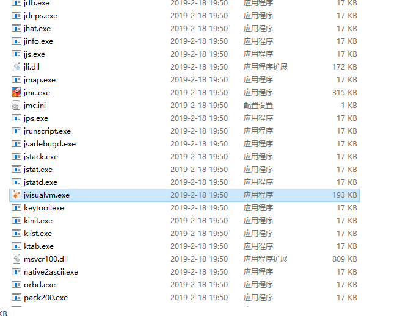
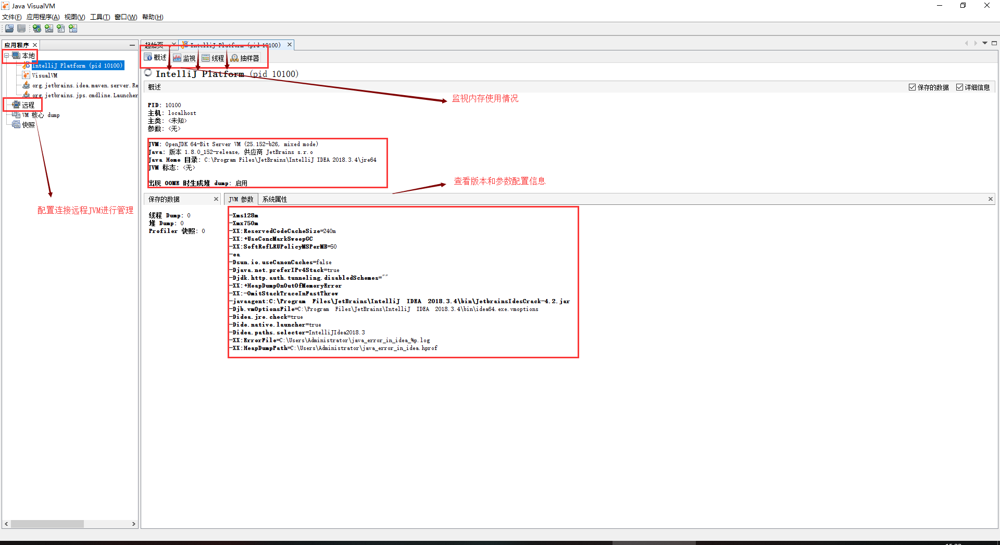
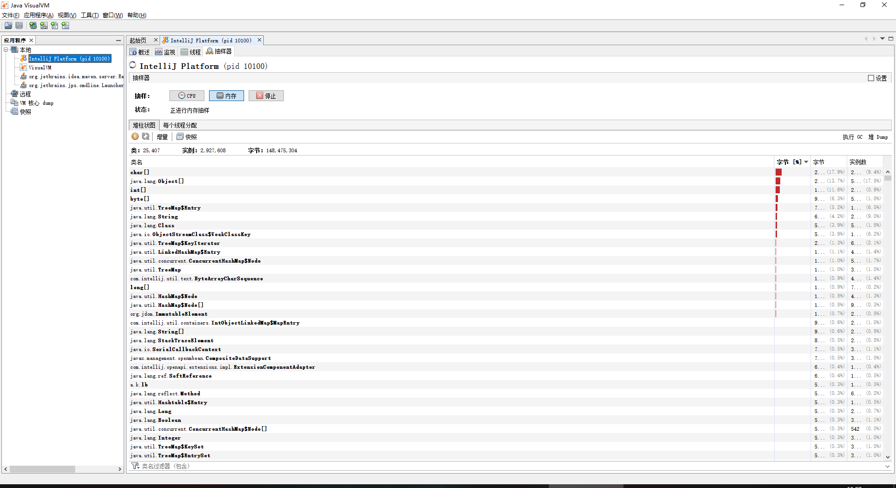

# JVM 性能调优

## 今日内容

- 掌握 jvm的运行参数以及参数的设置
- 掌握 jvm的内存模型（堆内存）
- 掌握 jamp命令的使用以及通过MAT工具进行分析
- 掌握定位分析内存溢出的方法
- 掌握 jstack命令的使用
- 掌握 VisualJVM工具的使用

## 一 JVM运行参数

在jvm中有很多的参数可以进行设置，这样可以让jvm在各种环境中都能够高效的运行。绝大部分的参数保持默认即可。

### 2.1、三种参数类型

- 标准参数，一般都是很稳定的，在未来的JVM版本中不会改变，可以使用`java -help`检索出所有的标准参数。
  - -help
  - -version
- -X 参数 （非标准参数，在不同版本的jvm中，参数可能会有所不同，可以通过java -
  X查看非标准参数。
  - -Xint
  - -Xcomp
- -XX 参数（使用率较高），主要用于jvm的调优和debug操作。-XX参数的使用有2种方式，一种是boolean类型，一种是非boolean类型
  - boolean 类型
    - 格式： -XX:[+-]
    - 如： -XX:+DisableExplicitGC 表示禁用手动调用gc操作，也就是说调用
      System.gc()无效
  - 非 boolean类型
    - 格式： -XX:
    - 如： -XX:NewRatio=1 表示新生代和老年代的比值

### 2.2 -server与-client参数

可以通过-server或-client设置jvm的运行参数。

- 它们的区别是 Server VM的初始堆空间会大一些，默认使用的是并行垃圾回收器，启动慢运行快。
- Client VM 相对来讲会保守一些，初始堆空间会小一些，使用串行的垃圾回收器，它的目标是为了让JVM的启动速度更快，但运行速度会比Serverm模式慢些。
- JVM 在启动的时候会根据硬件和操作系统自动选择使用Server还是Client类型的JVM。
- 32 位操作系统
  - 如果是 Windows系统，不论硬件配置如何，都默认使用Client类型的JVM。
  - 如果是其他操作系统上，机器配置有 2GB以上的内存同时有2个以上CPU的话默认使用server模式，否则使用client模式。
- 64 位操作系统
  - 只有 server类型，不支持client类型。

### 2.3 -Xint、-Xcomp、-Xmixed

- 在解释模式 (interpreted mode)下，-Xint标记会强制JVM执行所有的字节码，当然这会降低运行速度，通常低10倍或更多。
- -Xcomp 参数与它（-Xint）正好相反，JVM在第一次使用时会把所有的字节码编译成本地代码，从而带来最大程度的优化。
  - 然而，很多应用在使用 -Xcomp也会有一些性能损失，当然这比使用-Xint损失的少，原因是-xcomp没有让JVM启用JIT编译器的全部功能。JIT编译器可以对是否需要编译做判断，如果所有代码都进行编译的话，对于一些只执行一次的代码就没有意义了。
- -Xmixed 是混合模式，将解释模式与编译模式进行混合使用，由jvm自己决定，这是jvm默认的模式，也是推荐使用的模式。

### 2.4 -Xms与-Xmx参数

-Xms与-Xmx分别是设置jvm的堆内存的初始大小和最大大小。

-Xmx2048m：等价于-XX:MaxHeapSize，设置JVM最大堆内存为2048M。

-Xms512m：等价于-XX:InitialHeapSize，设置JVM初始堆内存为512M。

适当的调整jvm的内存大小，可以充分利用服务器资源，让程序跑的更快。

### 2.5 查看jvm的运行参数

- 运行java命令时打印参数，需要添加-XX:+PrintFlagsFinal参数即可。
  - 用法示例： java ‐XX:+PrintFlagsFinal ‐version

- 如果想要查看正在运行的jvm就需要借助于jinfo命令查看。
  - #查看所有的参数，用法：jinfo ‐flags <进程id>

## 二 JVM堆内存模型

### 2.1 JDK1.8堆内存结构

jdk1.8的内存模型是由2部分组成，年轻代 + 年老代。

年轻代：Eden + 2*Survivor

年老代：OldGen

在jdk1.8中变化最大的Perm（永久区）区，jdk1.8废弃了1.7的永久区，用Metaspace（元数据空间）进行了替换。

需要特别说明的是：Metaspace所占用的内存空间不是在虚拟机内部，而是在本地内存

空间中，这也是与1.7的永久代最大的区别所在

### 2.2 通过jstat命令进行查看堆内存使用情况

jstat命令可以查看堆内存各部分的使用量，以及加载类的数量。命令的格式如下：

jstat [-命令选项] [vmid] [间隔时间/毫秒] [查询次数]

- 查看class加载统计

  ```shell
  [root@node01 ~]# jps
  7080 Jps
  6219 Bootstrap
  [root@node01 ~]# jstat ‐class 6219
  Loaded  Bytes  Unloaded  Bytes     Time  
    3273  7122.3        0     0.0       3.98
  ```

  - Loaded ：加载class的数量
  - Bytes ：所占用空间大小
  - Unloaded ：未加载数量
  - Bytes ：未加载占用空间

- 查看编译统计

  ```shell
  [root@node01 ~]# jstat ‐compiler 6219
  Compiled Failed Invalid   Time   FailedType FailedMethod
      2376      1       0     8.04          1
  org/apache/tomcat/util/IntrospectionUtils setProperty
  ```
  - Compiled ：编译数量。
  - Failed ：失败数量
  - Invalid ：不可用数量
  - Time ：时间
  - FailedType ：失败类型
  - FailedMethod ：失败的方法

- 垃圾回收统计

  ```shell
  [root@node01 ~]# jstat ‐gc 6219
   S0C    S1C    S0U    S1U      EC       EU        OC         OU       MC
      MU    CCSC   CCSU   YGC     YGCT    FGC    FGCT     GCT  
  9216.0 8704.0  0.0   6127.3 62976.0   3560.4   33792.0    20434.9  
  23808.0 23196.1 2560.0 2361.6      7    1.078   1      0.244    1.323
  #也可以指定打印的间隔和次数，每1秒中打印一次，共打印5次
  [root@node01 ~]# jstat ‐gc 6219 1000 5
  ```

  - S0C ：第一个Survivor区的大小（KB）
  - S1C ：第二个Survivor区的大小（KB）
  - S0U ：第一个Survivor区的使用大小（KB）
  - EC ：Eden区的大小（KB）
  - OC ：Old区大小（KB）
  - MC ：方法区大小（KB）
  - CCSC ：压缩类空间大小（KB）
  - YGC ：年轻代垃圾回收次数
  - YGCT ：年轻代垃圾回收消耗时间
  - FGC ：老年代垃圾回收次数
  - FGCT ：老年代垃圾回收消耗时间
  - GCT ：垃圾回收消耗总时间

## 三 jmap的使用以及内存溢出分析

前面通过jstat可以对jvm堆的内存进行统计分析，而jmap可以获取到更加详细的内容，如：内存使用情况的汇总、对内存溢出的定位与分析。

### 3.1 jmap命令示例如下

- 查看内存使用情况

  ```shell
  # jmap ‐heap 6219		
  ```

- 查看内存中对象数量及大小

  ```shell
  #查看所有对象，包括活跃以及非活跃的
  jmap ‐histo <pid> | more
  #查看活跃对象
  jmap ‐histo:live <pid> | more
  [root@node01 ~]# jmap ‐histo:live 6219 | more
   num     #instances         #bytes  class name
  ‐‐‐‐‐‐‐‐‐‐‐‐‐‐‐‐‐‐‐‐‐‐‐‐‐‐‐‐‐‐‐‐‐‐‐‐‐‐‐‐‐‐‐‐‐‐
     1:         37437        7914608  [C
     2:         34916         837984  java.lang.String
  #对象说明
  B  byte	
  C  char
  D  double
  F  float
  I  int
  J  long
  Z  boolean
  [  数组，如[I表示int[]
  [L+类名 其他对象
  ```

- 将内存使用情况dump(转存)到文件中

  ```shell
  #用法：
  jmap ‐dump:format=b,file=dumpFileName <pid>
  #示例
  jmap ‐dump:format=b,file=/tmp/dump.dat 6219
  ```

- 通过jhat对dump文件进行分析

  - 我们将jvm的内存dump到文件中，这个文件是一个二进制的文件，不方便查看，这时我们可以借助于jhat工具进行查看。

  - ```shell
    #用法：
    jhat ‐port <port> <file>
    #示例：
    [root@node01 tmp]# jhat ‐port 9999 /tmp/dump.dat
    Reading from /tmp/dump.dat...
    Dump file created Mon Sep 10 01:04:21 CST 2018
    Snapshot read, resolving...
    ```

  - 打开浏览器进行访问：http://192.168.40.133:9999/

### 3.2 通过MAT工具对dump文件进行分析

MAT(Memory Analyzer Tool)，一个基于Eclipse的内存分析工具，是一个快速、功能丰富的JAVA heap分析工具，它可以帮助我们查找内存泄漏和减少内存消耗。使用内存分析工具从众多的对象中进行分析，快速的计算出在内存中对象的占用大小，看看是谁阻止了垃圾收集器的回收工作，并可以通过报表直观的查看到可能造成这种结果的对象。

官网地址：https://www.eclipse.org/mat/

下载地址：https://www.eclipse.org/mat/downloads.php

### 3.3 内存溢出的定位与分析

内存溢出在实际的生产环境中经常会遇到，比如，不断的将数据写入到一个集合中，出现了死循环，读取超大的文件等等，都可能会造成内存溢出。

如果出现了内存溢出，首先我们需要定位到发生内存溢出的环节，并且进行分析，是正常还是非正常情况，如果是正常的需求，就应该考虑加大内存的设置，如果是非正常需求，那么就要对代码进行修改，修复这个bug。

首先，我们得先学会如何定位问题，然后再进行分析。如何定位问题呢，我们需要借助于jmap与MAT工具进行定位分析。

## 四 jstack的使用

有些时候我们需要查看下jvm中的线程执行情况，比如，发现服务器的CPU的负载突然增高了、出现了死锁、死循环等，我们该如何分析呢？

由于程序是正常运行的，没有任何的输出，从日志方面也看不出什么问题，所以就需要看下jvm的内部线程的执行情况，然后再进行分析查找出原因。

这个时候，就需要借助于jstack命令了，jstack的作用是将正在运行的jvm的线程情况进行快照，并且打印出来：

```shell
#用法：jstack <pid>
[root@node01 bin]# jstack 2203
Full thread dump Java HotSpot(TM) 64‐Bit Server VM (25.141‐b15 mixed
mode):
```

### 4.1 查看死锁问题实例

如果在生产环境发生了死锁，我们将看到的是部署的程序没有任何反应了，这个时候我们可以借助jstack进行分析，下面我们实战下查找死锁的原因。

**1. 构造死锁**

编写代码，启动2个线程，Thread1拿到了obj1锁，准备去拿obj2锁时，obj2已经被Thread2锁定，所以发送了死锁。

```java
  public class TestDeadLock {
    private static Object obj1 = new Object();
    private static Object obj2 = new Object();
    public static void main(String[] args) {
        new Thread(new Thread1()).start();
        new Thread(new Thread2()).start();
    }
    private static class Thread1 implements Runnable{
        @Override
        public void run() {
            synchronized (obj1){
                System.out.println("Thread1 拿到了 obj1 的锁！");
                try {
                    // 停顿2秒的意义在于，让Thread2线程拿到obj2的锁
                    Thread.sleep(2000);
                } catch (InterruptedException e) {
                    e.printStackTrace();
                }
                synchronized (obj2){
                    System.out.println("Thread1 拿到了 obj2 的锁！");
                }
            }
        }
    }
    private static class Thread2 implements Runnable{
        @Override
        public void run() {
            synchronized (obj2){
                System.out.println("Thread2 拿到了 obj2 的锁！");
                try {
                    // 停顿2秒的意义在于，让Thread1线程拿到obj1的锁
					Thread.sleep(2000);
                } catch (InterruptedException e) {
                    e.printStackTrace();
                }
                synchronized (obj1){
                    System.out.println("Thread2 拿到了 obj1 的锁！");
                }
            }
        }
    }
}
```

**2. 在linux上运行**

```shell
[root@node01 test]# javac TestDeadLock.java
[root@node01 test]# ll
总用量 28
‐rw‐r‐‐r‐‐. 1 root root  184 9月  11 10:39 TestDeadLock$1.class
‐rw‐r‐‐r‐‐. 1 root root  843 9月  11 10:39 TestDeadLock.class
‐rw‐r‐‐r‐‐. 1 root root 1567 9月  11 10:39 TestDeadLock.java
‐rw‐r‐‐r‐‐. 1 root root 1078 9月  11 10:39 TestDeadLock$Thread1.class
‐rw‐r‐‐r‐‐. 1 root root 1078 9月  11 10:39 TestDeadLock$Thread2.class
‐rw‐r‐‐r‐‐. 1 root root  573 9月   9 10:21 TestJVM.class
‐rw‐r‐‐r‐‐. 1 root root  261 9月   9 10:21 TestJVM.java
[root@node01 test]# java TestDeadLock
Thread1 拿到了 obj1 的锁！
Thread2 拿到了 obj2 的锁！
#这里发生了死锁，程序一直将等待下去
```

**3. 使用jstack进行分析**

```shell
 [root@node01 ~]# jstack 3256
 
 Java stack information for the threads listed above:
===================================================
"Thread‐1":
at TestDeadLock$Thread2.run(TestDeadLock.java:47)    
‐ waiting to lock <0x00000000f655dc40> (a java.lang.Object)    
‐ locked <0x00000000f655dc50> (a java.lang.Object)    
at java.lang.Thread.run(Thread.java:748)    
"Thread‐0":
at TestDeadLock$Thread1.run(TestDeadLock.java:27)    
‐ waiting to lock <0x00000000f655dc50> (a java.lang.Object)    
‐ locked <0x00000000f655dc40> (a java.lang.Object)    
at java.lang.Thread.run(Thread.java:748)    
Found 1 deadlock.
```

## 五 VisualVM工具的使用

### 5.1 概述

VisualVM，能够监控线程，内存情况，查看方法的CPU时间和内存中的对 象，已被GC的对象，反向查看分配的堆栈(如100个String对象分别由哪几个对象分配出来的)。

VisualVM使用简单，几乎0配置，功能还是比较丰富的，几乎囊括了其它JDK自带命令的所有功能。

- 内存信息
- 线程信息
- Dump 堆（本地进程）
- Dump 线程（本地进程）
- 打开堆 Dump。堆Dump可以用jmap来生成。
- 打开线程 Dump
- 生成应用快照（包含内存信息、线程信息等等）
- 性能分析。 CPU分析（各个方法调用时间，检查哪些方法耗时多），内存分析（各类
- 对象占用的内存，检查哪些类占用内存多）
- ……

### 5.2 启动

在JDK安装目录bin下找到,启动



### 5.3 基本功能

### 5.4 抽样器

抽样器可以对CPU、内存在一段时间内进行抽样，以供分析。



### 5.5 监控远程的`JVM`

`VisualJVM`不仅是可以监控本地`jvm`进程，还可以监控远程的`JVM`进程，需要借助于`JMX`技术实现。

#### 5.5.1 什么是`JMX`?

**`JMX`**（Java Management Extensions，即Java管理扩展）是一个为应用程序、设备、系统等植入管理功能的框架。`JMX`可以跨越一系列异构操作系统平台、系统体系结构和网络传输协议，灵活的开发无缝集成的系统、网络和服务管理应用。

#### 5.5.2 监控远程的tomcat

想要监控远程的tomcat，就需要在远程的tomcat进行对`JMX`配置，方法如下：

```shell
#在tomcat的bin目录下，修改catalina.sh，添加如下的参数
JAVA_OPTS="‐Dcom.sun.management.jmxremote ‐
Dcom.sun.management.jmxremote.port=9999 ‐
Dcom.sun.management.jmxremote.authenticate=false ‐
Dcom.sun.management.jmxremote.ssl=false"
#这几个参数的意思是：
#‐Dcom.sun.management.jmxremote ：允许使用JMX远程管理
#‐Dcom.sun.management.jmxremote.port=9999 ：JMX远程连接端口
#‐Dcom.sun.management.jmxremote.authenticate=false ：不进行身份认证，任何用户都可以连接
#‐Dcom.sun.management.jmxremote.ssl=false ：不使用ssl
```

保存退出，重启tomcat。

#### 5.5.3 使用`VisualJVM`连接远程tomcat

1. 点击远程添加主机
2. 使用高配置的`JMX`远程连接端口,连接