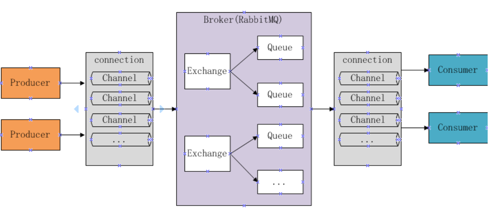

# 【3】RabbitMQ #

## 主要内容

- RabbitMQ基础
- RabbitMQ快速入门
- 工作模式
- SpringBoot整合

## 一 RabbitMQ基础

MQ全称为Message Queue，即消息队列， RabbitMQ是由erlang语言开发，基于AMQP（Advanced Message
Queue 高级消息队列协议）协议实现的消息队列，它是一种应用程序之间的通信方法，消息队列在分布式系统开
发中应用非常广泛。

RabbitMQ官方地址：http://www.rabbitmq.com/

### 1.1 开发中消息队列通常有如下应用场景：

1、任务异步处理。
将不需要同步处理的并且耗时长的操作由消息队列通知消息接收方进行异步处理。提高了应用程序的响应时间。
2、应用程序解耦合
MQ相当于一个中介，生产方通过MQ与消费方交互，它将应用程序进行解耦合。

市场上还有哪些消息队列？

ActiveMQ，RabbitMQ，ZeroMQ，Kafka，MetaMQ，RocketMQ、Redis。

### 1.2 为什么使用RabbitMQ呢？

1. 使得简单，功能强大。

2. 基于AMQP协议。 AMQP是一套公开的消息队列协议
3. 社区活跃，文档完善。
4. 高并发性能好，这主要得益于Erlang语言。
5. Spring Boot默认已集成RabbitMQ

### 1.3 JMS是什么？

JMS是java提供的一套消息服务API标准，其目的是为所有的java应用程序提供统一的消息通信的标准，类似java的
jdbc，只要遵循jms标准的应用程序之间都可以进行消息通信。它和AMQP有什么 不同，jms是java语言专属的消
息服务标准，它是在api层定义标准，并且只能用于java应用；而AMQP是在协议层定义的标准，是跨语言的 。

## 二 RabbitMQ快速入门

### 2.1 RabbitMQ 的工作原理

下图是RabbitMQ的基本结构：



**组成部分说明如下：**

- Broker ：消息队列服务进程，此进程包括两个部分：Exchange和Queue。
- Exchange ：消息队列交换机，按一定的规则将消息路由转发到某个队列，对消息进行过虑。
- Queue ：消息队列，存储消息的队列，消息到达队列并转发给指定的消费方。
- Producer ：消息生产者，即生产方客户端，生产方客户端将消息发送到MQ。
- Consumer ：消息消费者，即消费方客户端，接收MQ转发的消息。

**消息发布接收流程：**

-----发送消息-----

1. 生产者和Broker建立TCP连接。
2. 生产者和Broker建立通道。
3. 生产者通过通道消息发送给Broker，由Exchange将消息进行转发。
4. Exchange将消息转发到指定的Queue（队列）

----接收消息-----

1. 消费者和Broker建立TCP连接
2. 消费者和Broker建立通道
3. 消费者监听指定的Queue（队列）
4. 当有消息到达Queue时Broker默认将消息推送给消费者。
5. 消费者接收到消息。

### 2.2 Linux系统下安装RabbitMQ

需要注意的是：erlang语言和RabbitMQ版本对应关系

#### 2.2.1 安装依赖语言erlang

erlang依赖

```sh
yum -y install make gcc gcc-c++ kernel-devel m4 ncurses-devel openssl-devel
```

将下载好的otp_src_20.3.tar.gz上传到服务器，解压后cd到解压目录

```sh
./configure --prefix=/opt/erlang	安装目录
make install	编译安装
```

配置环境变量

```sh
export ERLANG_HOME=/opt/erlang
export PATH=$ERLANG_HOME/bin:$PATH
```

验证安装,环境变量配置是否成功

```sh
erl

halt().		退出erlang命令
```

#### 2.2.2 安装RabbitMQ

下载地址：[https://github.com/rabbitmq/rabbitmq-server/releases/tag/v3.7.3](https://github.com/rabbitmq/rabbitmq-server/releases/tag/v3.7.3)

解压：

```sh
xz -d rabbitmq-server-generic-unix-3.7.3.tar.xz 
tar -xvf rabbitmq-server-generic-unix-3.7.3.tar 
```

相关命令 /sbin目录下启动：

```sh
./rabbitmq-server -detached 		启动 rabbitmq服务

./rabbitmqctl status 		查看状态

./rabbitmqctl stop 		停止RabbitMQ服务

./rabbitmqctl start_app 	启动application

./rabbitmqctl stop_app 		停止application
```

**安装管理插件**：

```sh
./rabbitmq-plugins enable rabbitmq_management

开放端口：15672
```

外部访问：http://192.168.231.180:15672 初始账号密码guest/guest

外部访问测试问题: User can only log in via localhost 

原因：rabbitmq从3.3.0开始默认禁止使用guest/guest权限通过除localhost外的访问

```sh
vim ebin/rabbit.app	

将：{loopback_users, [<<”guest”>>]}，
改为：{loopback_users, []}，
```

### 2.3 Hello World

分别创建消费者工程和生产者工程：

#### 2.3.1 导入依赖

```xml
<dependency>
    <groupId>com.rabbitmq</groupId>
    <artifactId>amqp-client</artifactId>
    <version>5.1.2</version>
</dependency>
<dependency>
    <groupId>org.springframework.boot</groupId>
    <artifactId>spring-boot-starter-logging</artifactId>
    <version>2.1.0.RELEASE</version>
</dependency>	
```

#### 2.3.2 生产者

```javascript
/**
* 序号代表操作流程
*/
public class ProducerTest {

    /**
     * 声明队列名称
     */
    public static final String QUEUE = "HelloWorld";

    public static void main(String[] args) {

        ConnectionFactory connectionFactory = new ConnectionFactory();
        connectionFactory.setHost("192.168.231.180");
        connectionFactory.setPort(5672);
        connectionFactory.setUsername("guest");
        connectionFactory.setPassword("guest");
        // rabbitmq默认虚拟机名称为“/”，虚拟机相当于一个独立的mq服务器
        connectionFactory.setVirtualHost("/");
        Connection connection = null;
        Channel channel = null;
        try {
            // 1. 创建与RabbitMQ服务的TCP连接
            connection = connectionFactory.newConnection();
            // 2. 创建与Exchange的通道，每个连接可以创建多个通道，每个通道代表一个会话任务
            channel = connection.createChannel();
            /**
             * 3. 声明队列，如果Rabbit中没有此队列将自动创建
             *
             * param1:队列名称
             * param2:是否持久化
             * param3:队列是否独占此连接
             * param4:队列不再使用时是否自动删除此队列
             * param5:队列参数
             */
            channel.queueDeclare(QUEUE, true, false, false, null);
            String message = "HelloWorld Rabbit" + System.currentTimeMillis();
            /**
             * 4. 消息发布方法：这里没有指定交换机，消息将发送给默认交换机，每个队列也会绑定那个默认的交换机，但是不能显
             * 示绑定或解除绑定
             *
             * 默认的交换机，routingKey等于队列名称
             *
             * param1:Exchange的名称，如果没有指定，则使用Default Exchange
             * param2:routingKey,消息的路由Key，是用于Exchange（交换机）将消息转发到指定的消息队列
             * param3:消息包含的属性
             * param4:消息体
             */
            channel.basicPublish("", QUEUE, null, message.getBytes());
            System.out.println("send message is:" + message);
        } catch (Exception e) {
            return;
        }finally {
            try {
                if (channel != null) {
                    channel.close();
                }
                if (connection != null) {
                    connection.close();
                }
            } catch (Exception e) {
                e.printStackTrace();
            }
        }
    }
}
```

#### 2.3.3 消费者

```java
public class ConsumerTest {
    /**
     * 声明队列名称
     */
    public static final String QUEUE = "HelloWorld";

    public static void main(String[] args){
        ConnectionFactory connectionFactory = new ConnectionFactory();
        connectionFactory.setHost("192.168.231.180");
        connectionFactory.setPort(5672);
        connectionFactory.setUsername("guest");
        connectionFactory.setPassword("guest");
        Connection connection = null;
        Channel channel = null;
        try {
            // 1. 创建与RabbitMQ服务的TCP连接
            connection = connectionFactory.newConnection();
            // 2. 创建与Exchange的通道，每个连接可以创建多个通道，每个通道代表一个会话任务
            channel = connection.createChannel();
            // 3. 声明队列，如果Rabbit中没有此队列将自动创建
            channel.queueDeclare(QUEUE, true, false, false, null);
            DefaultConsumer consumer = new DefaultConsumer(channel) {
                /**
                 * 5. 消费者接收消息调用此方法
                 *
                 * @params: [consumerTag：消费者的标签，在channel.basicConsume()去指定, envelope：消息包的内容，可从中获取消息id，消息routingkey，交换机，消息和重传标志
                 * (收到消息失败后是否需要重新发送), properties, body]
                 * @return: void
                 */
                @Override
                public void handleDelivery(String consumerTag, Envelope envelope, AMQP.BasicProperties properties
                        , byte[] body) throws UnsupportedEncodingException {
                    // 交换机
                    String exchange = envelope.getExchange();
                    // 路由key
                    String routingKey = envelope.getRoutingKey();
                    // 消息id
                    long deliveryTag = envelope.getDeliveryTag();
                    // 消息内容
                    String message = new String(body, "UTF-8");
                    System.out.println("receive message:" + message);
                }
            };
            /**
             * 4. 监听队列String queue, boolean autoAck,Consumer callback
             * 参数明细:
             * 1、队列名称
             * 2、是否自动回复，设置为true为表示消息接收到自动向mq回复接收到了，mq接收到回复会删除消息，设置为false则需要手动回复
             * 3、消费消息的方法，消费者接收到消息后调用此方法
             */
            channel.basicConsume(QUEUE, false, consumer);
        } catch (Exception e) {
            e.printStackTrace();
        }
    }
}
```

## 三  工作模式

RabbitMQ有以下几种工作模式 ：

1. Work queues
2. Publish/Subscribe
3. Routing
4. Topics
5. Header
6. RPC

### 3.1 Work queues

work queues与入门程序相比，多了一个消费端，两个消费端共同消费同一个队列中的消息。
应用场景：对于 任务过重或任务较多情况使用工作队列可以提高任务处理的速度。

测试：

1. 使用入门程序，启动多个消费者。
2. 生产者发送多个消息。

结果：

1. 一条消息只会被一个消费者接收；
2. rabbit采用轮询的方式将消息是平均发送给消费者的；
3. 消费者在处理完某条消息后，才会收到下一条消息。

### 3.2 Publish/subscribe

发布订阅模式：

1. 每个消费者监听自己的队列。
2. 生产者将消息发给broker，由交换机将消息转发到绑定此交换机的每个队列，每个绑定交换机的队列都将接收
   到消息

#### 3.2.1 案例

用户通知，当用户充值成功或转账完成系统通知用户，通知方式有短信、邮件多种方法 。

**消息发布者:**

```java
/**
 * 发布订阅模式下的发布者即:生产者
 *
 * 案例：用户通知，当用户充值成功或转账完成系统通知用户，通知方式有短信、邮件多种方法。
 *
 * Create By @author:Yim On 2019-6-25 15:15
 **/
public class PublishTest {
    /**
     * 声明队列名称
     */
    public static final String QUEUE_INFORM_EMAIL = "queue_inform_email";
    public static final String QUEUE_INFORM_SMS = "queue_inform_sms";
    public static final String EXCHANGE_FANOUT_INFORM = "exchange_fanout_inform";

    public static void main(String[] args) {

        ConnectionFactory connectionFactory = new ConnectionFactory();
        connectionFactory.setHost("192.168.231.180");
        connectionFactory.setPort(5672);
        connectionFactory.setUsername("guest");
        connectionFactory.setPassword("guest");
        // rabbitmq默认虚拟机名称为“/”，虚拟机相当于一个独立的mq服务器
        connectionFactory.setVirtualHost("/");
        Connection connection = null;
        Channel channel = null;
        try {
            connection = connectionFactory.newConnection();
            channel = connection.createChannel();
            // 交换机类型，fanout、topic、direct、headers,此处声明交换机名称类型
            channel.exchangeDeclare(EXCHANGE_FANOUT_INFORM, BuiltinExchangeType.FANOUT);
            // 声明邮件队列
            channel.queueDeclare(QUEUE_INFORM_EMAIL, true, false, false, null);
            // 声明短信队列
            channel.queueDeclare(QUEUE_INFORM_SMS, true, false, false, null);
            // 绑定队列和交换机，使用默认路由
            channel.queueBind(QUEUE_INFORM_EMAIL,EXCHANGE_FANOUT_INFORM,"");
            channel.queueBind(QUEUE_INFORM_SMS,EXCHANGE_FANOUT_INFORM,"");

            for (int i = 0; i < 10; i++) {
                String message = "message to user:" + i;
                /**
                 * 参数说明：
                 * @param01：交换机名称，不指令使用默认交换机名称 Default Exchange
                 * @param02：routingKey（路由key），根据key名称将消息转发到具体的队列，这里填写队列名称表示消息将发到此队列
                 * @param03：消息属性
                 * @param04：消息内容
                 */
                channel.basicPublish(EXCHANGE_FANOUT_INFORM,"",null,message.getBytes());
                System.out.println(message);
            }
        } catch (Exception e) {
            return;
        }finally {
            try {
                if (channel != null) {
                    channel.close();
                }
                if (connection != null) {
                    connection.close();
                }
            } catch (Exception e) {
                e.printStackTrace();
            }
        }
    }
}
```

**Email订阅**：

```java
public class SubscribeEmailTest {

    public static final String QUEUE_INFORM_EMAIL = "queue_inform_email";
    public static final String EXCHANGE_FANOUT_INFORM = "exchange_fanout_inform";

    public static void main(String[] args) {
        ConnectionFactory connectionFactory = new ConnectionFactory();
        connectionFactory.setHost("192.168.231.180");
        connectionFactory.setPort(5672);
        connectionFactory.setUsername("guest");
        connectionFactory.setPassword("guest");
        Connection connection = null;
        Channel channel = null;
        try {
            connection = connectionFactory.newConnection();
            channel = connection.createChannel();
            channel.exchangeDeclare(EXCHANGE_FANOUT_INFORM, BuiltinExchangeType.FANOUT);
            channel.queueDeclare(QUEUE_INFORM_EMAIL, true, false, false, null);
            channel.queueBind(QUEUE_INFORM_EMAIL, EXCHANGE_FANOUT_INFORM, "");
            DefaultConsumer consumer = new DefaultConsumer(channel) {

                @Override
                public void handleDelivery(String consumerTag, Envelope envelope, AMQP.BasicProperties properties
                        , byte[] body) throws UnsupportedEncodingException {
                    String exchange = envelope.getExchange();
                    String routingKey = envelope.getRoutingKey();
                    long deliveryTag = envelope.getDeliveryTag();
                    String message = new String(body, "UTF-8");
                    System.out.println("receive email:" + message);
                }
            };
            channel.basicConsume(QUEUE_INFORM_EMAIL, false, consumer);
        } catch (Exception e) {
            e.printStackTrace();
        }
    }
}
```

**短息订阅**:

```java
public class SubscribeSmsTest {

    public static final String QUEUE_INFORM_SMS = "queue_inform_sms";
    public static final String EXCHANGE_FANOUT_INFORM = "exchange_fanout_inform";

    public static void main(String[] args){
        ConnectionFactory connectionFactory = new ConnectionFactory();
        connectionFactory.setHost("192.168.231.180");
        connectionFactory.setPort(5672);
        connectionFactory.setUsername("guest");
        connectionFactory.setPassword("guest");
        Connection connection = null;
        Channel channel = null;
        try {
            connection = connectionFactory.newConnection();
            channel = connection.createChannel();
            channel.exchangeDeclare(EXCHANGE_FANOUT_INFORM, BuiltinExchangeType.FANOUT);
            channel.queueDeclare(QUEUE_INFORM_SMS, true, false, false, null);
            channel.queueBind(QUEUE_INFORM_SMS,EXCHANGE_FANOUT_INFORM,"");
            DefaultConsumer consumer = new DefaultConsumer(channel) {

                @Override
                public void handleDelivery(String consumerTag, Envelope envelope, AMQP.BasicProperties properties
                        , byte[] body) throws UnsupportedEncodingException {
                    String exchange = envelope.getExchange();
                    String routingKey = envelope.getRoutingKey();
                    long deliveryTag = envelope.getDeliveryTag();
                    String message = new String(body, "UTF-8");
                    System.out.println("receive sms:" + message);
                }
            };
            channel.basicConsume(QUEUE_INFORM_SMS, false, consumer);
        } catch (Exception e) {
            e.printStackTrace();
        }
    }
}
```

使用生产者发送若干条消息，每条消息都转发到各各队列，每消费者都接收到了消息。

#### 3.2.2 publish/subscribe与work queues对比

1. publish/subscribe与work queues有什么区别。

   - 区别：
     1. work queues不用定义交换机，而publish/subscribe需要定义交换机。
     2. publish/subscribe的生产方是面向交换机发送消息，work queues的生产方是面向队列发送消息(底层使用默认交换机)。
     3. publish/subscribe需要设置队列和交换机的绑定，work queues不需要设置，实质上work queues会将队列绑定到默认的交换机 。
   - 相同点：所以两者实现的发布/订阅的效果是一样的，多个消费端监听同一个队列不会重复消费消息。

2. 实质工作用什么 publish/subscribe还是work queues。

   建议使用 publish/subscribe，发布订阅模式比工作队列模式更强大，并且发布订阅模式可以指定自己专用的交换机。

### 3.3 Routing

路由模式：

1. 每个消费者监听自己的队列，并且设置Routingkey。
2. 生产者将消息发给交换机，由交换机根据routingkey来转发消息到指定的队列。	

使用生产者发送若干条消息，交换机根据routingkey转发消息到指定的队列。

相对于publish/subscribe模式，Routing模式要求队列在绑定交换机时要指定routingkey，消息会转发到符合routingkey的队列。

**因此在publish/subscribe代码的基础上**：

```java
// 绑定队列时设置Routingkey
channel.queueBind(QUEUE_INFORM_EMAIL,EXCHANGE_FANOUT_INFORM,QUEUE_INFORM_EMAIL);
channel.queueBind(QUEUE_INFORM_SMS,EXCHANGE_FANOUT_INFORM,QUEUE_INFORM_SMS);
// 发送消息时设置Routingkey
channel.basicPublish(EXCHANGE_FANOUT_INFORM,QUEUE_INFORM_SMS,null,message.getBytes());
```

### 3.4 Topics

路由模式：

1. 每个消费者监听自己的队列，并且设置带统配符的routingkey。
2. 生产者将消息发给broker，由交换机根据routingkey来转发消息到指定的队列。

#### 3.4.1 案例

根据用户的通知设置去通知用户，设置接收Email的用户只接收Email，设置接收sms的用户只接收sms，设置两种
通知类型都接收的则两种通知都有效。

1. 生产者

   声明交换机，指定topic类型：

   ```java
   //声明交换机类型TOPIC
   channel.exchangeDeclare(EXCHANGE_TOPIC_INFORM, BuiltinExchangeType.TOPIC);
   //Email通知
   channel.basicPublish(EXCHANGE_TOPIC_INFORM,"inform.email",null,message.getBytes());
   //Sms通知
   channel.basicPublish(EXCHANGE_TOPIC_INFORM,"inform.sms",null,message.getBytes());
   //两种都通知
   channel.basicPublish(EXCHANGE_TOPIC_INFORM,"inform.email.sms",null,message.getBytes();
   ```

2. 消费端

   队列绑定交换机指定通配符：
   统配符规则：中间以“.”分隔。符号#可以匹配多个词，符号*可以匹配一个词语。

   ```java
   //绑定email通知队列
   channel.queueBind(QUEUE_INFORM_EMAIL,EXCHANGE_TOPICS_INFORM,"inform.#.email.#");
   //绑定sms通知队列
   channel.queueBind(QUEUE_INFORM_SMS,EXCHANGE_TOPICS_INFORM,"inform.#.sms.#");
   ```

**Topic模式更加强大，它可以实现Routing、publish/subscirbe模式的功能。**

### 3.5 RPC

RPC即客户端远程调用服务端的方法 ，使用MQ可以实现RPC的异步调用，基于Direct交换机实现，流程如下：

1. 客户端即是生产者就是消费者，向RPC请求队列发送RPC调用消息，同时监听RPC响应队列。
2. 服务端监听RPC请求队列的消息，收到消息后执行服务端的方法，得到方法返回的结果
3. 服务端将RPC方法 的结果发送到RPC响应队列
4. 客户端（RPC调用方）监听RPC响应队列，接收到RPC调用结果。

## 四 SpringBoot整合RabbitMQ

### 4.1 依赖

```xml
<dependency>
    <groupId>org.springframework.boot</groupId>
    <artifactId>spring-boot-starter-amqp</artifactId>
</dependency>
<dependency>
    <groupId>org.springframework.boot</groupId>
    <artifactId>spring-boot-starter-test</artifactId>
</dependency>
<dependency>
    <groupId>org.springframework.boot</groupId>
    <artifactId>spring-boot-starter-logging</artifactId>
</dependency>
```

### 4.2 配置文件

```yml
server:
  port: 44000
spring:
  application:
    name: rabbit-producer
  rabbitmq:
    host: 192.168.231.180
    port: 5672
    username: guest
    password: guest
    virtualHost: /
```

### 4.3 配置类：

```java
@Configuration
public class RabbitmqConfig {
    public static final String QUEUE_INFORM_EMAIL = "queue_inform_email";
    public static final String QUEUE_INFORM_SMS = "queue_inform_sms";
    public static final String EXCHANGE_TOPICS_INFORM="exchange_topics_inform";
    public static final String ROUTINGKEY_EMAIL="inform.#.email.#";
    public static final String ROUTINGKEY_SMS="inform.#.sms.#";

    //声明交换机
    @Bean(EXCHANGE_TOPICS_INFORM)
    public Exchange EXCHANGE_TOPICS_INFORM(){
        //durable(true) 持久化，mq重启之后交换机还在
        return ExchangeBuilder.topicExchange(EXCHANGE_TOPICS_INFORM).durable(true).build();
    }

    //声明QUEUE_INFORM_EMAIL队列
    @Bean(QUEUE_INFORM_EMAIL)
    public Queue QUEUE_INFORM_EMAIL(){
        return new Queue(QUEUE_INFORM_EMAIL);
    }
    //声明QUEUE_INFORM_SMS队列
    @Bean(QUEUE_INFORM_SMS)
    public Queue QUEUE_INFORM_SMS(){
        return new Queue(QUEUE_INFORM_SMS);
    }

    //ROUTINGKEY_EMAIL队列绑定交换机，指定routingKey
    @Bean
    public Binding BINDING_QUEUE_INFORM_EMAIL(@Qualifier(QUEUE_INFORM_EMAIL) Queue queue,
                                              @Qualifier(EXCHANGE_TOPICS_INFORM) Exchange exchange){
        return BindingBuilder.bind(queue).to(exchange).with(ROUTINGKEY_EMAIL).noargs();
    }
    //ROUTINGKEY_SMS队列绑定交换机，指定routingKey
    @Bean
    public Binding BINDING_ROUTINGKEY_SMS(@Qualifier(QUEUE_INFORM_SMS) Queue queue,
                                          @Qualifier(EXCHANGE_TOPICS_INFORM) Exchange exchange){
        return BindingBuilder.bind(queue).to(exchange).with(ROUTINGKEY_SMS).noargs();
    }

}
```

**消费端**：

```java
@Component
public class ReceiveHandler {

    @RabbitListener(queues = {RabbitmqConfig.QUEUE_INFORM_EMAIL})
    public void send_email(Message message, AMQP.Channel channel){
        System.out.println("receive message is:"+message.getBody());
    }
    @RabbitListener(queues = {RabbitmqConfig.QUEUE_INFORM_SMS})
    public void send_sms(Message message, AMQP.Channel channel){
        System.out.println("receive message is:"+message.getBody());
    }

}
```

