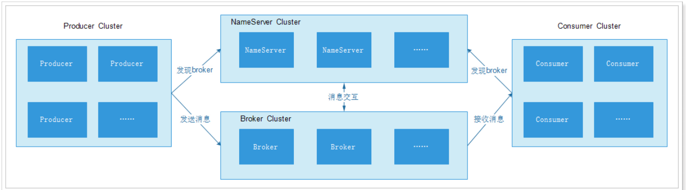
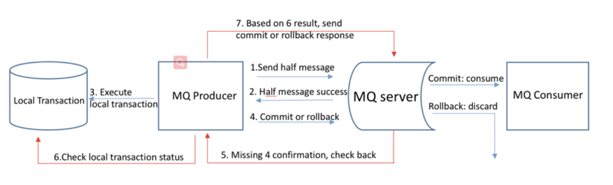

# 【7】RocketMQ #

## 主要内容

- RocketMQ简介和安装
- 入门项目
- producer
- consumer
- 重试策略
- 集群
- SpringBoot整合RocketMQ

## 一 RocketMQ简介和安装

Apache RocketMQ是一个采用Java语言开发的分布式的消息系统，由阿里巴巴团队开发，与2016年底贡献给
Apache，成为了Apache的一个顶级项目。

官网地址：http://rocketmq.apache.org/

下载地址：https://www.apache.org/dyn/closer.cgi?path=rocketmq/4.3.2/rocketmq-all-4.3.2-bin-release.zip

### 1.1 核心说明



- Producer
  - 消息生产者，负责产生消息，一般由业务系统负责产生消息。
  - Producer Group
    - 一类 Producer 的集合名称，这类 Producer 通常发送一类消息，且发送逻辑一致。
- Consumer
  - 消息费者，负责消费消息，一般是后台系统负责异步消费。
  - Push Consumer
    - 服务端向消费者端推送消息
  - Pull Consumer
    - 消费者端向服务定时拉取消息
  - Consumer Group
    - 一类 Consumer 的集合名称，这类 Consumer 通常消费一类消息，且消费逻辑一致。
- NameServer
  - 集群架构中的组织协调员
  - 收集broker的工作情况
  - 不负责消息的处理
- Broker
  - 是RocketMQ的核心负责消息的发送、接收、高可用等（真正干活的）
  - 需要定时发送自身情况到NameServer，默认10秒发送一次，超时2分钟会认为该broker失效。
- Topic
  - 不同类型的消息以不同的Topic名称进行区分，如User、Order等
  - 是逻辑概念
  - Message Queue
    - 消息队列，用于存储消息

### 1.2 Linux下部署RocketMQ

1. 解压文件

   ```sh
   cd /opt 
   unzip rocketmq-all-4.3.2-bin-release.zip
   cd rocketmq-all-4.3.2-bin-release
   ```

2. RocketMQ的配置默认是生产环境的配置，设置的jvm的内存大小值比较大，对于学习而言没有必要设置这么大，测试环境的内存往往都不是很大，所以需要调整默认值

   ```sh
   cd bin/
   vim runserver.sh
   JAVA_OPT="${JAVA_OPT} -server -Xms128m -Xmx128m -Xmn128m -XX:MetaspaceSize=128m -
   XX:MaxMetaspaceSize=128m"
   cd bin/
   vim runbroker.sh
   JAVA_OPT="${JAVA_OPT} -server -Xms128m -Xmx128m -Xmn128m"
   ```

3. 启动RocketMQ

   ```sh
   #1.启动nameserver
   bin/mqnamesrv
   
   #2.启动broker
   bin/mqbroker -n 192.168.231.160:9876
   The broker[yim, 172.17.0.1:10911] boot success. serializeType=JSON and name
   server is 192.168.231.160:9876
   #3. 声明NAMESRV_ADDR
   export NAMESRV_ADDR=127.0.0.1:9876
   ```

4. 测试producer和consumer

   ```sh
   cd /bin
   sh tools.sh org.apache.rocketmq.example.quickstart.Producer # 测试生产者，发消息
   
   sh tools.sh org.apache.rocketmq.example.quickstart.Consumer # 测试消费者，接受消息
   ```

5. broker的ip地址是172.17.0.1，外部无法访问，需要指定broker的ip地址。

   ```sh
   #创建broker配置文件,并配置如下内容
   vim /opt/rmq/rmqbroker/conf/broker.conf
   brokerIP1=192.168.231.160
   namesrvAddr=192.168.231.160:9876
   brokerName=broker_haoke_im
   
   #启动broker，通过 -c 指定配置文件启动
   bin/mqbroker -c /haoke/rmq/rmqbroker/conf/broker.conf
   The broker[yim, 192.168.231.160:10911] boot success. serializeType=JSON and name
   server is 192.168.231.160:9876  #这样就可以进行访问了
   ```

### 1.3 docker下部署RocketMQ

```sh
# 1.拉取镜像
docker pull foxiswho/rocketmq:server-4.3.2
docker pull foxiswho/rocketmq:broker-4.3.2

# 2.创建nameserver容器
docker create -p 9876:9876 --name rmqserver \
-e "JAVA_OPT_EXT=-server -Xms128m -Xmx128m -Xmn128m" \
-e "JAVA_OPTS=-Duser.home=/opt" \
-v /opt/rmq/rmqserver/logs:/opt/logs \
-v /opt/rmq/rmqserver/store:/opt/store \
foxiswho/rocketmq:server-4.3.2

# 3.创建broker容器
docker create -p 10911:10911 -p 10909:10909 --name rmqbroker \
-e "JAVA_OPTS=-Duser.home=/opt" \
-e "JAVA_OPT_EXT=-server -Xms128m -Xmx128m -Xmn128m" \
-v /opt/rmq/rmqbroker/conf/broker.conf:/etc/rocketmq/broker.conf \
-v /opt/rmq/rmqbroker/logs:/opt/logs \
-v /opt/rmq/rmqbroker/store:/opt/store \
foxiswho/rocketmq:broker-4.3.2

# 4.第三步的时候配置了文件,需要启动下容器才会创建文件,创建的broker.conf是目录，需要删除手动创建broker.conf，创建完成后给定文件0755权限
cd opt/rmq/rmqbroker/conf/
rm -f broker.conf
touch broker.conf
chmod 755 broker.conf

# 5.跟上面一样安装好之后仍需要配置broker.conf文件
vim broker.conf
brokerIP1=192.168.231.160
namesrvAddr=192.168.231.160:9876
brokerName=broker_haoke_im

# 6.如果出现目录挂载权限问题，可临时关闭selinux：
setenforce 0 #临时关闭
setenforce 1 #开启

# 5.启动容器
docker start rmqserver rmqbroker
```

### 1.4 部署RocketMQ的管理工具

RocketMQ提供了UI管理工具，名为rocketmq-console，项目地址：https://github.com/apache/rocketmq-externals/tree/master/rocketmq-console
该工具支持docker以及非docker安装

docker下运行：

```sh
#拉取镜像
docker pull styletang/rocketmq-console-ng
#创建并启动容器
docker run -e "JAVA_OPTS=-Drocketmq.namesrv.addr=192.168.231.166:9876 -Dcom.rocketmq.sendMessageWithVIPChannel=false" -p 8082:8080 -t styletang/rocketmq-console-ng
```

通过浏览器进行访问：http://192.168.231.160:8082/#/

非docker下运行：需要从GitHub上下载

```sh
mvn spring-boot:run
or
mvn clean package -Dmaven.test.skip=true
java -jar target/rocketmq-console-ng-1.0.1.jar
```

## 二 快速入门

创建项目进行测试用例编写，依赖如下

```xml
<dependency>
    <groupId>org.apache.rocketmq</groupId>
    <artifactId>rocketmq-client</artifactId>
    <version>4.3.2</version>
</dependency>
```

### 2.1 创建Topic

```java
public class TopicDemo {
    public static void main(String[] args) throws Exception {
        DefaultMQProducer producer = new DefaultMQProducer("HAOKE_IM");
        //设置nameserver的地址
        producer.setNamesrvAddr("192.168.231.166:9876");
        // 启动生产者
        producer.start();
        System.out.println("断点");
        /**
         * 创建topic，参数分别是：broker的名称，topic的名称，queue的数量
         */
        producer.createTopic("broker_haoke_im", "haoke_im_topic", 8);
        System.out.println("topic创建成功!");
        //关闭
        producer.shutdown();
    }
}
```

### 2.2 发送同步消息

```java
public class SyncProducer {
    public static void main(String[] args) throws Exception {
        DefaultMQProducer producer = new DefaultMQProducer("HAOKE_IM");
        producer.setNamesrvAddr("192.168.231.166:9876");
        producer.start();
        String msgStr = "用户A发送消息给用户B";
        Message msg = new Message("haoke_im_topic", "SEND_MSG",
                msgStr.getBytes(RemotingHelper.DEFAULT_CHARSET));
        // 发送消息
        SendResult sendResult = producer.send(msg);

        System.out.println("同步消息状态：" + sendResult.getSendStatus());
        System.out.println("消息id：" + sendResult.getMsgId());
        System.out.println("消息queue：" + sendResult.getMessageQueue());
        System.out.println("消息offset：" + sendResult.getQueueOffset());
        producer.shutdown();
    }
}
```

### 2.3 发送异步消息

```java
public class AsyncProducer {
    public static void main(String[] args) throws Exception {
        DefaultMQProducer producer = new DefaultMQProducer("HAOKE_IM");
        producer.setNamesrvAddr("192.168.231.166:9876");
        // 发送失败的重试次数
        producer.setRetryTimesWhenSendAsyncFailed(0);
        producer.start();

        String msgStr = "用户A发送消息给用户B";
        Message msg = new Message("haoke_im_topic", "SEND_MSG",
                msgStr.getBytes(RemotingHelper.DEFAULT_CHARSET));

        //异步发送消息
        producer.send(msg, new SendCallback() {
            @Override
            public void onSuccess(SendResult sendResult) {
                System.out.println("异步消息状态：" + sendResult.getSendStatus());
                System.out.println("消息id：" + sendResult.getMsgId());
                System.out.println("消息queue：" + sendResult.getMessageQueue());
                System.out.println("消息offset：" + sendResult.getQueueOffset());
            }
            @Override
            public void onException(Throwable e) {
                System.out.println("发送失败！" + e);
            }
        });
       //producer.shutdown(); //producer.shutdown()要注释掉，否则发送失败。原因是，异步发送，还未来得及发送就被关闭了
    }
}
```

### 2.4 消息消费

```java
public class ConsumerDemo {
    public static void main(String[] args) throws Exception {
        DefaultMQPushConsumer consumer = new DefaultMQPushConsumer("HAOKE_IM");
        consumer.setNamesrvAddr("192.168.231.166:9876");
        // 订阅topic，接收此Topic下的所有消息
        consumer.subscribe("haoke_im_topic", "*");

        consumer.registerMessageListener(new MessageListenerConcurrently() {
            @Override
            public ConsumeConcurrentlyStatus consumeMessage(List<MessageExt> msgs, ConsumeConcurrentlyContext context) {
                for (MessageExt msg : msgs) {
                    try {
                        System.out.println(new String(msg.getBody(),"UTF-8"));
                    } catch (UnsupportedEncodingException e) {
                        e.printStackTrace();
                    }
                }
                System.out.println("接受消息->"+msgs);
                return ConsumeConcurrentlyStatus.CONSUME_SUCCESS;
            }
        });
        consumer.start();
    }
}
```

**测试接收到的消息：**

```
用户A发送消息给用户B
接受消息->[MessageExt [queueId=7, storeSize=200, queueOffset=1, sysFlag=0, bornTimestamp=1561086475307, bornHost=/192.168.231.1:13785, storeTimestamp=1561086475761, storeHost=/192.168.231.166:10911, msgId=C0A8E7A600002A9F00000000000003E8, commitLogOffset=1000, bodyCRC=203638610, reconsumeTimes=0, preparedTransactionOffset=0, toString()=Message{topic='haoke_im_topic', flag=0, properties={MIN_OFFSET=0, MAX_OFFSET=2, CONSUME_START_TIME=1561086826309, UNIQ_KEY=C0A81FB0333418B4AAC26962B02B0000, WAIT=true, TAGS=SEND_MSG}, body=[-25, -108, -88, -26, -120, -73, 65, -27, -113, -111, -23, -128, -127, -26, -74, -120, -26, -127, -81, -25, -69, -103, -25, -108, -88, -26, -120, -73, 66], transactionId='null'}]]
```

**其他订阅方式**：

```java
//完整匹配
consumer.subscribe("haoke_im_topic", "SEND_MSG");
//或匹配
consumer.subscribe("haoke_im_topic", "SEND_MSG || SEND_MSG1");
```

### 2.5 消息过滤器

RocketMQ支持根据用户自定义属性进行过滤，过滤表达式类似于SQL的where，如：a> 5 AND b ='abc'

**发送消息**：

```java
public class SyncProducerFilter {
    public static void main(String[] args) throws Exception {
        DefaultMQProducer producer = new DefaultMQProducer("HAOKE_IM");
        producer.setNamesrvAddr("192.168.231.166:9876");
        producer.start();

        String msgStr = "美女001";
        Message message = new Message("haoke_meinv_topic", "SEND_MSG", msgStr.getBytes(RemotingHelper.DEFAULT_CHARSET));
        message.putUserProperty("age","18");
        message.putUserProperty("sex","女");

        SendResult sendResult = producer.send(message);

        System.out.println("消息状态" + sendResult.getSendStatus());
        System.out.println("消息id" + sendResult.getMsgId());
        System.out.println("消息queue" + sendResult.getMessageQueue());
        System.out.println("消息offset" + sendResult.getQueueOffset());

        System.out.println(sendResult);
        producer.shutdown();
    }
}
```

**接受消息**：	

```java
public class ConsumerFilter {
    public static void main(String[] args) throws Exception {
        DefaultMQPushConsumer consumer = new DefaultMQPushConsumer("HAOKE_IM");
        consumer.setNamesrvAddr("192.168.231.166:9876");

        // 订阅topic，接收此Topic下的所有消息
        consumer.subscribe("haoke_meinv_topic", MessageSelector.bySql("age<=20 AND sex='女'"));

        consumer.registerMessageListener(new MessageListenerConcurrently() {
            @Override
            public ConsumeConcurrentlyStatus consumeMessage(List<MessageExt> msgs, ConsumeConcurrentlyContext context) {
                for (MessageExt msg : msgs) {
                    try {
                        System.out.println(new String(msg.getBody(),"UTF-8"));
                    } catch (UnsupportedEncodingException e) {
                        e.printStackTrace();
                    }
                }
                System.out.println("收到消息->"+msgs);

                return ConsumeConcurrentlyStatus.CONSUME_SUCCESS;
            }
        });
        consumer.start();
    }
}
```

启动接受消息：报错

```jade
Exception in thread "main" org.apache.rocketmq.client.exception.MQClientException: CODE: 1  DESC: The broker does not support consumer to filter message by SQL92
```

原因是默认配置下，不支持自定义属性，需要设置开启：

```sh
enablePropertyFilter=true #在broker.conf中加入
```

重启broker进行测试，发现已经可以正常发送、接收消息了。

## 三 producer

### 3.1 顺序消息

在某些业务中，consumer在消费消息时，是需要按照生产者发送消息的顺序进行消费的，比如在电商系统中，订
单的消息，会有创建订单、订单支付、订单完成，如果消息的顺序发生改变，那么这样的消息就没有意义了。

**OrderProducer**：

```java
public class OrderProducer {
    public static void main(String[] args) throws Exception {
        DefaultMQProducer producer = new DefaultMQProducer("HAOKE_ORDER_PRODUCER");
        producer.setNamesrvAddr("192.168.231.166:9876");
        producer.start();

        int orders = 100;
        for (int i = 0; i < orders; i++) {
            String msgStr = "order -->" + i;
            // 模拟订单
            int orderId = i%10;
            Message message = new Message(
                    "haoke_order_topic", "ORDER_MSG", msgStr.getBytes(RemotingHelper.DEFAULT_CHARSET));
            // 匿名内部类实现的接口 MessageQueueSelector
            SendResult sendResult = producer.send(message, (mqs, msg, arg) -> {
                Integer id = (Integer) arg;
                int index = id % mqs.size();
                return mqs.get(index);
            }, orderId);
            System.out.println(sendResult);
        }
        producer.shutdown();
    }
}
```


```java
public class OrderConsumer {

    public static void main(String[] args) throws Exception {

        DefaultMQPushConsumer consumer = new DefaultMQPushConsumer("HAOKE_ORDER_CONSUMER");
        consumer.setNamesrvAddr("192.168.231.166:9876");
        // 订阅topic，接收此Topic下的所有消息
        consumer.subscribe("haoke_order_topic", "*");

        consumer.registerMessageListener(new MessageListenerOrderly() {
            @Override
            public ConsumeOrderlyStatus consumeMessage(List<MessageExt> msgs, ConsumeOrderlyContext context) {
                System.out.println(Thread.currentThread().getName() + " Receive NewMessages: " + msgs);
                return ConsumeOrderlyStatus.SUCCESS;
            }
        });
        consumer.start();
    }
}
```

**测试结果**：相同订单id的消息会落到同一个queue中，一个消费者线程会顺序消费queue，从而实现顺序消费消
息。

### 3.2 分布式事务消息

#### 3.2.1 事务

聊什么是事务，最经典的例子就是转账操作，用户A转账给用户B1000元的过程如下：

- 用户A发起转账请求，用户A账户减去1000元
- 用户B的账户增加1000元

如果，用户A账户减去1000元后，出现了故障（如网络故障），那么需要将该操作回滚，用户A账户增加1000元。这就是事务。

#### 3.2.2 分布式事务：

随着项目越来越复杂，越来越服务化，就会导致系统间的事务问题，这个就是分布式事务问题。
分布式事务分类有这几种：

- 基于单个JVM，数据库分库分表了（跨多个数据库）。
- 基于多JVM，服务拆分了（不跨数据库）。
- 基于多JVM，服务拆分了 并且数据库分库分表了。

解决分布式事务问题的方案有很多，使用消息实现只是其中的一种。

#### 3.2.3 原理

- Half(Prepare) Message
  - 指的是暂不能投递的消息，发送方已经将消息成功发送到了 MQ 服务端，但是服务端未收到生产者对该消息的二次确认，此时该消息被标记成“暂不能投递”状态，处于该种状态下的消息即半消息。
- Message Status Check
  - 由于网络闪断、生产者应用重启等原因，导致某条事务消息的二次确认丢失，MQ 服务端通过扫描发现某条消息长期处于“半消息”时，需要主动向消息生产者询问该消息的最终状态（Commit 或是 Rollback），该过程即消息回查。

#### 3.3.4 执行流程



1. 发送方向 MQ 服务端发送消息。
2. MQ Server 将消息持久化成功之后，向发送方 ACK 确认消息已经发送成功，此时消息为半消息。
3. 发送方开始执行本地事务逻辑。
4. 发送方根据本地事务执行结果向 MQ Server 提交二次确认（Commit 或是 Rollback），MQ Server 收到
Commit 状态则将半消息标记为可投递，订阅方最终将收到该消息；MQ Server 收到 Rollback 状态则删除半
消息，订阅方将不会接受该消息。
5. 在断网或者是应用重启的特殊情况下，上述步骤4提交的二次确认最终未到达 MQ Server，经过固定时间后
MQ Server 将对该消息发起消息回查。
6. 发送方收到消息回查后，需要检查对应消息的本地事务执行的最终结果。
7. 发送方根据检查得到的本地事务的最终状态再次提交二次确认，MQ Server 仍按照步骤4对半消息进行操作。

#### 3.3.5 生产者TransactionMQProducer

```java
public class TransactionProducer {
    public static void main(String[] args) throws Exception {
        TransactionMQProducer producer = new TransactionMQProducer("transaction_producer");
        producer.setNamesrvAddr("192.168.231.166:9876");
        //设置事务监听器
        producer.setTransactionListener(new TransactionListenerImpl());
        producer.start();
        Message message = new Message("pay_topic", "用户A给用户B转账500元".getBytes("UTF-8"));
        producer.sendMessageInTransaction(message, null);
        Thread.sleep(999999);
        producer.shutdown();
    }
}
```

#### 3.3.6 本地事务处理

```java
public class TransactionListenerImpl implements TransactionListener {

    private static Map<String, LocalTransactionState> STATE_MAP = new HashMap<>();
    /**
     * 执行具体的业务逻辑
     *
     * @params: [msg, arg]
     * @return: org.apache.rocketmq.client.producer.LocalTransactionState
     */
    @Override
    public LocalTransactionState executeLocalTransaction(Message msg, Object arg) {
        try {
            System.out.println("用户A账户减500元.");
            //模拟调用服务
            Thread.sleep(500);

            System.out.println("用户B账户加500元.");
            Thread.sleep(800);

            STATE_MAP.put(msg.getTransactionId(), LocalTransactionState.COMMIT_MESSAGE);
            // 二次提交确认
            return LocalTransactionState.COMMIT_MESSAGE;
        } catch (Exception e) {
            e.printStackTrace();
        }
        STATE_MAP.put(msg.getTransactionId(), LocalTransactionState.ROLLBACK_MESSAGE);
        // 回滚
        return LocalTransactionState.ROLLBACK_MESSAGE;
    }
    /**
     * 消息回查
     *
     * @params: [msg]
     * @return: org.apache.rocketmq.client.producer.LocalTransactionState
     */
    @Override
    public LocalTransactionState checkLocalTransaction(MessageExt msg) {
        return STATE_MAP.get(msg.getTransactionId());
    }
}
```

#### 3.3.7 消费者

```java
public class TransactionConsumer {
    public static void main(String[] args) throws MQClientException {

        DefaultMQPushConsumer consumer = new DefaultMQPushConsumer("HAOKE_CONSUMER");
        consumer.setNamesrvAddr("192.168.231.166:9876");
        // 订阅topic，接收此Topic下的所有消息
        consumer.subscribe("pay_topic", "*");
        consumer.registerMessageListener(new MessageListenerConcurrently() {
            @Override
            public ConsumeConcurrentlyStatus consumeMessage(List<MessageExt> msgs, ConsumeConcurrentlyContext context) {

                for (MessageExt msg : msgs) {
                    try {
                        System.out.println(new String(msg.getBody(), "UTF-8"));
                    } catch (UnsupportedEncodingException e) {
                        e.printStackTrace();
                    }
                }
                return ConsumeConcurrentlyStatus.CONSUME_SUCCESS;
            }
        });
        consumer.start();
    }
}
```

#### 3.3.8 测试结果

返回commit状态时，消费者能够接收到消息，返回rollback状态时，消费者接受不到消息。

## 四 consumer

### 4.1 push和pull模式

在RocketMQ中，消费者有两种模式，一种是push模式，另一种是pull模式。

- push模式：客户端与服务端建立连接后，当服务端有消息时，将消息推送到客户端。
- pull模式：客户端不断的轮询请求服务端，来获取新的消息。

但在具体实现时，Push和Pull模式都是采用消费端主动拉取的方式，即consumer轮询从broker拉取消息。

> 区别：
> Push方式里，consumer把轮询过程封装了，并注册MessageListener监听器，取到消息后，唤醒
> MessageListener的consumeMessage()来消费，对用户而言，感觉消息是被推送过来的。
> Pull方式里，取消息的过程需要用户自己写，首先通过打算消费的Topic拿到MessageQueue的集合，遍历
> MessageQueue集合，然后针对每个MessageQueue批量取消息，一次取完后，记录该队列下一次要取的开
> 始offset，直到取完了，再换另一个MessageQueue。

疑问：既然是采用pull方式实现，RocketMQ如何保证消息的实时性呢？

**RocketMQ中采用了长轮询的方式实现，什么是长轮询呢？**

> 长轮询即是在请求的过程中，若是服务器端数据并没有更新，那么则将这个连接挂起，直到服务器推送新的
> 数据，再返回，然后进入循环周期。
> 客户端像传统轮询一样从服务端请求数据，服务端会阻塞请求不会立刻返回，直到有数据或超时才返回给客
> 户端，然后关闭连接，客户端处理完响应信息后再向服务器发送新的请求。

### 4.2、消息模式

DefaultMQPushConsumer实现了自动保存offset值以及实现多个consumer的负载均衡。

```java
//设置组名
DefaultMQPushConsumer consumer = new DefaultMQPushConsumer("HAOKE_IM");
```

通过groupname将多个consumer组合在一起，那么就会存在一个问题，消息发送到这个组后，消息怎么分配呢？
这个时候，就需要指定消息模式，分别有集群和广播模式。

- 集群模式
  - 同一个 ConsumerGroup(GroupName相同) 里的每 个 Consumer 只消费所订阅消息的一部分内容， 同
    一个 ConsumerGroup 里所有的 Consumer消费的内容合起来才是所订阅 Topic 内容的整体， 从而达到
    负载均衡的目的 。
- 广播模式
  - 同一个 ConsumerGroup里的每个 Consumer都 能消费到所订阅 Topic 的全部消息，也就是一个消息会
    被多次分发，被多个 Consumer消费。

```java
// 集群模式
consumer.setMessageModel(MessageModel.CLUSTERING);
// 广播模式
consumer.setMessageModel(MessageModel.BROADCASTING);
```

### 4.3、重复消息的解决方案

造成消息重复的根本原因是：网络不可达。只要通过网络交换数据，就无法避免这个问题。所以解决这个问题的办
法就是绕过这个问题。那么问题就变成了：如果消费端收到两条一样的消息，应该怎样处理？

1. 消费端处理消息的业务逻辑保持幂等性
2. 保证每条消息都有唯一编号且保证消息处理成功与去重表的日志同时出现

第1条很好理解，只要保持幂等性，不管来多少条重复消息，最后处理的结果都一样。第2条原理就是利用一张日志表来记录已经处理成功的消息的ID，如果新到的消息ID已经在日志表中，那么就不再处理这条消息。

第1条解决方案，很明显应该在消费端实现，不属于消息系统要实现的功能。第2条可以消息系统实现，也可以业务端实现。正常情况下出现重复消息的概率其实很小，如果由消息系统来实现的话，肯定会对消息系统的吞吐量和高可用有影响，所以最好还是由业务端自己处理消息重复的问题，这也是RocketMQ不解决消息重复的问题的原因。

**RocketMQ不保证消息不重复，如果你的业务需要保证严格的不重复消息，需要你自己在业务端去重。**

## 五 RocketMQ存储	

RocketMQ中的消息数据存储，采用了零拷贝技术（使用 mmap + write 方式），文件系统采用 Linux Ext4 文件系统进行存储。

### 5.1、消息数据的存储

在RocketMQ中，消息数据是保存在磁盘文件中，为了保证写入的性能，RocketMQ尽可能保证顺序写入，顺序写
入的效率比随机写入的效率高很多。

RocketMQ消息的存储是由ConsumeQueue和CommitLog配合完成的，CommitLog是真正存储数据的文件，
ConsumeQueue是索引文件，存储数据指向到物理文件的配置。

- 消息主体以及元数据都存储在CommitLog当中
- Consume Queue相当于kafka中的partition，是一个逻辑队列，存储了这个Queue在CommiLog中的起始
  offset，log大小和MessageTag的hashCode。
- 每次读取消息队列先读取consumerQueue,然后再通过consumerQueue去commitLog中拿到消息主体。

### 5.2、同步刷盘与异步刷盘

RocketMQ 为了提高性能，会尽可能地保证 磁盘的顺序写入。消息在通过 Producer 写入 RocketMQ 的时候，有两种写磁盘方式，分别是同步刷盘与异步刷盘。

- 同步刷盘
  - 在返回写成功状态时，消息已经被写入磁盘 。
  - 具体流程是：消息写入内存的 PAGECACHE 后，立刻通知刷盘线程刷盘，然后等待刷盘完成，刷盘线程
    执行完成后唤醒等待的线程，返回消息写成功的状态 。
- 异步刷盘
  - 在返回写成功状态时，消息可能只是被写入了内存的 PAGECACHE，写操作的返回快，吞吐量大
  - 当内存里的消息量积累到一定程度时，统一触发写磁盘动作，快速写入。
- broker配置文件中指定刷盘方式
  - flushDiskType=ASYNC_FLUSH -- 异步
  - flushDiskType=SYNC_FLUSH -- 同步

## 六 重试策略

在消息的发送和消费过程中，都有可能出现错误，如网络异常等，出现了错误就需要进行错误重试，这种消息的重
试需要分2种，分别是producer端重试和consumer端重试。

### 6.1 producer端重试

生产者端的消息失败，也就是Producer往MQ上发消息没有发送成功，比如网络抖动导致生产者发送消息到MQ失
败。

```java
public class ReSyncProducer {
    public static void main(String[] args) throws Exception {

        DefaultMQProducer producer = new DefaultMQProducer("HAOKE_IM");
        producer.setNamesrvAddr("192.168.231.166:9876");
        //消息发送失败时，重试3次
        producer.setRetryTimesWhenSendFailed(3);
        producer.start();
        String msgStr = "用户A发送消息给用户B";
        Message msg = new Message("haoke_im_topic", "SEND_MSG",
                msgStr.getBytes(RemotingHelper.DEFAULT_CHARSET));

        // 发送消息,并且指定超时时间
        SendResult sendResult = producer.send(msg, 1000);
        System.out.println("消息状态:" + sendResult.getSendStatus());
        System.out.println("消息id:" + sendResult.getMsgId());
        System.out.println("消息queue:" + sendResult.getMessageQueue());
        System.out.println("消息offset:" + sendResult.getQueueOffset());
        System.out.println(sendResult);
        producer.shutdown();
    }
}
```

### 6.2 consumer端重试

消费者端的失败，分为2种情况，一个是exception，一个是timeout。

### 6.3 exception

消息正常的到了消费者，结果消费者发生异常，处理失败了。例如反序列化失败，消息数据本身无法处理（例如话
费充值，当前消息的手机号被注销，无法充值）等。

消息的状态：

```java
public enum ConsumeConcurrentlyStatus {
    /**
     * Success consumption
     */
    CONSUME_SUCCESS,
    /**
     * Failure consumption,later try to consume
     */
    RECONSUME_LATER;
}
```

可以看到，消息的状态分为成功或者失败。如果返回的状态为失败会怎么样呢？

在启动broker的日志中可以看到这样的信息：

```sh
INFO main - messageDelayLevel=1s 5s 10s 30s 1m 2m 3m 4m 5m 6m 7m 8m 9m 10m 20m 30m 1h
2h
```

这个表示了，如果消息消费失败，那么消息将会在1s、5s、10s后重试，一直到2h后不再重试。

其实，有些时候并不需要重试这么多次，一般重试3~5次即可。这个时候就可以通过msg.getReconsumeTimes()获取重试次数进行控制。

```java
public class ReConsumer {
    public static void main(String[] args) throws Exception {

        DefaultMQPushConsumer consumer = new DefaultMQPushConsumer("HAOKE_IM");
        consumer.setNamesrvAddr("192.168.231.166:9876");
        // 订阅topic，接收此Topic下的所有消息
        consumer.subscribe("my-test-topic", "*");
        consumer.registerMessageListener(new MessageListenerConcurrently() {
            @Override
            public ConsumeConcurrentlyStatus consumeMessage(List<MessageExt> msgs, ConsumeConcurrentlyContext context) {
                for (MessageExt msg : msgs) {
                    try {
                        System.out.println(new String(msg.getBody(), "UTF-8"));
                    } catch (UnsupportedEncodingException e) {
                        e.printStackTrace();
                    }
                }
                System.out.println("收到消息 -->" + msgs);
                if (msgs.get(0).getReconsumeTimes() >= 3) {
                    // 重试3次后，不再进行重试
                    return ConsumeConcurrentlyStatus.CONSUME_SUCCESS;
                }

                return ConsumeConcurrentlyStatus.RECONSUME_LATER;
            }
        });
        consumer.start();
    }
}
```

### 6.4 timeout超时

比如由于网络原因导致消息压根就没有从MQ到消费者上，那么在RocketMQ内部会不断的尝试发送这条消息，直
至发送成功为止！

也就是说，服务端没有接收到消息的反馈，既不是成功也不是失败，这个时候定义为超时。

## 七 RocketMQ集群

### 7.1 集群模式

在RocketMQ中，集群的部署模式是比较多的，有以下几种：

- 单个Master
  - 这种方式风险较大，一旦Broker重启或者宕机时，会导致整个服务不可用，不建议线上环境使用。
- 多Master模式
  - 一个集群无Slave，全是Master，例如2个Master或者3个Master
  - 单台机器宕机期间，这台机器上未被消费的消息在机器恢复之前不可订阅，消息实时性会受到影响。
- 多Master多Slave模式，异步复制
  - 每个Master配置一个Slave，有多对Master-Slave，HA采用异步复制方式，主备有短暂消息延迟，毫秒
    级。
  - 优点：即使磁盘损坏，消息丢失的非常少，且消息实时性不会受影响，因为Master宕机后，消费者仍然
    可以从Slave消费，此过程对应用透明，不需要人工干预。性能同多Master模式几乎一样。
  - 缺点：Master宕机，磁盘损坏情况，会丢失少量消息。
- 多Master多Slave模式，同步双写
  - 每个Master配置一个Slave，有多对Master-Slave，HA采用同步双写方式，主备都写成功，向应用返回
    成功。
  - 优点：数据与服务都无单点，Master宕机情况下，消息无延迟，服务可用性与数据可用性都非常高。
  - 缺点：性能比异步复制模式略低，大约低10%左右。

### 7.2 搭建2m2s集群

下面通过docker搭建2master+2slave的集群。

> **需要注意的是:**
>
> **挂载的文件需要启动下容器才会创建文件,创建的broker.conf是目录，需要删除手动创建broker.conf文件，创建完成后给定文件0755权限**

#### 7.2.1 创建两个Master

1. **创建两个NameServer**

   ```sh
   #NameServer01
   docker create -p 9876:9876 --name rmqserver01 \
   -e "JAVA_OPT_EXT=-server -Xms128m -Xmx128m -Xmn128m" \
   -e "JAVA_OPTS=-Duser.home=/opt" \
   -v /opt/rocketmq/rmqserver01/logs:/opt/logs \
   -v /opt/rocketmq/rmqserver01/store:/opt/store \
   foxiswho/rocketmq:server-4.3.2
   
   #NameServer02
   docker create -p 9877:9876 --name rmqserver02 \
   -e "JAVA_OPT_EXT=-server -Xms128m -Xmx128m -Xmn128m" \
   -e "JAVA_OPTS=-Duser.home=/opt" \
   -v /opt/rocketmq/rmqserver02/logs:/opt/logs \
   -v /opt/rocketmq/rmqserver02/store:/opt/store \
   foxiswho/rocketmq:server-4.3.2
   ```

2. **创建两个Master Broker**

   ```sh
   #Master Broker01
   docker create --net host --name rmqbroker01 \
   -e "JAVA_OPTS=-Duser.home=/opt" \
   -e "JAVA_OPT_EXT=-server -Xms128m -Xmx128m -Xmn128m" \
   -v /opt/rocketmq/rmqbroker01/conf/broker.conf:/etc/rocketmq/broker.conf \
   -v /opt/rocketmq/rmqbroker01/logs:/opt/logs \
   -v /opt/rocketmq/rmqbroker01/store:/opt/store \
   foxiswho/rocketmq:broker-4.3.2
   #配置Master Broker01配置文件broker.conf
   namesrvAddr=192.168.231.166:9876;192.168.231.166:9877
   brokerClusterName=YimCluster
   brokerName=broker01
   brokerId=0
   deleteWhen=04
   fileReservedTime=48
   brokerRole=SYNC_MASTER
   flushDiskType=ASYNC_FLUSH
   brokerIP1=192.168.231.166
   brokerIp2=192.168.231.166
   listenPort=10911
   
   #Master Broker02
   docker create --net host --name rmqbroker02 \
   -e "JAVA_OPTS=-Duser.home=/opt" \
   -e "JAVA_OPT_EXT=-server -Xms128m -Xmx128m -Xmn128m" \
   -v /opt/rocketmq/rmqbroker02/conf/broker.conf:/etc/rocketmq/broker.conf \
   -v /opt/rocketmq/rmqbroker02/logs:/opt/logs \
   -v /opt/rocketmq/rmqbroker02/store:/opt/store \
   foxiswho/rocketmq:broker-4.3.2
   #配置Master Broker02配置文件broker.conf
   namesrvAddr=192.168.231.166:9876;192.168.231.166:9877
   brokerClusterName=YimCluster
   brokerName=broker02
   brokerId=0
   deleteWhen=04
   fileReservedTime=48
   brokerRole=SYNC_MASTER
   flushDiskType=ASYNC_FLUSH
   brokerIP1=192.168.231.166
   brokerIp2=192.168.231.166
   listenPort=10811
   ```

#### 7.2.2  创建两个Slave

```sh
#Slave Broke01
docker create --net host --name rmqbroker03 \
-e "JAVA_OPTS=-Duser.home=/opt" \
-e "JAVA_OPT_EXT=-server -Xms128m -Xmx128m -Xmn128m" \
-v /opt/rocketmq/rmqbroker03/conf/broker.conf:/etc/rocketmq/broker.conf \
-v /opt/rocketmq/rmqbroker03/logs:/opt/logs \
-v /opt/rocketmq/rmqbroker03/store:/opt/store \
foxiswho/rocketmq:broker-4.3.2
#Slave Broke01配置文件broker.conf
namesrvAddr=192.168.231.166:9876;192.168.231.166:9877
brokerClusterName=YimCluster
brokerName=broker01
brokerId=1
deleteWhen=04
fileReservedTime=48
brokerRole=SLAVE
flushDiskType=ASYNC_FLUSH
brokerIP1=192.168.231.166
brokerIp2=192.168.231.166
listenPort=10711

#Slave Broke02
docker create --net host --name rmqbroker04 \
-e "JAVA_OPTS=-Duser.home=/opt" \
-e "JAVA_OPT_EXT=-server -Xms128m -Xmx128m -Xmn128m" \
-v /opt/rocketmq/rmqbroker04/conf/broker.conf:/etc/rocketmq/broker.conf \
-v /opt/rocketmq/rmqbroker04/logs:/opt/logs \
-v /opt/rocketmq/rmqbroker04/store:/opt/store \
foxiswho/rocketmq:broker-4.3.2
#Slave Broke02配置文件broker.conf
namesrvAddr=192.168.231.166:9876;192.168.231.166:9877
brokerClusterName=YimCluster
brokerName=broker02
brokerId=1
deleteWhen=04
fileReservedTime=48
brokerRole=SLAVE
flushDiskType=ASYNC_FLUSH
brokerIP1=192.168.231.166
brokerIp2=192.168.231.166
listenPort=10611
```

#### 7.2.3 启动容器2m2s容器

```sh
docker start rmqserver01 rmqserver02
docker start rmqbroker01 rmqbroker02 rmqbroker03 rmqbroker04
```

#### 7.2.4 查看启动结果

```powershell
[root@yim-mongodb ~]# docker ps
CONTAINER ID        IMAGE                            COMMAND                  CREATED             STATUS              PORTS                    NAMES
60fc193f0a38        foxiswho/rocketmq:broker-4.3.2   "/bin/sh -c 'cd ${..."   14 minutes ago      Up 12 seconds                                rmqbroker04
23ee891f65f3        foxiswho/rocketmq:broker-4.3.2   "/bin/sh -c 'cd ${..."   14 minutes ago      Up 14 seconds                                rmqbroker03
c7ae43779bab        foxiswho/rocketmq:broker-4.3.2   "/bin/sh -c 'cd ${..."   14 minutes ago      Up 16 seconds                                rmqbroker02
5817e61e5839        foxiswho/rocketmq:broker-4.3.2   "/bin/sh -c 'cd ${..."   14 minutes ago      Up 17 seconds                                rmqbroker01
a7eed0ca3421        foxiswho/rocketmq:server-4.3.2   "/bin/sh -c 'cd ${..."   15 minutes ago      Up 13 minutes       0.0.0.0:9877->9876/tcp   rmqserver02
7dcef00eb294        foxiswho/rocketmq:server-4.3.2   "/bin/sh -c 'cd ${..."   15 minutes ago      Up 13 minutes       0.0.0.0:9876->9876/tcp   rmqserver01
```

## 八 SpringBoot整合RocketMQ

### 8.1 整合开发流程

1. 创建一个SpringBoot项目

2. 引入相关依赖

   ```xml
   <dependency>
       <groupId>org.apache.rocketmq</groupId>
       <artifactId>rocketmq-spring-boot-starter</artifactId>
       <version>2.0.0</version>
   </dependency>
   ```

   > 说明：rocketmq-spring-boot-starter的依赖包是不能直接从中央仓库下载的，需要自己通过源码install到本地仓库的。

   ```sh
   #源码地址（或者使用资料中的源码）
   https://github.com/apache/rocketmq-spring
   
   #进入源码目录，执行如下命令
   mvn clean install
   ```

3. 编写配置文件内容

   ```properties
   # Spring boot application
   spring.application.name = rocketmq-demo
   
   spring.rocketmq.nameServer=192.168.231.166:9876
   spring.rocketmq.producer.group=spring-group
   ```

4. 编写生产者

   ```java
   @Component
   public class SpringProducer {
   
       @Autowired
       private RocketMQTemplate rocketMQTemplate;
       /**
        * 发送消息
        * @params: [topic, msg] 
        * @return: void
        */
       public void sendMsg(String topic,String msg){
           rocketMQTemplate.convertAndSend(topic,msg);
       }
   }
   ```

5. 编写消费者

   ```java
   @Component
   @RocketMQMessageListener(topic = "topic-demo",consumerGroup = "spring-consumer", selectorExpression = "*")
   public class SpringConsumer implements RocketMQListener<String> {
       /**
        * 接收消息
        * @params: [msg]
        * @return: void
        */
       @Override
       public void onMessage(String msg) {
           System.out.println("接收到消息 -> " + msg);
       }
   }
   ```

6. 编写启动类

7. 编写测试用例

   ```java
   @Test
   public void testSendMsg() {
   	this.springProducer.sendMsg("topic-demo", "第一个Spring消息");
   }
   ```

### 8.2 事务相关内容

1. 定义TransactionListenerImpl

   ```java
   @RocketMQTransactionListener(txProducerGroup = "myTransactionGroup")
   public class TransactionListenerImpl implements RocketMQLocalTransactionListener {
   
       private static Map<String, RocketMQLocalTransactionState> STATE_MAP = new HashMap<>();
       /**
        * 执行业务逻辑
        *
        * @param message
        * @param o
        * @return
        */
       @Override
       public RocketMQLocalTransactionState executeLocalTransaction(Message message, Object o) {
           String transId = (String) message.getHeaders().get(RocketMQHeaders.TRANSACTION_ID);
   
           try {
               System.out.println("执行操作1");
               Thread.sleep(500);
   
               System.out.println("执行操作2");
               Thread.sleep(800);
   
               STATE_MAP.put(transId, RocketMQLocalTransactionState.COMMIT);
   
               return RocketMQLocalTransactionState.UNKNOWN;
   
           } catch (Exception e) {
               e.printStackTrace();
           }
   
           STATE_MAP.put(transId, RocketMQLocalTransactionState.ROLLBACK);
           return RocketMQLocalTransactionState.ROLLBACK;
   
       }
       /**
        * 回查
        *
        * @param message
        * @return
        */
       @Override
       public RocketMQLocalTransactionState checkLocalTransaction(Message message) {
           String transId = (String) message.getHeaders().get(RocketMQHeaders.TRANSACTION_ID);
           System.out.println("回查消息 -> transId = " + transId + ", state = " + STATE_MAP.get(transId));
           return STATE_MAP.get(transId);
       }
   }
   ```

2. 重新定义生产者

   ```java
   @Component
   public class SpringTransactionProducer {
   
       @Autowired
       private RocketMQTemplate rocketMQTemplate;
   
       public void sendMsg(String topic, String msg){
   
           Message<String> message = MessageBuilder.withPayload(msg).build();
           // myTransactionGroup要和@RocketMQTransactionListener(txProducerGroup ="myTransactionGroup")定义的一致
           rocketMQTemplate.sendMessageInTransaction("myTransactionGroup",topic,message,null);
           System.out.println("发送消息成功");
       }
   }
   ```

3. 消费者无变化

4. 编写测试用例测试

   ```java
   @Test
   public void testSendMsg2() {
       this.springTransactionProducer.sendMsg("topic-demo", "第3个Spring消息");
   }
   ```

   

