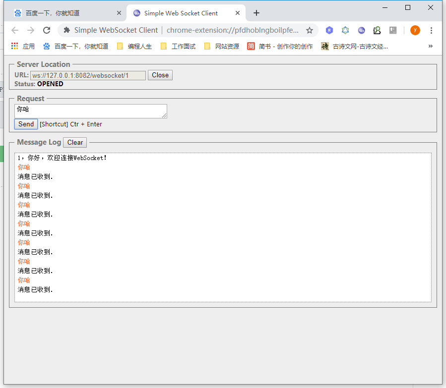
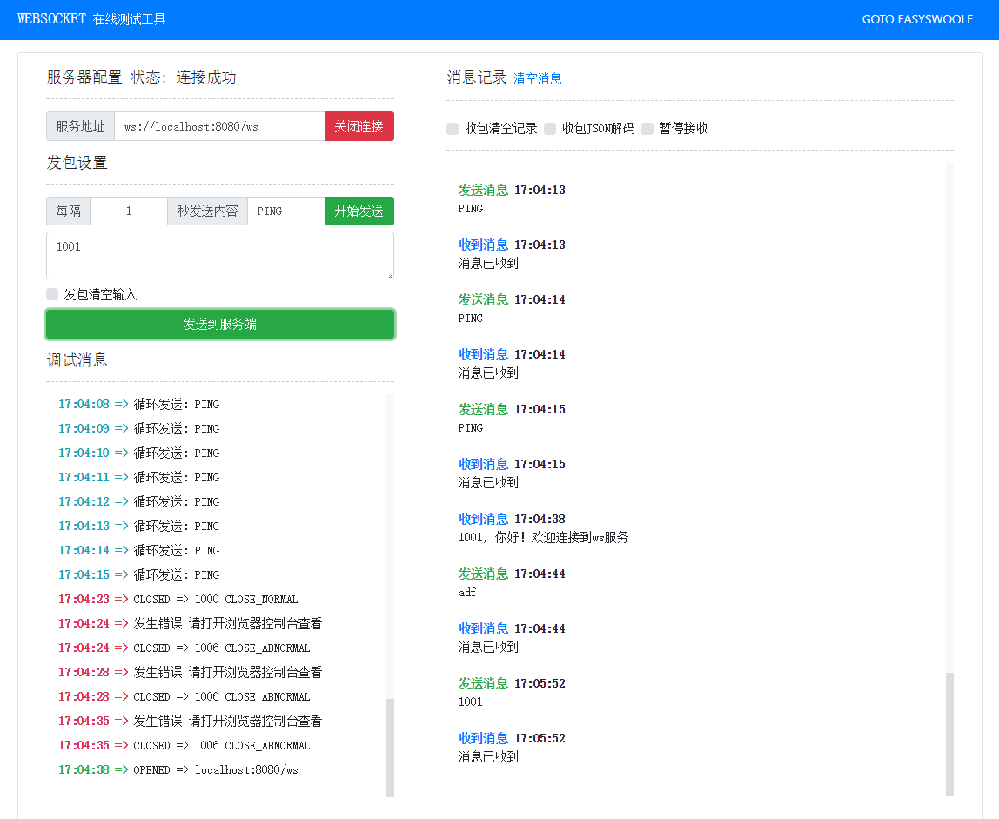

# WebSocket #

## 主要内容

- 关于WebSocket
- WebSocket入门

## 一 什么是WebSocket？

WebSocket 是HTML5一种新的协议。它实现了浏览器与服务器全双工通信(full-duplex)。一开始的握手需要借助
HTTP请求完成。 WebSocket是真正实现了全双工通信的服务器向客户端推的互联网技术。 它是一种在单个TCP连
接上进行全双工通讯协议。Websocket通信协议与2011年倍IETF定为标准RFC 6455，Websocket API被W3C定为
标准。

> 全双工和单工的区别？
>
> - 全双工（Full Duplex）是通讯传输的一个术语。通信允许数据在两个方向上同时传输，它在能力上相当
>   于两个单工通信方式的结合。全双工指可以同时（瞬时）进行信号的双向传输（A→B且B→A）。指
>   A→B的同时B→A，是瞬时同步的。
> - 单工、半双工（Half Duplex），所谓半双工就是指一个时间段内只有一个动作发生，举个简单例子，
>   一条窄窄的马路，同时只能有一辆车通过，当目前有两辆车对开，这种情况下就只能一辆先过，等到头
>   儿后另一辆再开，这个例子就形象的说明了半双工的原理。早期的对讲机、以及早期集线器等设备都是
>   基于半双工的产品。随着技术的不断进步，半双工会逐渐退出历史舞台。

**查看浏览器支持情况**：https://caniuse.com/#search=websocket

## 二 http与websocket的区别

**回顾Http、Http2、TCP、UDP、dubbo:// 等协议内容**

- WebSocket协议是一种长链接，只需要通过一次请求来初始化链接，然后所有的请求和响应都是通过这个TCP链接进行通讯。

## 三 WebSocket基本使用

### 3.1 创建HelloWorld项目，并导入依赖

```xml
<dependency>
    <groupId>javax</groupId>
    <artifactId>javaee-api</artifactId>
    <version>7.0</version>
    <scope>provided</scope>
</dependency>
```

### 3.2 websocket的相关注解说明

- @ServerEndpoint("/websocket/{uid}")
  - 申明这是一个websocket服务
  - 需要指定访问该服务的地址，在地址中可以指定参数，需要通过{}进行占位
- @OnOpen
  - 用法：public void onOpen(Session session, @PathParam("uid") String uid) throws IOException{}
  - 该方法将在建立连接后执行，会传入session对象，就是客户端与服务端建立的长连接通道
  - 通过@PathParam获取url申明中的参数
- @OnClose
  - 用法：public void onClose() {}
  - 该方法是在连接关闭后执行
- @OnMessage
  - 用法：public void onMessage(String message, Session session) throws IOException {}
  - 该方法用于接收客户端发来的消息
  - message：发来的消息数据
  - session：会话对象（也是通道）
- 发送消息到客户端
  - 用法：session.getBasicRemote().sendText("你好");
  - 通过session进行发送。

### 3.3 编写WebSocket服务

```java
@ServerEndpoint("/websocket/{uid}")// 注意此处：/不可省略
public class WebSocketDemo {

    @OnOpen
    public void onOpen(Session session, @PathParam("uid") String uid) throws IOException {
        // 连接成功
        session.getBasicRemote().sendText(uid + "，你好，欢迎连接WebSocket！");
    }

    @OnClose
    public void onClose() {
        System.out.println(this + "关闭连接");
    }

    @OnMessage
    public void onMessage(String message, Session session) throws IOException {
        System.out.println("接收到消息：" + message);
        session.getBasicRemote().sendText("消息已收到.");
    }

    @OnError
    public void onError(Session session, Throwable error) {
        System.out.println("发生错误，打印错误信息");
        error.printStackTrace();
    }
}
```

编写完成后，无需进额外的配置，直接启动tomcat即可。

### 3.4 测试websocket的方式

1. 可以通过安装chrome插件或者通过在线工具进行测试：chrome插件，Simple WebSocket Client：https://chrome.google.com/webstore/detail/simple-websocket-client/pfdhoblngboilpfeibdedpjgfnlcodoo

   

2. 在线工具：https://easyswoole.com/wstool.html

## 四 SpringBoot整合WebSocket

### 4.1 引入依赖

```xml
<parent>
    <groupId>org.springframework.boot</groupId>
    <artifactId>spring-boot-starter-parent</artifactId>
    <version>2.1.6.RELEASE</version>
</parent>

<dependencies>
    <dependency>
        <groupId>org.springframework.boot</groupId>
        <artifactId>spring-boot-starter-websocket</artifactId>
    </dependency>
</dependencies>
```

### 4.2 HandshakeInterceptor拦截器

在Spring中提供了websocket拦截器，可以在建立连接之前写些业务逻辑，比如校验登录等。

**编写拦截器：**

```java
@Component
public class DemoHandshakeInterceptor implements HandshakeInterceptor {

    /**
     * Handshake: 握手 握手之前返回false，则不建立连接
     *
     * @params: [serverHttpRequest, serverHttpResponse, webSocketHandler, map]
     * @return: boolean
     */
    @Override
    public boolean beforeHandshake(ServerHttpRequest serverHttpRequest, ServerHttpResponse serverHttpResponse
            , WebSocketHandler webSocketHandler, Map<String, Object> map) throws Exception {
        //将用户id放入socket处理器的会话(WebSocketSession)中
        map.put("uid", 1001);
        System.out.println("开始握手。。。。。。。");
        return true;
    }

    @Override
    public void afterHandshake(ServerHttpRequest serverHttpRequest, ServerHttpResponse serverHttpResponse
            , WebSocketHandler webSocketHandler, Exception e) {
        System.out.println("握手成功之后....");
    }
}
```

### 4.3 实现WebSocketHandler对信息处理

在Spring中，处理消息的具体业务逻辑需要实现WebSocketHandler接口。

```java
@Component
public class DemoWebSocketHandler extends TextWebSocketHandler {

    @Override
    public void handleTextMessage(WebSocketSession session, TextMessage message)
            throws IOException {
        System.out.println("获取到消息 >> " + message.getPayload());

        // 向客户端发送消息
        session.sendMessage(new TextMessage("消息已收到"));

        if(message.getPayload().equals("10")){
            for (int i = 0; i < 10; i++) {
                session.sendMessage(new TextMessage("消息 -> " + i));
                try {
                    Thread.sleep(100);
                } catch (InterruptedException e) {
                    e.printStackTrace();
                }
            }
        }
    }

    @Override
    public void afterConnectionEstablished(WebSocketSession session) throws
            Exception {
        Integer uid = (Integer) session.getAttributes().get("uid");
        session.sendMessage(new TextMessage(uid+", 你好！欢迎连接到ws服务"));
    }

    @Override
    public void afterConnectionClosed(WebSocketSession session, CloseStatus status)
            throws Exception {
        System.out.println("断开连接！");
    }
}
```

### 4.3 编写配置类

```java
@Configuration
@EnableWebSocket
public class WebSocketConfig implements WebSocketConfigurer {

    @Autowired
    private DemoHandshakeInterceptor handshakeInterceptor;

    @Override
    public void registerWebSocketHandlers(WebSocketHandlerRegistry registry) {
        // 注册处理服务
        WebSocketHandlerRegistration registration = registry.addHandler(webSocketHandler(), "/ws")
                .setAllowedOrigins("*");
        // 添加拦截器
        registration.addInterceptors(handshakeInterceptor);
    }

    @Bean
    public WebSocketHandler webSocketHandler() {
        return new DemoWebSocketHandler();
    }
}
```

### 4.4 编写SpringBoot启动器：启动进行测试

