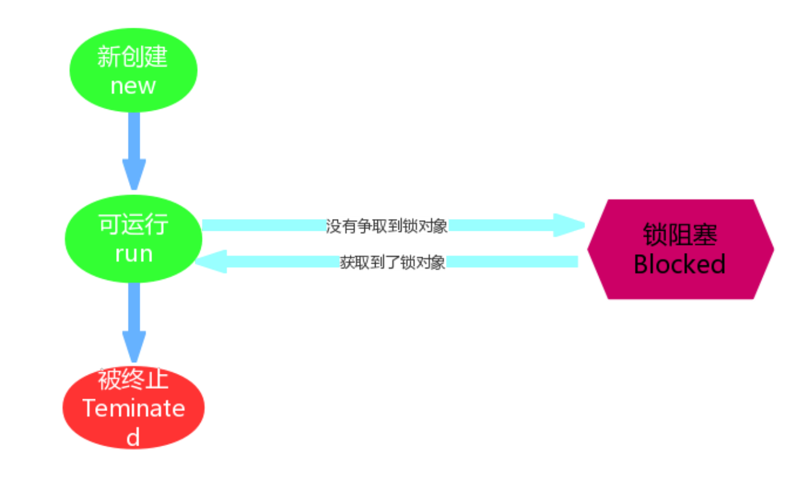

# 	Java 并发多线程

## 学习目标

- [ ] 掌握线程与进程之间的关系
- [ ] 掌握并发编程原则，JMM内存模型
- [ ] 掌握多线程创建的方式
- [ ] 掌握同步与互斥
- [ ] 掌握Thread类常用API
- [ ] 掌握ThreadLocal使用和底层原理
- [ ] 掌握线程间通信
- [ ] 掌握线程运行的六种状态
- [ ] 掌握线程池的知识
- [ ] 掌握死锁相关知识
- [ ] 掌握锁相关知识，如乐观/悲观锁、公平/非公平锁、自旋锁（可重入锁）

## 一 多线程

我们在之前，学习的程序在没有跳转语句的前提下，都是由上至下依次执行，那现在想要设计一个程序，边打游戏边听歌，怎么设计？

要解决上述问题,咱们得使用多进程或者多线程来解决.

### 1.1 并发与并行

- **并发**：指两个或多个事件在**同一个时间段内**发生。
- **并行**：指两个或多个事件在**同一时刻**发生（同时发生）。


在操作系统中，安装了多个程序，并发指的是在一段时间内宏观上有多个程序同时运行，这在单 CPU 系统中，每一时刻只能有一道程序执行，即微观上这些程序是分时的交替运行，只不过是给人的感觉是同时运行，那是因为分时交替运行的时间是非常短的。

而在多个 CPU 系统中，则这些可以并发执行的程序便可以分配到多个处理器上（CPU），实现多任务并行执行，即利用每个处理器来处理一个可以并发执行的程序，这样多个程序便可以同时执行。目前电脑市场上说的多核 CPU，便是多核处理器，核 越多，并行处理的程序越多，能大大的提高电脑运行的效率。

> 注意：单核处理器的计算机肯定是不能并行的处理多个任务的，只能是多个任务在单个CPU上并发运行。同理,线程也是一样的，从宏观角度上理解线程是并行运行的，但是从微观角度上分析却是串行运行的，即一个线程一个线程的去运行，当系统只有一个CPU时，线程会以某种顺序执行多个线程，我们把这种情况称之为线程调度。

### 1.2 线程与进程

- **进程**：是指一个内存中运行的应用程序，每个进程都有一个独立的内存空间，一个应用程序可以同时运行多个进程；进程也是程序的一次执行过程，是系统运行程序的基本单位；系统运行一个程序即是一个进程从创建、运行到消亡的过程。

- **线程**：线程是进程中的一个执行单元，负责当前进程中程序的执行，一个进程中至少有一个线程。一个进程中是可以有多个线程的，这个应用程序也可以称之为多线程程序。 

  简而言之：一个程序运行后至少有一个进程，一个进程中可以包含多个线程 

**线程调度:**

- 分时调度

  所有线程轮流使用 CPU 的使用权，平均分配每个线程占用 CPU 的时间。

- 抢占式调度

  优先让优先级高的线程使用 CPU，如果线程的优先级相同，那么会随机选择一个(线程随机性)，Java使用的为抢占式调度。

  - 设置线程的优先级

  

  - 抢占式调度详解

    大部分操作系统都支持多进程并发运行，现在的操作系统几乎都支持同时运行多个程序。比如：现在我们上课一边使用编辑器，一边使用录屏软件，同时还开着画图板，dos窗口等软件。此时，这些程序是在同时运行，”感觉这些软件好像在同一时刻运行着“。

    实际上，CPU(中央处理器)使用抢占式调度模式在多个线程间进行着高速的切换。对于CPU的一个核而言，某个时刻，只能执行一个线程，而 CPU的在多个线程间切换速度相对我们的感觉要快，看上去就是在同一时刻运行。
    其实，多线程程序并不能提高程序的运行速度，但能够提高程序运行效率，让CPU的使用率更高。

    

### 1.3 Thread 类

在上一天内容中我们已经可以完成最基本的线程开启，那么在我们完成操作过程中用到了 java.lang.Thread 类，
`API`中该类中定义了有关线程的一些方法，具体如下：

#### 1.3.1 构造方法：

- `public Thread()` :分配一个新的线程对象。
- `public Thread(String name)` :分配一个指定名字的新的线程对象。
- `public Thread(Runnable target)` :分配一个带有指定目标新的线程对象。
- `public Thread(Runnable target,String name)` :分配一个带有指定目标新的线程对象并指定名字

#### 1.3.2 常用方法

- `public String getName()` :获取当前线程名称。
- `public void start()` :导致此线程开始执行; Java虚拟机调用此线程的run方法。
- `public void run()` :此线程要执行的任务在此处定义代码。
- `public static void sleep(long millis)` :使当前正在执行的线程以指定的毫秒数暂停（暂时停止执行）。
- `public static Thread currentThread()` :返回对当前正在执行的线程对象的引用。
- `boolean isDaemon() `：用于测试该线程是否为守护线程。守护线程通常指后台运行为其它线程提供服务的线程，如：垃圾回收线程。
- `void setDaemon(boolean on)` ：用于标记该线程为守护线程，必须在启动之前调用。当所有非守护线程结束时，守护线程也会随之结束。
- `int getPriority()` ：用于获取当前线程的优先级并返回。 
- `void setPriority(int newPriority)`： 用于设置线程的优先级。优先级越高表示获取到时间片的机会越多，但不一定先执行。

### 1.4 创建线程的四种方式 ###

1. 继承Thread类并重写run()方法，创建该类的对象调用start()方法。

2. 实现Runnable接口并重写run()方法，创建该类的对象作为创建Thread类对象的实参，然后使用Thread类的对象去调用start()方法。

3. Callable接口创建线程的方式

   ```java
   /**
    * @author yim create time 2019-8-8
    *
    * 创建线程的方式
    * 1. 继承Thread类
    * 2. 实现Runnable接口
    * 3. 使用Callable接口
    *
    * 4. 使用线程池创建
    */
   public class CallableDemo {
       public static void main(String[] args) throws ExecutionException, InterruptedException {
           FutureTask<Integer> futureTask = new FutureTask<Integer>(new MyThread());
           new Thread(futureTask,"t1").start();
           // 同一个futureTask再次调用，不执行
           new Thread(futureTask,"t2").start();
   
           // futureTask.get()建议放在最后面，为了避免call()计算时间过长
           System.out.println("result****" + futureTask.get());
       }
   
   }
   
   class MyThread implements Callable<Integer>{
   
       @Override
       public Integer call() throws Exception {
           System.out.println("come in callable");
           return 1024;
       }
   }
   ```

4 . 使用线程池创建

### 1.5 Object中方法

- `void wait()` ： 用于使得当前线程进入等待状态，直到其它线程调用notify()或notifyAll()方法为止。
- `void wait(long timeout)`：使得当前线程进入等待状态，直到其它线程调用上述方法，或者参数指定的毫秒数已经过去为止。
- `void notify() `： 用于唤醒单个等待的线程。
- `void notifyAll() `： 用于唤醒所有等待的线程。

### 1.6 多线程原理 ###

main()方法是程序的入口，执行main()方法的线程叫做主线程；

由start()方法启动的线程叫做新/子线程。

对于start()方法之前的代码来说，由主线程执行一次，当start()方法调用成功后，线程的个数瞬间由1个变成了2个，其中新创建的线程去执行run()方法的代码，主线程继续向下执行，两个线程各自独立运行。

当run()方法结束后子线程结束，当main()方法结束后主线程结束，两个线程的执行先后次序没有明确的规定，由系统的调度算法来决定。

**注意：**

继承的方式创建和启动线程的代码简单，但Java支持单继承，不利于项目的维护和扩展，因此在以后的开发中推荐使用实现接口的方式创建和启动线程。

### 1.7 线程的编号和名称 ###

	long getId() - 用于获取线程的标识符/编号并返回。
	String getName() - 用于获取线程的名称并返回。
	void setName(String name) - 用于将线程名称修改为参数指定的数值。
	static Thread currentThread() - 用于返回当前正在执行线程对象的引用。

## 第二章 线程的同步与互斥

### 2.1  线程安全

如果有多个线程在同时运行，而这些线程可能会同时运行这段代码。程序每次运行结果和单线程运行的结果是一样
的，而且其他的变量的值也和预期的是一样的，就是线程安全的。

我们通过一个案例，演示线程的安全问题：

电影院要卖票，我们模拟电影院的卖票过程。假设要播放的电影是 “葫芦娃大战奥特曼”，本次电影的座位共100个
(本场电影只能卖100张票)。

我们来模拟电影院的售票窗口，实现多个窗口同时卖 “葫芦娃大战奥特曼”这场电影票(多个窗口一起卖这100张票)
需要窗口，采用线程对象来模拟；需要票，Runnable接口子类来模拟

模拟票：

```java
public class Ticket implements Runnable {
    private int ticket = 100;
    /*
     * 执行卖票操作
     */
    @Override
    public void run() {
        //每个窗口卖票的操作
        //窗口 永远开启
        while (true) {
            if (ticket > 0) {//有票 可以卖
                //出票操作
                //使用sleep模拟一下出票时间
                try {
                    Thread.sleep(100);
                } catch (InterruptedException e) {
                    // TODO Auto‐generated catch block
                    e.printStackTrace();
                }
                //获取当前线程对象的名字
                String name = Thread.currentThread().getName();
                System.out.println(name + "正在卖:" + ticket‐‐);
            }
        }
    }
}
```

测试类：

```
public class Demo {
public static void main(String[] args) {    
    //创建线程任务对象        
    Ticket ticket = new Ticket();        
    //创建三个窗口对象        
    Thread t1 = new Thread(ticket, "窗口1");        
    Thread t2 = new Thread(ticket, "窗口2");        
    Thread t3 = new Thread(ticket, "窗口3");        

    //同时卖票        
    t1.start();        
    t2.start();        
    t3.start();        
    }    
}
```

发现程序出现了两个问题：
1. 相同的票数,比如5这张票被卖了两回。
2. 不存在的票，比如0票与-1票，是不存在的。
这种问题，几个窗口(线程)票数不同步了，这种问题称为线程不安全。

> 线程安全问题都是由全局变量及静态变量引起的。若每个线程中对全局变量、静态变量只有读操作，而无写
> 操作，一般来说，这个全局变量是线程安全的；若有多个线程同时执行写操作，一般都需要考虑线程同步，
> 否则的话就可能影响线程安全。

### 2.2  线程同步

当我们使用多个线程访问同一资源的时候，且多个线程中对资源有写的操作，就容易出现线程安全问题。
要解决上述多线程并发访问一个资源的安全性问题:也就是解决重复票与不存在票问题，Java中提供了同步机制
(synchronized)来解决。

为了保证每个线程都能正常执行原子操作,Java引入了线程同步机制。

那么怎么去使用呢？有三种方式完成同步操作：

1. 同步代码块。
2.  同步方法。
3. 锁（Lock）机制。

其中1、2的方式是使用synchronized关键进行完成的

### 2.3 synchronized关键字

#### 2.3.1 使用方式一：同步代码块

- **同步代码块** ： synchronized 关键字可以用于方法中的某个区块中，表示只对这个区块的资源实行互斥访问。

格式：

```
synchronized(同步锁){
     需要同步操作的代码
}
```

**同步锁:**

对象的同步锁只是一个概念,可以想象为在对象上标记了一个锁.

1. 锁对象 可以是任意类型。
2. 多个线程对象 要使用同一把锁。

> 注意:在任何时候,最多允许一个线程拥有同步锁,谁拿到锁就进入代码块,其他的线程只能在外等着
> (BLOCKED)。

使用同步代码块解决问题：

```java
public class Ticket implements Runnable{

    private int ticket = 100;

    Object lock = new Object();

    @Override
    public void run() {
        while (true){
            // synchronized用法一：同步代码块
            synchronized (lock){
                if (ticket > 0){
                    try {
                        // sleep模拟售票操作时间
                        TimeUnit.SECONDS.sleep(1);
                    } catch (InterruptedException e) {
                        e.printStackTrace();
                    }
                    System.out.println(Thread.currentThread().getName() + "操作员 \t 进行售票" + ticket--);
                }
            }
        }
    }
}
```

#### 2.3.2  使用方式二：同步方法

**同步方法** :使用synchronized修饰的方法,就叫做同步方法,保证A线程执行该方法的时候,其他线程只能在方法外
等着。

格式：

```java
public synchronized void method(){
   可能会产生线程安全问题的代码 
}
```

> 同步锁是谁?
> 对于非static方法,同步锁就是this。
> 对于static方法,我们使用当前方法所在类的字节码对象(类名.class)。

```java
public class Ticket implements Runnable{

    private int ticket = 100;
    
    @Override
    public void run() {
        while (true){
            sellTickets();
        }
    }

    /**
     * synchronized用法二：同步方法
     */
    public synchronized void sellTickets(){
        if (ticket > 0){
            try {
                // sleep模拟售票操作时间
                TimeUnit.SECONDS.sleep(1);
            } catch (InterruptedException e) {
                e.printStackTrace();
            }
            System.out.println(Thread.currentThread().getName() + "操作员 \t 进行售票" + ticket--);
        }
    }
}
```

### 2.4 Lock 锁机制

`java.util.concurrent.locks.Lock `机制提供了比synchronized代码块和synchronized方法更广泛的锁定操作,
同步代码块/同步方法具有的功能Lock都有,除此之外更强大,更体现面向对象。

Lock锁也称同步锁，加锁与释放锁方法化了，如下：

- `public void lock()` :加同步锁。
- `public void unlock()` :释放同步锁。

使用如下：

```java
public class Ticket implements Runnable{
    private int ticket = 100;    

    Lock lock = new ReentrantLock();    
    /*    
     * 执行卖票操作    
     */    
    @Override    
    public void run() {    
        //每个窗口卖票的操作         
        //窗口 永远开启         
        while(true){        
        lock.lock();            
        if(ticket>0){//有票 可以卖            
        //出票操作                 
        //使用sleep模拟一下出票时间                 
        try {                
        Thread.sleep(50);                    
        } catch (InterruptedException e) {                
        // TODO Auto‐generated catch block                    
        e.printStackTrace();                    
        }                
        //获取当前线程对象的名字                 
        String name = Thread.currentThread().getName();                
        System.out.println(name+"正在卖:"+ticket‐‐);                
        }            
        lock.unlock();            
        }        
    }    
}
```

## 第三章 线程的状态

### 3.1  线程状态概述

当线程被创建并启动以后，它既不是一启动就进入了执行状态，也不是一直处于执行状态。在线程的生命周期中，
有几种状态呢？在`API`中 `java.lang.Thread.State` 这个枚举中给出了六种线程状态：

这里先列出各个线程状态发生的条件，下面将会对每种状态进行详细解析

| 线程状态               | 导致状态发生条件                                             |
| ---------------------- | ------------------------------------------------------------ |
| NEW(新建)              | 线程刚被创建，但是并未启动。还没调用start方法。              |
| Runnable(可运行)       | 线程可以在`java`虚拟机中运行的状态，可能正在运行自己代码，也可能没有，这取决于操作系统处理器。 |
| Blocked(锁阻塞)        | 当一个线程试图获取一个对象锁，而该对象锁被其他的线程持有，则该线程进入Blocked状态；当该线程持有锁时，该线程将变成Runnable状态。 |
| Waiting(无限等待)      | 一个线程在等待另一个线程执行一个（唤醒）动作时，该线程进入Waiting状态。进入这个状态后是不能自动唤醒的，必须等待另一个线程调用notify或者notifyAll方法才能够唤醒。 |
| TimedWaiting(计时等待) | 同waiting状态，有几个方法有超时参数，调用他们将进入Timed Waiting状态。这一状态将一直保持到超时期满或者接收到唤醒通知。带有超时参数的常用方法有Thread.sleep 、Object.wait。 |
| Teminated(被终止)      | 因为run方法正常退出而死亡，或者因为没有捕获的异常终止了run方法而死亡。 |

### 3.2 Timed Waiting （计时等待）

Timed Waiting在API中的描述为：一个正在限时等待另一个线程执行一个（唤醒）动作的线程处于这一状态。单独
的去理解这句话，真是玄之又玄，其实我们在之前的操作中已经接触过这个状态了，在哪里呢？
在我们写卖票的案例中，为了减少线程执行太快，现象不明显等问题，我们在run方法中添加了sleep语句，这样就
强制当前正在执行的线程休眠（**暂停执行**），以“减慢线程”。
其实当我们调用了sleep方法之后，当前执行的线程就进入到“休眠状态”，其实就是所谓的Timed Waiting(计时等
待)，那么我们通过一个案例加深对该状态的一个理解。

**实现一个计数器，计数到100，在每个数字之间暂停1秒，每隔10个数字输出一个字符串**

```java
 public class MyThread extends Thread {
    public void run() {
        for (int i = 0; i < 100; i++) {
            if ((i) % 10 == 0) {
                System.out.println("‐‐‐‐‐‐‐" + i);
            }
            System.out.print(i);
            try {
                Thread.sleep(1000);
               System.out.print("    线程睡眠1秒！\n");  
            } catch (InterruptedException e) {
                e.printStackTrace();
            }
        }
    }
    public static void main(String[] args) {
        new MyThread().start();
    }
}
```

通过案例可以发现， sleep方法的使用还是很简单的。我们需要记住下面几点：
1. 进入 TIMED_WAITING 状态的一种常见情形是调用的 sleep 方法，单独的线程也可以调用，不一定非要有协
作关系。
2. 为了让其他线程有机会执行，可以将Thread.sleep()的调用放**线程run()之内**。这样才能保证该线程执行过程
中会睡眠
3. sleep与锁无关，线程睡眠到期自动苏醒，并返回到Runnable（可运行）状态。

> 小提示：sleep()中指定的时间是线程不会运行的最短时间。因此，sleep()方法不能保证该线程睡眠到期后就
> 开始立刻执行。

Timed Waiting 线程状态图:


### 3.3 BLOCKED （锁阻塞）

Blocked 状态在API中的介绍为：一个正在阻塞等待一个监视器锁（锁对象）的线程处于这一状态。

我们已经学完同步机制，那么这个状态是非常好理解的了。比如，线程A与线程B代码中使用同一锁，如果线程A获
取到锁，线程A进入到Runnable状态，那么线程B就进入到Blocked锁阻塞状态。

这是由Runnable状态进入Blocked状态。除此Waiting以及Time Waiting状态也会在某种情况下进入阻塞状态，而
这部分内容作为扩充知识点带领大家了解一下。

Blocked 线程状态图:



### 3.4 Waiting （无限等待）

Wating状态在API中介绍为：一个正在无限期等待另一个线程执行一个特别的（唤醒）动作的线程处于这一状态。

那么我们之前遇到过这种状态吗？答案是并没有，但并不妨碍我们进行一个简单深入的了解。我们通过一段代码来
学习一下：

```java
public class WaitingTest {
    public static Object obj = new Object();
    public static void main(String[] args) {
        // 演示waiting
        new Thread(new Runnable() {
            @Override
            public void run() {
                while (true){
                    synchronized (obj){
                        try {
                            System.out.println( Thread.currentThread().getName() +"=== 获取到锁对象，调用wait方法，进入waiting状态，释放锁对象");
                            obj.wait();  //无限等待
                            //obj.wait(5000); //计时等待, 5秒 时间到，自动醒来
                        } catch (InterruptedException e) {
                            e.printStackTrace();
                        }
                        System.out.println( Thread.currentThread().getName() + "=== 从waiting状态醒来，获取到锁对象，继续执行了");
                    }
                }
            }
        },"等待线程").start();
        new Thread(new Runnable() {
            @Override
            public void run() {
//                while (true){   //每隔3秒 唤醒一次
                    try {
                        System.out.println( Thread.currentThread().getName() +"‐‐‐‐‐ 等待3秒钟");
                        Thread.sleep(3000);
                    } catch (InterruptedException e) {
                        e.printStackTrace();
                    }
                    synchronized (obj){
                        System.out.println( Thread.currentThread().getName() +"‐‐‐‐‐ 获取到锁对
象,调用notify方法，释放锁对象");
                        obj.notify();
                    }
                }
//            }
        },"唤醒线程").start();
    }
}
```

通过上述案例我们会发现，一个调用了某个对象的 Object.wait 方法的线程会等待另一个线程调用此对象的
Object.notify()方法 或 Object.notifyAll()方法。

Waiting 线程状态图:


### 3.5  补充知识点

想要有更多的了解，详情可以见下图：


> 一条有意思的tips:
>
> 我们在翻阅API的时候会发现Timed Waiting（计时等待） 与 Waiting（无限等待） 状态联系还是很紧密的，
> 比如Waiting（无限等待） 状态中wait方法是空参的，而timed waiting（计时等待） 中wait方法是带参的。
> 这种带参的方法，其实是一种倒计时操作，相当于我们生活中的小闹钟，我们设定好时间，到时通知，可是
> 如果提前得到（唤醒）通知，那么设定好时间在通知也就显得多此一举了，那么这种设计方案其实是一举两
> 得。如果没有得到（唤醒）通知，那么线程就处于Timed Waiting状态,直到倒计时完毕自动醒来；如果在倒
> 计时期间得到（唤醒）通知，那么线程从Timed Waiting状态立刻唤醒。

## 第四章 线程间的通信

### 4.1 线程间通信

**概念：**多个线程在处理同一个资源，但是处理的动作（线程的任务）却不相同。

比如：线程A用来生成包子的，线程B用来吃包子的，包子可以理解为同一资源，线程A与线程B处理的动作，一个是生产，一个是消费，那么线程A与线程B之间就存在线程通信问题。

**为什么要处理线程间通信：**

多个线程并发执行时, 在默认情况下CPU是随机切换线程的，当我们需要多个线程来共同完成一件任务，并且我们希望他们有规律的执行, 那么多线程之间需要一些协调通信，以此来帮我们达到多线程共同操作一份数据。

**如何保证线程间通信有效利用资源：**

多个线程在处理同一个资源，并且任务不同时，需要线程通信来帮助解决线程之间对同一个变量的使用或操作。 就是多个线程在操作同一份数据时， 避免对同一共享变量的争夺。也就是我们需要通过一定的手段使各个线程能有效的利用资源。而这种手段即—— **等待唤醒机制。**

### 4.2 等待唤醒机制

**什么是等待唤醒机制**

这是多个线程间的一种**协作**机制。谈到线程我们经常想到的是线程间的**竞争（race）**，比如去争夺锁，但这并不是故事的全部，线程间也会有协作机制。就好比在公司里你和你的同事们，你们可能存在在晋升时的竞争，但更多时候你们更多是一起合作以完成某些任务。

就是在一个线程进行了规定操作后，就进入等待状态（**wait()**）， 等待其他线程执行完他们的指定代码过后 再将其唤醒（**notify()**）;在有多个线程进行等待时， 如果需要，可以使用 notifyAll()来唤醒所有的等待线程。

wait/notify 就是线程间的一种协作机制。

**等待唤醒中的方法**

等待唤醒机制就是用于解决线程间通信的问题的，使用到的3个方法的含义如下：

1. wait：线程不再活动，不再参与调度，进入 wait set 中，因此不会浪费 CPU 资源，也不会去竞争锁了，这时的线程状态即是 WAITING。它还要等着别的线程执行一个**特别的动作**，也即是“**通知（notify）**”在这个对象上等待的线程从wait set 中释放出来，重新进入到调度队列（ready queue）中
2. notify：则选取所通知对象的 wait set 中的一个线程释放；例如，餐馆有空位置后，等候就餐最久的顾客最先入座。
3. notifyAll：则释放所通知对象的 wait set 上的全部线程。

> 注意：
>
> 哪怕只通知了一个等待的线程，被通知线程也不能立即恢复执行，因为它当初中断的地方是在同步块内，而此刻它已经不持有锁，所以她需要再次尝试去获取锁（很可能面临其它线程的竞争），成功后才能在当初调用 wait 方法之后的地方恢复执行。
>
> 总结如下：
>
> - 如果能获取锁，线程就从 WAITING 状态变成 RUNNABLE 状态；
> - 否则，从 wait set 出来，又进入 entry set，线程就从 WAITING 状态又变成 BLOCKED 状态

**调用wait和notify方法需要注意的细节**

1. wait方法与notify方法必须要由同一个锁对象调用。因为：对应的锁对象可以通过notify唤醒使用同一个锁对象调用的wait方法后的线程。
2. wait方法与notify方法是属于Object类的方法的。因为：锁对象可以是任意对象，而任意对象的所属类都是继承了Object类的。
3. wait方法与notify方法必须要在同步代码块或者是同步函数中使用。因为：必须要通过锁对象调用这2个方法。

### 4.3 生产者与消费者问题

等待唤醒机制其实就是经典的“生产者与消费者”的问题。

就拿生产包子消费包子来说等待唤醒机制如何有效利用资源：

```
包子铺线程生产包子，吃货线程消费包子。
当包子没有时（包子状态为false），吃货线程等待，包子铺线程生产包子（即包子状态为true），并通知吃货线程（解除吃货的等待状态）,因为已经有包子了，那么包子铺线程进入等待状态。
接下来，吃货线程能否进一步执行则取决于锁的获取情况。如果吃货获取到锁，那么就执行吃包子动作，包子吃完（包子状态为false），并通知包子铺线程（解除包子铺的等待状态）,吃货线程进入等待。
包子铺线程能否进一步执行则取决于锁的获取情况。
```

**代码演示：**

包子资源类：

```java
public class BaoZi {
     String  pier ;
     String  xianer ;
     boolean  flag = false ;//包子资源 是否存在  包子资源状态
}
```

吃货线程类：

```java
public class ChiHuo extends Thread{
    private BaoZi bz;

    public ChiHuo(String name,BaoZi bz){
        super(name);
        this.bz = bz;
    }
    @Override
    public void run() {
        while(true){
            synchronized (bz){
                if(bz.flag == false){//没包子
                    try {
                        bz.wait();
                    } catch (InterruptedException e) {
                        e.printStackTrace();
                    }
                }
                System.out.println("吃货正在吃"+bz.pier+bz.xianer+"包子");
                bz.flag = false;
                bz.notify();
            }
        }
    }
}
```

包子铺线程类：

```java
public class BaoZiPu extends Thread {

    private BaoZi bz;

    public BaoZiPu(String name,BaoZi bz){
        super(name);
        this.bz = bz;
    }

    @Override
    public void run() {
        int count = 0;
        //造包子
        while(true){
            //同步
            synchronized (bz){
                if(bz.flag == true){//包子资源  存在
                    try {

                        bz.wait();

                    } catch (InterruptedException e) {
                        e.printStackTrace();
                    }
                }

                // 没有包子  造包子
                System.out.println("包子铺开始做包子");
                if(count%2 == 0){
                    // 冰皮  五仁
                    bz.pier = "冰皮";
                    bz.xianer = "五仁";
                }else{
                    // 薄皮  牛肉大葱
                    bz.pier = "薄皮";
                    bz.xianer = "牛肉大葱";
                }
                count++;

                bz.flag=true;
                System.out.println("包子造好了："+bz.pier+bz.xianer);
                System.out.println("吃货来吃吧");
                //唤醒等待线程 （吃货）
                bz.notify();
            }
        }
    }
}
```

测试类：

```java
public class Demo {
    public static void main(String[] args) {
        //等待唤醒案例
        BaoZi bz = new BaoZi();

        ChiHuo ch = new ChiHuo("吃货",bz);
        BaoZiPu bzp = new BaoZiPu("包子铺",bz);

        ch.start();
        bzp.start();
    }
}
```

执行效果：

```java
包子铺开始做包子
包子造好了：冰皮五仁
吃货来吃吧
吃货正在吃冰皮五仁包子
包子铺开始做包子
包子造好了：薄皮牛肉大葱
吃货来吃吧
吃货正在吃薄皮牛肉大葱包子
包子铺开始做包子
包子造好了：冰皮五仁
吃货来吃吧
吃货正在吃冰皮五仁包子
```

## 第五章 线程池

### 5.1 线程池思想概述

我们使用线程的时候就去创建一个线程，这样实现起来非常简便，但是就会有一个问题：

如果并发的线程数量很多，并且每个线程都是执行一个时间很短的任务就结束了，这样频繁创建线程就会大大降低系统的效率，因为频繁创建线程和销毁线程需要时间。

那么有没有一种办法使得线程可以复用，就是执行完一个任务，并不被销毁，而是可以继续执行其他的任务？

在Java中可以通过线程池来达到这样的效果。今天我们就来详细讲解一下Java的线程池。

### 5.2 线程池概念

- **线程池：**其实就是一个容纳多个线程的容器，其中的线程可以反复使用，省去了频繁创建线程对象的操作，无需反复创建线程而消耗过多资源。

合理利用线程池能够带来三个好处：

1. 降低资源消耗。减少了创建和销毁线程的次数，每个工作线程都可以被重复利用，可执行多个任务。
2. 提高响应速度。当任务到达时，任务可以不需要的等到线程创建就能立即执行。
3. 提高线程的可管理性。可以根据系统的承受能力，调整线程池中工作线线程的数目，防止因为消耗过多的内存，而把服务器累趴下(每个线程需要大约1MB内存，线程开的越多，消耗的内存也就越大，最后死机)。

### 5.3 线程池如何使用？

#### 5.3.1 线程池组织架构图


由上图可知线程池的线程池的顶级父接口为Executer

而实际工作的是ExecutorService

而线程池的核心类是`ThreadPoolExecutor`，以下五种创建线程的方式同时通过该类实现的。

#### 5.3.2 Executors创建线程的五种方式


以下介绍三中常用方式：

```java
public class MyThreadPoolDemo {
    public static void main(String[] args) {
        // 固定线程数量的线程池
        ExecutorService threadPool01 = Executors.newFixedThreadPool(5);
        // 一池一线程
        ExecutorService threadPool02 = Executors.newSingleThreadExecutor();
        // 一池多线程
        ExecutorService threadPool03 = Executors.newCachedThreadPool();

        try {
            for (int i = 1; i <= 10; i++) {
                // 线程的执行方法
                threadPool03.execute(() -> {
                    System.out.println(Thread.currentThread().getName() + "\t 办理业务");
                });

            }
        }catch (Exception e){
            e.printStackTrace();
        }finally {
            threadPool01.shutdown();
        }
    }
}
```

### 5.4 线程池七大参数


`ThreadPoolExecutor`：提供了四种构造方法，我们查看其中参数最多构造函数，来看看其参数作用：源码如下：

```java
public ThreadPoolExecutor(int corePoolSize,
                          int maximumPoolSize,
                          long keepAliveTime,
                          TimeUnit unit,
                          BlockingQueue<Runnable> workQueue,
                          ThreadFactory threadFactory,
                          RejectedExecutionHandler handler) {
    if (corePoolSize < 0 ||
        maximumPoolSize <= 0 ||
        maximumPoolSize < corePoolSize ||
        keepAliveTime < 0)
        throw new IllegalArgumentException();
    if (workQueue == null || threadFactory == null || handler == null)
        throw new NullPointerException();
    this.acc = System.getSecurityManager() == null ?
        null :
    AccessController.getContext();
    this.corePoolSize = corePoolSize;
    this.maximumPoolSize = maximumPoolSize;
    this.workQueue = workQueue;
    this.keepAliveTime = unit.toNanos(keepAliveTime);
    this.threadFactory = threadFactory;
    this.handler = handler;
}
```

- corePoolSize：线程池中的常驻核心线程数
- maximumPoolSize：线程池能够容纳溶蚀执行的最大线程数，此值大于等于1
- keepAliveTime：多余的空闲线程的存活时间。
- unit：keepAliveTime的时间单位
- workQueue：任务队列，被提交但尚未被执行的任务
- threadFactory：表示生成线程池中工作线程的线程工厂
- handler：拒绝策略，便是当队列满了并且工作线程大于等于线程池的最大线程数（maximumPoolSize）如何拒绝

### 5.5 线程池的四种拒绝策略（内置）

1. `AbortPolicy`（中止策略，默认方式）：直接抛出RejectExecutionException异常阻止系统正常运行
2. `CallerRunsPolicy`：“调用者运行”一种调节机制，该策略不会抛弃任务，也不会抛出异常，而是将某些任务回退到调用者，从而降低新任务的流量。
3. `DiscardOldestPolicy`：抛弃队列中等待最久的任务，然后把当前任务加入队列中重新尝试再次提交当前任务
4. `DiscardPolicy`：直接丢弃任务，不予任何处理也不抛出异常。如果任务允许丢失，这是最好的 一种方案。 

### 5.6 线程池的底层工作原理


1. 创建线程池后，等待提交过来的任务请求
2. 当调用execute()方法添加一个请求时，线程池会做如下判断：
   1. 如果当前运行的线程数小于corePoolSize，那么马上创建运行这个任务
   2. 如果大于等于corePoolSize，那么将任务放入队列
   3. 如果阻塞队列满了，且正在运行的线程数量小于maximumPoolSize，那么还是要创建非核心线程立刻运行这个任务
   4. 如果阻塞队列满了，且运行的线程数大于等于maximumPoolSize，那么线程池会使用拒绝策略来执行。
3. 当一个线程完成任务时，它会从队列中取下一个任务来执行
4. 当一个线程无事可做，超过其存活时间keepAliveTime，线程池会做判断：如果当前线程数量大于corePoolSize，那么这个线程就会被停掉。

### 5.7 线程池的使用（手动创建）

```java
/**
 * @author yim create time 2019-8-9
 */
public class ThreadPoolExecutorDemo {
    public static void main(String[] args) {
        // 创建一个核心线程数为2，最大线程数为5，等待时间为1s的线程池，切换不同拒绝策略进行测试
        ThreadPoolExecutor threadPool = new ThreadPoolExecutor(2
                        ,5
                        ,1L
                        , TimeUnit.SECONDS
                        ,new LinkedBlockingDeque<Runnable>(3)
                        , Executors.defaultThreadFactory()
                ,new ThreadPoolExecutor.DiscardPolicy());

        for (int i = 0; i < 12; i++) {
            threadPool.execute(() -> {
                System.out.println(Thread.currentThread().getName() + "\t check in");
            });
        }
        threadPool.shutdown();
    }
}
```

### 5.8 如何合理配置线程池

- CPU密集型：意思是任务需要大量的运算，而没有阻塞，cpu一直全速运行，参考公式
  - 最大线程数池公式：cpu核数+1
- IO密集型：即任务需要大量的IO，即大量的阻塞
  - 参考公式：cpu核数/(1-阻塞系数)
  - 阻塞系数0.8~0.9之间

- - 参考公式：cpu核数/(1-阻塞系数)
  - 阻塞系数0.8~0.9之间

## 六 死锁

### 6.1 死锁的基本常识

是指两个或者两个以上的进程在执行过程中，因争夺资源而造成的一种互相等待的现象，若无外力干涉那他们都无法推进下去，如果系统资源充足，进程的资源得到满足，死锁出现的可能性就很低，否则就会因争夺有限的资源而陷入死锁。

**死锁产生的必要条件**

- 互斥条件：线程要求对所分配的资源（如打印机）进行排他性控制，即在一段时间内某 资源仅为一个线程所占有。此时若有其他线程请求该资源，则请求线程只能等待。

- 不剥夺条件：线程所获得的资源在未使用完毕之前，不能被其他线程强行夺走，即只能由获得该资源的线程自己来释放（只能是主动释放)。
- 请求和保持条件：线程已经保持了至少一个资源，但又提出了新的资源请求，而该资源已被其他线程占有，此时请求进程被阻塞，但对自己已获得的资源保持不放。
- 循环等待条件：存在一种线程资源的循环等待链，链中每一个线程已获得的资源同时被链中下一个线程所请求

**产生死锁的主要原因：**

1. 系统资源不足
2. 进程运行推进的顺序不合适
3. 资源分配不当

### 6.2 手写一个死锁并排查

手写一个死锁：代码如下：

```java
public class DeadLockDemo {
    public static void main(String[] args) {
        String lockA = "lockA";
        String lockB = "lockB";
        new Thread(new HoldLock(lockA,lockB),"thread-A").start();
        new Thread(new HoldLock(lockB,lockA),"thread-B").start();
    }
}

class HoldLock implements Runnable{
    private String lockA;
    private String lockB;
    public HoldLock(String lockA,String lockB){
        this.lockA = lockA;
        this.lockB = lockB;
    }

    @Override
    public void run() {
        synchronized (lockA){
            System.out.println(Thread.currentThread().getName() + "\t 持有" + lockA + "\t 尝试获取" + lockB);
            try {
                TimeUnit.SECONDS.sleep(2);
            } catch (InterruptedException e) {
                e.printStackTrace();
            }
            synchronized (lockB){
                System.out.println(Thread.currentThread().getName() + "\t 自己持有" + lockB + "\t 尝试获取" + lockA);
            }
        }
    }
}
```

### 6.3 死锁排查

```
jps -l

jstack pid
```
