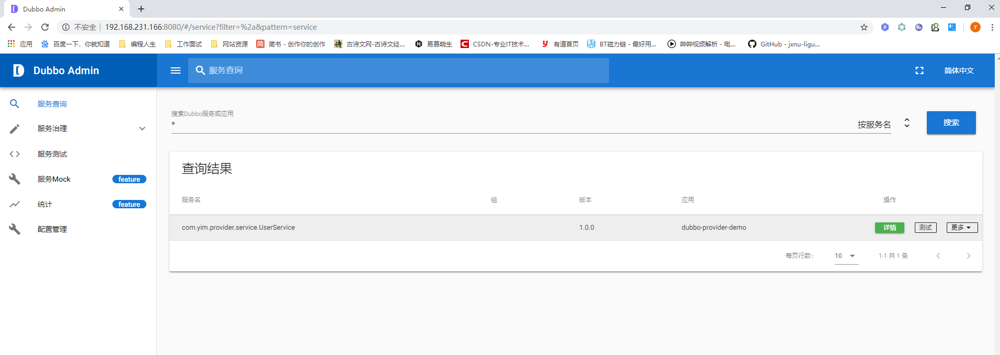

# 【3】Dubbo #

## 主要内容

- dubbo了解
- 基本入门使用
- zookeeper
- 学习入门,以后学习参考官网文档

## 一 dubbo概述

Apache Dubbo™ (incubating)是一款高性能Java RPC框架。官网： http://dubbo.apache.org/zh-cn/index.html

RPC：远程过程调用协议

### 1.1 框架说明 

随着互联网的发展，网站应用的规模不断扩大，常规的垂直应用架构已无法应对，分布式服务架构以及流动计算架
构势在必行，亟需一个治理系统确保架构有条不紊的演进。

- 单一应用架构
  当网站流量很小时，只需一个应用，将所有功能都部署在一起，以减少部署节点和成本。此时，用于简化增删改查工作量的数据访问框架(ORM)是关键。
- 垂直应用架构
  当访问量逐渐增大，单一应用增加机器带来的加速度越来越小，将应用拆成互不相干的几个应用，以提升效率。此时，用于加速前端页面开发的Web框架(MVC)是关键。
- 分布式服务架构
  当垂直应用越来越多，应用之间交互不可避免，将核心业务抽取出来，作为独立的服务，逐渐形成稳定的服务中心，使前端应用能更快速的响应多变的市场需求。此时，用于提高业务复用及整合的分布式服务框架(RPC)是关键。
- 流动计算架构
  当服务越来越多，容量的评估，小服务资源的浪费等问题逐渐显现，此时需增加一个调度中心基于访问压力实时管理集群容量，提高集群利用率。此时，用于提高机器利用率的资源调度和治理中心(SOA)是关键。

### 1.2 dubbo基本需求

- 当服务越来越多时，服务 URL 配置管理变得非常困难，F5 硬件负载均衡器的单点压力也越来越大。 此时需要一个服务注册中心，动态的注册和发现服务，使服务的位置透明。并通过在消费方获取服务提供方地址列表，实现软负载均衡和 Failover，降低对 F5 硬件负载均衡器的依赖，也能减少部分成本。
- 当进一步发展，服务间依赖关系变得错踪复杂，甚至分不清哪个应用要在哪个应用之前启动，架构师都不能完整的描述应用的架构关系。 这时，需要自动画出应用间的依赖关系图，以帮助架构师理清理关系。
- 接着，服务的调用量越来越大，服务的容量问题就暴露出来，这个服务需要多少机器支撑？什么时候该加机器？ 为了解决这些问题，第一步，要将服务现在每天的调用量，响应时间，都统计出来，作为容量规划的参考指标。其次，要可以动态调整权重，在线上，将某台机器的权重一直加大，并在加大的过程中记录响应时间的变化，直到响应时间到达阈值，记录此时的访问量，再以此访问量乘以机器数反推总容量。

### 1.3 dubbo架构


**节点角色说明：**

- Provider 暴露服务的服务提供方
- Consumer 调用远程服务的服务消费方
- Registry 服务注册与发现的注册中心
- Monitor 统计服务的调用次数和调用时间的监控中心
- Container 服务运行容器

**调用关系说明：**

1. 服务容器负责启动，加载，运行服务提供者。
2. 服务提供者在启动时，向注册中心注册自己提供的服务。
3. 服务消费者在启动时，向注册中心订阅自己所需的服务。
4. 注册中心返回服务提供者地址列表给消费者，如果有变更，注册中心将基于长连接推送变更数据给消费者。
5. 服务消费者，从提供者地址列表中，基于软负载均衡算法，选一台提供者进行调用，如果调用失败，再选另
一台调用。
6. 服务消费者和提供者，在内存中累计调用次数和调用时间，定时每分钟发送一次统计数据到监控中心。

Dubbo 架构具有以下几个特点，分别是连通性、健壮性、伸缩性、以及向未来架构的升级性。

更多介绍参见： http://dubbo.apache.org/zh-cn/docs/user/preface/architecture.html

## 二 注册中心

dubbo支持多种注册中心，推荐使用ZooKeeper。http://dubbo.apache.org/zh-cn/docs/user/references/registry/introduction.html

Zookeeper  是 Apacahe Hadoop 的子项目，是一个树型的目录服务，支持变更推送，适合作为 Dubbo 服务的注
册中心，工业强度较高，可用于生产环境，并推荐使用。


流程说明：

- 服务提供者启动时: 向 `/dubbo/com.foo.BarService/providers` 目录下写入自己的 URL 地址
- 服务消费者启动时: 订阅 `/dubbo/com.foo.BarService/providers` 目录下的提供者 URL 地址。并向 `/dubbo/com.foo.BarService/consumers` 目录下写入自己的 URL 地址
- 监控中心启动时: 订阅 `/dubbo/com.foo.BarService` 目录下的所有提供者和消费者 URL 地址。

支持以下功能：

- 当提供者出现断电等异常停机时，注册中心能自动删除提供者信息
- 当注册中心重启时，能自动恢复注册数据，以及订阅请求
- 当会话过期时，能自动恢复注册数据，以及订阅请求
- 当设置 `<dubbo:registry check="false" />` 时，记录失败注册和订阅请求，后台定时重试
- 可通过 `<dubbo:registry username="admin" password="1234" />` 设置 zookeeper 登录信息
- 可通过 `<dubbo:registry group="dubbo" />` 设置 zookeeper 的根节点，不设置将使用无根树
- 支持 `*` 号通配符 `<dubbo:reference group="*" version="*" />`，可订阅服务的所有分组和所有版本的提供者

### 3.1 zookeeper安装：

传统方法（Linux系统安装）：http://dubbo.apache.org/zh-cn/docs/admin/install/zookeeper.html

docker下安装：

```sh
# 拉取zk镜像
docker pull zookeeper:3.5
#创建容器
docker create --name zk -p 2181:2181 zookeeper:3.5
#启动容器
docker start zk
```

## 三 入门项目

1. 使用IDEA创建SpringBoot的POM项目，并创建两个子模块作为Provider 和Customer，设置父子依赖关系

   ```xml
   <parent>
       <groupId>com.yim</groupId>
       <artifactId>dubbo-demo</artifactId>
       <version>0.0.1-SNAPSHOT</version>
   </parent>
   ```

2. 项目引入依赖

   ```xml
   <!--start idea创建boot项目自带-->
   <parent>
       <groupId>org.springframework.boot</groupId>
       <artifactId>spring-boot-starter-parent</artifactId>
       <version>2.1.6.RELEASE</version>
       <relativePath/> <!-- lookup parent from repository -->
   </parent>
   <dependencies>
       <dependency>
           <groupId>org.springframework.boot</groupId>
           <artifactId>spring-boot-starter</artifactId>
       </dependency>
       <dependency>
           <groupId>org.springframework.boot</groupId>
           <artifactId>spring-boot-starter-test</artifactId>
           <scope>test</scope>
       </dependency>
       <!--end -->
       <!--代码简化包
      @Data ：注解在类上；提供类所有属性的 getting 和 setting 方法，此外还提供了equals、canEqual、			hashCode、toString 方法
    @Setter ：注解在属性上；为属性提供 setting 方法
    @Getter ：注解在属性上；为属性提供 getting 方法
    @Slf4j ：注解在类上；为类提供一个 属性名为log 的 slf4j日志对象
    @NoArgsConstructor ：注解在类上；为类提供一个无参的构造方法
    @AllArgsConstructor ：注解在类上；为类提供一个全参的构造方法
    @Builder ：使用Builder模式构建对象
    -->
       <dependency>
           <groupId>org.projectlombok</groupId>
           <artifactId>lombok</artifactId>
           <optional>true</optional>
       </dependency>
       <!--dubbo和SpringBoot结合包 -->
       <dependency>
           <groupId>com.alibaba.boot</groupId>
           <artifactId>dubbo-spring-boot-starter</artifactId>
           <version>0.2.0</version>
       </dependency>
       <!--dubbo依赖包-->
       <dependency>
           <groupId>com.alibaba</groupId>
           <artifactId>dubbo</artifactId>
           <version>2.6.4</version>
       </dependency>
       <!--zookeeper -->
       <dependency>
           <groupId>org.apache.zookeeper</groupId>
           <artifactId>zookeeper</artifactId>
           <version>3.4.13</version>
       </dependency>
       <!--zkclient zookeeper客户端连接 -->
       <dependency>
           <groupId>com.github.sgroschupf</groupId>
           <artifactId>zkclient</artifactId>
           <version>0.1</version>
       </dependency>
   </dependencies>
   ```

3. 编写User，业务接口，以及实现类

   ```java
   @Data
   public class User implements Serializable {
   
       private Long id;
   
       private String username;
   
       private String password;
   
       private Integer age;
   }
   ```

   ```java
   public interface UserService {
   
       /**
        * 查询所有的用户数据
        *
        * @return
        */
       List<User> queryAll();
   }
   ```

   ```java
   /**
    * @Service声明这是一个dubbo服务,与spring@Service作用不同注意区分
    * Create By @author：Yim On 2019-5-31 13:43 
    **/
   @Service(version = "${dubbo.service.version}")
   public class UserServiceImpl implements UserService {
   
       /**
        * 实现查询，这里做模拟实现，不做具体的数据库查询
        */
       @Override
       public List<User> queryAll() {
           List<User> list = new ArrayList<User>();
           for (int i = 0; i < 10; i++) {
               User user = new User();
               user.setAge(10 + i);
               user.setId(Long.valueOf(i + 1));
               user.setPassword("123456");
               user.setUsername("username_" + i);
               list.add(user);
           }
           System.out.println("---------Service 3------------");
           return list;
       }
   }
   ```

4. 启动SpringBoot启动引导类，启动后查看

   

红框内容：表示服务注册成功

5. 配置消费者consumer项目内容：

   ```properties
   # Spring boot application
   spring.application.name=dubbo-consumer
   server.port=9091
   # 应用名称
   dubbo.application.name=dubbo-consumer-demo
   # zk注册中心
   dubbo.registry.address=zookeeper://192.168.231.166:2181
   dubbo.registry.client=zkclient
   ```

6. 编写消费者：测试代码

   ```java
   @RunWith(SpringRunner.class)
   @SpringBootTest
   public class DubboConsumerApplicationTests {
   
       @Reference(version = "1.0.0")
       private UserService userService;
   
       @Test
       public void contextLoads() {
           List<User> users = this.userService.queryAll();
           for (User user : users) {
               System.out.println(user.toString());
           }
       }
   }
   ```

打印出结果：则项目完成

## 四 dubbo Admin

Dubbo提供了可视化的界面管理工具，方便我们对服务进行管理，它就是dubbo admin，代码地址：
https://github.com/apache/incubator-dubbo-ops

使用（需要部署项目）：

1. 使用git命令下载

   ```
   git clone https://github.com/apache/incubator-dubbo-ops.git
   ```

2. 修改dubbo -admin-server项目下配置文件application.properties中zookeeper注册地址

3. 使用Maven命令构建项目：需要配置环境变量

   ```sh
   mvn clean package 
   ```

4. 通过maven插件启动程序：

   ```shell
   mvn  --projects dubbo-admin-backend spring-boot:run
   ```

5. 访问系统: [http://192.168.231.166:8080](http://192.168.231.166:8080/)



## /五 服务负载均衡

在集群负载均衡时，Dubbo 提供了多种均衡策略，缺省为  random 随机调用。具体参看： http://dubbo.apache.org/zh-cn/docs/user/demos/loadbalance.html

### 5.1 负载均衡策略

**Random LoadBalance**

- **随机**，按权重设置随机概率。
- 在一个截面上碰撞的概率高，但调用量越大分布越均匀，而且按概率使用权重后也比较均匀，有利于动态调整提供者权重。

**RoundRobin LoadBalance**

- **轮询**，按公约后的权重设置轮询比率。
- 存在慢的提供者累积请求的问题，比如：第二台机器很慢，但没挂，当请求调到第二台时就卡在那，久而久之，所有请求都卡在调到第二台上。

**LeastActive LoadBalance**

- **最少活跃调用数**，相同活跃数的随机，活跃数指调用前后计数差。
- 使慢的提供者收到更少请求，因为越慢的提供者的调用前后计数差会越大。

**ConsistentHash LoadBalance**

- **一致性 Hash**，相同参数的请求总是发到同一提供者。
- 当某一台提供者挂时，原本发往该提供者的请求，基于虚拟节点，平摊到其它提供者，不会引起剧烈变动。
- 算法参见：<http://en.wikipedia.org/wiki/Consistent_hashing>
- 缺省只对第一个参数 Hash，如果要修改，请配置 `<dubbo:parameter key="hash.arguments" value="0,1" />`
- 缺省用 160 份虚拟节点，如果要修改，请配置 `<dubbo:parameter key="hash.nodes" value="320" />`

### 5.2 测试轮询：

```java
@Test
public void testQueryAll() {
    for (int i = 0; i < 50; i++) {
        List<User> users = this.userService.queryAll();
        for (User user : users) {
            System.out.println(user.toString());
        }
        try {
            Thread.sleep(1000);
        } catch (InterruptedException e) {
            e.printStackTrace();
        }
    }
}
```

 **启动多个提供方，进行测试，观察提供方的输出，会发现会有轮询的效果出现。**

## 六 dubbo:// 协议

Dubbo  缺省协议采用单一长连接和 NIO 异步通讯，适合于小数据量大并发的服务调用，以及服务消费者机器数远大于服务提供者机器数的情况。反之，Dubbo 缺省协议不适合传送大数据量的服务，比如传文件，传视频等，除非请求量很低。


- Transporter （传输）: mina, netty, grizzy
- Serialization （序列化）: dubbo, hessian2, java, json
- Dispatcher （分发调度）: all, direct, message, execution, connection
- ThreadPool （线程池）: fixed, cached

**特性**

缺省协议，使用基于 mina `1.1.7` 和 hessian `3.2.1` 的 tbremoting 交互。

- 连接个数：单连接
- 连接方式：长连接
- 传输协议：TCP
- 传输方式：NIO 异步传输
- 序列化：Hessian 二进制序列化
- 适用范围：传入传出参数数据包较小（建议小于100K），消费者比提供者个数多，单一消费者无法压满提供者，尽量不要用 dubbo 协议传输大文件或超大字符串。
- 适用场景：常规远程服务方法调用