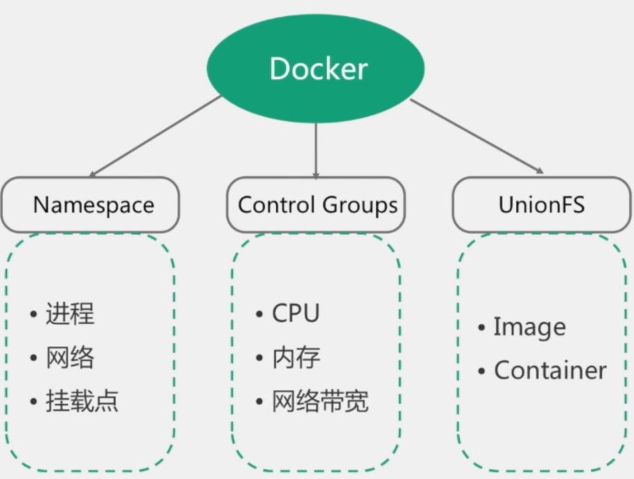

# 【0】系统架构和前沿技术

## 主要内容

- 服务架构发展
  - 单一应用
  - 分布式应用
  - 云原生
- 容器管理
  - Docker

## 一 系统架构演化

### 1.1 单一架构

### 1.2 微服务架构

### 1.3 云原生服务

## 二 容器化基础

### 2.1 Docker

### 2.2 kubernates（K8s）

是一个开源的，用于管理云平台中多个主机上的容器化的应用，Kubernetes的目标是让部署容器化的应用简单并且高效（powerful）,Kubernetes提供了应用部署，规划，更新，维护的一种机制。