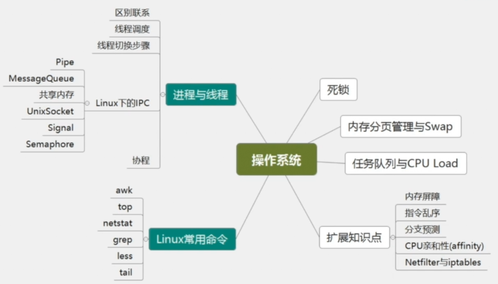
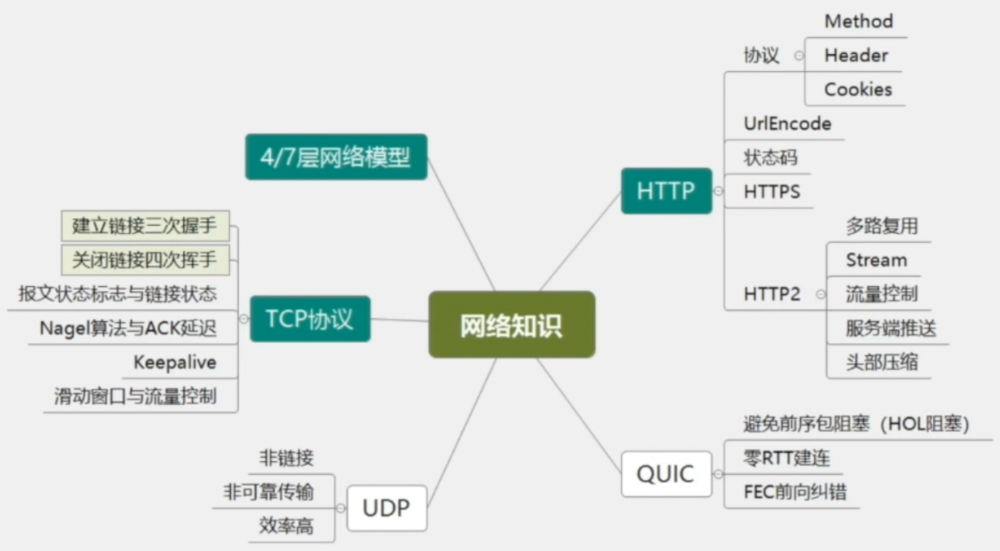
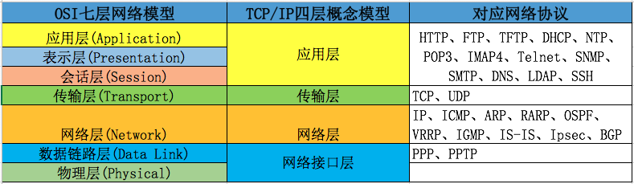
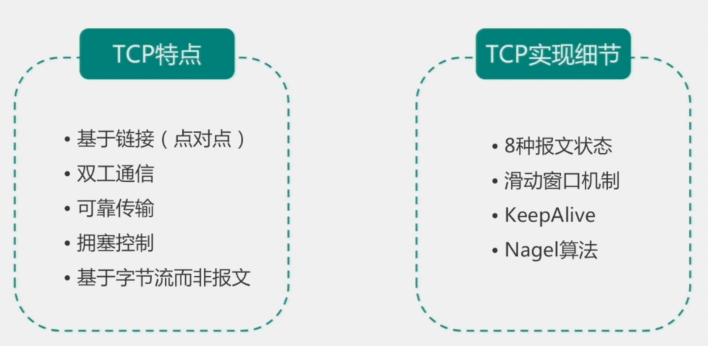
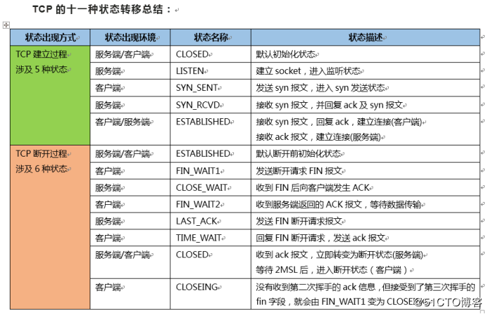
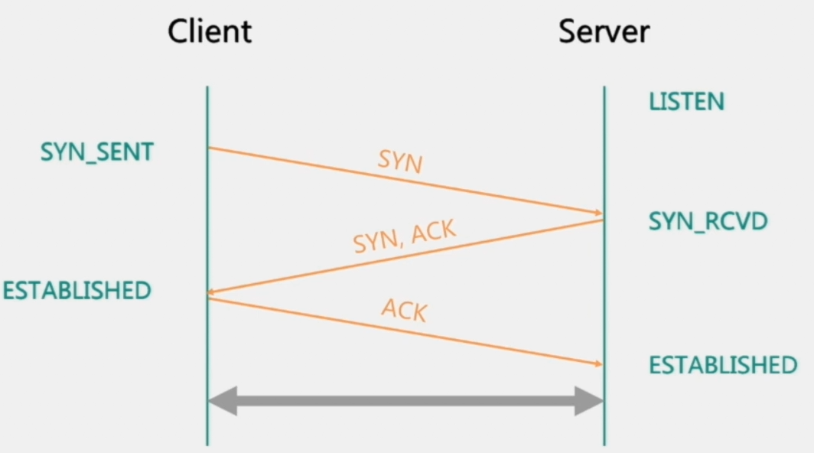
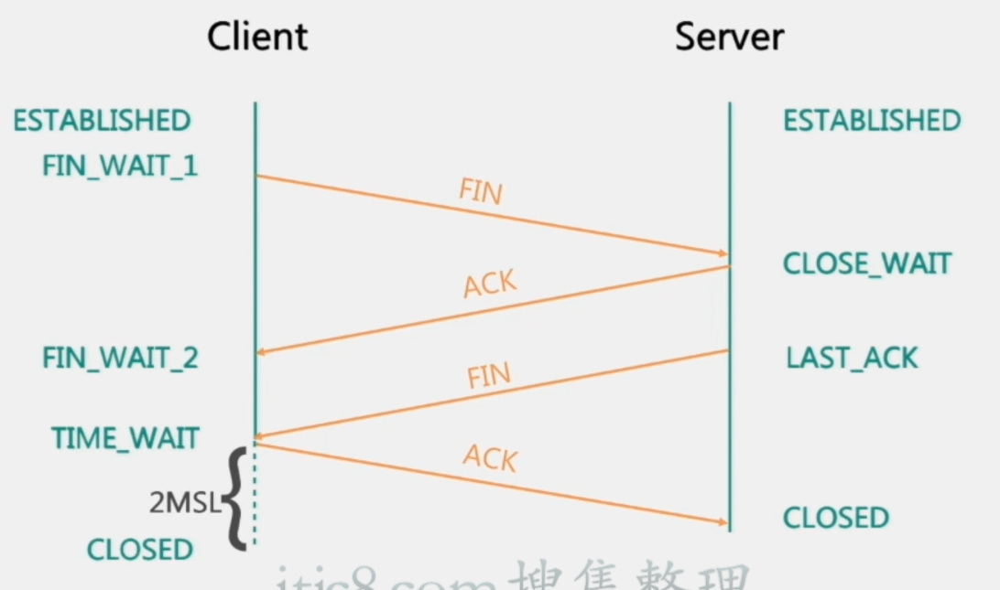

# 【1】操作系统和计算机网络

## 主要内容

- 操作系统
  - 进程和线程
  - Linux
- 网络知识
  - TCP协议
  - HTTP协议

## 一 操作系统

### 1.1 进程和线程

#### 1.1.1 区别和联系

- **进程**：是系统资源分配的最小单位，进程使用独立的内存空间
- **线程**：线程是程序执行的最小单位,线程共享进程资源

#### 1.1.2 线程调度

- 分时调度

  所有线程轮流使用 CPU 的使用权，平均分配每个线程占用 CPU 的时间。

- 抢占式调度

  优先让优先级高的线程使用 CPU，如果线程的优先级相同，那么会随机选择一个(线程随机性)，Java使用的为抢占式调度。

#### 1.1.3 线程切换步骤

**线程的上下文切换**

CPU切换前把当前任务的状态保存下来，以便下次切换回这个任务时可以再次加载这个任务的状态，然后加载下一任务的状态并执行。任务的状态保存及再加载, 这段过程就叫做上下文切换。

上下文切换会导致额外的开销，常常表现为高并发执行时速度会慢串行，因此减少上下文切换次数便可以提高多线程程序的运行效率。

**减少上下文切换手段**

- **无锁并发编程**。多线程竞争时，会引起上下文切换，所以多线程处理数据时，可以用一些办法来避免使用锁，如将数据的ID按照Hash取模分段，不同的线程处理不同段的数据
- **CAS算法**。Java的Atomic包使用CAS算法来更新数据，而不需要加锁
- **使用最少线程**。避免创建不需要的线程，比如任务很少，但是创建了很多线程来处理，这样会造成大量线程都处于等待状态
- **协程**。在单线程里实现多任务的调度，并在单线程里维持多个任务间的切换

### 1.2 Linux常用命令

[【实用版】Linux命令常用指南](/linux/linux-commands.md)

## 二 网络知识

### 2.1 4/7层网络模型

### 2.2 HTTP协议

[HTTP协议知识点](/java/web/HTTP.md)

### 2.3 TCP协议

TCP协议：是一种基于链接的全双工字节流传输协议

特点：

- 面向连接
- 全双工
- 字节流传输
- 传输可靠
- 拥塞控制

**TCP协议状态：**

#### 2.3.1 建立链接的三次握手

1. 建立链接前Server处于监听状态（Listen）等待连接请求
2. 第一次握手：Client向Server发送SYN包，并进入SYN_SENT状态
3. 第二次握手：Server接收到Client发来SYN包，并向Client回复SYN+ACK包，此时Server进入SYN_RCVD状态
4. 第三次握手：Client接收到Server发来的SYN+ACK包，回复Server发送ACK包，Server接收到ACK包，双发都进入ESTABLISHED状态
5. 建联完成，双发随时可以进行数据传输

**SYN洪水攻击发生原因：**Server接收到Client发送SYN请求时，回复SYN+ACK包，但是Client不进行回复，导致大量的链接处于SYN_RCVD状态。

#### 2.3.2 关闭链接的四次挥手

1. Client和Server刚开始都处于ESTABLISHED状态

2MSL: 2倍最大报文段生存时间

**为什么要等待2MSL的时间？**

1. 要保证TCP的全双工链接能够可靠关闭。
2. 保证这次链接中重复的数据段能够从网络中消失，防止端口被重用会产生数据混淆。

**为什么断链时需要四次挥手？**

因为断开链接时，Client和Server的关闭时间不同，无法合并数据包发送

## 三 真题汇总

1. 进程和线程的区别和联系？
2. 线程调度的方法？
3. 简单介绍一下线程的切换过程
4. 你经常使用哪些Linux命令，用来解决什么问题？
5. 为什么TCP建立连接需要3次握手而断开连接需要4次？
6. 为什么TCP关闭链接时需要TIME_WAIT状态，为什么要2MSL？
7. 一次完整的HTTP请求过程是什么样的？
8. 4/7层网络模型，ip属于什么层，TCP属于什么层协议？

