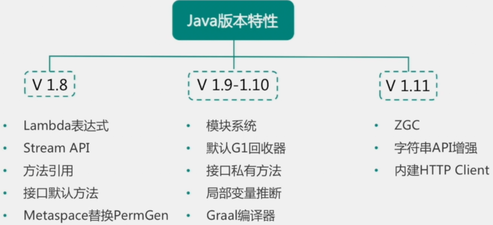

# 【2】Java设计模式和语言特性

## 主要内容：

- 常用设计模式
  - 常用设计模式的实现
  - 使用场景
- Java语言特性
  - Java中的重点集合
  - JUC

## 一 常用设计模式


参考内容：

[设计原则和设计模式](/java/advanced/design-patter.md)

## 二  Java语言特性


### 2.1 常用集合

#### 2.1.1 HashMap底层原理

HashMap底层是由数组+链表+红黑树组成。HashMap是一个散列，采用链表法的方式，为了解决hash冲突严重导致链表查询效率低。1.8中加入了红黑树，当链表个数大于8时，就会直接转换成红黑树的数据结构，以牺牲部分空间换取时间效率。

负载因子：0.75f

默认容器大小：16

超过阀值（0.75*16）就会进行扩容

**HashMap：put操作流程图**


这张图是讲HashSet的其实，HashSet的底层使用HashMap实现的，但是HashSet对hashMap进行了封装。使用了一个Object对象的常量，替换了Value值，做存储

**参考源码理解：**

```java
public V put(K key, V value) {
    // 1. 使用hash函数(hash(key))获取hash之
    return putVal(hash(key), key, value, false, true);
}

final V putVal(int hash, K key, V value, boolean onlyIfAbsent,
               boolean evict) {
    Node<K,V>[] tab; Node<K,V> p; int n, i;
    // 判断table是否为空，空则进行桶扩容
    if ((tab = table) == null || (n = tab.length) == 0)
        n = (tab = resize()).length;
    // 判断数组下标n-1位置是否为空，空则直接插入
    if ((p = tab[i = (n - 1) & hash]) == null)
        tab[i] = newNode(hash, key, value, null);
    else {
        // 非空赋值,非空也说明存在hash冲突，此下代码用来解决hash冲突
        Node<K,V> e; K k;
        if (p.hash == hash &&
            ((k = p.key) == key || (key != null && key.equals(k))))
            e = p;
        // 判断p数据类型，是否为树节点，是直接插入红黑树
        else if (p instanceof TreeNode)
            e = ((TreeNode<K,V>)p).putTreeVal(this, tab, hash, key, value);
        // 非空，非树，遍历插入
        else {
            for (int binCount = 0; ; ++binCount) {
                if ((e = p.next) == null) {
                    p.next = newNode(hash, key, value, null);
                    // 进一步判断链表元素>=7,既链表元素大于8转为红黑树插入
                    if (binCount >= TREEIFY_THRESHOLD - 1) // -1 for 1st
                        treeifyBin(tab, hash);
                    break;
                }
                if (e.hash == hash &&
                    ((k = e.key) == key || (key != null && key.equals(k))))
                    break;
                p = e;
            }
        }
        // 如果存在key value映射则替换旧值
        if (e != null) { // existing mapping for key
            V oldValue = e.value;
            if (!onlyIfAbsent || oldValue == null)
                e.value = value;
            afterNodeAccess(e);
            return oldValue;
        }
    }
    ++modCount;
    if (++size > threshold)
        resize();
    afterNodeInsertion(evict);
    return null;
}
```

#### 2.1.2 `ConcurrentHashMap`

`ConcurrentHashMap`的使用我们需要了解的是集合在多线程环境下线程不安全产生的问题：`ConcurrentModificationException`：

查看源码：发现在其关键代码部分都添加了synchronized关键字和volatile关键字：从而保证在多线程环境下的统一性，可见性和有序性。

CAS的原理：

**此部分内容参考：**

[多线程编程高级（偏面试）](/java/advcanced/advanced-thread.md)

#### 2.1.3 ArrayList和LinkedList

ArrayList：底层是数组实现的，支持动态扩容（默认10个元素空间 1.5倍），增删不变，查询方便

LinkedList：底层是双向链表实现的，查询不便，增删方便

**此处参考数据结构数组和链表部分内容：**

[数据结构内容知识点](/java/advcanced/data-structure.md)

### 2.2 动态代理和反射

#### 2.2.1 反射机制

Java中提供了Class、Method、Construction、Filed类实现了动态创建对象和调用方法的一种技术手段

#### 2.2.2 动态代理

我们知道Spring中AOP就是使用动态代理的技术实现的，其实现的方式有两种一种是JDK proxy和Cglib这也是Java中代理模式实现的两种方式。

### 2.3 Java版本差异



[【08】Java8版本特性](/Java/base/java8.md)

