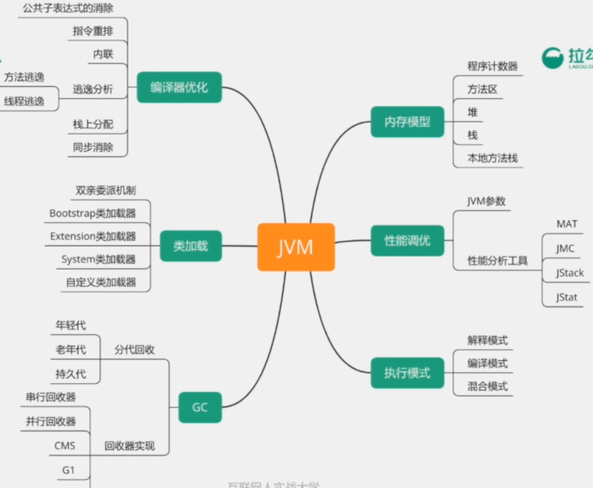

# 【3】深入理解JVM

## 主要内容

- 内存模型
- 类加载
- GC
- 编译器优化
- 性能调优
- 执行模式

## 考察点

1. 深入理解JVM内存模型
2. 了解类加载机制
3. 了解内存可见性
4. 了解GC常用的算法和适用场景？
5. 根据业务场景选择合适的JVM参数和GC算法

## 一 简介

[【01】深入理解JVM](/java/advanced/JVM.md)

[【02】垃圾回收器GC](/java/advanced/GC.md)

[【03】JVM性能调优](/java/advanced/jvm-optimeze.md)

[【04】JVM(偏面试)](/java/advanced/JVM02.md)

[【补充知识】类文件结构](/java/advanced/class-structure.md)

## 二 真题汇总

1. 简述JVM内存模型？
2. 什么情况下触发FullGC?
3. Java类加载器有几种，关系？
4. 双亲委派机制的加载流程是怎样的，好处？
5. 1.8为什么用Metaspace替代PermGen？Metaspace保存在哪里？
6. 编译期会对指令做哪些优化？（简述编译器指令重排）
7. 简述一下volatile可以解决什么问题？如何做到的？
8. 简述一下GC的分代回收？
9. G1和CMS算法的区别？
10. 对象的引用有几种，有什么特点？
11. 使用过的JVM调试工具有哪些，主要分析哪些内容？