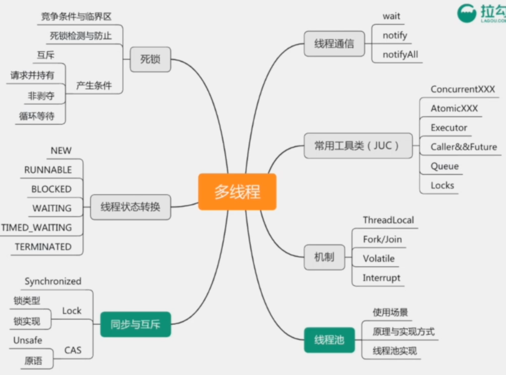

# 【4】并发和多线程

## 主要内容

- 同步和互斥
- 线程池
- JUC

## 考察点

1. 理解线程同步和互斥原理
2. 掌握线程安全的相关机制
3. 了解JUC的使用场景和实现原理
4. 熟悉线程池原理、使用场景、常用配置
5. 理解线程的同步和异步，阻塞和非阻塞

## 一 简介

多线程知识点：学习文档

[【01】多线程编程基础](/java/base/java-concurrent.md)

[【02】多线程编程高级（偏面试）](/java/advanced/JVM02.md)

## 真题汇总 

1. 如何实现一个生产者和消费者模型？（锁，线程通信，阻塞队列，信号量等）
2. 如何理解线程的同步与异步、阻塞与非阻塞？
3. 线程池处理任务的流程是怎样的？
4. wait和sleep有什么不同？
5. Synchronized和Lock有什么不同，各适用什么场景？
6. 读写锁适合什么场景？ReentrantReadWriteLock是如何实现的？
7. 线程之间如何通信？
8. 保证线程安全的方法有哪些？
9. 如何尽可能的提高多线程并发性能？
10. ThreadLocal用来解决什么问题？ThreadLocal如何实现的？
11. 死锁产生的条件？如何分析有线程死锁？
12. 在实际工作中遇到过什么样的并发问题? 如何发现、排查、解决的？