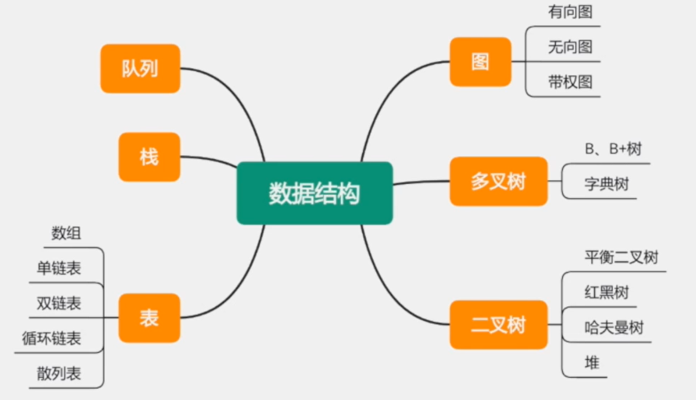
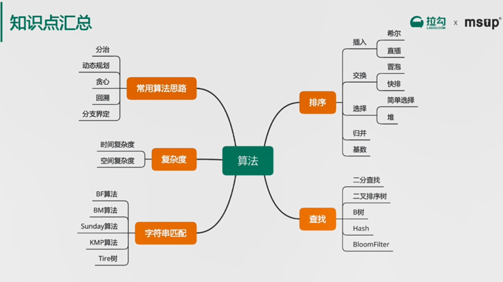
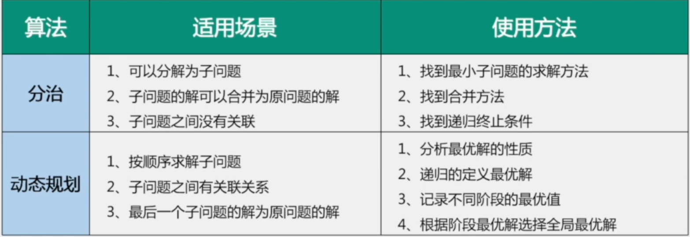
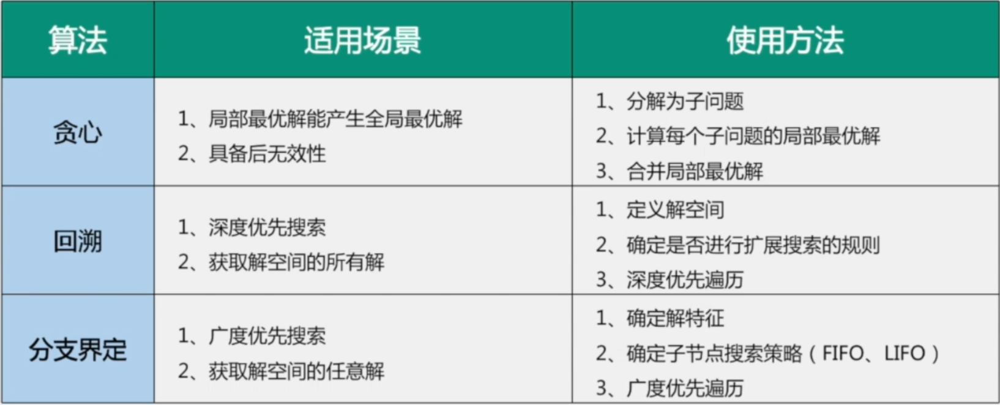

# 【5】数据结构和算法

## 主要内容

- 数据结构
- 算法

## 考察点

1. 了解基本数据结构和特点
2. 表、栈、队列、树需要熟练掌握，深刻理解使用场景
3. 了解常用的搜索、排序算法，及其复杂度和稳定性
4. 了解常用的字符串处理算法
5. 能够分析算法的实现的复杂度
6. 了解常用的算法分类，解决问题的思路和解决哪类问题

## 一 数据结构

## 二 算法

## 三 真题汇总

1. 各种排序算法实现和复杂度、稳定性？
2. 二叉树的前、中、后序遍历
3. 翻转句子中单词的顺序
4. 用栈模拟队列（或者用队列模拟栈）
5. 对10亿个数进行排序，限制内存为1G
6. 去掉（或找出）两个数组中重复的数字
7. 将一颗二叉树转换成其镜像
8. 确定一个字符串中括号是否匹配
9. 给定一个开始词，一个结束词，一个字典，如何找到从开始词到结束词的最短接龙路径
10. 如何查找两个二叉树节点最近的公共祖先？