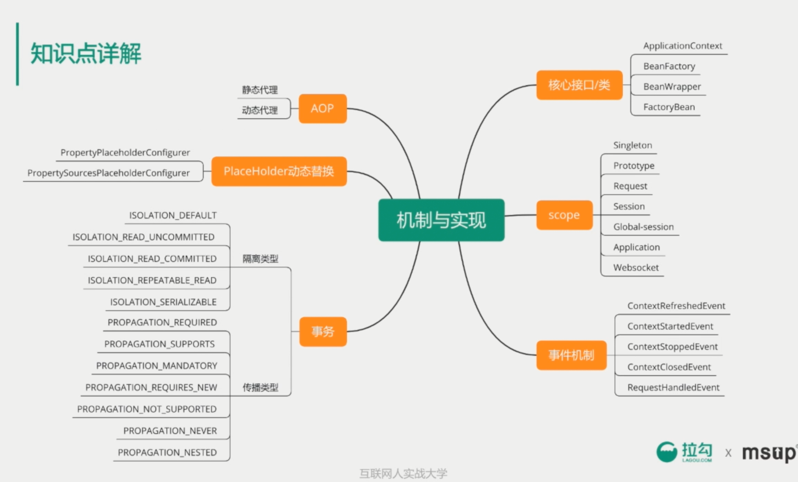
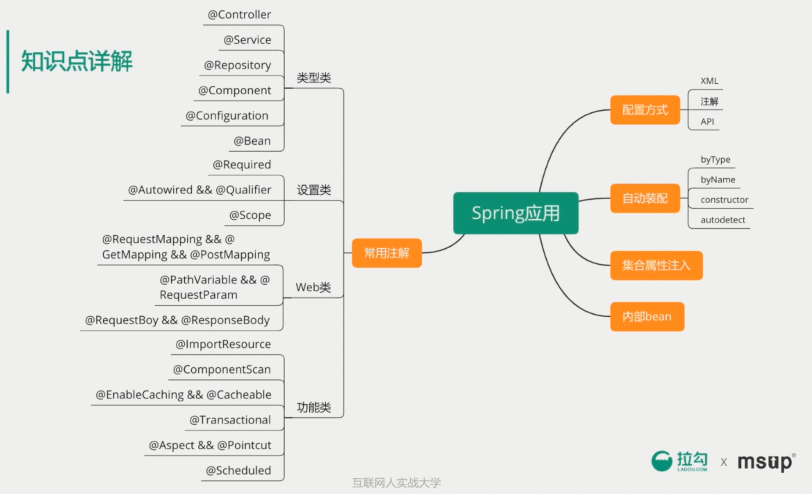
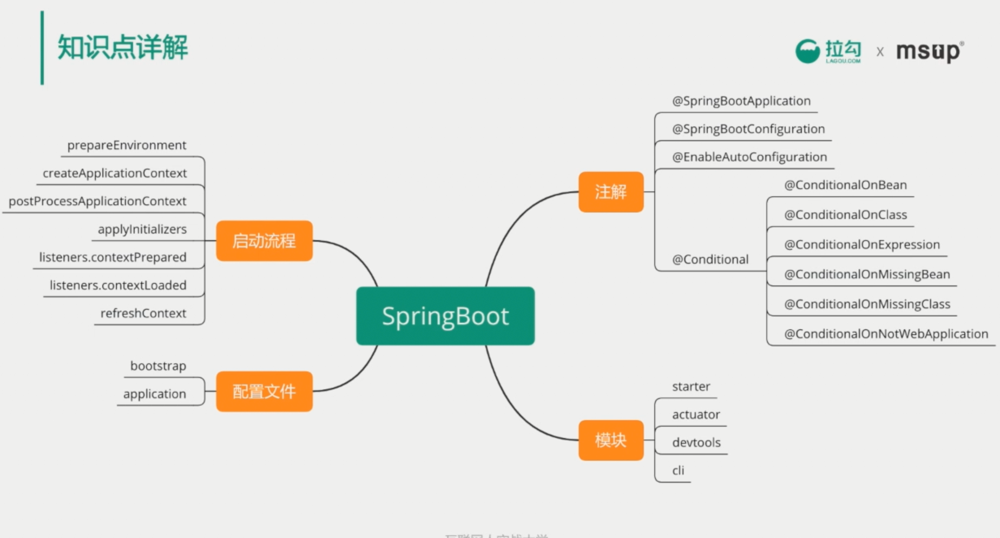

# 【7-1】必会框架-Spring全家

## 主要内容

- Spring
- SpringBoot
- SpringCloud

## 一 Spring

**Spring学习笔记：**

[【01】Spring5基本内容和配置使用](/Java/integrationframe/spring5.md)

[【02】SpringMVC学习笔记](/Java/integrationframe/springmvc.md)

[【03】Spring联系项目（权限管理系统）](/Java/integrationframe/ssm-system.md)

## 二 SpringBoot

**基于SpringBoot 2.0 +：**

[【01】SpringBoot基础](/Java/integrationframe/springboot.md)

## 三 SpringCloud