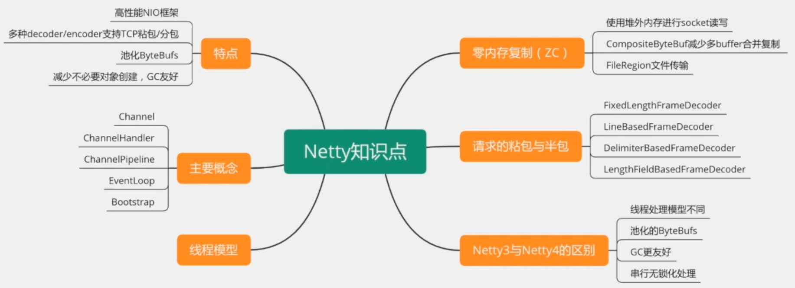
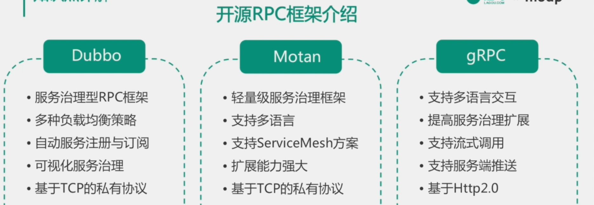
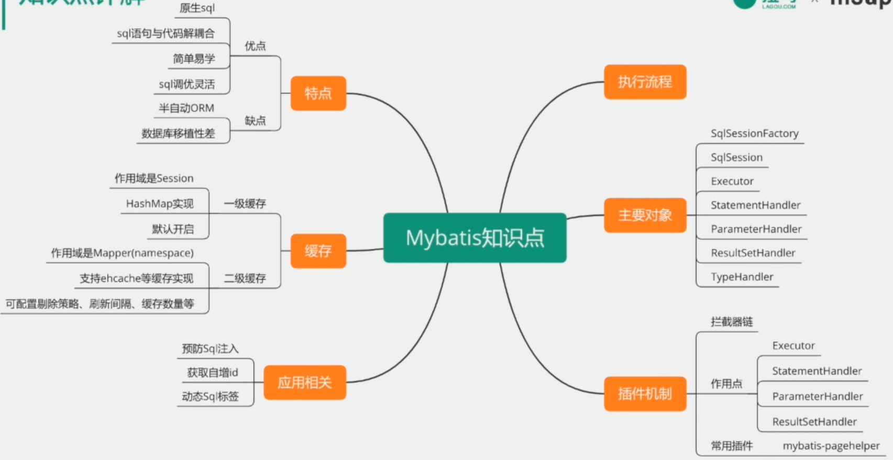

# 【7-2】必会框架-其它框架

## 主要内容

- Netty
- RPC
- ORM

## 一 Netty

## 二 开源的RPC框架

## 三 Mybatis

## 四  真题汇总

1. Spring Context初始化的整个流程
2. 简述一下Bean的生命周期和作用域？
3. Spring配置中的Placeholder占位符如何替换？有什么办法可以实现自定义的配置替换？
4. SpringMVC的工作流程？
5. Spring如何解决循环依赖？
6. Bean的构造方法、@PostConstruct注解、InitializingBean、init-method的执行顺序是怎样的？
7. 说说Netty中有哪些重要对象，它们之间的关系是什么？
8. RPC与HTTP的区别是什么？什么场景适合选用RPC，什么场景适用HTTP？
9. RPC交互流程？
10. 简介一下Mybatis缓存机制？
11. Mybatis如何动态配置SQL？有哪些动态SQL标签?