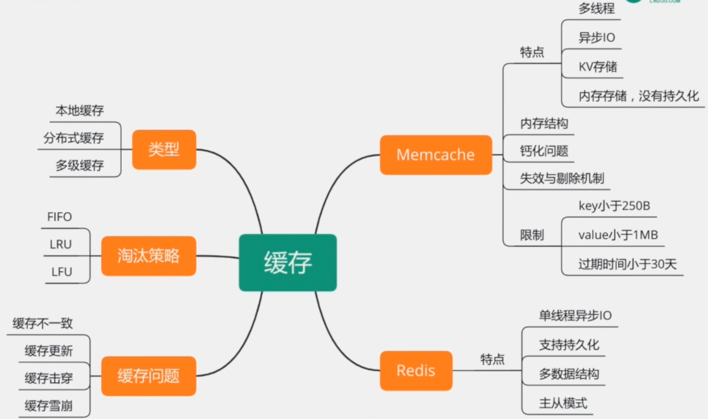
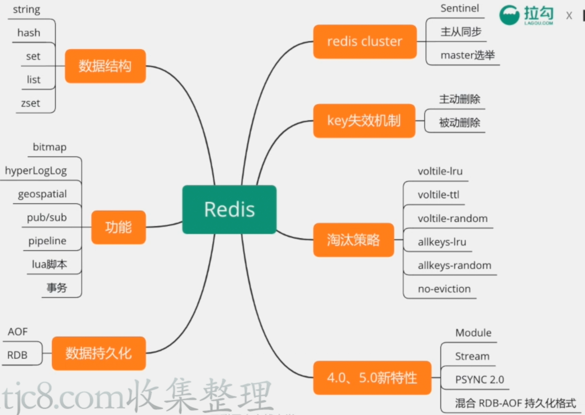

# 【8】高并发架构基石 - 缓存

## 主要内容

- Memcache
- Redis
- 缓存常见问题

## 考察点

1. 了解缓存的使用场景，不同缓存的使用方式
2. 掌握Redis和MC的常用命令
3. 了解MC和Redis在内存中的存储结构
4. 了解MC和Redis的数据失效方式剔除策略
5. 了解Redis的持久化、主从同步与cluster部署原理

## 一 缓存

## 二 Redis

## 三 真题汇总

1. Redis和Memcache有什么区别? 该如何选用？
2. 你用过那些Redis的数据结构？用在什么场景下？
3. Redis持久化方式有哪些？区别?
4. Redis过期机制是怎样的？Redis有哪些淘汰策略？
5. 如何保证Redis的高并发和高可用？
6. 如何使用Redis实现延时队列？ 如何使用Redis实现分布式锁？