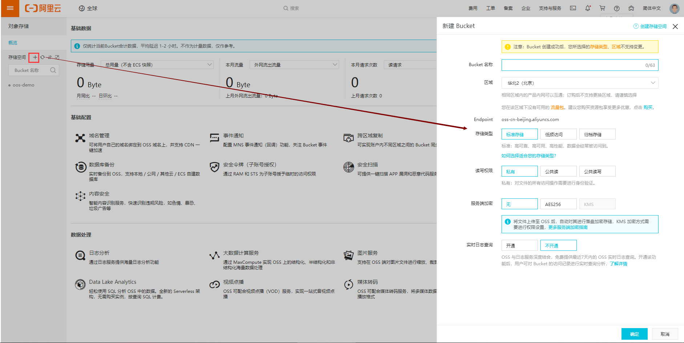
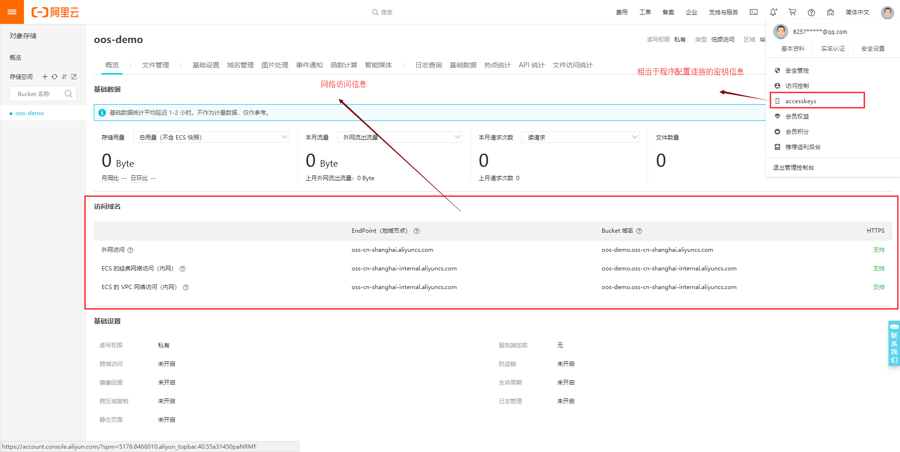

# OOS对象存储	 #

## 主要内容

- 图片存储解决方案的分析
- 阿里云OSS存储方案的实现
- 本地存储方案的实现

## 一 图片存储解决方案

1. 直接将图片保存到服务的硬盘
   1. 优点：开发便捷，成本低
   2. 缺点：扩容困难
2. 使用分布式文件系统进行存储
   1. 优点：容易实现扩容
   2. 缺点：开发复杂度稍大（尤其是开发复杂的功能）
3. 使用nfs(网络文件系统)做存储
   1. 优点：开发较为便捷
   2. 缺点：需要有一定的运维知识进行部署和维护
4. 使用第三方的存储服务
   1. 优点：开发简单，拥有强大功能，免维护
   2. 缺点：付费

## 二 OOS服务

阿里OOS地址：https://www.aliyun.com/product/oss?spm=a2c4g.11186623.cloudEssentials.19.60f81c62VrnDMR

1. 购买服务

2. 购买成功够进入控制台：https://oss.console.aliyun.com/overview?accounttraceid=c6d6f516-6e83-4b1a-82a5-a6a9dced8ca9

3. 新建Bucket

   

4. 查看网络域名和AccessKey信息

   

5. 阿里OOS的其他功能，可参照控制台查看：如图片水印，样式等

## 三 结合SpringBoot项目实现

### 3.1 导入依赖

```xml
<dependency>
    <groupId>com.aliyun.oss</groupId>
    <artifactId>aliyun-sdk-oss</artifactId>
    <version>2.8.3</version>
</dependency>
<dependency>
    <groupId>joda-time</groupId>
    <artifactId>joda-time</artifactId>
    <version>2.9.9</version>
</dependency>
```

### 3.2 编写aliyun.properties配置文件

**配置信息在OSS控制台获取，内容参考上图**

```properties
aliyun.endpoint=oss-cn-qingdao.aliyuncs.com
aliyun.accessKeyId=LTAIfC7fUsPj7Rfq
aliyun.accessKeySecret=c2Vo3q1AmivtY8lxFnfsCfkO2c2HCk
aliyun.bucketName=oss-demo
aliyun.urlPrefix=http://itcast-haoke.oss-cn-qingdao.aliyuncs.com/
```

### 3.3 配置类AliyunConfig

```java
@Configuration
@PropertySource("classpath:aliyun.properties")//获取配置文件
@ConfigurationProperties(prefix = "aliyun")//配置文件与实体属性映射注解
@Data
public class AliyunConfig {

    private String endpoint;
    private String accessKeyId;
    private String accessKeySecret;
    private String bucketName;
    private String urlPrefix;

    @Bean
    public OSSClient oSSClient() {
        return new OSSClient(endpoint, accessKeyId, accessKeySecret);
    }

}
```

### 3.4 编写实体类

该类用于返回给前端的数据结构定义。

```java
@Data
public class PicUploadResult {
    /**
    * 文件唯一标识
    */
    private String uid;
    /**
    * 文件名
    */
    private String name;
    /**
    * 状态有：uploading done error removed
    */
    private String status;
    /**
    * 服务端响应内容，如：'{"status": "success"}'
    */
    private String response;
}

```

### 3.5 编写业务逻辑PicUploadService

```java
@Service
public class PicUploadService {
    /**
     * 允许上传的格式
     */
    private static final String[] IMAGE_TYPE = new String[]{".bmp", ".jpg",
            ".jpeg", ".gif", ".png"};

    @Autowired
    private OSSClient ossClient;
    @Autowired
    private AliyunConfig aliyunConfig;

    public PicUploadResult upload(MultipartFile uploadFile) {

        PicUploadResult fileUploadResult = new PicUploadResult();

        //图片做校验，对后缀名
        boolean isLegal = false;

        for (String type : IMAGE_TYPE) {
            if (StringUtils.endsWithIgnoreCase(uploadFile.getOriginalFilename(),
                    type)) {
                isLegal = true;
                break;
            }
        }
        if (!isLegal) {
            fileUploadResult.setStatus("error");
            return fileUploadResult;
        }
        // 文件新路径
        String fileName = uploadFile.getOriginalFilename();
        String filePath = getFilePath(fileName);

        // 上传到阿里云
        try {
            // OSS API调用方法
            ossClient.putObject(aliyunConfig.getBucketName(), filePath, new
                    ByteArrayInputStream(uploadFile.getBytes()));
        } catch (Exception e) {
            e.printStackTrace();
            //上传失败
            fileUploadResult.setStatus("error");
            return fileUploadResult;
        }
        // 上传成功
        fileUploadResult.setStatus("done");
        fileUploadResult.setName(this.aliyunConfig.getUrlPrefix() + filePath);
        fileUploadResult.setUid(String.valueOf(System.currentTimeMillis()));

        return fileUploadResult;
    }

    private String getFilePath(String sourceFileName) {
        DateTime dateTime = new DateTime();
        return "images/" + dateTime.toString("yyyy")
                + "/" + dateTime.toString("MM") + "/"
                + dateTime.toString("dd") + "/" + System.currentTimeMillis() +
                RandomUtils.nextInt(100, 9999) + "." +
                StringUtils.substringAfterLast(sourceFileName, ".");
    }

}
```

### 3.6 编写PicUploadController

```java
@RequestMapping("picture/upload")
@Controller
public class PicUploadController {	

    @Autowired
    private PicUploadService picUploadService;

    @PostMapping
    @ResponseBody
    public PicUploadResult upload(@RequestParam("file") MultipartFile multipartFile) {
        return this.picUploadService.upload(multipartFile);
    }
}
```

## 3.7 测试文件上传

借助：Postman

或者浏览器插件进行测试