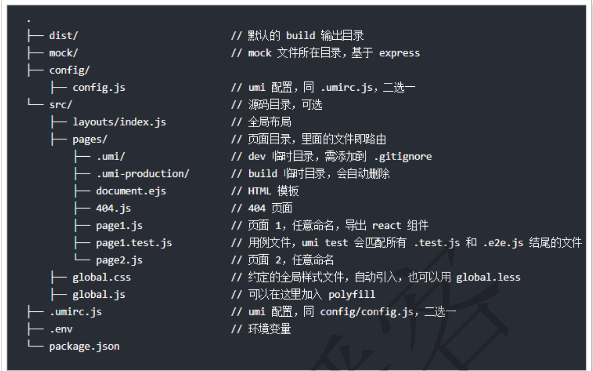

# ReactJS #

## 主要内容

- 前端发展的四个阶段
- 什么是ReactJS
- 布局
- Ant Design Pro

## 一 前端发展演变和ReactJS

### 1.1 前端发展

- 阶段一：静态页面阶段
- 阶段二：ajax阶段
- 阶段三：前端MVC阶段
- 阶段四：SPA阶段
  - 前端可以做到读写数据、切换视图、用户交互，这意味着，网页其实是一个应用程序，而不是信息的纯展示。这种单张网页的应用程序称为 SPA（single-page-application）。
  - 目前，最流行的前端框架 Vue、Angular、React 等等，都属于 SPA 开发框架。

### 1.2  ReactJS简介

官网： https://reactjs.org/	

ReactJS把复杂的页面，拆分成一个个的组件，将这些组件一个个的拼装起来，就会呈现多样的页面。ReactJS可以用于 MVC 架构，也可以用于 MVVM 架构，或者别的架构。

ReactJS圈内的一些框架简介：

- Flux
  - Flux 是Facebook用户建立客户端Web应用的前端架构， 它通过利用一个单向的数据流补充了React的组合视图组件，这更是一种模式而非框架。
- Redux
  - Redux  是 JavaScript 状态容器，提供可预测化的状态管理。Redux可以让React组件状态共享变得简单。
- Ant Design of React
  - 阿里开源的基于 React的企业级后台产品，其中集成了多种框架，包含了上面提到的Flux、Redux。
  - Ant Design 提供了丰富的组件，包括：按钮、表单、表格、布局、分页、树组件、日历等。

### 1.3 UmiJS  读音：（乌米）

阿里的开源企业级react框架：UmiJS。

- 插件化
  - umi  的整个生命周期都是插件化的，甚至其内部实现就是由大量插件组成，比如 pwa、按需加载、一键切
    换 preact、一键兼容 ie9 等等，都是由插件实现。
- 开箱即用
  - 你只需一个 umi 依赖就可启动开发，无需安装 react、preact、webpack、react-router、babel、jest 等
    等。
- 约定式路由
  - 类 next.js 的约定式路由，无需再维护一份冗余的路由配置，支持权限、动态路由、嵌套路由等等。

前端在安装NodeJS的前提下：

```sh
#接下来，开始安装yarn，其中tyarn使用的是npm.taobao.org的源，速度要快一些
npm i yarn tyarn -g  #-g 是指全局安装
tyarn -v #进行测试，如果能够正常输出版本信息则说明安装成功了

#下面开始安装umi
tyarn global add umi
umi #进行测试
umi #安装目录在NodeJS下，需要配置环境变量
```

基本使用：

```shell
# 通过初始化命令将生成package.json文件，它是 NodeJS 约定的用来存放项目的信息和配置等信息的文件。
tyarn init -y

#通过umi命令创建index.js文件
umi g page index  #可以看到在pages下创建好了index.js和index.css文件

#通过命令行启动umi的后台服务,用于本地开发
umi dev
#通过浏览器进行访问：http://localhost:8000/，查看效果
```

## 二 搭建入门项目

使用 UmiJS作为项目构建工具。

1. webstorm创建项目

2. 初始化：

   ```
   tyarn init -y 
   ```

3. 添加umi依赖

   ```sh
   tyarn add umi  --dev  #项目中添加umi的依赖 
   ```

4. 编写HelloWorld(先了解目录结构)

   

   1. 创建config.js

      ```javascript
      // 导出一个对象，暂时设置为空对象，后面再填充内容
      export default {};
      ```

   2. 创建HelloWorld.js页面文件

      ```javascript
      export default () => {
       return <div>hello world</div>;
      }
      ```

5. 启动服务

   ```sh
   # 启动服务
   umi dev
   ```

6. 添加umi-plugin-react插件

   1. umi-plugin-react插件是umi官方基于react封装的插件，包含了13个常用的进阶功能。
   2. 具体可查看： https://umijs.org/zh/plugin/umi-plugin-react.html

   ```sh
   # 添加插件
   tyarn add umi-plugin-react --dev
   ```

   3. 在 config.js文件中引入该插件

   ```javascript
   export default {
     plugins: [
      ['umi-plugin-react', {
         //暂时不启用任何功能
      }]
    ]
   };
   ```

7. 构建和部署

   1. 现在我们写的js，必须通过umi先转码后才能正常的执行 

   ```
   umi build #构建项目 进行转码生成普通的html、js、css文件 
   ```

## 三 React知识入门

### 3.1 JSX语法

JSX语法就是，可以在js文件中插入html片段，是React自创的一种语法。

JSX语法会被Babel等转码工具进行转码，得到正常的js代码再执行。

使用JSX语法，需要2点注意：

1. 所有的html标签必须是闭合的
2. 在JSX语法中，只能有一个根标签，不能有多个。

```javascript
const div1 = <div>hello world</div> //正确
const div2 = <div>hello</div> <div>world</div> //错误
```

> 在JSX语法中，如果想要在html标签中插入js脚本，需要通过{}插入js脚本。

### 3.2  组件

组件是React中最重要也是最核心的概念，一个网页，可以被拆分成一个个的组件

#### 3.2.1 自定义一个组件

```javascript
import React from 'react'; //第一步，导入React
class HelloWorld extends React.Component { //第二步，编写类并且继承 React.Component
    render(){ //第三步，重写render()方法，用于渲染页面
        return <div>hello world!</div> //JSX语法
    }
}
export default HelloWorld; //第四步，导出该类
```

#### 3.2.2 导入自定义组件

创建Show.js文件，用于测试导入组件：

```javascript
import React from 'react'
import HelloWorld from './HelloWorld' //导入HelloWorld组件
class Show extends React.Component{
    render(){
        return <HelloWorld/>; //使用HelloWorld组件
    }
}
export default Show;
```

#### 3.2.3 组件参数

组件是可以传递参数的，有 2种方式传递，分别是属性和标签包裹的内容传递，具体使用如下：

```javascript
import React from 'react'
import HelloWorld from './HelloWorld' //导入HelloWorld组件
class Show extends React.Component{
  render(){
    return <HelloWorld name="zhangsan">shanghai</HelloWorld>; //使用HelloWorld组件
 }
}
export default Show;
```

其中，**name="zhangsan"就是属性传递，shanghai就是标签包裹的内容传递**。

那么，在HelloWord.js组件中如何接收参数呢？

对应的也是2种方法：

属性：this.props.name 接收；

标签内容：this.props.children 接收；

使用如下：

```javascript
import React from 'react'; //第一步，导入React
class HelloWorld extends React.Component { //第二步，编写类并且继承 React.Component
  render(){ //第三步，编写render()方法，用于渲染页面
    return <div>hello world! name={this.props.name}, address=
{this.props.children}</div> //JSX语法
 }
}
export default HelloWorld; //第四步，导出该类
```

#### 3.2.4 组件的状态

每一个组件都有一个状态，其保存在this.state中，当状态值发生变化时，React框架会自动调用render()方法，重新渲染页面。
其中，要注意两点：

- this.state值的设置要在构造参数中完成；
- 要修改this.state的值，需要调用this.setState()完成，不能直接对this.state进行修改；

#### 3.2.4 生命周期

组件的运行过程中，存在不同的阶段。React 为这些阶段提供了钩子方法，允许开发者自定义每个阶段自动执行的函数。这些方法统称为生命周期方法（lifecycle methods）

## 四 Model

**分层**：

前端代码的结构，同样需要进行必要的分层：

- Page  负责与用户直接打交道：渲染页面、接受用户的操作输入，侧重于展示型交互
  性逻辑。
- Model  负责处理业务逻辑，为 Page 做数据、状态的读写、变换、暂存等。
- Service  负责与 HTTP 接口对接，进行纯粹的数据读写。

### 4.1 使用DVA进行数据分层管理

首先，我们先将dva框架引入进来，由于umi对dva进行了整合，所以导入就变得非常简单了。

1. 在config.js文件中进行配置：

```java
export default {
    plugins: [
        ['umi‐plugin‐react', {
            dva: true // 开启dva功能
        }]
    ]
};
```

接下来，创建model文件，在umi中，约定在src/models文件夹中定义model，所以，在

2. 该文件夹下创建ListData.js文件编辑：

```java
export default {
    namespace: 'list',
    state: {
        data: [1, 2, 3],
        maxNum: 3
    }
}
```

3. 在list.js中引入使用

```java
import React from 'react';
import { connect } from 'dva';
const namespace = 'list';
```

流程说明：
1. umi框架启动，会自动读取models目录下model文件，即ListData.js中的数据
2. @connect修饰符的第一个参数，接收一个方法，该方法必须返回{}，将接收到
    model数据
3. 在全局的数据中，会有很多，所以需要通过namespace进行区分，所以通过
    state[namespace]进行获取数据
4. 拿到model数据中的data，也就是[1, 2, 3]数据，进行包裹{}后返回
5. 返回的数据，将被封装到this.props中，所以通过this.props.listData即可获取到
    model中的数据

### 4.2 在model中请求数据

前面我的数据是写死在model中的，实际开发中，更多的是需要异步加载数据，那么在
model中如何异步加载数据呢？

### 4.3 mock数据

umi中支持对请求的模拟，由于我们现在没有真正的服务可以返回数据，所以才需要模
拟。
在项目根目录下创建mock目录，然后创建MockListData.js文件

> 此处需要案例了解，暂不想浪费太多时间

## 五 Ant Design

Ant Design是阿里蚂蚁金服团队基于React开发的ui组件，主要用于中后台系统的使用。
官网：https://ant.design/index-cn

antd布局：https://ant.design/components/layout-cn/

##### 5.1 组件概述

- Layout ：布局容器，其下可嵌套  Header Sider Content Footer 或  Layout 本身，可以放在任何父容器中。
- Header ：顶部布局，自带默认样式，其下可嵌套任何元素，只能放在  Layout 中。
- Sider ：侧边栏，自带默认样式及基本功能，其下可嵌套任何元素，只能放在Layout 中。
- Content ：内容部分，自带默认样式，其下可嵌套任何元素，只能放在  Layout中。
- Footer ：底部布局，自带默认样式，其下可嵌套任何元素，只能放在  Layout 中。

### 5.2 Ant Design Pro

Ant Design Pro 是基于Ant Design的一个开箱即用的，企业级中后台前端/设计解决方案。

源码地址： https://github.com/ant-design/ant-design-pro