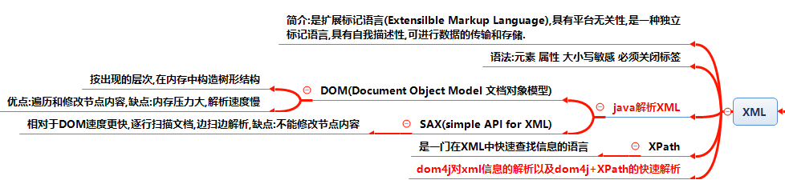
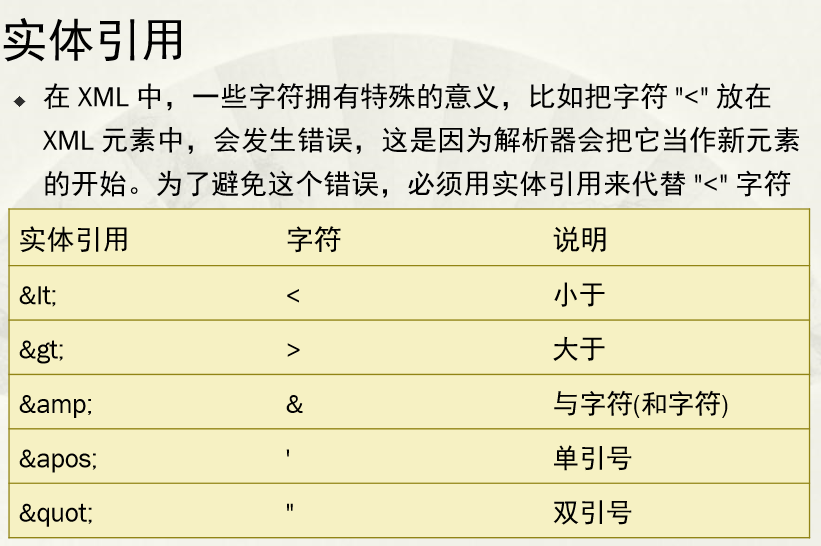
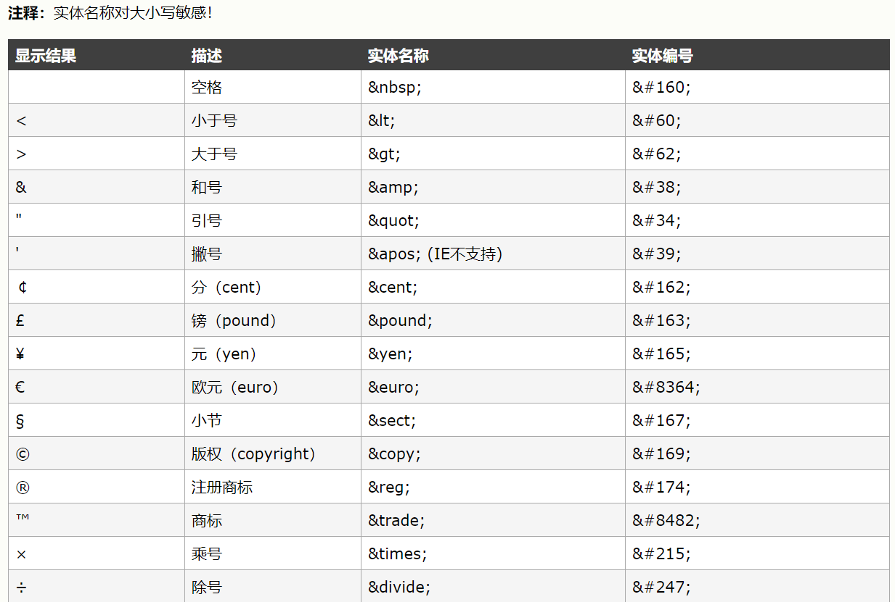
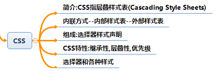

# XML-HTML-CSS #

## 主要内容

- XML
- HTML
- HTML5
- CSS

## 学习目标

- [x] 了解掌握基本使用
- [x] HTML5新特性

## 一 XML ##

**XML中的注意事项:**

## 二 HTML ##

HTML 超文本标记语言，使用标签来描述页面
tags 具有属性 也可以使用自定义的方式定义属性

    标题 <h1>~<h6>
    水平线 

    注释 <!-- 注释内容 -->
    段落 

    换行  
    超链接 

### 2.1 文本格式化标签 ###

    <b> 定义粗体文本
    <em> 定义着重字
    <i> 定义斜体字
    <small> 定义小号字
     定义下标字
      定义上标字
    <ins> 定义插入字
    <del> 定义删除字
### 2.2 计算机输出标签 ###

    <code> 定义计算机代码
    <kbd> 定义键盘码
    <samp> 定义计算机代码样式
    <var> 定义变量
    <pre> 定义预格式文本

### 2.3 引用和术语定义 ###

    <abbr>	定义缩写
    <acronym>	定义首字母缩写
    <address>	定义地址
    <bdo>	定义文字方向
    <blockquote>	定义长的引用
    <q>	定义短的引用语
    <cite>	定义引用、引证
    <dfn>	定义一个定义项目
    
    图像 
    背景图片 <body background="">
    背景颜色 <body bgcolor="">
        
        <body bgcolor="#000000"> 十六进制数
        <body bgcolor="rgb(0,0,0)"> RGB值
        <body bgcolor="black"> 颜色名
    
    表格 <table><tr><td></td></tr></table>
    有序列表 <ul type="disc"><li></li></ul>
    无序列表 <ol type="A"><li></li></ol>
    块元素 
 

### 2.4 HTML5语义元素 ###

    header	定义文档或节的页眉
    nav	定义导航链接的容器
    section	定义文档中的节
    article	定义独立的自包含文章
    aside	定义内容之外的内容（比如侧栏）
    footer	定义文档或节的页脚
    details	定义额外的细节
    summary	定义 details 元素的标题

 ### 2.5 head元素是所有头部元素的容器 ###

    可以添加的标签有<title>、<base>、<link>、<meta>、<script> 以及 <style>
    <title> 定义浏览器工具栏中的标题
            提供页面被添加到收藏夹时显示的标题
            显示在搜索引擎结果中的页面标题
    <base> 标签为页面上的所有链接规定默认地址或默认目标（target）
    <link> 标签定义文档与外部资源之间的关系
    <meta> 标签提供关于 HTML 文档的元数据。元数据不会显示在页面上，但是对于机器是可读的。
    典型的情况是，meta 元素被用于规定页面的描述、关键词、文档的作者、最后修改时间以及其他元数据。
    <meta> 标签始终位于 head 元素中

### 2.6 HTML实体 ###

URL统一资源定位器
URL 编码会将字符转换为可通过因特网传输的格式 ASCII字符集

**查询HTML不同颜色对应的名字**[http://www.w3school.com.cn/html/html_colornames.asp](http://www.w3school.com.cn/html/html_colornames.asp "查询------颜色名")

## 三 HTML5 ##

HTML5 的一些最有趣的新特性：   

    用于绘画的 canvas 元素
    用于媒介回放的 video 和 audio 元素
    对本地离线存储的更好的支持
    新的特殊内容元素，比如 article、footer、header、nav、section
    新的表单控件，比如 calendar、date、time、email、url、search

### 3.1 video视频 ###

格式:

    <video src="movie.ogg" controls="controls">
    </video>
支持的播放格式:

Ogg = 带有 Theora 视频编码和 Vorbis 音频编码的 Ogg 文件

MPEG4 = 带有 H.264 视频编码和 AAC 音频编码的 MPEG 4 文件

WebM = 带有 VP8 视频编码和 Vorbis 音频编码的 WebM 文件

属性

    autoplay	autoplay	如果出现该属性，则视频在就绪后马上播放
    controls	controls	如果出现该属性，则向用户显示控件，比如播放按钮。
    height	pixels	设置视频播放器的高度。
    loop	loop	如果出现该属性，则当媒介文件完成播放后再次开始播放。
    preload	preload	
    如果出现该属性，则视频在页面加载时进行加载，并预备播放。
    
    如果使用 "autoplay"，则忽略该属性。
    
    src	url	要播放的视频的 URL。
    width	pixels	设置视频播放器的宽度。

### 3.2 audio音频类似视频 ###

    <audio src="song.ogg" controls="controls">
    Your browser does not support the audio tag.
    </audio>

### 3.3 拖放 ###

常见的属性

### 3.4 画布 ###

画布是一个矩形区域，您可以控制其每一像素。

canvas 拥有多种绘制路径、矩形、圆形、字符以及添加图像的方法。

页面定义canvas元素

    <canvas id="myCanvas" width="200" height="100"></canvas>

使用JS进行绘制

### 3.5 SVG ###

SVG 指可伸缩矢量图形 (Scalable Vector Graphics)
SVG 用于定义用于网络的基于矢量的图形
SVG 使用 XML 格式定义图形
SVG 图像在放大或改变尺寸的情况下其图形质量不会有损失
SVG 是万维网联盟的标准

**SVG与Canvas对比**

[http://www.w3school.com.cn/html5/html_5_canvas_vs_svg.asp](http://www.w3school.com.cn/html5/html_5_canvas_vs_svg.asp)

### 3.6 地理定位 ###

[http://www.w3school.com.cn/html5/html_5_geolocation.asp](http://www.w3school.com.cn/html5/html_5_geolocation.asp "HTML5获取地理位置的脚本")

### 3.7 web存储 ###

localStorage
sessionStorage

### 3.8 应用缓存 ###
HTML5 引入了应用程序缓存，这意味着 web 应用可进行缓存，并可在没有因特网连接时进行访问。

应用程序缓存为应用带来三个优势：

    离线浏览 - 用户可在应用离线时使用它们
    速度 - 已缓存资源加载得更快
    减少服务器负载 - 浏览器将只从服务器下载更新过或更改过的资源。

使用:    

    <!DOCTYPE HTML>
    <html manifest="demo.appcache">
    ...
    </html>

Manifest 文件

    manifest 文件是简单的文本文件，它告知浏览器被缓存的内容（以及不缓存的内容）。
    manifest 文件可分为三个部分：
    
    CACHE MANIFEST - 在此标题下列出的文件将在首次下载后进行缓存
    NETWORK - 在此标题下列出的文件需要与服务器的连接，且不会被缓存
    FALLBACK - 在此标题下列出的文件规定当页面无法访问时的回退页面（比如 404 页面）

### 3.9 Web Worker对象 ###

web worker 是运行在后台的 JavaScript，独立于其他脚本，不会影响页面的性能。您可以继续做任何愿意做的事情：点击、选取内容等等，而此时 web worker 在后台运行。

### 3.10 服务器发送事件 ###

Server-Sent 事件 - 单向消息传递

### 3.11 HTML全局属性 ###

|属性|描述|
|-----|----|
|accesskey|设置访问元素的键盘快捷键|
|class|规定元素的类名（classname）|
|contenteditable|	规定是否可编辑元素的内容|
|contextmenu|指定一个元素的上下文菜单。当用户右击该元素，出现上下文菜单|
|data-*	|用于存储页面的自定义数据|
|dir|设置元素中内容的文本方向|
|draggable|指定某个元素是否可以拖动|
|dropzone|指定是否将数据复制，移动，或链接，或删除|
|hidden|hidden 属性规定对元素进行隐藏|
|id	|规定元素的唯一 id|
|lang|设置元素中内容的语言代码|
|spellcheck|检测元素是否拼写错误|
|style|规定元素的行内样式（inline style）|
|tabindex|设置元素的 Tab 键控制次序|
|title|规定元素的额外信息（可在工具提示中显示）|
|translate|	指定是否一个元素的值在页面载入时是否需要翻译|

## 四 CSS ##

### 4.1 CSS 层叠样式表 ###

CSS 层叠样式表
CSS使用的三种方式

内联样式表（在标签内定义style属性，优先级最高） 

内部样式表（在网页head中定义style标签 其次） 

外部样式表（在外部使用css文件，在head中使用<link>进行引用）

    <link rel="stylesheet" type="text/css" href="mystyle.css">

语法格式:简单示例
    p{
    color:red;
    text-align:center;
    }

注释:/**/

### 4.2 css选择器 ###

id选择器 #

class选择器 .

分组选择器 示例

    h1,h2,p
    {
        color:green;
    }

后代选择器(以空格分隔)

子元素选择器(以大于号分隔）

相邻兄弟选择器（以加号分隔）

普通兄弟选择器（以破折号分隔）

### 4.3 CSS背景 ###

    background	简写属性，作用是将背景属性设置在一个声明中。
    background-attachment	背景图像是否固定或者随着页面的其余部分滚动。
    background-color	设置元素的背景颜色。
    background-image	把图像设置为背景。
    background-position	设置背景图像的起始位置。
    background-repeat	设置背景图像是否及如何重复。

### 4.4 css文本 ###

    color	设置文本颜色
    direction	设置文本方向。
    letter-spacing	设置字符间距
    line-height	设置行高
    text-align	对齐元素中的文本
    text-decoration	向文本添加修饰
    text-indent	缩进元素中文本的首行
    text-shadow	设置文本阴影
    text-transform	控制元素中的字母
    unicode-bidi	设置或返回文本是否被重写 
    vertical-align	设置元素的垂直对齐
    white-space	设置元素中空白的处理方式
    word-spacing	设置字间距

### 4.5 css字体 ###

    font	在一个声明中设置所有的字体属性
    font-family	指定文本的字体系列
    font-size	指定文本的字体大小
    font-style	指定文本的字体样式
    font-variant	以小型大写字体或者正常字体显示文本。
    font-weight	指定字体的粗细。

### 4.6 css链接 ###

    a:link {color:#000000;}      /* 未访问链接*/
    a:visited {color:#00FF00;}  /* 已访问链接 */
    a:hover {color:#FF00FF;}  /* 鼠标移动到链接上 */
    a:active {color:#0000FF;}  /* 鼠标点击时 */

### 4.7 css列表 ###

    list-style	简写属性。用于把所有用于列表的属性设置于一个声明中
    list-style-image	将图象设置为列表项标志。
    list-style-position	设置列表中列表项标志的位置。
    list-style-type	设置列表项标志的类型。

### 4.8 css表格 ###

    table{
        border-collapse:collapse;
    }
    table,th, td{
        border: 1px solid black;
    }

### 4.9 盒模型 ###

    Margin(外边距) - 清除边框外的区域，外边距是透明的。
    Border(边框) - 围绕在内边距和内容外的边框。
    Padding(内边距) - 清除内容周围的区域，内边距是透明的。
    Content(内容) - 盒子的内容，显示文本和图像。

### 4.10 css边框 ###

    border	简写属性，用于把针对四个边的属性设置在一个声明。
    border-style	用于设置元素所有边框的样式，或者单独地为各边设置边框样式。
    border-width	简写属性，用于为元素的所有边框设置宽度，或者单独地为各边边框设置宽度。
    border-color	简写属性，设置元素的所有边框中可见部分的颜色，或为 4 个边分别设置颜色。
    border-bottom	简写属性，用于把下边框的所有属性设置到一个声明中。
    border-bottom-color	设置元素的下边框的颜色。
    border-bottom-style	设置元素的下边框的样式。
    border-bottom-width	设置元素的下边框的宽度。
    border-left	简写属性，用于把左边框的所有属性设置到一个声明中。
    border-left-color	设置元素的左边框的颜色。
    border-left-style	设置元素的左边框的样式。
    border-left-width	设置元素的左边框的宽度。
    border-right	简写属性，用于把右边框的所有属性设置到一个声明中。
    border-right-color	设置元素的右边框的颜色。
    border-right-style	设置元素的右边框的样式。
    border-right-width	设置元素的右边框的宽度。
    border-top	简写属性，用于把上边框的所有属性设置到一个声明中。
    border-top-color	设置元素的上边框的颜色。
    border-top-style	设置元素的上边框的样式。
    border-top-width	设置元素的上边框的宽度。

### 4.11 css 轮廓（outline） ###

    轮廓（outline）是绘制于元素周围的一条线，位于边框边缘的外围，可起到突出元素的作用。
    CSS outline 属性规定元素轮廓的样式、颜色和宽度。

outline	在一个声明中设置所有的轮廓属性	

    outline-color
    outline-style
    outline-width
    inherit
outline-color	设置轮廓的颜色
	
    color-name
    hex-number
    rgb-number
    invert
outline-style	设置轮廓的样式
	
    none
    dotted
    dashed
    solid
    double
    groove
    ridge
    inset
    outset
    inherit
outline-width	设置轮廓的宽度
	
    thin
    medium
    thick
    length
    inherit

### 4.12 css margin外边距 ###

    margin	简写属性。在一个声明中设置所有外边距属性。
    margin-bottom	设置元素的下外边距。
    margin-left	设置元素的左外边距。
    margin-right	设置元素的右外边距。
    margin-top	设置元素的上外边距。

### 4.13 css padding内边距 ###

    padding	使用简写属性设置在一个声明中的所有填充属性
    padding-bottom	设置元素的底部填充
    padding-left	设置元素的左部填充
    padding-right	设置元素的右部填充
    padding-top	设置元素的顶部填充
### 4.14 css 尺寸(Dimension) ###

    height	设置元素的高度。
    line-height	设置行高。
    max-height	设置元素的最大高度。
    max-width	设置元素的最大宽度。
    min-height	设置元素的最小高度。
    min-width	设置元素的最小宽度。
    width	设置元素的宽度。

### 4.15 css Display显示 ###

隐藏元素 - display:none或visibility:hidden

隐藏一个元素可以通过把display属性设置为"none"，或把visibility属性设置为"hidden"。但是请注意，这两种方法会产生不同的结果。

visibility:hidden可以隐藏某个元素，但隐藏的元素仍需占用与未隐藏之前一样的空间。也就是说，该元素虽然被隐藏了，但仍然会影响布局。

    h1.hidden {visibility:hidden;}
display:none可以隐藏某个元素，且隐藏的元素不会占用任何空间。也就是说，该元素不但被隐藏了，而且该元素原本占用的空间也会从页面布局中消失。

    h1.hidden {display:none;}
    
    li {display:inline;} 内联元素
    span {display:block;} 块元素

### 4.16 css Position定位 ###

position 属性的五个值：

static

    HTML元素的默认值，即没有定位，元素出现在正常的流中,
    静态定位的元素不会受到 top, bottom, left, right影响。
relative

    相对定位元素的定位是相对其正常位置。
fixed

    元素的位置相对于浏览器窗口是固定位置。
    即使窗口是滚动的它也不会移动：
absolute

    绝对定位的元素的位置相对于最近的已定位父元素，如果元素没有已定位的父元素，那么它的位置相对于<html>:
sticky

    sticky 英文字面意思是粘，粘贴，所以可以把它称之为粘性定位。
    position: sticky; 基于用户的滚动位置来定位。

### 4.17 css Overflow内容溢出 ###

overflow属性有以下值：

    visible	默认值。内容不会被修剪，会呈现在元素框之外。
    hidden	内容会被修剪，并且其余内容是不可见的。
    scroll	内容会被修剪，但是浏览器会显示滚动条以便查看其余的内容。
    auto	如果内容被修剪，则浏览器会显示滚动条以便查看其余的内容。
    inherit	规定应该从父元素继承 overflow 属性的值。

### 4.18 css float浮动 ###

clear	指定不允许元素周围有浮动元素。
    left
    right
    both
    none
    inherit	
float	指定一个盒子（元素）是否可以浮动。
	
    left
    right
    none
    inherit

### 4.19 css3新内容 ###

[http://www.runoob.com/css3/css3-mediaqueries-ex.html](http://www.runoob.com/css3/css3-mediaqueries-ex.html)

### 4.20 css中的单位 ###

px 像素
em 1em 相当于当前字体的尺寸
   2em 相当于当前字体尺寸的两倍

rem 相对长度单位 相对于跟元素font-size计算值的倍数
