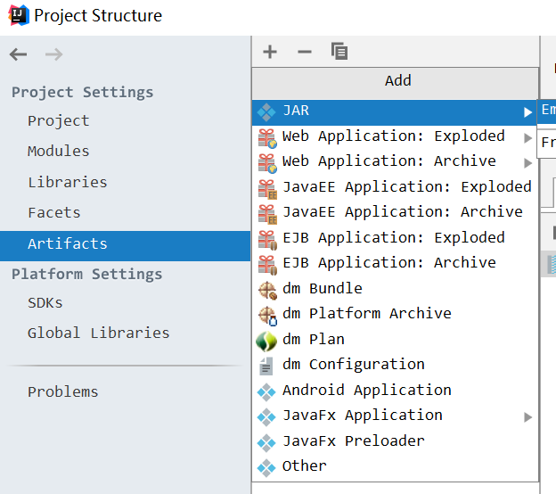
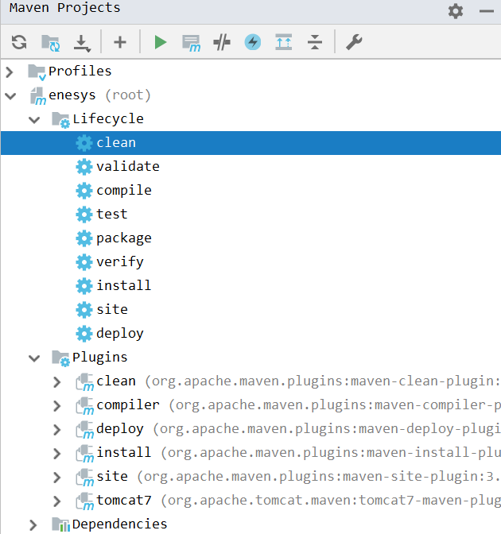
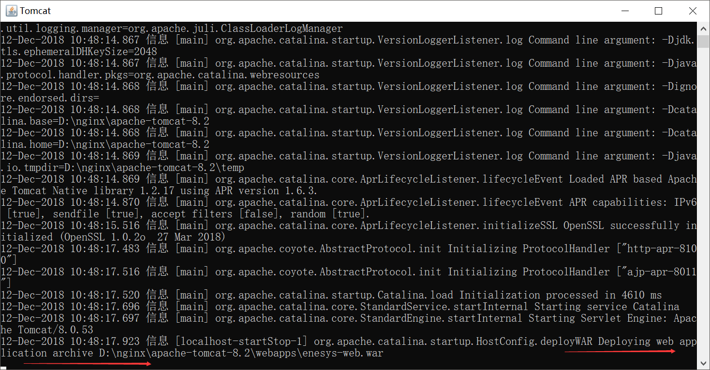
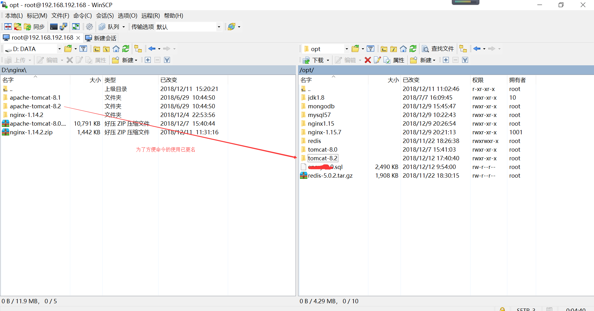
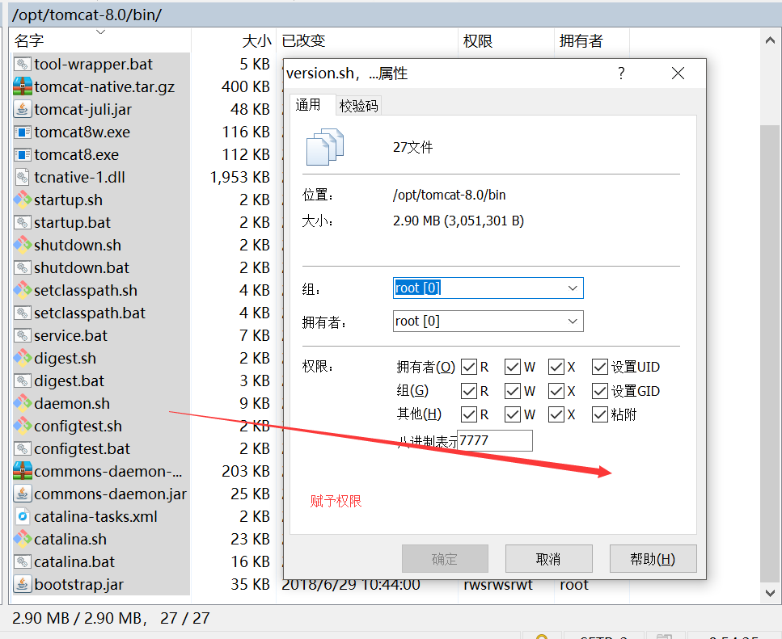

# Linux部署项目 #
date: 2018/12/12 10:17:40

## 一 项目打包 ##

1 IDEA打包方式

    了解IDEA项目结构: 快捷键Ctrl+Shifr+Alt+s

此处可以选择要打的包形式

在Tomcat中配置,Tomcat运行前进行的打包工作

一般在Tomcat运行之前进行打包,会执行编译后进行打包命令,web项目默认存放在web项目所在target下面

2 maven打包方式

    了解maven常用命令

Alt+v 在Tool windows中找到Maven Projects,或者配置自定义快捷键找到

Maven编译命令   mvn clean
打包命令    mvn package
将项目打包存放在本地Maven仓    mvn install

## 二 在windows中的Tomcat中测试打包项目是否可用 ##

1 打包前请确认数据库连接是否正确,将打包好war包,扔到webapps下

2 在tomcat/bin目录下点击startup.bat启动项目或者cmd命令到tomcat/bin目录下,建议使用管理员权限

如果tomcat开始部署项目

3 项目启动成功使用 

    http//:ip:端口号/war名称/ 
    
    进行访问,能正常访问则部署成功

项目启动失败/思考可能原因/查看tomcat启动日志

## 三 Linux中使用Tomcat部署项目 ##

1 将刚刚windows中tomcat关闭,使用winSCP直接拖入刚刚的Tomcat,由于系统环境改变,请确认Linux系统中是否已经配置好java环境,已经数据库连接是否正确以及其他相关接口的配置是否可以使用.

2 cd/opt/tomcat-8.0/bin 进入tomcat/bin目录 并给bin目录下文件赋权

3 远程访问项目,在项目启动前可以先设置远程访问

    首先需要开启防火墙的端口号规则（安全组），将tomcat访问端口号开通（暂时开通，如果服务器重启，则需要再次开启），开启命令如下：
    
    /sbin/iptables -I INPUT -p tcp --dport 8080 -j ACCEPT
    
    或使用如下命令
    
    firewall-cmd --add-port=8080/tcp --zone=public --permanent 
    firewall-cmd  --reload

4 ./startup.sh 启动tomcat 

    或者使用如下命令启动 ./catalina.sh run  (startup.sh不会显示日志信息)
    显示日志但是会影响SSH的使用,不过SSH那么灵活再开一个窗口不就得了

5 ./shutdown.sh 关闭tomcat

6 若tomcat进程没有正常关闭

    ps -ef|grep tomcat
    
    使用杀死进程的方式，停止tomcat，命令：kill -9 tomcat进程号

7 部署项目

    第一次部署，则需要打jar包或者war包放到tomcat下webapps下，或者直接将本地tomcat下的文件复制到linux下就可以
    后续部署文件，则需要文件单独部署

8 关于Linux防火墙以及命令参考:  [https://blog.csdn.net/s_p_j/article/details/80979450](https://blog.csdn.net/s_p_j/article/details/80979450)

## 关于maven配置的坑 ##

    <mirrors>
    	<mirror>
    		<id>nexus-aliyun</id>
    		<mirrorOf>central</mirrorOf>
    		<name>Nexus aliyun</name>
    		<url>http://maven.aliyun.com/nexus/content/groups/public</url>
    	</mirror> 
    </mirrors>

    <mirrorOf>central</mirrorOf>中的值可以是*,central,maven
    
    *的意思就是（根据mirrorOf和repository的id）匹配所有的库（repository），这样就是说如果你需要某个jar，他会从镜像地址去下载这个jar。不管你配置了多少个库，即使这些库的地址不一样，仍然会从镜像地址访问
    
    center,表示当前镜像为远程中央仓库的镜像
    
    弄掉重试,换掉本地仓,发现jar包没有下载,才找到原来坑在这儿!