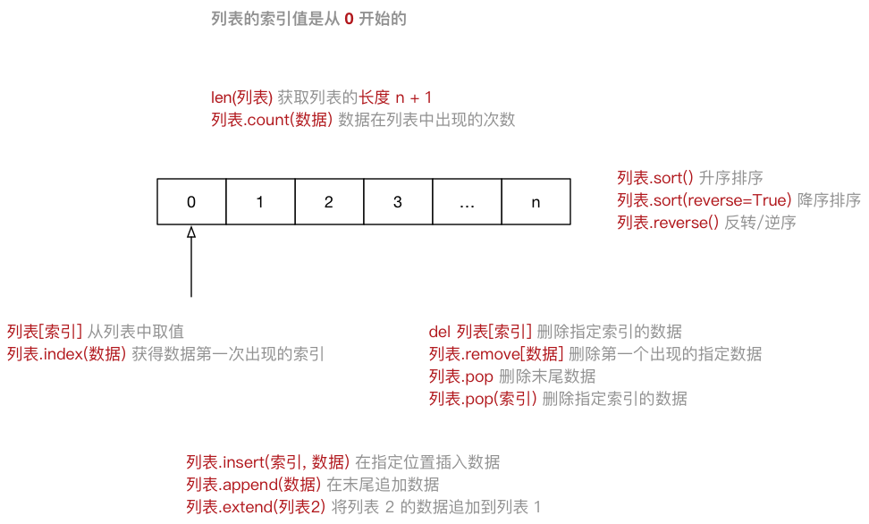

# Python基础

> 人生苦短，我用 Python —— Life is short, you need Python

## 目标

* python解释器
* Python 的特点
* Python 的优缺点
* 第一个Python程序

## 一 Python 的起源

> Python 的创始人为吉多·范罗苏姆（Guido van Rossum）

### 1.1 解释器（科普）

**计算机不能直接理解任何除机器语言以外的语言**，所以必须要把程序员所写的程序语言翻译成机器语言，计算机才能执行程序。**将其他语言翻译成机器语言的工具，被称为编译器**

编译器翻译的方式有两种：一个是**编译**，另外一个是**解释**。两种方式之间的区别在于**翻译时间点的不同**。当编译器**以解释方式运行的时候**，也称之为**解释器**

* **编译型语言**：程序在执行之前需要一个专门的编译过程，把程序编译成为机器语言的文件，运行时不需要重新翻译，直接使用编译的结果就行了。程序执行效率高，依赖编译器，跨平台性差些。如 C、C++
* **解释型语言**：解释型语言编写的程序不进行预先编译，以文本方式存储程序代码，会将代码一句一句直接运行。在发布程序时，看起来省了道编译工序，但是在运行程序的时候，必须先解释再运行

#### 编译型语言和解释型语言对比

* **速度** —— 编译型语言比解释型语言执行速度快
* **跨平台性** —— 解释型语言比编译型语言跨平台性好

### 1.2 Python 的设计目标

1999 年，吉多·范罗苏姆向 DARPA 提交了一条名为 “Computer Programming for Everybody” 的资金申请，并在后来说明了他对 Python 的目标：

* 一门**简单直观的语言**并与主要竞争者一样强大
* **开源**，以便任何人都可以为它做贡献
* 代码**像纯英语那样容易理解**
* 适用于**短期**开发的日常任务

这些想法中的基本都已经成为现实，Python 已经成为一门流行的编程语言

### 1.3 Python 的设计哲学

1. 优雅
2. 明确
3. 简单

<!-- > 在 Python 解释器内运行 `import this` 可以获得完整的列表 -->

* Python 开发者的哲学是：**用一种方法，最好是只有一种方法来做一件事**
* 如果面临多种选择，Python 开发者一般会拒绝花俏的语法，而选择**明确没有或者很少有歧义的语法**

> 在 Python 社区，吉多被称为“仁慈的独裁者”

### 1.4 为什么选择 Python？

* 代码量少
* ……

> 同一样问题，用不同的语言解决，代码量差距还是很多的，一般情况下 `Python` 是 `Java` 的 **1/5**，所以说 **人生苦短，我用 Python**

### 1.5 Python 特点

* Python 是**完全面向对象的语言**
    * **函数**、**模块**、**数字**、**字符串**都是对象，**在 Python 中一切皆对象**
    * 完全支持继承、重载、多重继承
    * 支持重载运算符，也支持泛型设计
* Python **拥有一个强大的标准库**，Python 语言的核心只包含 **数字**、**字符串**、**列表**、**字典**、**文件** 等常见类型和函数，而由 Python 标准库提供了 **系统管理**、**网络通信**、**文本处理**、**数据库接口**、**图形系统**、**XML 处理** 等额外的功能
* Python 社区提供了**大量的第三方模块**，使用方式与标准库类似。它们的功能覆盖 **科学计算**、**人工智能**、**机器学习**、**Web 开发**、**数据库接口**、**图形系统** 多个领域

**面向对象的思维方式**

* **面向对象** 是一种 **思维方式**，也是一门 **程序设计技术**
* 要解决一个问题前，首先考虑 **由谁** 来做，怎么做事情是 **谁** 的职责，最后把事情做好就行！
    * **对象** 就是 **谁**
* 要解决复杂的问题，就可以找**多个不同的对象**，**各司其职**，共同实现，最终完成需求

### 1.6 Python 的优缺点

#### 1.6.1 优点

* 简单、易学
* 免费、开源
* **面向对象**
* 丰富的库
* 可扩展性
    * 如果需要一段关键代码运行得更快或者希望某些算法不公开，可以把这部分程序用 `C` 或 `C++` 编写，然后在 `Python` 程序中使用它们
* ……

#### 1.6.2 缺点

* 运行速度
* 国内市场较小
* 中文资料匮乏

### 1.7 `Python 2.x` 与 `3.x` 版本简介`Python 2.x` 与 `3.x` 版本简介

目前市场上有两个 Python 的版本并存着，分别是 `Python 2.x` 和 `Python 3.x`

`Python 3.0` 在设计的时候 **没有考虑向下兼容**

提示：如果开发时，无法立即使用 Python 3.0（还有极少的第三方库不支持 3.0 的语法），建议

- 先使用 `Python 3.0` 版本进行开发
- 然后使用 `Python 2.6`、`Python 2.7` 来执行，并且做一些兼容性的处理

## 二 执行 Python 程序的三种方式

### 2.1 解释器 `python` / `python3

```bash
# 使用 python 2.x 解释器
$ python xxx.py

# 使用 python 3.x 解释器
$ python3 xxx.py
```

**Python 的解释器**（了解） 如今有多个语言的实现，包括：

- `CPython` —— 官方版本的 C 语言实现
- `Jython` —— 可以运行在 Java 平台
- `IronPython` —— 可以运行在 .NET 和 Mono 平台
- `PyPy` —— Python 实现的，支持 JIT 即时编译

### 2.2 交互式运行 Python 程序

- 配置好环境变量直接在终端中运行解释器
- 在 Python 的 `Shell` 中直接输入 **Python 的代码**，会立即看到程序执行结果
- 适合于学习/验证 Python 语法或者局部代码
- IPython 是一个 python 的 **交互式 shell**，比默认的 `python shell` 好用得多

退出方式：

1.  python 解释器中，按热键 `ctrl + d` 可以退出解释器
2. 直接输入 `exit()`

### 22.3 集成开发环境

集成开发环境（`IDE`，Integrated Development Environment）—— **集成了开发软件需要的所有工具**，一般包括以下工具：

- 图形用户界面
- 代码编辑器（支持 **代码补全**／**自动缩进**）
- 编译器／解释器
- 调试器（**断点**／**单步执行**）
- ……

#### 2.3.1 集成开发工具PyCharm

需要了解内容：Linux下配置文件

`PyCharm` 的 **配置信息** 是保存在 **用户家目录下** 的 `.PyCharmxxxx.x` 目录下的，`xxxx.x` 表示当前使用的 `PyCharm` 的版本号

## 三 Python基本语法

### 3.1 注释

```python
# 这是第一个单行注释
print("hello python")

"""
这是一个多行注释

在多行注释之间，可以写很多很多的内容……
""" 
print("hello python")
```

**什么时候需要使用注释？**

1. **注释不是越多越好**，对于一目了然的代码，不需要添加注释
2. 对于 **复杂的操作**，应该在操作开始前写上若干行注释
3. 对于 **不是一目了然的代码**，应在其行尾添加注释（为了提高可读性，注释应该至少离开代码 2 个空格）
4. 绝不要描述代码，假设阅读代码的人比你更懂 Python，他只是不知道你的代码要做什么

> 在一些正规的开发团队，通常会有 **代码审核** 的惯例，就是一个团队中彼此阅读对方的代码

**参考代码规范文档：**

谷歌有对应的中文文档：http://zh-google-styleguide.readthedocs.io/en/latest/google-python-styleguide/python_style_rules/

### 3.2 Python 程序执行原

1. 操作系统会首先让 **CPU** 把 **Python 解释器** 的程序复制到 **内存** 中
2. **Python 解释器** 根据语法规则，**从上向下** 让 **CPU** 翻译 **Python 程序中的代码**
3. **CPU** 负责执行翻译完成的代码

**Python 的解释器有多大？**

- 执行以下终端命令可以查看 Python 解释器的大小

```bash
# 1. 确认解释器所在位置
$ which python

# 2. 查看 python 文件大小(只是一个软链接)
$ ls -lh /usr/bin/python

# 3. 查看具体文件大小
$ ls -lh /usr/bin/python2.7
```

> 提示：建立 **软链接** 的目的，是为了方便使用者不用记住使用的解释器是 **哪一个具体版本**

### 3.3 数据类型

#### 3.3.1 数据类型

- 数据类型可以分为 **数字型** 和 **非数字型**
- 数字型
  - 整型 (`int`)
  - 浮点型（`float`）
  - 布尔型（`bool`） 
    - 真 `True` `非 0 数` —— **非零即真**
    - 假 `False` `0`
  - 复数型 (`complex`)
    - 主要用于科学计算，例如：平面场问题、波动问题、电感电容等问题
- 非数字型
  - 字符串
  - 列表
  - 元组
  - 字典

> 提示：在 Python 2.x 中，**整数** 根据保存数值的长度还分为：
>
> - `int`（整数）
> - `long`（长整数）

- 使用 `type` 函数可以查看一个变量的类型

```python
In [1]: type(name)
```

#### 3.3.2 注意事项

- **数字型** 之间可以直接计算

- **字符串变量** 之间使用 `+` 拼接字符串

- **字符串变量** 可以和 **整数** 使用 `*` 重复拼接相同的字符串

  ```python
  # 示例
  In [1]: "-" * 50
  Out[1]: '--------------------------------------------------'
  ```

- **数字型变量** 和 **字符串** 之间 **不能进行其他计算**

  ```sh
  In [1]: first_name = "zhang"
  
  In [2]: x = 10
  
  In [3]: x + first_name
  ---------------------------------------------------------------------------
  TypeError: unsupported operand type(s) for +: 'int' and 'str'
  类型错误：`+` 不支持的操作类型：`int` 和 `str`
  ```

#### 3.3.3  获取用户输入input

- 所谓 **输入**，就是 **用代码** **获取** 用户通过 **键盘** 输入的信息
- 在 Python 中，如果要获取用户在 **键盘** 上的输入信息，需要使用到 `input` 函数
- 用户输入的 **任何内容** Python 都认为是一个 **字符串**

```python
字符串变量 = input("提示信息：")
```

| 函数     | 说明                  |
| -------- | --------------------- |
| int(x)   | 将 x 转换为一个整数   |
| float(x) | 将 x 转换到一个浮点数 |

#### 3.3.4 变量的格式化输出

- 在 Python 中可以使用 `print` 函数将信息输出到控制台
- 如果希望输出文字信息的同时，**一起输出** **数据**，就需要使用到 **格式化操作符**
- `%` 被称为 **格式化操作符**，专门用于处理字符串中的格式
  - 包含 `%` 的字符串，被称为 **格式化字符串**
  - `%` 和不同的 **字符** 连用，**不同类型的数据** 需要使用 **不同的格式化字符**

| 格式化字符 | 含义                                                         |
| ---------- | ------------------------------------------------------------ |
| %s         | 字符串                                                       |
| %d         | 有符号十进制整数，`%06d` 表示输出的整数显示位数，不足的地方使用 `0` 补全 |
| %f         | 浮点数，`%.2f` 表示小数点后只显示两位                        |
| %%         | 输出 `%`                                                     |

- 语法格式如下：

```python
print("格式化字符串" % 变量1)

print("格式化字符串" % (变量1, 变量2...))
```

**注意：变量命名规则和Java基本一致，但不包含$符号**

### 3.4 运算符

#### 3.4.1 算数运算符

- 是完成基本的算术运算使用的符号，用来处理四则运算

| 运算符 |  描述  | 实例                                       |
| :----: | :----: | ------------------------------------------ |
|   +    |   加   | 10 + 20 = 30                               |
|   -    |   减   | 10 - 20 = -10                              |
|   *    |   乘   | 10 * 20 = 200                              |
|   /    |   除   | 10 / 20 = 0.5                              |
|   //   | 取整除 | 返回除法的整数部分（商） 9 // 2 输出结果 4 |
|   %    | 取余数 | 返回除法的余数 9 % 2 = 1                   |
|   **   |   幂   | 又称次方、乘方，2 ** 3 = 8                 |

- 在 Python 中 `*` 运算符还可以用于字符串，计算结果就是字符串重复指定次数的结果

```python
In [1]: "-" * 50
Out[1]: '----------------------------------------' 
```

#### 3.4.2 比较（关系）运算符

| 运算符 | 描述                                                         |
| ------ | ------------------------------------------------------------ |
| ==     | 检查两个操作数的值是否 **相等**，如果是，则条件成立，返回 True |
| !=     | 检查两个操作数的值是否 **不相等**，如果是，则条件成立，返回 True |
| >      | 检查左操作数的值是否 **大于** 右操作数的值，如果是，则条件成立，返回 True |
| <      | 检查左操作数的值是否 **小于** 右操作数的值，如果是，则条件成立，返回 True |
| >=     | 检查左操作数的值是否 **大于或等于** 右操作数的值，如果是，则条件成立，返回 True |
| <=     | 检查左操作数的值是否 **小于或等于** 右操作数的值，如果是，则条件成立，返回 True |

> Python 2.x 中判断 **不等于** 还可以使用 `<>` 运算符
>
> `!=` 在 Python 2.x 中同样可以用来判断 **不等于**

#### 3.4.3 逻辑运算符

| 运算符 | 逻辑表达式 | 描述                                                         |
| ------ | ---------- | ------------------------------------------------------------ |
| and    | x and y    | 只有 x 和 y 的值都为 True，才会返回 True<br />否则只要 x 或者 y 有一个值为 False，就返回 False |
| or     | x or y     | 只要 x 或者 y 有一个值为 True，就返回 True<br />只有 x 和 y 的值都为 False，才会返回 False |
| not    | not x      | 如果 x 为 True，返回 False<br />如果 x 为 False，返回 True   |

## 3.4.4 赋值运算符

- 在 Python 中，使用 `=` 可以给变量赋值
- 在算术运算时，为了简化代码的编写，`Python` 还提供了一系列的 与 **算术运算符** 对应的 **赋值运算符**
- 注意：**赋值运算符中间不能使用空格**

| 运算符 | 描述                       | 实例                                  |
| ------ | -------------------------- | ------------------------------------- |
| =      | 简单的赋值运算符           | c = a + b 将 a + b 的运算结果赋值为 c |
| +=     | 加法赋值运算符             | c += a 等效于 c = c + a               |
| -=     | 减法赋值运算符             | c -= a 等效于 c = c - a               |
| *=     | 乘法赋值运算符             | c *= a 等效于 c = c * a               |
| /=     | 除法赋值运算符             | c /= a 等效于 c = c / a               |
| //=    | 取整除赋值运算符           | c //= a 等效于 c = c // a             |
| %=     | 取 **模** (余数)赋值运算符 | c %= a 等效于 c = c % a               |
| **=    | 幂赋值运算符               | c **= a 等效于 c = c ** a             |

#### 3.4.5 运算符的优先级

- 以下表格的算数优先级由高到最低顺序排列

| 运算符                   | 描述                   |
| ------------------------ | ---------------------- |
| **                       | 幂 (最高优先级)        |
| * / % //                 | 乘、除、取余数、取整除 |
| + -                      | 加法、减法             |
| <= < > >=                | 比较运算符             |
| == !=                    | 等于运算符             |
| = %= /= //= -= += *= **= | 赋值运算符             |
| not or and               | 逻辑运算符             |

### 3.5 流程控制语句

- **顺序** —— **从上向下**，顺序执行代码
- **分支** —— 根据条件判断，决定执行代码的 **分支**
- **循环** —— 让 **特定代码 重复** 执行

#### 3.5.1 判断语句语法

结合案例体会：

```python
# 从控制台输入要出的拳 —— 石头（1）／剪刀（2）／布（3）
player = int(input("请出拳 石头（1）／剪刀（2）／布（3）："))

# 电脑 随机 出拳 - 假定电脑永远出石头
computer = 1

# 比较胜负
# 如果条件判断的内容太长，可以在最外侧的条件增加一对大括号
# 再在每一个条件之间，使用回车，PyCharm 可以自动增加 8 个空格
if ((player == 1 and computer == 2) or
        (player == 2 and computer == 3) or
        (player == 3 and computer == 1)):

    print("噢耶！！！电脑弱爆了！！！")
elif player == computer:
    print("心有灵犀，再来一盘！")
else:
    print("不行，我要和你决战到天亮！")
```

#### 3.5.2 循环语句语法

结合案例体会：

```python
# 计算 0 ~ 100 之间所有数字的累计求和结果
# 0. 定义最终结果的变量
result = 0

# 1. 定义一个整数的变量记录循环的次数
i = 0

# 2. 开始循环
while i <= 100:
    print(i)

    # 每一次循环，都让 result 这个变量和 i 这个计数器相加
    result += i

    # 处理计数器
    i += 1

print("0~100之间的数字求和结果 = %d" % result)
```

**break 和 continue**：

> `break` 和 `continue` 是专门在循环中使用的关键字

- `break` **某一条件满足时**，退出循环，不再执行后续重复的代码
- `continue` **某一条件满足时**，不执行后续重复的代码

> `break` 和 `continue` 只针对 **当前所在循环** 有效

## 四 变量 函数 模块

### 4.1 变量

#### 4.1.1 变量的声明

```python
a = 1
b = "hi"
c = true
```

- 在 `Python` 中定义变量是 **不需要指定类型**（在其他很多高级语言中都需要）
- 声明一个变量，会在内存中记录以下信息
  - 变量的名称
  - 变量存储的数据内容
  - 变量的数据类型
  - 变量存储在内存中的地址

#### 4.1.2 变量的引用

在 `Python` 中

- **变量** 和 **数据** 是分开存储的
- **数据** 保存在内存中的一个位置
- **变量** 中保存着数据在内存中的地址
- **变量** 中 **记录数据的地址**，就叫做 **引用**
- 使用 `id()` 函数可以查看变量中保存数据所在的 **内存地址**

> 注意：如果变量已经被定义，当给一个变量赋值的时候，本质上是 **修改了数据的引用**
>
> - 变量 **不再** 对之前的数据引用
> - 变量 **改为** 对新赋值的数据引用

```python
# 变量引用的示例(python变量间进行传递：引用传递)
a = 1
a = 2
b = a
# 使用id()函数查看（可变和不可变类型变量）地址变化
id(a)
```

#### 4.1.2  可变和不可变类型

- **不可变类型**，内存中的数据不允许被修改：
  - 数字类型 `int`, `bool`, `float`, `complex`, `long(2.x)`
  - 字符串 `str`
  - 元组 `tuple`
- **可变类型**，内存中的数据可以被修改：
  - 列表 `list`
  - 字典 `dict`

哈希 `(hash)`：

- `Python` 中内置有一个名字叫做 `hash(o)` 的函数
  - 接收一个 **不可变类型** 的数据作为 **参数**
  - **返回** 结果是一个 **整数**
- `哈希` 是一种 **算法**，其作用就是提取数据的 **特征码（指纹）**
  - **相同的内容** 得到 **相同的结果**
  - **不同的内容** 得到 **不同的结果**
- 在 `Python` 中，设置字典的 **键值对** 时，会首先对 `key` 进行 `hash` 已决定如何在内存中保存字典的数据，以方便 **后续** 对字典的操作：**增、删、改、查**
  - 键值对的 `key` 必须是不可变类型数据
  - 键值对的 `value` 可以是任意类型的数据

#### 4.1.3 全局变量

1. **全局变量** 是在 **函数外部定义** 的变量，所有函数内部都可以使用这个变量
2. 为了保证所有的函数都能够正确使用到全局变量，应该 **将全局变量定义在其他函数的上方**
3. 在函数内部，可以 **通过全局变量的引用获取对应的数据**
4. **不允许直接修改全局变量的引用** —— 使用赋值语句修改全局变量的值
5. 为了避免局部变量和全局变量出现混淆，在定义全局变量时，有些公司会有一些开发要求，例如：全局变量名前应该增加 `g_` 或者 `gl_` 的前缀

**全局变量使用示例：**

```python
# 定义全局变量
num = 10

def demo0():
	# 定义一个局部变量，不影响全局变量，只是变量名相同
    num = 50
    # 变量调用的优先原则，此时调用的为局部变量
    print(num)  # 50

def demo1():
	# 此时调用的为全局变量
   print(num)  # 10

def demo2():

    # global 关键字，告诉 Python 解释器 num 是一个全局变量
    global num
    # 只是定义了一个局部变量，不会修改到全局变量，只是变量名相同而已
    num = 100
    print(num)

def demo3():
   #demo2先调用过，此时全局变量发生改变
   print(num)

demo0()
demo1()
demo2()
demo3()
```

#### 4.1.4 局部变量

- **局部变量** 是在 **函数内部** 定义的变量，**只能在函数内部使用**

**局部变量的生命周期：**

1. 所谓 **生命周期** 就是变量从 **被创建** 到 **被系统回收** 的过程
2. **局部变量** 在 **函数执行时** 才会被创建
3. **函数执行结束后** 局部变量 **被系统回收**
4. **局部变量在生命周期** 内，可以用来存储 **函数内部临时使用到的数据**

### 4.2 函数

相当于：Java中方法

#### 4.2.1 函数的定义

定义函数的格式如下：

```python
def 函数名():
	""" 函数体相对比较独立，函数定义的上方，应该和其他代码（包括注释）保留 两个空行"""
    
    
    函数封装的代码
    ……
```

函数组成：

1. `def` 是英文 `define` 的缩写：定义一个函数
2. 函数名：模块中名称唯一，且遵循驼峰命名
3. 函数的参数：无参数和有参数的形式（定义函数时的参数为形参）
4. 函数的返回值：使用return返回返回值（可有可无 根据实际情况） 
5. 函数体：编写具体的实现代码

#### 4.2.2 函数的调用

- 模块内部调用函数

  ```python
  # 调用格式函数名+参数列表
  函数名()
  ```

- 模块外部调用函数

  ```python
  # 引入一个模块的方式
  import 模块名
  
  # 此时对函数进行引用时，传递的参数为实参
  模块名.函数名(1,"ee")
  ```

- `python`在函数调用发生参数传递，即实参变量传递给形参变量，`python`中变量传递都是进行引用传递，则此时参数传递为引用传递

### 4.3 模块和包 

#### 4.3.1 模块的概念和导入

> **模块是 Python 程序架构的一个核心概念**

- **模块** 就好比是 **工具包**，要想使用这个工具包中的工具，就需要 **导入 import** 这个模块
- 每一个以扩展名 `py` 结尾的 `Python` 源代码文件都是一个 **模块**
- 在模块中定义的 **全局变量** 、 **函数** 都是模块能够提供给外界直接使用的工具
- **模块** 就好比是 **工具包**，要想使用这个工具包中的工具，就需要先 **导入** 这个模块

**使用示例：**

```python
# 导入模块应该独占一行
import 模块名1
import 模块名2 

# 模块别名 大驼峰命名法
import 模块名1 as 模块别名

# 从 模块 导入 某一个工具 
# 可以直接使用 模块提供的工具 —— 全局变量、函数、类
# 不需要通过 模块名.
from 模块名1 import 工具名

# 从 模块 导入 所有工具
# 这种方式不推荐使用，因为函数重名并没有任何的提示，出现问题不好排查
from 模块名1 import *
```

#### 4.3.2 注意

- 如果 **两个模块**，存在 **同名的函数**，那么 **后导入模块的函数**，会 **覆盖掉先导入的函数**
- 开发时 `import` 代码应该统一写在 **代码的顶部**，更容易及时发现冲突
- 一旦发现冲突，可以使用 `as` 关键字 **给其中一个工具起一个别名**

#### 4.3.3  包（Package）

- **包** 是一个 **包含多个模块** 的 **特殊目录**
- 目录下有一个 **特殊的文件** `__init__.py`
- 包名的 **命名方式** 和变量名一致，**小写字母** + `_`
- 使用 `import 包名` 可以一次性导入 **包** 中 **所有的模块**

#### 4.3.4 发布模块

**示例如下：**

1. 创建setup.py模块

2. 构建模块

   ```sh
   $ python3 setup.py build
   ```

3. 生成发布压缩包

   ```sh
   $ python3 setup.py sdist
   ```

4. 安装模块

   ```sh
   $ sudo python3 setup.py install
   ```

#### 4.3.5  `pip` 安装第三方模块

- **第三方模块** 通常是指由 **知名的第三方团队** **开发的** 并且被 **程序员广泛使用** 的 `Python` 包 / 模块
  - 例如 `pygame` 就是一套非常成熟的 **游戏开发模块**

- `pip` 是一个现代的，通用的 `Python` 包管理工具
- 提供了对 `Python` 包的查找、下载、安装、卸载等功能

```sh
# 将模块安装到 Python 2.x 环境
$ sudo pip install pygame
$ sudo pip uninstall pygame

# 将模块安装到 Python 3.x 环境
$ sudo pip3 install pygame
$ sudo pip3 uninstall pygame
```

**在 `Linux` 下安装 `iPython`:**

```python
$ sudo apt install ipython
$ sudo apt install ipython3
```

## 五 高级数据类型

### 5.1 列表

- `List`（列表） 是 `Python` 中使用 **最频繁** 的数据类型
- 专门用于存储 **一串 信息**，**数据** 之间使用 `,` 分隔
- 列表用 `[]` 定义
- 列表的 **索引** 从 `0` 开始
  - **索引** 就是数据在 **列表** 中的位置编号，**索引** 又可以被称为 **下标**

> 注意：从列表中取值时，如果 **超出索引范围**，程序会报错

#### 5.1.1 定义一个列表

```python
# 定义一个非空列表
name_list = ["zhangsan", "lisi", "wangwu"]
# 定义一个空列表
name_list = []
```

- 尽管 `Python` 的 **列表** 中可以 **存储不同类型的数据**
- 但是在开发中，更多的应用场景是
  1. **列表** 存储相同类型的数据
  2. 通过 **迭代遍历**，在循环体内部，针对列表中的每一项元素，执行相同的操作



#### 5.1.2 列表的常用函数

| 序号 | 分类 | 关键字 / 函数 / 方法    | 说明                     |
| ---- | ---- | ----------------------- | ------------------------ |
| 1    | 增加 | 列表.insert(索引, 数据) | 在指定位置插入数据       |
|      |      | 列表.append(数据)       | 在末尾追加数据           |
|      |      | 列表.extend(列表2)      | 将列表2 的数据追加到列表 |
| 2    | 修改 | 列表[索引] = 数据       | 修改指定索引的数据       |
| 3    | 删除 | del 列表[索引]          | 删除指定索引的数据       |
|      |      | 列表.remove[数据]       | 删除第一个出现的指定数据 |
|      |      | 列表.pop                | 删除末尾数据             |
|      |      | 列表.pop(索引)          | 删除指定索引数据         |
|      |      | 列表.clear              | 清空列表                 |
| 4    | 统计 | len(列表)               | 列表长度                 |
|      |      | 列表.count(数据)        | 数据在列表中出现的次数   |
| 5    | 排序 | 列表.sort()             | 升序排序                 |
|      |      | 列表.sort(reverse=True) | 降序排序                 |
|      |      | 列表.reverse()          | 逆序、反转               |

**使用关键字del操作列表**：

```python
import keyword

# 查看python中的关键字
for key in keyword.kwlist:

    print(key)

name_list = ["zhangsan", "lisi", "wangwu"]

# 使用关键字del操作列表
del  name_list[1]
```

> 在 `Python` 中，可以使用 `for` 循环遍历所有非数字型类型的变量：**列表**、**元组**、**字典** 以及 **字符串**

### 5.2 元组

- `Tuple`（元组）与列表类似，不同之处在于元组的 **元素不能修改**
  - **元组** 表示多个元素组成的序列
  - **元组** 在 `Python` 开发中，有特定的应用场景
- 用于存储 **一串 信息**，**数据** 之间使用 `,` 分隔
- 元组用 `()` 定义
- 元组的 **索引** 从 `0` 开始
  - **索引** 就是数据在 **元组** 中的位置编号

#### 5.2.1 元组的定义

```python
# 定义一个非空元祖
info_tuple = ("zhangsan", 18, 1.75)
# 定义一个空元祖
info_tuple = ()
# 元组中 只包含一个元素 时，需要 在元素后面添加逗号
info_tuple = (50, )
```


#### 5.2.2 元组和列表之间的转换

- 使用 `list` 函数可以把元组转换成列表

```python
list(元组) 
```

- 使用 `tuple` 函数可以把列表转换成元组

```python
tuple(列表)
```

### 5.3  字典

- `dictionary`（字典） 是 **除列表以外** `Python` 之中 **最灵活** 的数据类型
- 字典同样可以用来 **存储多个数据**
  - 通常用于存储 **描述一个 `物体` 的相关信息** 
- 和列表的区别
  - **列表** 是 **有序** 的对象集合
  - **字典** 是 **无序** 的对象集合
- 字典用 `{}` 定义
- 字典使用 **键值对** 存储数据，键值对之间使用 `,` 分隔
  - **键** `key` 是索引
  - **值** `value` 是数据
  - **键** 和 **值** 之间使用 `:` 分隔
  - **键必须是唯一的**
  - **值** 可以取任何数据类型，但 **键** 只能使用 **字符串**、**数字**或 **元组**

#### 5.3.1 字典的定义

```python
xiaoming = {"name": "小明",
            "age": 18,
            "gender": True,
            "height": 1.75}

xiaoming = {}
```

#### 5.3.2 字典的操作

```
xiaoming.clear       xiaoming.items       xiaoming.setdefault
xiaoming.copy        xiaoming.keys        xiaoming.update
xiaoming.fromkeys    xiaoming.pop         xiaoming.values
xiaoming.get         xiaoming.popitem 
```


### 5.4 字符串

- **字符串** 就是 **一串字符**，是编程语言中表示文本的数据类型
- 在 Python 中可以使用 **一对双引号** `"` 或者 **一对单引号** `'` 定义一个字符串
  - 虽然可以使用 `\"` 或者 `\'` 做字符串的转义，但是在实际开发中：
    - 如果字符串内部需要使用 `"`，可以使用 `'` 定义字符串
    - 如果字符串内部需要使用 `'`，可以使用 `"` 定义字符串
- 可以使用 **索引** 获取一个字符串中 **指定位置的字符**，索引计数从 **0** 开始
- 也可以使用 `for` **循环遍历** 字符串中每一个字符

#### 5.4.1 字符串的定义

```python
hello_str = "Hello Python"

# 小字符串在大字符串第一次出现索引位置
index = hello_str.index("l")
print(index)
# 字符长度
print(len(hello_str))

#获取下表为0的字符
hello_str[0]

# 小字符串出现的次数
count = hello_str.count("o")
print(count)

# for in循环打印
for c in hello_str:
    print(c)

# 定义一个空字符串    
hello = ""
```

#### 5.4.2 常用操作

##### 1）判断类型 - 9

| 方法               | 说明                                                         |
| ------------------ | ------------------------------------------------------------ |
| string.isspace()   | 如果 string 中只包含空格，则返回 True                        |
| string.isalnum()   | 如果 string 至少有一个字符并且所有字符都是字母或数字则返回 True |
| string.isalpha()   | 如果 string 至少有一个字符并且所有字符都是字母则返回 True    |
| string.isdecimal() | 如果 string 只包含数字则返回 True，`全角数字`                |
| string.isdigit()   | 如果 string 只包含数字则返回 True，`全角数字`、`⑴`、`\u00b2` |
| string.isnumeric() | 如果 string 只包含数字则返回 True，`全角数字`，`汉字数字`    |
| string.istitle()   | 如果 string 是标题化的(每个单词的首字母大写)则返回 True      |
| string.islower()   | 如果 string 中包含至少一个区分大小写的字符，并且所有这些(区分大小写的)字符都是小写，则返回 True |
| string.isupper()   | 如果 string 中包含至少一个区分大小写的字符，并且所有这些(区分大小写的)字符都是大写，则返回 True |

##### 2) 查找和替换 - 7

| 方法                                                    | 说明                                                         |
| ------------------------------------------------------- | ------------------------------------------------------------ |
| string.startswith(str)                                  | 检查字符串是否是以 str 开头，是则返回 True                   |
| string.endswith(str)                                    | 检查字符串是否是以 str 结束，是则返回 True                   |
| string.find(str, start=0, end=len(string))              | 检测 str 是否包含在 string 中，如果 start 和 end 指定范围，则检查是否包含在指定范围内，如果是返回开始的索引值，否则返回 `-1` |
| string.rfind(str, start=0, end=len(string))             | 类似于 find()，不过是从右边开始查找                          |
| string.index(str, start=0, end=len(string))             | 跟 find() 方法类似，不过如果 str 不在 string 会报错          |
| string.rindex(str, start=0, end=len(string))            | 类似于 index()，不过是从右边开始                             |
| string.replace(old_str, new_str, num=string.count(old)) | 把 string 中的 old_str 替换成 new_str，如果 num 指定，则替换不超过 num 次 |

##### 3) 大小写转换 - 5

| 方法                | 说明                             |
| ------------------- | -------------------------------- |
| string.capitalize() | 把字符串的第一个字符大写         |
| string.title()      | 把字符串的每个单词首字母大写     |
| string.lower()      | 转换 string 中所有大写字符为小写 |
| string.upper()      | 转换 string 中的小写字母为大写   |
| string.swapcase()   | 翻转 string 中的大小写           |

##### 4) 文本对齐 - 3

| 方法                 | 说明                                                         |
| -------------------- | ------------------------------------------------------------ |
| string.ljust(width)  | 返回一个原字符串左对齐，并使用空格填充至长度 width 的新字符串 |
| string.rjust(width)  | 返回一个原字符串右对齐，并使用空格填充至长度 width 的新字符串 |
| string.center(width) | 返回一个原字符串居中，并使用空格填充至长度 width 的新字符串  |

##### 5) 去除空白字符 - 3

| 方法            | 说明                               |
| --------------- | ---------------------------------- |
| string.lstrip() | 截掉 string 左边（开始）的空白字符 |
| string.rstrip() | 截掉 string 右边（末尾）的空白字符 |
| string.strip()  | 截掉 string 左右两边的空白字符     |

##### 6) 拆分和连接 - 5

| 方法                      | 说明                                                         |
| ------------------------- | ------------------------------------------------------------ |
| string.partition(str)     | 把字符串 string 分成一个 3 元素的元组 (str前面, str, str后面) |
| string.rpartition(str)    | 类似于 partition() 方法，不过是从右边开始查找                |
| string.split(str="", num) | 以 str 为分隔符拆分 string，如果 num 有指定值，则仅分隔 num + 1 个子字符串，str 默认包含 '\r', '\t', '\n' 和空格 |
| string.splitlines()       | 按照行('\r', '\n', '\r\n')分隔，返回一个包含各行作为元素的列表 |
| string.join(seq)          | 以 string 作为分隔符，将 seq 中所有的元素（的字符串表示）合并为一个新的字符串 |

#### 5.4.3 字符串的切片

- **切片** 方法适用于 **字符串**、**列表**、**元组**
  - **切片** 使用 **索引值** 来限定范围，从一个大的 **字符串** 中 **切出** 小的 **字符串**
  - **列表** 和 **元组** 都是 **有序** 的集合，都能够 **通过索引值** 获取到对应的数据
  - **字典** 是一个 **无序** 的集合，是使用 **键值对** 保存数据

```python
字符串[开始索引:结束索引:步长]
```

**注意**：

1. 指定的区间属于 **左闭右开** 型 `[开始索引,  结束索引)` => `开始索引 >= 范围 < 结束索引`
   - 从 `起始` 位开始，到 **`结束`位的前一位** 结束（**不包含结束位本身**)
2. 从头开始，**开始索引** **数字可以省略，冒号不能省略**
3. 到末尾结束，**结束索引** **数字可以省略，冒号不能省略**
4. 步长默认为 `1`，如果连续切片，**数字和冒号都可以省略**

**索引的顺序和倒序**

- 在 Python 中不仅支持 **顺序索引**，同时还支持 **倒序索引**
- 所谓倒序索引就是 **从右向左** 计算索引
  - 最右边的索引值是 **-1**，依次递减

### 5.5 公共方法

#### 5.5.1 Python 内置函数

Python 包含了以下内置函数：

| 函数              | 描述                              | 备注                        |
| ----------------- | --------------------------------- | --------------------------- |
| len(item)         | 计算容器中元素个数                |                             |
| del(item)         | 删除变量                          | del 有两种方式              |
| max(item)         | 返回容器中元素最大值              | 如果是字典，只针对 key 比较 |
| min(item)         | 返回容器中元素最小值              | 如果是字典，只针对 key 比较 |
| cmp(item1, item2) | 比较两个值，-1 小于/0 相等/1 大于 | Python 3.x 取消了 cmp 函数  |

**注意**

- **字符串** 比较符合以下规则： "0" < "A" < "a"

#### 5.5.2 切片

| 描述 | Python 表达式      | 结果    | 支持的数据类型     |
| :--: | ------------------ | ------- | ------------------ |
| 切片 | "0123456789"[::-2] | "97531" | 字符串、列表、元组 |

- **切片** 使用 **索引值** 来限定范围，从一个大的 **字符串** 中 **切出** 小的 **字符串**
- **列表** 和 **元组** 都是 **有序** 的集合，都能够 **通过索引值** 获取到对应的数据
- **字典** 是一个 **无序** 的集合，是使用 **键值对** 保存数据

#### 5.5.3 运算符

|    运算符    | Python 表达式         | 结果                         | 描述           | 支持的数据类型           |
| :----------: | --------------------- | ---------------------------- | -------------- | ------------------------ |
|      +       | [1, 2] + [3, 4]       | [1, 2, 3, 4]                 | 合并           | 字符串、列表、元组       |
|      *       | ["Hi!"] * 4           | ['Hi!', 'Hi!', 'Hi!', 'Hi!'] | 重复           | 字符串、列表、元组       |
|      in      | 3 in (1, 2, 3)        | True                         | 元素是否存在   | 字符串、列表、元组、字典 |
|    not in    | 4 not in (1, 2, 3)    | True                         | 元素是否不存在 | 字符串、列表、元组、字典 |
| > >= == < <= | (1, 2, 3) < (2, 2, 3) | True                         | 元素比较       | 字符串、列表、元组       |

**注意**

- `in` 在对 **字典** 操作时，判断的是 **字典的键**
- `in` 和 `not in` 被称为 **成员运算符**

**成员运算符**：

成员运算符用于 **测试** 序列中是否包含指定的 **成员**

| 运算符 | 描述                                                  | 实例                              |
| ------ | ----------------------------------------------------- | --------------------------------- |
| in     | 如果在指定的序列中找到值返回 True，否则返回 False     | `3 in (1, 2, 3)` 返回 `True`      |
| not in | 如果在指定的序列中没有找到值返回 True，否则返回 False | `3 not in (1, 2, 3)` 返回 `False` |

注意：在对 **字典** 操作时，判断的是 **字典的键**

#### 5.5.4 完整的 for 循环语法

- 在 `Python` 中完整的 `for 循环` 的语法如下：

```python
for 变量 in 集合:
    
    循环体代码
else:
    没有通过 break 退出循环，循环结束后，会执行的代码
```

**应用场景：**

- 在 **迭代遍历** 嵌套的数据类型时，例如 **一个列表包含了多个字典**
- 需求：要判断 某一个字典中 是否存在 指定的 值 
  - 如果 **存在**，提示并且退出循环
  - 如果 **不存在**，在 **循环整体结束** 后，希望 **得到一个统一的提示**