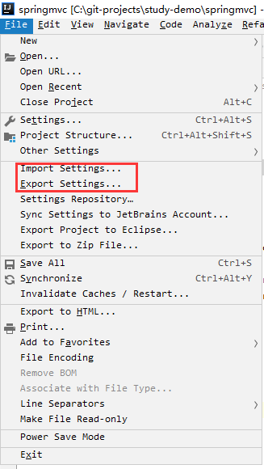

# 【实用版】IDEA配置策略

## 主要内容

- 简介
- 常用快捷键
- 方法类注释模板
- 常用插件使用

## 一 简介

IDEA 全称 IntelliJ IDEA，是java编程语言开发的集成环境。IntelliJ在业界被公认为最好的java开发工具之一，尤其在智能代码助手、代码自动提示、重构、J2EE支持、各类版本工具(git、svn等)、JUnit、CVS整合、代码分析、 创新的GUI设计等方面的功能可以说是超常的。

- 官方下载地址：http://www.jetbrains.com/idea/?fromMenu
- 注册码网站：http://idea.lanyus.com/
  - 该网站提供了IDEA主题链接
  - 搭建私有服务器方式

## 二 常用快捷键

### 2.1 窗口命令

```ruby
# 数字内容自定义
Alt + 1: 打开或者隐藏Project窗口
Alt + 2: 打开收藏窗口
Alt + 3: 打开DataBase窗口
Alt + 4: 打开输出控制台
Alt + 5: 打开debug输出控制台
Alt + 6: 打开TODO
Alt + 7: 打开Structure
Alt + 8: 打开Maven窗口
Alt + 9: 打开版本控制器
Alt + 0: 打开Messages信息
Alt + F12: 打开Terminal
Alt + F1: #选择要打开的活动窗口
Alt + Shift + F: #Add to Favorites  添加到收藏
Ctrl + F12: # 查看文件结构,可用于快速查看,定义的属性和方法（对应文件结构窗口）

# 对应层级结构窗口
Ctrl + H: Type #hierarchy 类型层次结构
Ctrl + Shift + H: #方法层次结构
```

### 2.2 创建命令（自定义）

```ruby
Alt + P: #创建Project
Alt + A: #创建Java类
Alt + H: #创建HTML 文件 
Alt + D: #创建目录/包 Direction
Alt + C: #关闭项目
Alt + F: #创建文件(加上文件后缀创建想要创建的文件 很是通用)
Alt + T：#打开run/bug 配置
Alt + B: #全屏模式
Alt + N: #专注模式 
Alt + -: #关闭其他编辑页
// 此处配置命令，打开导航栏命令冲突，默认取代了
```

### 2.3 基本操作命令

```ruby
F5: copy #复制(针对文件)
F6: move #移动(针对文件)
Shift + F6: #Rename 重命名/联动操作
Alt + Delete: #安全删除

Ctrl + Alt + S: #Open Settings dialog 打开设置
Ctrl + Alt + Shift + S: #Open Project Structure dialog 打开项目结构

Ctrl + Alt + F12: # 打开当前文件所在路径
Ctrl + Shift + F12: #关闭其他框口,只留编辑窗口

Ctrl + Shift + A: #查找并调用编辑器的功能
```

### 2.4 DeBug快捷键

```ruby
F7: #step into 步入
F8: #step over 步过
Shift + F7: #Smart step into 智能步入
Shift + F8: #Smart step over 智能步过    
Alt + F9: #Run to cursor 运行至光标处
Alt + F8: #Evaluate expression 计算表达式
Ctrl + F8: #Toggle breakpoint 切换断点
Ctrl + Shift + F8: #View breakpoints 查看断点
F9: #Resume program 恢复程序
```

**小技巧**：鼠标右键点击断点，可以切换成多线程断点模式，便于多线程编程时操作查看！


### 2.5 运行相关命令

```ruby
Ctrl + F9: #Make project (compile modifed and dependent) 构建项目
Ctrl + Shift + F9: #Compile selected file, package or module 重新编译
Shift + F10|F9: #Run/Debug 运行/debug运行
Alt + Shift + F10|F9: #Select configuration and run/and debug 选择运行方式运行/debug运行
Ctrl + F10: Update Running Application #更新运行中的应用
Ctrl + F2:  #停止运行
```

### 2.6 文件查找和代码编辑

#### 2.6.1 快速定位命令

```ruby
# 全局快速定位
Ctrl + N: #Go to class 通过类名快速查找
Ctrl + Shift + N: #Go to file 通过文件名快速查找工程内的文件
Ctrl + Alt + Shift + N: #Go to symbol 通过符号定位
Double Shift: #Search everywhere 全局查

Ctrl + E: #Recent files popup 查看最近打开的文件
Ctrl + Shift + E:# 查看最近的更改的代码

Ctrl + Shift + F: #Find in path 在项目中或模块中查找，全文效果
Ctrl + Shift + R: # 在项目中或模块中替换，全文效果 注意使用

F11: #Toggle Bookmark 标记一个书签
Ctrl + F11: #Toggle bookmark with mnemonic 标记书签并带有标号
Ctrl + [0-9]: #Go to numbered bookmark 
Shift + F11: #Show bookmarks 查看书签

# 当前页快速定位
Ctrl + F: #Find 在当前页进行查找
F2 | Shift + F2: #Next/previous highlighted error 下一个/前一个高亮错误
F3 | Shift + F3: #查找下一个/查找上一个
Ctrl + G: #跳转到行
Ctrl + R: #Replace 在当前页替换

Alt + 上|下: #去到上一个方法/下一个方法
```

#### 2.6.1   查看信息命令

```ruby
Shift + Alt + E: #Go to implementation(s) 查看具体实现类
F4: Edit #source / View source 查看源码
Ctrl + Q: # 查看快速文档

Ctrl + B: #查看变量声明
Ctrl + Shift + B: #Go to type declaration 查看变量声明类型的类
Ctrl + P: # Parameter info (within method call arguments) 查看参数信息

Ctrl + Shift + P: # 查看表达式类型
Ctrl + I: #Implement methods 查看实现方法

Ctrl + F1: #Show descriptions of error or warning at caret 查看错误描述

Alt + F7： #查看代码引用（窗口中显示）
Ctrl + Alt + F7： #查看引用
```

#### 2.6.3 代码编辑命令

```ruby
Alt + Enter: # 导入包/自动修正
Ctrl + U: # Go to super-method / super-class 跳转到父类方法/父类
Ctrl + O: # 重写方法

Ctrl + C: # 拷贝
Ctrl + Shift + C: #拷贝文件路径
Ctrl + V: # 粘贴
Ctrl + Shift + V: #从历史记录粘贴
Ctrl + Z：#撤销
Ctrl + Shift + Z：#取消撤销
Ctrl + D: # 整行向下复制（区别Eclipse快捷键）/ 光标不在编辑区时，可用来对比文件差异
Ctrl + X：# 默认剪切整行
Alt + Shift +上|下: #整行上移/整行下移（区别Eclipse快捷键）
Ctrl + Shift +上|下: #代码块上移/下移

Alt + /: #代码提示
Alt + insert: #Generate code... (Getters, Setters,Constructors,hashCode/equals, toString) 代码生成get/set
Ctrl + Alt + T: #Surround with… (if..else, try..catch, for,synchronized, etc.) 代码包围
Ctrl + Shift + Enter: # Complete statement 补全当前语句，主要补全符号
Ctrl + space: #Basic code completion (the name of any class,method or variable)  基础代码实现（类 方法 变量）
Ctrl + Shift + space : #Smart code completion (filters the list of methods and variables by expected type) 智能代码补全
Ctrl + J: #Insert Live Template  插入模板（可在Live Template中自定义） 
Ctrl + Alt + J: #Surround with Live Template 使用模板包围
Ctrl + Shift + U:  #大小写切换

Ctrl + S：# 保存全部 idea提供自动保存功能
```

#### 2.6.3 无鼠标操作快捷命令

```ruby
F12: #Go back to previous tool window 光标移动到之前的窗口
Esc:# 移动光标到之前的编辑窗口
Alt + Home: #显示导航条，可以对本类路径的其它类快速定位

Ctrl + F4: #Close active editor tab 关闭编辑单个编辑窗
Alt + 左|右: #Go to next / previous editor tab 左右选择编辑窗

Ctrl + A：#全选
Ctrl + W: #Select successively increasing code blocks 扩展选择
Ctrl + Shift + W: #Decrease current selection to previous state 缩小选择

Ctrl + Shift + J: #Smart line join 拼接成一行

Ctrl + ]/[:# Move to code block end/start 光标移动到代码块的开始/结束为止
Ctrl + Shift + ]/[: #Select till code block end/start 选择内容从光标到代码块结束/开始的内容
  
Ctrl + -: #收缩
Ctrl + Shift + -: #全部收缩
Ctrl + =: #伸展
Ctrl + Shift + =: #全部展开
```

#### 2.6.4  代码格式命令

```ruby
Ctrl + Alt + I: #Auto-indent line(s) 自动行缩进
Ctrl + Alt + L: #Reformat code 重新格式化代码
```

## 三 IDEA注释模板

注释快捷键如下：

```sh
Ctrl + /: #Comment/uncomment with line comment 行注释/取消行注释
Ctrl + Shift + /: #Comment/uncomment with block comment 块注释/取消注释
```

### 3.1 类注释模板

Settings中搜索：**File and Code Templates**

阿里巴巴开发者手册中要求：类注释`JavaDoc`的格式中包含作者和日期信息

```java
/**
 * description:
 * 
 * @author: yim create time ${DATE} ${TIME}
 **/
```

### 3.2 方法注释模板

Settings中搜索：**Live Templates**

#### 3.2.1 创建一个方法注释模板

参数获取：需要自己设置

```
/**
 * 
 * @Params: $param$
 * @return: $return$
 */
```

#### 3.2.2 并设置一个空的`JavaDoc`模板，用于属性注释

```
/**
 * 
 */
```

### 3.3 IDEA自带（Live Templates）

如有需要可自定义代码模板：平时常写的重写代码内容

```
sout -- 打印语句
iter -- 增强版for循环
fori -- for循环
psvm -- public static void main(){}
ifn  -- if null判断
inn  -- if not null判断
geti -- 单例方法getInstance(){}
St  -- String
psf  -- public static final 
psfs -- public static final String
psfi -- public static final int
```

## 四 IDEA其它配置

### 4.1 配置DataBase可视化连接数据库

用着还行，毕竟比其他工具感觉好多了！如果用Oracle数据库的话，需要更深入的使用推荐使用PL/SQL

```ruby
Ctrl + Enter： # 执行选中代码

Ctrl + Alt + L： # 对sql格式化

Ctrl + F6：# 查看表结构
```

### 4.2 配置Maven

如果配置了自己的Maven，但是每次创建项目时仍是IDEA默认的Maven。每次都配置比较麻烦，建议直接替换掉IDEA的Maven，需要IDEA去安装安装目录下替换。

IDEA默认Maven版本3.3.9，不影响使用，就用默认的也行。

Maven配置文件：setting.xml文件

### 4.3 配置IDEA默认编码格式

settings中搜索：**File Encodings**


### 4.4 Devtools配置热启动

1. SpringBoot项目中引入Devtools包

2. settings中搜索compiler

   

3. 使用快捷键`Ctrl + Shift +A`搜索registry，勾选一下内容

   

### 4.5 配置Tomcat


- +号：添加新的sever
- `VM options`：配置内存信息
- Deployment：推荐exploded部署包
- `VM`下面可配置Tomcat热启动设置

### 4.6 其它配置


## 五 常用插件安装

在settings中`plugins`中搜索插件名进行下载：

- 阿里规约代码检查插件：`Alibaba Java Coding Guidelines`
- `Lombok`插件：
  - `Lombok`通过注解的方式简化了代码
  - 通过@Data注解生gets/sets方法
  - IDEA中引入方便代码查看
- `Jrebel`插件：一款优秀的热启动插件，需要激活

## 六 导入和导出自己的配置

辛苦配置了，大半天的IDEA，还是需要保存自己的配置的：

因此IDEA提供配置文件的导入和导出方法：

也可以在第一次装idea配置

